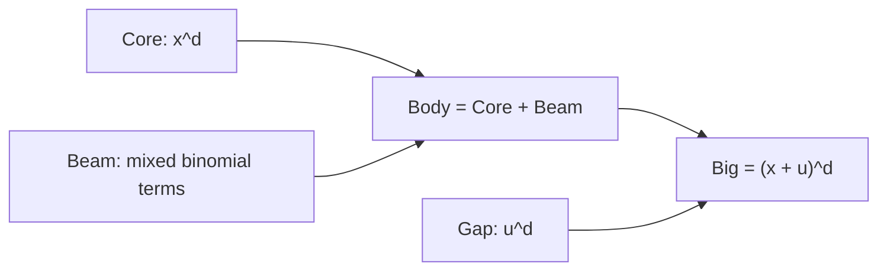
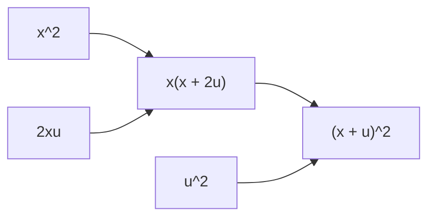

# 保存分解としての宇宙式

## 序文

DkMath の中心語彙の一つに「宇宙式」がある。
名前だけを聞けば、巨大な物理法則や未知の方程式を想像するかもしれない。
しかし、その最小核はきわめて素朴な二次恒等式である。

$$N+u^2=P$$

ここで、DkMath は次のように置く。

$$N=x(x+2u)$$

$$P=(x+u)^2$$

したがって中心式は、次の恒等式となる。

$$x(x+2u)+u^2=(x+u)^2$$

これは二項平方の展開そのものである。
宇宙式という読み方の特徴は、この恒等式を単に展開して消してしまうのではなく、全体・本体・残された単位平方の関係として保持する点にある。

## 結果

Lean file `CosmicFormulaBasic.lean` は、実数上の単位宇宙式を次の差として定義している。

$$\operatorname{CF}(x,u)=(x+u)^2-x(x+2u)$$

定理 `cosmic_formula_unit_theorem` は、任意の実数 $x,u$ に対して次を証明する。

$$\operatorname{CF}(x,u)=u^2$$

同じ内容は、減算を使わない形でも形式化されている。
`N` と `P` を先ほどの式で定義すると、定理 `cosmic_formula_add` は任意の可換半環で次を与える。

$$N(x,u)+u^2=P(x,u)$$

さらに可換環では、定理 `cosmic_formula_sub_from_add` により差の形へ戻せる。

$$P(x,u)-N(x,u)=u^2$$

ここまでが二次の単位宇宙式である。

DkMath は、この構造を一般の正次数 $d$ へ拡張する。
`CoreBeamGap.lean` では、二項展開の左端、中央、右端をそれぞれ次のように分ける。

$$\operatorname{Core}_d(x)=x^d$$

$$\operatorname{Gap}_d(u)=u^d$$

$$\operatorname{Beam}_d(x,u)=\text{二項展開の両端を除く中間項の総和}$$

定理 `big_eq_core_beam_gap` は、$0<d$ のもとで次を証明する。

$$\operatorname{Big}_d(x,u)=\operatorname{Core}_d(x)+\operatorname{Beam}_d(x,u)+\operatorname{Gap}_d(u)$$

ここで、

$$\operatorname{Big}_d(x,u)=(x+u)^d$$

である。

## 一般数学での読み方

一般数学の言葉では、これは二項定理の端点・内部項分解である。

$$ (x+u)^d=x^d+\sum_{k=1}^{d-1}\binom{d}{k}x^k u^{d-k}+u^d $$

DkMath の語彙との対応は単純である。

| DkMath | 一般数学での役割 |
|---|---|
| Big | 二項冪全体 $(x+u)^d$ |
| Core | 左端の純冪 $x^d$ |
| Beam | 混合項の総和 |
| Gap | 右端の純冪 $u^d$ |

$d=2$ では Beam は $2xu$ となる。

$$ (x+u)^2=x^2+2xu+u^2 $$

そして Core と Beam を一つにまとめると、

$$x^2+2xu=x(x+2u)=N$$

となる。
したがって、単位宇宙式は一般の二項分解を二つの部分へ畳んだ形である。

$$\underbrace{x(x+2u)}_{\text{Core + Beam}}+\underbrace{u^2}_{\text{Gap}}=\underbrace{(x+u)^2}_{\text{Big}}$$

## DkMath での読み方

DkMath は、等式の両辺が等しいという事実だけでなく、等しくなるまでにどの成分が保存されているかを主語にする。

宇宙式では、$x$ が変化しても、次の差は常に $u^2$ へ戻る。

$$ (x+u)^2-x(x+2u)=u^2 $$

つまり、$x$ に依存する部分を本体側へ集めた後にも、$u$ だけで決まる純粋な平方が残る。
DkMath はこの残留成分を Gap と呼ぶ。

ただし Gap は、単なる「誤差」ではない。
この恒等式では、Big を完成させるために正確に必要な成分である。

$$\operatorname{Big}=\operatorname{Body}+\operatorname{Gap}$$

さらに Body を分けると、

$$\operatorname{Body}=\operatorname{Core}+\operatorname{Beam}$$

したがって、

$$\operatorname{Big}=\operatorname{Core}+\operatorname{Beam}+\operatorname{Gap}$$

となる。

## 構造図

二次の場合は、さらに具体的に読める。

## 例

$x=3$、$u=2$ とする。

$$N=3(3+4)=21$$

$$u^2=4$$

$$P=(3+2)^2=25$$

したがって、

$$21+4=25$$

となる。

展開してしまえば当然の計算である。
しかし保存分解として読むと、Big $25$ は Body $21$ と Gap $4$ に一意に分けて観測される。

## 考察

ここから先は、この記事で参照した定理だけから自動的に得られる結論ではなく、DkMath における研究上の読み方である。

宇宙式の価値は、一つの難しい恒等式を発見したことではない。
既知の恒等式を、境界・内部相互作用・残留単位へ分け、別の理論でも再利用できる共通 API として読むところにある。

この分解は、DkMath 内で次の方向へ接続されている。

- 二項 Tail と GN
- 質量保存と分岐
- トロミノによる二次元分解
- 回転と二成分平方質量
- valuation flow や primitive prime bridge

今後の Journal では、それぞれの接続を一記事ずつ独立に取り上げる。
最初の記事で重要なのは、宇宙式の出発点が不可思議な新演算ではなく、二項展開の構造を保持した読み方である、と確認することである。

## Lean source anchors

### Definitions

- `DkMath.CosmicFormula.Basic.cosmic_formula_unit`
- `DkMath.CosmicFormula.Basic.N`
- `DkMath.CosmicFormula.Basic.P`
- `DkMath.CosmicFormula.CoreBeamGap.Core`
- `DkMath.CosmicFormula.CoreBeamGap.Beam`
- `DkMath.CosmicFormula.CoreBeamGap.Gap`
- `DkMath.CosmicFormula.CoreBeamGap.Big`

### Theorems

- `DkMath.CosmicFormula.Basic.cosmic_formula_unit_theorem`
- `DkMath.CosmicFormula.Basic.cosmic_formula_add`
- `DkMath.CosmicFormula.Basic.cosmic_formula_sub_from_add`
- `DkMath.CosmicFormula.CoreBeamGap.big_eq_body_add_gap`
- `DkMath.CosmicFormula.CoreBeamGap.big_eq_core_beam_gap`

### Source files

- `lean/dk_math/DkMath/CosmicFormula/CosmicFormulaBasic.lean`
- `lean/dk_math/DkMath/CosmicFormula/CoreBeamGap.lean`
