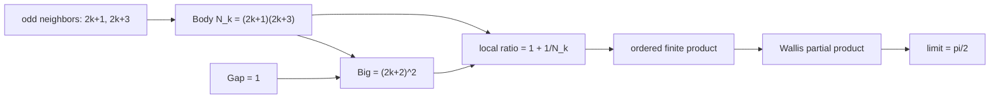

# 宇宙式 Gap 比の積は円周率へ到達する

## 序文

円周率 $\pi$ は、円の周長と直径の比として知られている。
しかし解析学では、円を直接描かなくても、数列、積分、級数、無限積の極限として $\pi$ が現れる。

DkMath の Pascal 層には、宇宙式の局所恒等式から作られる有理数の積が、古典的な Wallis 積と項ごとに一致し、その実数極限が $\pi/2$ となる経路が Lean で形式化されている。

この記事では、その経路を有限の代数恒等式と極限の二段階に分けて読む。

## 結果

自然数 $k$ に対して、三つの連続する整数を置く。

$$a_k=2k+1$$

$$c_k=2k+2$$

$$b_k=2k+3$$

`WallisCosmicPetalBridge.lean` では、宇宙式の本体を次の有理数として定義する。

$$N_k=a_kb_k=(2k+1)(2k+3)$$

定理 `cosmic_square_odd_bridge_Q` は、中央の偶数平方が本体に一を加えたものと等しいことを証明する。

$$c_k^2=N_k+1$$

すなわち、具体的には次の恒等式である。

$$(2k+2)^2=(2k+1)(2k+3)+1$$

Wallis 因子と宇宙式 Gap 因子は、それぞれ次のように定義される。

$$W_k=\frac{c_k^2}{a_kb_k}$$

$$C_k=\frac{N_k+1}{N_k}$$

定理 `wallisFactorQ_eq_cosmicFactorQ` は、各 $k$ について両者が等しいことを証明する。

$$W_k=C_k$$

定理 `cosmicFactorQ_eq_one_add_inv_body` は、宇宙式因子を本体に対する単位 Gap の比として書き直す。

$$C_k=1+\frac{1}{N_k}$$

したがって各局所因子について、次の三つの表示が一致する。

$$\frac{(2k+2)^2}{(2k+1)(2k+3)}=\frac{N_k+1}{N_k}=1+\frac{1}{N_k}$$

有限積は次のように定義される。

$$\mathrm{WallisPartial}(m)=\prod_{k=0}^{m-1}W_k$$

$$\mathrm{CosmicPartial}(m)=\prod_{k=0}^{m-1}C_k$$

定理 `wallisPartialQ_eq_cosmicPartialQ` は、すべての自然数 $m$ について有限積が一致することを証明する。

$$\mathrm{WallisPartial}(m)=\mathrm{CosmicPartial}(m)$$

`WallisLimitBridge.lean` は、この有限積を実数へ写し、Mathlib の Wallis 積定理へ接続する。
定理 `tendsto_cosmicPartialQ_pi_div_two` は次の収束を証明する。

$$\lim_{m\to\infty}\mathrm{CosmicPartial}(m)=\frac{\pi}{2}$$

さらに `hasProd_conditional_real_cosmic_gap_ratio_pi_div_two` は、自然数順に並べた宇宙式 Gap 比の積を条件付き無限積として明示する。

$$\prod_{k=0}^{\infty}\left(1+\frac{1}{(2k+1)(2k+3)}\right)=\frac{\pi}{2}$$

ここで Lean の定理は、`SummationFilter.conditional ℕ` を使用し、`Finset.range m` による順序付き部分積の極限として主張されている。

## 一般数学での読み方

古典的な Wallis 積は、次の形である。

$$\frac{\pi}{2}=\prod_{k=0}^{\infty}\frac{(2k+2)^2}{(2k+1)(2k+3)}$$

通常は、偶数を二回、左右の奇数を一回ずつ配置する積として読む。

DkMath の有限橋は、それぞれの Wallis 因子の分子にある平方を、隣接する奇数積と単位差へ分解する。

$$(2k+2)^2-(2k+1)(2k+3)=1$$

このため、一つの Wallis 因子は次の相対増分となる。

$$\frac{N_k+1}{N_k}=1+\frac{1}{N_k}$$

つまり Wallis 積は、各段階で本体 $N_k$ に単位 $1$ を補った比率を掛け続ける積としても読める。

重要なのは、有限段階で完全に同じ積であることを先に証明し、その後に既知の Wallis 極限を移送している点である。
円周率への収束を独立に再証明しているのではなく、有限積の点ごとの一致を介して Mathlib の定理へ接続している。

## DkMath での読み方

宇宙式の基本形は、全体と本体の差として単位平方が残る構造である。
今回の局所式では単位を $1$ として、次の形が現れる。

$$\mathrm{Big}_k=N_k+1=(2k+2)^2$$

$$\mathrm{Body}_k=N_k=(2k+1)(2k+3)$$

$$\mathrm{Gap}_k=1$$

このとき、局所因子は Big と Body の比である。

$$C_k=\frac{\mathrm{Big}_k}{\mathrm{Body}_k}=1+\frac{\mathrm{Gap}_k}{\mathrm{Body}_k}$$

したがって Wallis 積は、DkMath の語彙では「各奇数区間で生じる単位 Gap の相対比を、自然数順に蓄積したもの」と読める。

各 Gap は常に $1$ だが、Body は $k$ とともに大きくなるため、相対 Gap $1/N_k$ は小さくなる。
その小さな補正をすべて掛け合わせた極限が $\pi/2$ に到達する。

## 構造図

## 例

最初の三つの局所因子を計算する。

$k=0$ では、$N_0=1\cdot3=3$ である。

$$C_0=1+\frac{1}{3}=\frac{4}{3}$$

$k=1$ では、$N_1=3\cdot5=15$ である。

$$C_1=1+\frac{1}{15}=\frac{16}{15}$$

$k=2$ では、$N_2=5\cdot7=35$ である。

$$C_2=1+\frac{1}{35}=\frac{36}{35}$$

三項までの部分積は次の値になる。

$$\frac{4}{3}\cdot\frac{16}{15}\cdot\frac{36}{35}=\frac{2304}{1575}\approx1.462857$$

これはまだ $\pi/2\approx1.570796$ より小さいが、Lean では部分積列が Wallis 部分積列と一致し、その極限が $\pi/2$ であることまで接続されている。

## 考察

ここから先は、この記事で参照した Lean theorem から直接得られる主張ではなく、DkMath における研究上の読み方である。

この形式化は、円周率を「円から突然現れる定数」としてではなく、局所的な単位補完比の累積結果として読む入口になる。

ただし、現時点で Lean が証明している確定事項は、宇宙式 Gap 因子が Wallis 因子と一致し、順序付き部分積が $\pi/2$ へ収束するということである。
この事実だけから、すべての円周率公式が同じ Gap 原理から導出されるとはまだ言えない。

今後の接続候補としては、中央二項係数による別表示、Pascal 三角形との関係、Wallis 積から積分や円の幾何へ戻る橋がある。
それぞれを独立した Journal 記事として切り分けることで、有限代数から解析極限、さらに幾何学的な $\pi$ へ至る経路を段階的に追跡できる。

## Lean source anchors

### Definitions

- `DkMath.Pascal.WallisCosmicPetalBridge.cosmicBodyQ`
- `DkMath.Pascal.WallisCosmicPetalBridge.wallisFactorQ`
- `DkMath.Pascal.WallisCosmicPetalBridge.cosmicFactorQ`
- `DkMath.Pascal.WallisCosmicPetalBridge.wallisPartialQ`
- `DkMath.Pascal.WallisCosmicPetalBridge.cosmicPartialQ`

### Theorems

- `DkMath.Pascal.WallisCosmicPetalBridge.cosmic_square_odd_bridge_Q`
- `DkMath.Pascal.WallisCosmicPetalBridge.wallisFactorQ_eq_cosmicFactorQ`
- `DkMath.Pascal.WallisCosmicPetalBridge.cosmicFactorQ_eq_one_add_inv_body`
- `DkMath.Pascal.WallisCosmicPetalBridge.wallisPartialQ_eq_cosmicPartialQ`
- `DkMath.Pascal.WallisLimitBridge.tendsto_cosmicPartialQ_pi_div_two`
- `DkMath.Pascal.WallisLimitBridge.hasProd_conditional_real_cosmic_gap_ratio_pi_div_two`
- `DkMath.Pascal.WallisLimitBridge.tprod_conditional_real_cosmic_gap_ratio_eq_pi_div_two`

### Source files

- `lean/dk_math/DkMath/Pascal/WallisCosmicPetalBridge.lean`
- `lean/dk_math/DkMath/Pascal/WallisLimitBridge.lean`
