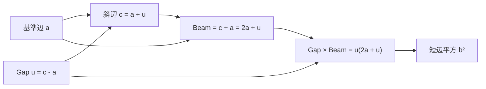
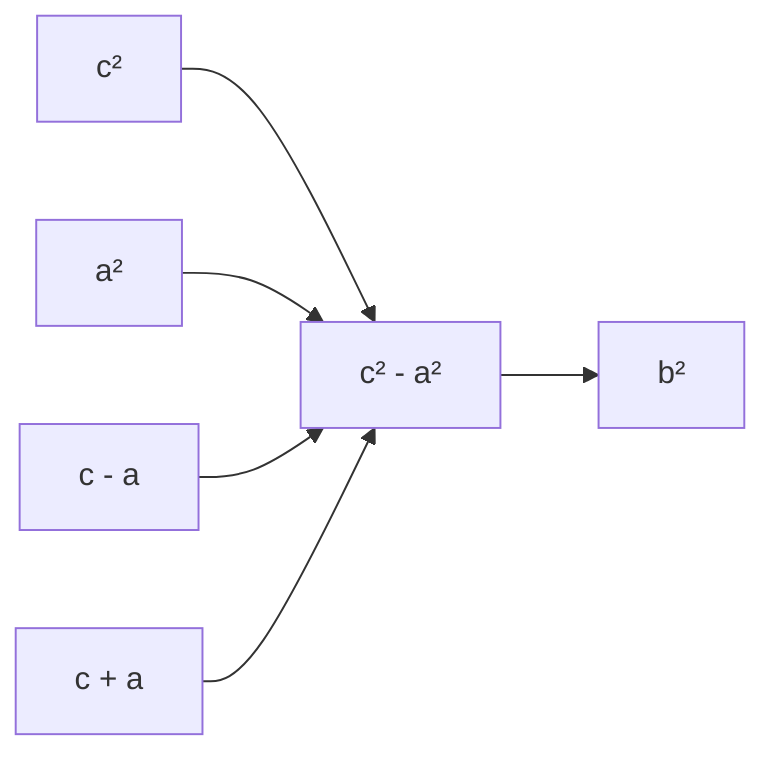

# ピタゴラス平方差を Gap と Beam の積として読む

## 序文

ピタゴラスの定理は、通常は三辺の平方の加法として書かれる。

$$a^2+b^2=c^2$$

しかし同じ等式を、斜辺平方から一辺平方を取り除く差分として読むこともできる。

$$c^2-a^2=b^2$$

この読み替えでは、短辺の平方 $b^2$ は独立に置かれた量ではない。斜辺 $c$ と基準辺 $a$ の間に生じる平方差として回収される。

DkMath の `CosmicFormulaPythagoras.lean` は、この平方差をさらに二つの因子へ分ける。

$$c^2-a^2=(c-a)(c+a)$$

差 $c-a$ を Gap、和 $c+a$ を Beam と名付けると、短辺平方は Gap と Beam の積として現れる。

## 結果

Lean では、可換環上のピタゴラス条件を次で定義する。

$$\mathrm{IsPythagoreanTripleOver}(a,b,c)\;:\Longleftrightarrow\;a^2+b^2=c^2$$

実数版の定理 `pythagoras_as_difference` は、この加法形が二つの差分形と同値であることを証明する。

$$a^2+b^2=c^2\;\Longleftrightarrow\;c^2-a^2=b^2\;\land\;c^2-b^2=a^2$$

次に、斜辺を $c=a+u$ と表す。定義 `PythagoreanCosmicForm` は次の量である。

$$\mathrm{PythagoreanCosmicForm}(a,u)=2au+u^2$$

定理 `pythagoras_cosmic_form` は、これが平方差そのものであることを証明する。

$$(a+u)^2-a^2=2au+u^2$$

ピタゴラス条件 $a^2+b^2=(a+u)^2$ があれば、定理 `pythagoras_in_cosmic_form` により短辺平方へ戻る。

$$b^2=2au+u^2$$

さらに、一般の可換環上で次の二つを定義する。

$$\mathrm{boundaryGap}(a,c)=c-a$$

$$\mathrm{pythagoreanBeam}(a,c)=c+a$$

定理 `sq_sub_sq_gap_beam` は平方差を両者の積へ分解する。

$$c^2-a^2=\mathrm{boundaryGap}(a,c)\,\mathrm{pythagoreanBeam}(a,c)$$

$c=a+u$ の場合、定理 `sq_diff_of_gap` は次を与える。

$$(a+u)^2-a^2=u(2a+u)$$

したがって、ピタゴラス条件のもとでは短辺平方が Gap と Beam の積になる。

$$b^2=u(2a+u)$$

## 一般数学での読み方

一般数学では、中心にあるのは差の平方の因数分解である。

$$c^2-a^2=(c-a)(c+a)$$

ピタゴラス条件 $a^2+b^2=c^2$ を使うと、左辺は $b^2$ になる。

$$b^2=(c-a)(c+a)$$

ここで $u=c-a$ と置けば $c=a+u$ なので、もう一方の因子は次のようになる。

$$c+a=2a+u$$

ゆえに、

$$b^2=u(2a+u)$$

を得る。

これは新しいピタゴラス定理ではない。同じ古典的等式を、加法保存ではなく境界差と共役和の積として表したものである。

この表現から、正の実数の場合には次の性質も直ちに読める。

- Gap $u=c-a$ が小さくても、Beam $c+a$ が大きければ短辺平方は大きくなり得る。
- 短辺平方 $b^2$ は、Gap だけではなく基準辺を含む Beam と共同で決まる。
- 平方差の因数分解は、長さの差を面積量へ変換する。

## DkMath での読み方

DkMath では、$u=c-a$ を単なる変数置換ではなく、二つの境界の間隔として読む。

```text
Gap
  c - a
  境界間の差幅

Beam
  c + a
  二つの境界を貫く和

Gap × Beam
  c² - a²
  境界間に生成される平方差
```

このとき、ピタゴラスの短辺平方は次の構造になる。

$$b^2=\mathrm{Gap}\times\mathrm{Beam}$$

二次の単位宇宙式では、Big と Body の差として純粋な $u^2$ が残った。

$$(a+u)^2-a(a+2u)=u^2$$

一方、ピタゴラス平方差では $a^2$ だけを取り除くため、残る量は $u^2$ だけではなく混合項 $2au$ も含む。

$$(a+u)^2-a^2=2au+u^2$$

したがって両者の違いは、何を Body として差し引いたかにある。

```text
単位宇宙式
  (a + u)² - a(a + 2u) = u²
  Core と混合項を差し引き、純粋 Gap を残す

ピタゴラス平方差
  (a + u)² - a² = 2au + u²
  Core だけを差し引き、Beam と Gap を残す
```

## 構造図



平方量の関係だけを抜き出すと、次の流れになる。



## 例

古典的な $3$–$4$–$5$ 三角形を考える。

$$3^2+4^2=5^2$$

基準辺を $a=3$、短辺を $b=4$、斜辺を $c=5$ とする。このとき Gap は、

$$u=c-a=2$$

Beam は、

$$c+a=8$$

したがって、

$$\mathrm{Gap}\times\mathrm{Beam}=2\times8=16$$

これは短辺平方と一致する。

$$b^2=4^2=16$$

同じ計算を $c=a+u$ の形で書けば、

$$b^2=u(2a+u)=2(6+2)=16$$

となる。

Lean file は、整数上の古典的パラメータ表示も定義している。

$$(a,b,c)=(m^2-n^2,2mn,m^2+n^2)$$

定理 `parametrization_is_pythagoras` は、この三つ組が整数上のピタゴラス条件を満たすことを証明する。さらに `parametrization_embeds_cosmic_structure` は、その表示でも平方差が短辺平方へ戻ることを証明する。

$$c^2-a^2=b^2$$

## 考察

ここから先は、この記事で参照した Lean theorem だけから直接得られる主張ではなく、DkMath における研究上の読み方である。

Gap と Beam の積という表現は、境界差が単独では全体の変化量を決めないことを示唆する。差幅 $u$ が同じでも、基準辺 $a$ が変われば Beam $2a+u$ が変わり、生成される平方差も変わる。

つまり、局所的な Gap を観測するときには、それをどの規模の Beam が運んでいるかを同時に記録する必要がある。この視点は、DkMath の他の分野で現れる次の構造と比較できる可能性がある。

- 差冪における境界因子と GN kernel
- valuation flow における局所 drop と全体 capacity
- Collatz PetalBridge における局所 drift と伝播区間
- 二成分平方質量における保存作用

ただし、これらとの一般的な統一定理は本記事の Lean source では証明していない。現段階で確定しているのは、ピタゴラス平方差が Gap と Beam の積として厳密に因子化されることまでである。

## Lean source anchors

### Definitions

- `DkMath.CosmicFormula.Pythagoras.IsPythagoreanTripleOver`
- `DkMath.CosmicFormula.Pythagoras.PythagoreanDifference₁`
- `DkMath.CosmicFormula.Pythagoras.PythagoreanCosmicForm`
- `DkMath.CosmicFormula.Pythagoras.boundaryGap`
- `DkMath.CosmicFormula.Pythagoras.pythagoreanBeam`

### Theorems

- `DkMath.CosmicFormula.Pythagoras.pythagoras_as_difference`
- `DkMath.CosmicFormula.Pythagoras.pythagoras_cosmic_form`
- `DkMath.CosmicFormula.Pythagoras.pythagoras_in_cosmic_form`
- `DkMath.CosmicFormula.Pythagoras.short_side_as_diff_of_squares`
- `DkMath.CosmicFormula.Pythagoras.sq_sub_sq_gap_beam`
- `DkMath.CosmicFormula.Pythagoras.sq_diff_of_gap`
- `DkMath.CosmicFormula.Pythagoras.pythagoras_gap_beam_interpretation`
- `DkMath.CosmicFormula.Pythagoras.parametrization_is_pythagoras`
- `DkMath.CosmicFormula.Pythagoras.parametrization_embeds_cosmic_structure`

### Source files

- `lean/dk_math/DkMath/CosmicFormula/CosmicFormulaPythagoras.lean`
