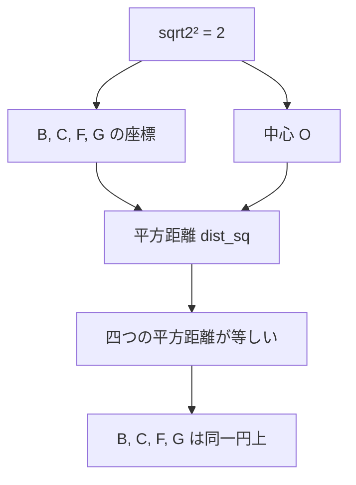

# 平方距離だけで四点が同じ円に乗ることを確かめる

## 序文

四点が同じ円周上にあることを示すとき、紙の上では円を描き、中心から四点までの距離が同じであることを確認する。

しかし Lean にとって、通常の距離には平方根が現れる。平方根を含む等式では、非負性や平方根の消去条件まで管理しなければならない。

`DkMath.SilverRatio.SilverRatioCircle` は、この問題をもっと代数的に扱う。

距離そのものではなく **平方距離** を使い、実数座標上の四点 $B,C,F,G$ が一つの円に乗ることを証明する。

中心に現れるのは $\sqrt{2}$ であり、単位正方形と白銀比構造を結ぶ小さな座標幾何になっている。

## 結果

### 1. $\sqrt{2}$ の固定

`DkMath.SilverRatio.Sqrt2.sqrt2` は実数としての $\sqrt{2}$ を定義する。

$$\mathrm{sqrt2}:=\sqrt{2}$$

定理 `DkMath.SilverRatio.Sqrt2.sqrt2_sq` は、その平方が $2$ であることを証明する。

$$\mathrm{sqrt2}^2=2$$

また `DkMath.SilverRatio.Sqrt2.sqrt2_ne_zero` により、分母へ置くために必要な非零性も得られている。

### 2. 点と平方距離

点は実数の組として表される。

$$\mathrm{Point}:=\mathbb{R}\times\mathbb{R}$$

二点 $p,q$ の平方距離は、次で定義される。

$$\mathrm{dist\_sq}(p,q)=(p_x-q_x)^2+(p_y-q_y)^2$$

この定義には平方根がない。

### 3. 四点と中心

Lean source は次の四点を固定する。

$$B=(1,0)$$

$$C=(1,1)$$

$$F=(0,\sqrt{2})$$

$$G=\left(-\frac{1}{\sqrt{2}},\frac{1}{\sqrt{2}}\right)$$

さらに中心候補を次で固定する。

$$O=\left(\frac{\sqrt{2}-1}{2},\frac{1}{2}\right)$$

### 4. 同一円上にあるという述語

`DkMath.SilverRatio.Circle.concyclic4` は、四点 $P,Q,R,S$ に対して、ある中心と平方半径が存在し、四つの平方距離がすべて等しいことを要求する。

$$\exists O,r^2,\quad \mathrm{dist\_sq}(O,P)=\mathrm{dist\_sq}(O,Q)=\mathrm{dist\_sq}(O,R)=\mathrm{dist\_sq}(O,S)=r^2$$

### 5. 主定理

定理 `DkMath.SilverRatio.Circle.bcfg_concyclic` は、四点 $B,C,F,G$ が同一円上にあることを証明する。

$$\mathrm{concyclic4}(B,C,F,G)$$

証明では、中心として先ほどの $O$ を、平方半径として $\mathrm{dist\_sq}(O,B)$ を与える。

そのうえで次の三つの等式を閉じる。

$$\mathrm{dist\_sq}(O,C)=\mathrm{dist\_sq}(O,B)$$

$$\mathrm{dist\_sq}(O,F)=\mathrm{dist\_sq}(O,B)$$

$$\mathrm{dist\_sq}(O,G)=\mathrm{dist\_sq}(O,B)$$

## 一般数学での読み方

一般数学では、中心 $O=(h,k)$、半径 $r$ の円は次で表される。

$$(x-h)^2+(y-k)^2=r^2$$

四点が同じ円に乗ることを示すには、同じ $h,k,r^2$ に対して四点の座標がこの式を満たせばよい。

この Lean 実装は、まさにこの座標計算を行っている。

通常の距離

$$\sqrt{(x-h)^2+(y-k)^2}$$

を比較する代わりに、平方根を外した量

$$(x-h)^2+(y-k)^2$$

を比較している。

半径は非負なので、平方距離が等しければ距離も等しい。円周上判定には平方距離だけで十分である。

## DkMath での読み方

DkMath 的には、円を最初から図形として仮定する必要はない。

先にあるのは、中心 $O$ に対する二成分平方質量である。

$$Q_O(x,y)=(x-O_x)^2+(y-O_y)^2$$

四点についてこの値が保存されるなら、その保存境界を後から円と読むことができる。

```text
中心 O
  ↓
二成分平方質量 Q_O
  ↓
B, C, F, G で同じ値
  ↓
同じ保存境界
  ↓
円として解釈
```

ここでは「円だから距離が等しい」のではなく、

> 平方質量が等しい点の族を調べた結果、円という境界が現れる。

という順序になっている。

$\sqrt{2}$ は図形の外から持ち込まれた装飾ではない。単位正方形の対角方向と、二成分平方質量を結ぶ座標値として現れている。

## 構造図



## 例

点 $B=(1,0)$ と $C=(1,1)$ は、中心 $O$ の縦座標が $1/2$ であるため、上下方向について対称である。

したがって、$O$ からの縦方向の差はそれぞれ $1/2$ と $-1/2$ になり、平方すると同じ値になる。

$$\left(\frac{1}{2}-0\right)^2=\left(\frac{1}{2}-1\right)^2=\frac{1}{4}$$

横方向の差は両点とも同じなので、ただちに平方距離が一致する。

$$\mathrm{dist\_sq}(O,B)=\mathrm{dist\_sq}(O,C)$$

$F$ と $G$ については $\sqrt{2}$ と $1/\sqrt{2}$ が現れるが、`sqrt2_sq` と `sqrt2_ne_zero` を使うことで、最終的には多項式等式へ還元される。

## 考察

この実装の価値は、四点の共円性そのものだけではない。

平方根を含む幾何問題を、そのまま距離空間の抽象理論へ持ち込まず、まず平方距離の多項式恒等式へ落とす方法を示している。

この方法は、今後の DkMath における次の形式化へ再利用できる可能性がある。

- 二成分平方質量の保存作用
- 回転前後の平方距離保存
- 白銀比を含む座標構成
- 円を仮定せず、保存境界として円を復元する API

ただし、これらの一般化は本記事の Lean 定理から直接証明済みではない。本記事で確定しているのは、明示された四点 $B,C,F,G$ の共円性である。

## Lean source anchors

### Source files

- `lean/dk_math/DkMath/SilverRatio/Sqrt2Lemmas.lean`
- `lean/dk_math/DkMath/SilverRatio/SilverRatioCircle.lean`

### Definitions

- `DkMath.SilverRatio.Sqrt2.sqrt2`
- `DkMath.SilverRatio.Sqrt2.sigma`
- `DkMath.SilverRatio.Circle.Point`
- `DkMath.SilverRatio.Circle.dist_sq`
- `DkMath.SilverRatio.Circle.B`
- `DkMath.SilverRatio.Circle.C`
- `DkMath.SilverRatio.Circle.F`
- `DkMath.SilverRatio.Circle.G`
- `DkMath.SilverRatio.Circle.O`
- `DkMath.SilverRatio.Circle.concyclic4`

### Theorems

- `DkMath.SilverRatio.Sqrt2.sqrt2_sq`
- `DkMath.SilverRatio.Sqrt2.sqrt2_ne_zero`
- `DkMath.SilverRatio.Circle.bcfg_concyclic`
