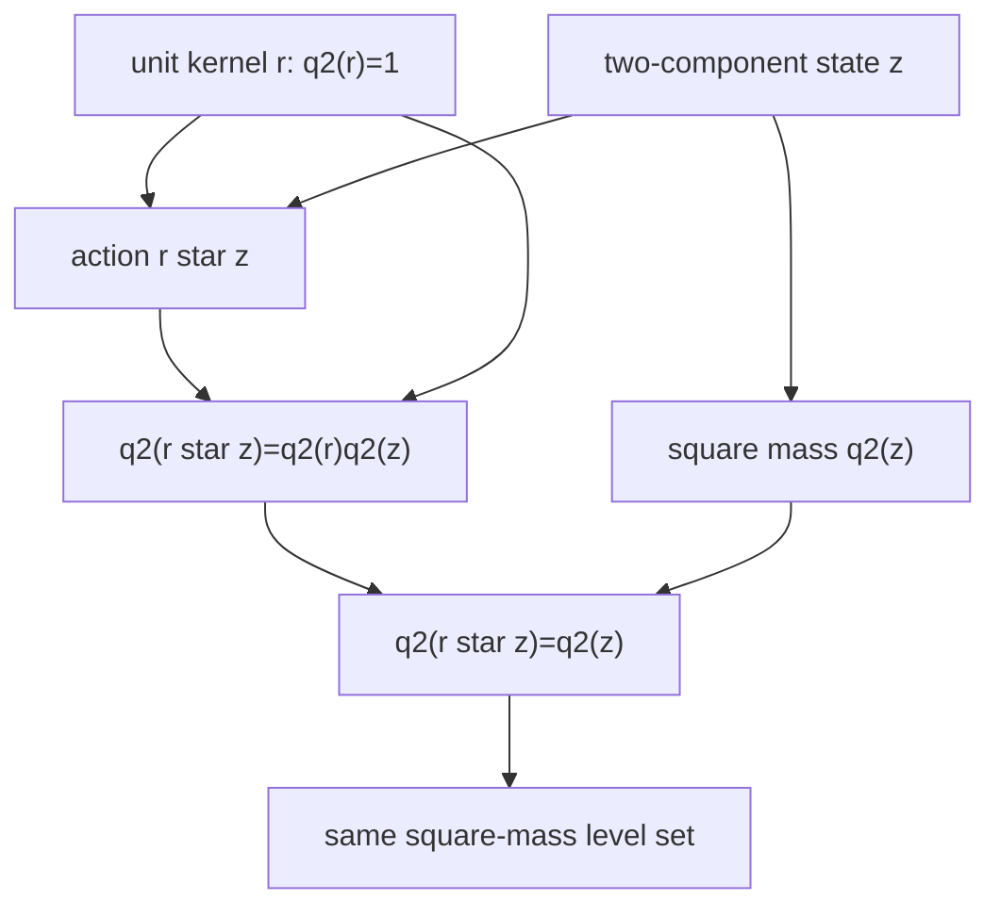

# 単位核作用はすべての平方質量境界を保存する

## 序文

円を回転させる、と最初から言ってしまえば、三角関数や角度を用意したくなる。

DkMath の `CF2D` は逆向きに進む。最初に置くのは二成分の状態、二成分平方質量、そして二成分同士の積だけである。円、距離、角度、三角関数は使用しない。

その純代数的な層で、平方質量が積に対して乗法的であることを証明する。さらに平方質量が `1` の核を作用させると、任意の平方質量境界が保存される。

## 結果

可換環 `R` 上の二成分状態は、Lean では `Vec R` として定義される。成分を $(x,y)$ と書けば、その平方質量は

$$q2(x,y)=x^2+y^2$$

である。

二つの状態 $r=(a,b)$ と $z=(x,y)$ に対する積 `star` は

$$r\star z=(ax-by,ay+bx)$$

で定義される。

Lean theorem `Vec.q2_star` は、この積に対して平方質量が乗法的であることを証明する。

$$q2(r\star z)=q2(r)q2(z)$$

`UnitKernel R` は、平方質量が `1` である二成分核である。

$$q2(r)=1$$

この核の作用 `UnitKernel.act r z` は `r \star z` そのものである。したがって `UnitKernel.q2_act` により、作用後の平方質量は作用前と等しい。

$$q2(r\star z)=q2(z)$$

さらに `LevelSet R rho2` は、平方質量が固定値 $\rho^2$ である状態を証明付きで束ねる。

$$\mathrm{LevelSet}(\rho^2)=\{z\mid q2(z)=\rho^2\}$$

`LevelSet.act` は、任意の単位核作用がこの集合の内部に留まることを定義として固定している。

## 一般数学での読み方

`q2` は二変数の二次形式

$$Q(x,y)=x^2+y^2$$

である。

`star` は複素数の積

$$(a+bi)(x+yi)=(ax-by)+(ay+bx)i$$

と同じ座標式を持つ。しかし、この Lean 層では複素数も三角関数も必要としない。中心定理は可換環上の多項式恒等式として証明されている。

平方質量が `1` の核は、通常の実数幾何では単位円上の点に対応する。その核を掛ける操作は二次形式 $Q$ を保存する。実数上で後から幾何学的意味を与えれば、これは原点を中心とする回転として読める。

ここで重要なのは、保存則が幾何学的名称より先に成立していることである。

## DkMath での読み方

二成分状態は `(core, beam)` と読むことができる。

$$q2(z)=\mathrm{Core}(z)^2+\mathrm{Beam}(z)^2$$

単位核は、自身の二成分平方質量が `1` に閉じた保存核である。この核を別の状態へ作用させると、Core と Beam の配分は変化するが、平方質量の総量は変化しない。

```text
作用前:  Core² + Beam² = rho²
              ↓ unit-kernel action
作用後:  Core'² + Beam'² = rho²
```

したがって DkMath では、回転を先に定義する必要がない。

> 回転とは、二成分平方質量境界の内部で Core と Beam を再配分する単位核作用である。

この定式化では、円は運動の前提ではなく、保存される `q2` level set に後から付けられる幾何学的名称となる。

## 構造図



## 例

整数上で単位核

$$r=(0,1)$$

を取ると、

$$q2(r)=0^2+1^2=1$$

である。

状態 $z=(3,4)$ へ作用させると、

$$r\star z=(0\cdot3-1\cdot4,0\cdot4+1\cdot3)=(-4,3)$$

となる。作用前後の平方質量は、

$$q2(3,4)=3^2+4^2=25$$

$$q2(-4,3)=(-4)^2+3^2=25$$

で一致する。

ここでは角度を導入していないが、実数平面では $90$ 度回転に相当する座標変換が、単位核作用として既に現れている。

## 考察

以下は Lean theorem が直接主張する結果ではなく、確定した保存核から先を読むための接続候補である。

`LevelSet` は、原点中心の平方質量境界を一般の可換環上で保持する。実数上で $\rho^2>0$ を仮定し、通常の距離や平方根と接続すれば、これは半径 $\rho$ の円として読める。

また、単位核をパラメータ族として並べ、その積がパラメータ加法に対応することを証明すれば、核の二座標を `cfcos` と `cfsin` として観測できる。その段階で加法公式は `act_star` と `star` の座標式から現れる。

さらに、明示された複数点が同じ中心から同じ平方距離を持つ共円性定理は、中心移動後の点を一つの `LevelSet` へ載せることで、この保存作用へ接続できる。白銀比から構成された四点の共円性は、その具体例候補である。

したがって今後の橋は、概念的には次の形になる。

$$\mathrm{SquaredDistance}\longrightarrow\mathrm{LevelSet}\longrightarrow q2\_star\longrightarrow\mathrm{UnitKernel}\longrightarrow\mathrm{cfcos},\mathrm{cfsin}$$

## Lean source anchors

### Source file

- `lean/dk_math/DkMath/CosmicFormula/Rotation/CF2D/Basic.lean`

### Definitions

- `DkMath.CosmicFormula.Rotation.CF2D.Vec`
- `DkMath.CosmicFormula.Rotation.CF2D.Vec.q2`
- `DkMath.CosmicFormula.Rotation.CF2D.Vec.star`
- `DkMath.CosmicFormula.Rotation.CF2D.PreservesQ2`
- `DkMath.CosmicFormula.Rotation.CF2D.UnitKernel`
- `DkMath.CosmicFormula.Rotation.CF2D.UnitKernel.act`
- `DkMath.CosmicFormula.Rotation.CF2D.LevelSet`
- `DkMath.CosmicFormula.Rotation.CF2D.LevelSet.act`

### Theorems

- `DkMath.CosmicFormula.Rotation.CF2D.Vec.q2_star`
- `DkMath.CosmicFormula.Rotation.CF2D.Vec.star_assoc`
- `DkMath.CosmicFormula.Rotation.CF2D.UnitKernel.act_star`
- `DkMath.CosmicFormula.Rotation.CF2D.UnitKernel.q2_act`
- `DkMath.CosmicFormula.Rotation.CF2D.UnitKernel.preservesQ2_act`
- `DkMath.CosmicFormula.Rotation.CF2D.LevelSet.act_val`
