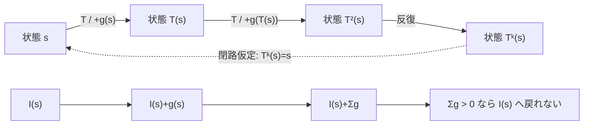

## 1. 序文

離散力学系で「同じ状態へ戻る閉路が存在しない」と示す最も強力な方法の一つは、反復するたびに必ず増える自然数値を見つけることである。

状態空間を `State`、一回の遷移を $T$、状態を測る自然数値を $I$ とする。DkMath の `UnitCycle.Core` は、この単純な観測を、一定増分、不等式増分、状態依存増分、厳密増加という複数の形で Lean 定理として固定している。

中心原理は次である。

> 一周して元の状態へ戻るなら、観測値も元へ戻らなければならない。しかし各段階で観測値が正に増えるなら、それは不可能である。

## 2. 結果

### 2.1 一回につき1増える場合

`DkMath.UnitCycle.I_iterate_of_unit` は、すべての状態 $s$ について

$$I(T(s))=I(s)+1$$

が成立するなら、$k$ 回反復後に

$$I(T^k(s))=I(s)+k$$

となることを確定する。

さらに `DkMath.UnitCycle.no_nontrivial_cycle_unit` は、

$$T^k(s)=s$$

ならば

$$k=0$$

であることを示す。したがって正の長さを持つ閉路は存在しない。

### 2.2 一回につき一定値 $u$ 増える場合

`DkMath.UnitCycle.I_iterate_of_u` は、

$$I(T(s))=I(s)+u$$

ならば、

$$I(T^k(s))=I(s)+ku$$

となることを示す。

`DkMath.UnitCycle.cycle_mul_zero` により、閉路 $T^k(s)=s$ が存在すれば、必ず

$$ku=0$$

である。さらに $u>0$ なら、`DkMath.UnitCycle.no_nontrivial_cycle_of_pos_u` によって $k=0$ が従う。

### 2.3 少なくとも1増える場合

増分が毎回一定でなくても、

$$I(T(s))\ge I(s)+1$$

がすべての状態で成立すればよい。

`DkMath.UnitCycle.I_iterate_of_ge_one` は、

$$I(T^k(s))\ge I(s)+k$$

を与える。`DkMath.UnitCycle.no_nontrivial_cycle_of_ge_one` は、この下界だけで非自明な閉路を排除する。

### 2.4 状態依存増分の場合

各状態で増分が $g(s)$ に変わるとする。

$$I(T(s))\ge I(s)+g(s)$$

`DkMath.UnitCycle.I_iterate_ge_sum_g` は、反復後の観測値を、軌道上の増分総和で下から評価する。

$$I(T^k(s))\ge I(s)+\sum_{i=0}^{k-1}g(T^i(s))$$

さらにすべての状態で $g(s)\ge1$ なら、`DkMath.UnitCycle.I_iterate_ge_add_k` により再び

$$I(T^k(s))\ge I(s)+k$$

を得る。`DkMath.UnitCycle.no_nontrivial_cycle_of_ge_g` は、この条件から非自明閉路が存在しないことを確定する。

### 2.5 厳密増加だけを仮定する場合

自然数上では、

$$I(T(s))>I(s)$$

ならば必ず

$$I(T(s))\ge I(s)+1$$

である。これは `DkMath.UnitCycle.ge_one_of_strict` によって固定されている。

したがって `DkMath.UnitCycle.no_nontrivial_cycle_of_strict` は、観測値が各遷移で厳密に増えるだけで、

$$T^k(s)=s\Longrightarrow k=0$$

を結論する。

## 3. 一般数学での読み方

これは離散力学系における順位関数、変種関数、Lyapunov 型関数の最も基本的な形である。

写像 $T:X\to X$ に対し、自然数値関数 $I:X\to\mathbb N$ が軌道に沿って厳密増加するなら、軌道は以前の状態へ戻れない。閉路があると仮定すれば、同じ状態に同じ $I$ の値が割り当てられる一方、反復によってその値は正に増えていなければならず、矛盾する。

一定増分の場合は、閉路仮定から

$$I(s)+ku=I(s)$$

が得られ、自然数の加法消去により $ku=0$ となる。

状態依存増分の場合は、各段階で得た正の増分をすべて足し合わせる。閉路が存在するには、その総和が0でなければならない。しかし各項が1以上なら総和は正であり、閉路は成立しない。

## 4. DkMath での読み方

DkMath の語彙では、$I$ は軌道が通過するたびに蓄積される **方向付き Beam** と読める。

状態が元へ戻るには、状態だけでなく、その状態に付随する確定量も元へ戻る必要がある。ところが各遷移が正の Beam を追加し続けるなら、蓄積値には消去不能な Gap が残る。

$$\mathrm{AccumulatedBeam}(k)=\sum_{i=0}^{k-1}g(T^i(s))$$

閉路の発動条件は、この総量が0へ戻ることである。各増分が正なら、その条件は満たせない。

したがって `UnitCycle.Core` は、個別の力学系を直接解析する前に使える抽象的な閉路排除結界である。対象ごとに必要なのは、状態空間と遷移 $T$ を定め、正に増える観測器 $I$ または増分 $g$ を構成することである。

## 5. 構造図

## 6. 例

状態空間を自然数、遷移を

$$T(n)=n+2$$

観測器を

$$I(n)=n$$

とする。このとき、

$$I(T(n))=n+2=I(n)+2$$

である。

したがって $k$ 回後には、

$$I(T^k(n))=I(n)+2k$$

となる。もし $T^k(n)=n$ なら、

$$2k=0$$

であり、自然数上では $k=0$ しかない。

この例では遷移自体が明白に増加しているが、一般の状態空間では状態に順序がなくてもよい。状態から自然数へ写す観測器 $I$ だけが増加すれば、同じ閉路排除定理を利用できる。

## 7. 考察

この節は Lean 定理から直接は従わない今後の見通しである。

本抽象定理は、Collatz 型軌道、有限状態グラフ、書換え系、証明探索、再帰アルゴリズムなどへ接続できる。ただし、対象に適した大域的な増加量が存在するかは別問題である。局所的に増える量があっても、別の遷移で減少するなら、この定理をそのまま適用することはできない。

特に複雑な力学系では、単一の $I$ ではなく、辞書式順序、多成分順位、重み付き総和、あるいは区間ごとの局所観測器を組み合わせる必要があるかもしれない。

DkMath の今後の設計としては、個別問題について

1. 正の増分を持つ状態量を発見する層
2. `UnitCycle.Core` へ接続して閉路を排除する層
3. 例外的な零増分領域を有限分類する層

を分離すると、観測と閉路証明を再利用可能な形で管理できる。

## 8. Lean source anchors

### Source file

- `lean/dk_math/DkMath/UnitCycle/Core.lean`

### Definition

- `DkMath.UnitCycle.iterate`

### Iteration lemmas

- `DkMath.UnitCycle.iterate_zero`
- `DkMath.UnitCycle.iterate_succ`
- `DkMath.UnitCycle.iterate_comm`

### Fixed-increment theorems

- `DkMath.UnitCycle.I_iterate_of_unit`
- `DkMath.UnitCycle.no_nontrivial_cycle_unit`
- `DkMath.UnitCycle.I_iterate_of_u`
- `DkMath.UnitCycle.cycle_mul_zero`
- `DkMath.UnitCycle.no_nontrivial_cycle_of_pos_u`

### Lower-bound and state-dependent theorems

- `DkMath.UnitCycle.I_iterate_of_ge_one`
- `DkMath.UnitCycle.no_nontrivial_cycle_of_ge_one`
- `DkMath.UnitCycle.I_iterate_ge_sum_g`
- `DkMath.UnitCycle.I_iterate_ge_add_k`
- `DkMath.UnitCycle.I_iterate_of_ge_g`
- `DkMath.UnitCycle.no_nontrivial_cycle_of_ge_g`

### Strict-increment theorems

- `DkMath.UnitCycle.ge_one_of_strict`
- `DkMath.UnitCycle.no_nontrivial_cycle_of_strict`
