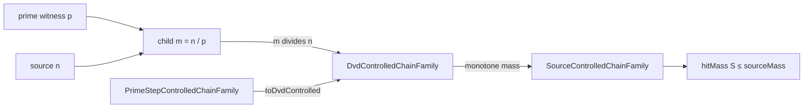

# 素数降下は約数制御へ忘却できる

## 1. 序文

整数 $n$ から、その素因数 $p$ を一つ選んで商 $n/p$ へ降りる操作を考える。この一歩には「どの素数で割ったか」という精密な情報が含まれる。しかし、後段の評価が必要とするのは、降下先が元の整数の約数であるという粗い情報だけかもしれない。

`PrimeDescent.lean` は、この精密な素数降下を一般の約数降下へ忘却し、そのまま既存の chain family と質量上界へ接続する層を実装している。

中心となる流れは次である。

$$m=n/p,\quad p\mid n,\quad p\ \mathrm{prime}\Longrightarrow m\mid n$$

素数という証人を捨てても、約数順序に沿って下へ移動したという事実は残る。

## 2. 結果

### 2.1 素数降下と素数冪降下

一回の素数降下は、次の命題として定義されている。

$$\mathrm{PrimeDescentStep}(n,m)\iff\exists p,\ p\ \mathrm{prime}\land p\mid n\land m=n/p$$

同様に、素数冪降下は次である。

$$\mathrm{PrimePowerDescentStep}(n,m)\iff\exists p,k,\ p\ \mathrm{prime}\land 0<k\land p^k\mid n\land m=n/p^k$$

Lean では、どちらの降下も一般の約数降下へ変換できることが証明されている。

$$\mathrm{PrimeDescentStep}(n,m)\Longrightarrow m\mid n$$

$$\mathrm{PrimePowerDescentStep}(n,m)\Longrightarrow m\mid n$$

対応する定理は `PrimeDescentStep.toDvdDescentStep`、`PrimeDescentStep.dvd_source`、`PrimePowerDescentStep.toDvdDescentStep`、`PrimePowerDescentStep.dvd_source` である。

### 2.2 素数制御 chain family の忘却

`PrimeStepControlledChainFamily` は、各添字 $i$ に対して source node を持ち、その chain 内の各点が source から一回の素数降下で得られることを要求する。

この構造から `toDvdControlled` によって `DvdControlledChainFamily` を作れる。忘却後も、添字集合、chain、source は定義上そのまま保存される。

$$\mathrm{index}(F_{\mathrm{dvd}})=\mathrm{index}(F)$$

$$\mathrm{chain}(F_{\mathrm{dvd}})=\mathrm{chain}(F)$$

$$\mathrm{source}(F_{\mathrm{dvd}})=\mathrm{source}(F)$$

変化するのは証明契約だけである。各 chain point が「素数で一回割った点」だという強い証明から、「source の約数である」という弱い証明へ移る。

### 2.3 原始集合の hit mass 上界

有限集合 $S$ が `PrimitiveOn S` を満たし、質量 $M$ が約数関係に沿って単調であるとする。このとき、素数降下で制御された chain family は、約数制御を経由して次の上界を得る。

$$\mathrm{hitMass}(S)\le\mathrm{sourceMass}$$

この結果は `PrimeStepControlledChainFamily.primitive_hitMass_le_sourceMass` として実装されている。証明は、新しい質量不等式を直接作るのではなく、`toDvdControlled` で既存の約数降下定理へ接続する。

### 2.4 具体例

Lean source には、次の二つの素数降下が具体的に証明されている。

$$8\longrightarrow4\quad\text{by }p=2$$

$$9\longrightarrow3\quad\text{by }p=3$$

この二本を Bool 添字で束ねた sample family について、原始集合 $\{3,4\}$ の unit hit mass が source mass 以下であることも証明されている。

## 3. 一般数学での読み方

自然数を約数関係で順序づける。

$$a\preceq b\iff a\mid b$$

素数降下 $n\mapsto n/p$ は、この順序における下降辺のうち、商が素数一個の除去で生じるものを選んだ部分関係である。素数冪降下なら、一つの素数に属する指数をまとめて除去する。

したがって関係の包含は、概念的には次となる。

$$\mathrm{PrimeDescent}\subseteq\mathrm{PrimePowerDescent}\subseteq\mathrm{DivisibilityDescent}$$

ここで最初の包含は $k=1$ を選ぶという意味であり、Lean source の本記事対象部分では独立定理としては述べられていない。確定しているのは、素数降下と素数冪降下の双方が約数降下へ写ることである。

この忘却は、圏論的な言葉を使えば「追加証人を落とす写像」に近い。点と chain のデータは変えず、性質だけを弱めるため、約数順序について既に証明された一般定理を再利用できる。

## 4. DkMath での読み方

DkMath では、素数 $p$ は単なる割り算の値ではなく、source から下位 node へ移る channel の証人となる。

```text
Prime witness p
  ↓
source n ── divide by p ──> child m
  ↓                         ↓
precise channel             divisor below source
```

`PrimeStepControlledChainFamily` は channel 情報を保持する精密層である。一方 `DvdControlledChainFamily` は、どの channel を通ったかを忘れ、source と child の上下関係だけを残す Core 層である。

この設計により、素数ごとの細かな経路を後から追加しても、既存の原始集合 hit bound を壊さずに利用できる。

## 5. 構造図



## 6. 例

$8$ と $9$ を source とする二本の chain を考える。

$$8=2\cdot4,\qquad9=3\cdot3$$

それぞれ素数 $2$、$3$ を一つ除去して、$4$、$3$ へ降りる。降下先同士について、$3\nmid4$ かつ $4\nmid3$ なので、集合 $\{3,4\}$ はこの二点間で約数比較を持たない原始的な対になる。

Lean の sample は、各 chain を singleton として持つ。

```text
false-channel: source 8 -> {4}
true-channel : source 9 -> {3}
```

`unitNatMassSpace_dvdMonotone` を用いると、この原始集合が二本の chain に当たる質量は、二つの source が供給する質量以下である。

## 7. 考察

ここから先は、本記事の中心定理から直接は従わない解釈である。

素数降下を約数降下へ忘却する設計は、将来、素数ごとの重みや素数冪 channel を導入するときの安定した接続面になり得る。精密な channel 側で新しい情報を増やしつつ、上界証明側では必要最小限の約数単調性だけを使えるからである。

一方、忘却後には「どの素数を除去したか」という情報は失われる。素数別の寄与、指数、von Mangoldt 型の重みを追跡する議論では、`PrimeStepControlledChainFamily` またはさらに精密な構造へ戻る必要がある。

したがって、この bridge の価値は、情報を捨てること自体ではない。目的に応じて、精密層と一般上界層の間を安全に移動できることにある。

## 8. Lean source anchors

### Source file

- `lean/dk_math/DkMath/NumberTheory/PrimitiveSet/PrimeDescent.lean`

### Definitions

- `DkMath.NumberTheory.PrimitiveSet.DvdDescentStep`
- `DkMath.NumberTheory.PrimitiveSet.ProperDvdDescentStep`
- `DkMath.NumberTheory.PrimitiveSet.PrimeDescentStep`
- `DkMath.NumberTheory.PrimitiveSet.PrimePowerDescentStep`
- `DkMath.NumberTheory.PrimitiveSet.PrimeStepControlledChainFamily`
- `DkMath.NumberTheory.PrimitiveSet.PrimeStepControlledChainFamily.toDvdControlled`
- `DkMath.NumberTheory.PrimitiveSet.samplePrimeStepControlledBoolChainFamily`

### Theorems

- `DkMath.NumberTheory.PrimitiveSet.PrimeDescentStep.toDvdDescentStep`
- `DkMath.NumberTheory.PrimitiveSet.PrimeDescentStep.dvd_source`
- `DkMath.NumberTheory.PrimitiveSet.PrimePowerDescentStep.toDvdDescentStep`
- `DkMath.NumberTheory.PrimitiveSet.PrimePowerDescentStep.dvd_source`
- `DkMath.NumberTheory.PrimitiveSet.PrimeStepControlledChainFamily.toDvdControlled_index`
- `DkMath.NumberTheory.PrimitiveSet.PrimeStepControlledChainFamily.toDvdControlled_chain`
- `DkMath.NumberTheory.PrimitiveSet.PrimeStepControlledChainFamily.toDvdControlled_source`
- `DkMath.NumberTheory.PrimitiveSet.PrimeStepControlledChainFamily.primitive_hitMass_le_sourceMass`
- `DkMath.NumberTheory.PrimitiveSet.primeDescentStep_eight_four`
- `DkMath.NumberTheory.PrimitiveSet.primeDescentStep_nine_three`
- `DkMath.NumberTheory.PrimitiveSet.primitive_three_four_samplePrimeStepControlledBoolChainFamily_hitMass_le_sourceMass`
