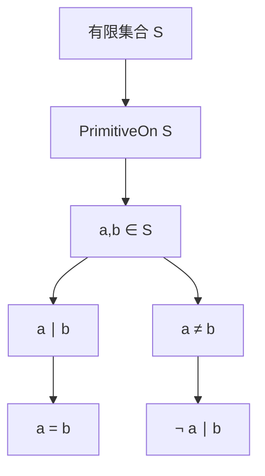

# 原始集合では可除関係が等号へ退化する

## 1. 序文

自然数を「大きい・小さい」ではなく、「割り切れる・割り切れない」で並べると、可除関係による半順序が現れる。

DkMath の `PrimitiveOn` は、有限集合の内部で、この可除関係による上下関係をすべて禁止する述語である。同じ集合に属する二数について、一方が他方を割るなら、その二数は最初から同じでなければならない。

本稿では、この定義から Lean が確定している基本事実を読む。中心となるのは、原始集合の内部では

$$a\mid b\iff a=b$$

と可除関係が等号へ退化することである。

## 2. 結果

`DkMath.NumberTheory.PrimitiveSet.PrimitiveOn` は有限集合 `S : Finset ℕ` に対し、次で定義される。

$$\mathrm{PrimitiveOn}(S)\iff \forall a,b\in S,\ a\mid b\longrightarrow a=b$$

Lean source には、この定義から次の定理が実装されている。

1. `PrimitiveOn.eq_of_dvd`

   原始集合 `S` の要素 $a,b$ について $a\mid b$ なら、$a=b$ である。

2. `PrimitiveOn.pair_eq_of_dvd`

   上と同じ内容を、原始集合内の一対という語彙で再利用する別名として与える。

3. `PrimitiveOn.not_dvd_of_ne`

   原始集合 `S` の異なる二要素 $a\ne b$ について、$a\nmid b$ である。

4. `PrimitiveOn.dvd_iff_eq`

   原始集合の内部では、可除関係と等号が同値になる。

$$a\mid b\iff a=b$$

5. `primitiveOn_empty`

   空集合は原始集合である。

6. `primitiveOn_singleton`

   任意の自然数 $a$ に対して、一点集合 $\{a\}$ は原始集合である。これは $\{0\}$ も含む。

7. `primitiveOn_pair`

   $a\nmid b$ かつ $b\nmid a$ なら、二点集合 $\{a,b\}$ は原始集合である。

8. `primitiveOn_pair_two_three`

   具体例として $\{2,3\}$ は原始集合である。

以上はすべて `nightly` branch の Lean source に存在する定義・定理である。

## 3. 一般数学での読み方

可除関係

$$a\preceq b\iff a\mid b$$

を自然数上の順序として見ると、原始集合はこの順序に関する有限反鎖である。

反鎖とは、異なる二要素が比較不能である集合をいう。したがって原始集合 `S` では、異なる $a,b\in S$ に対して

$$a\nmid b\qquad\mathrm{and}\qquad b\nmid a$$

が成立する。

`PrimitiveOn.dvd_iff_eq` は、この反鎖性を集合内部の関係そのものとして表している。集合全体では豊かな可除構造があっても、原始集合へ制限すると、その関係は対角線だけになる。

$$\{(a,b)\in S\times S:a\mid b\}=\{(a,a):a\in S\}$$

## 4. DkMath での読み方

DkMath の語彙では、可除関係は一つの数から、その内部因子へ到達する経路を表す。

原始集合では、異なる二点の間にその経路を引くことができない。どの要素も別の要素の内部へ降下せず、各点が独立した Core として残る。

`PrimitiveOn.eq_of_dvd` は、集合内部で可除 Beam が見つかった場合、それが異なる二点を結ぶ新しい Beam ではなく、同一点へ戻る自己関係だったことを確定する。

`PrimitiveOn.not_dvd_of_ne` は逆方向から、二つの Core が異なるなら、その間の可除 Beam は存在しないと読むことができる。

## 5. 構造図

## 6. 例

### 6.1 一点集合

任意の $a\in\mathbb N$ に対して $\{a\}$ は原始集合である。集合内部に二つの異なる要素が存在しないため、禁止される可除関係も存在しない。

特に $\{0\}$ も原始集合である。ただし、定義は $0$ を自動的に除外しない。正の自然数 $a$ と $0$ が同じ集合に入ると、$a\mid0$ なので、一般には原始性が失われ得る。

### 6.2 二点集合 `{2,3}`

$2\nmid3$ かつ $3\nmid2$ なので、定理 `primitiveOn_pair` を適用できる。

$$\mathrm{PrimitiveOn}(\{2,3\})$$

この具体的事実が `primitiveOn_pair_two_three` として証明されている。

### 6.3 原始でない二点集合

$\{2,4\}$ では $2\mid4$ かつ $2\ne4$ なので、`PrimitiveOn` の条件を満たさない。

これは Lean source 内の個別定理ではなく、定義を用いた比較例である。

## 7. 考察

以下は本稿の Lean 確定結果から直接は述べられていない解釈・接続候補である。

`PrimitiveOn` は、後続の原始集合上の重み、hit mass、降下鎖を扱う際の最小の離散骨格になる。可除関係が集合内部で等号へ退化するため、一つの降下経路が原始集合の複数要素を順番に通過することはできない。この性質が、原始集合への到達回数や質量を制御する際の非衝突条件として働くと考えられる。

また、`PrimeDescentStep` のような精密な降下構造を一般の可除制御へ忘却した後でも、到達先が原始集合に属するなら、異なる原始要素間の可除衝突を `PrimitiveOn` が排除する。この接続は別記事で扱うべき後続層であり、本稿の「結果」には含めない。

## 8. Lean source anchors

### Source file

- `lean/dk_math/DkMath/NumberTheory/PrimitiveSet/Basic.lean`

### Definition

- `DkMath.NumberTheory.PrimitiveSet.PrimitiveOn`

### Theorems

- `DkMath.NumberTheory.PrimitiveSet.PrimitiveOn.eq_of_dvd`
- `DkMath.NumberTheory.PrimitiveSet.PrimitiveOn.pair_eq_of_dvd`
- `DkMath.NumberTheory.PrimitiveSet.PrimitiveOn.not_dvd_of_ne`
- `DkMath.NumberTheory.PrimitiveSet.PrimitiveOn.dvd_iff_eq`
- `DkMath.NumberTheory.PrimitiveSet.primitiveOn_empty`
- `DkMath.NumberTheory.PrimitiveSet.primitiveOn_singleton`
- `DkMath.NumberTheory.PrimitiveSet.primitiveOn_pair`
- `DkMath.NumberTheory.PrimitiveSet.primitiveOn_pair_two_three`
