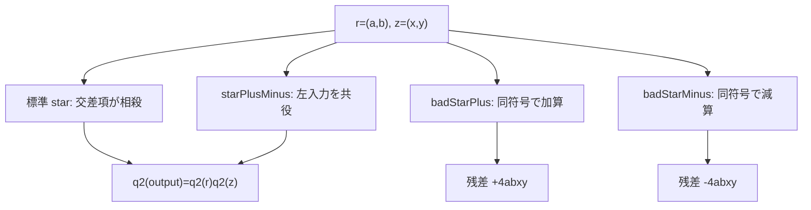

# 符号配置を誤ると平方質量に残差が残る

## 1. 序文

二成分平方質量

$$q2(x,y)=x^2+y^2$$

を保存する積では、二つの交差項が正確に相殺されなければならない。CF2D の標準積は、その相殺が成立する符号配置を選んでいる。

`Failure.lean` は、標準積に近い三つの符号配置を比較する。二つは平方質量の乗法性を壊し、残り一つは別の形で乗法性を保つ。このファイルは、保存則が単なる形の類似ではなく、交差項の符号に依存することを Lean で固定している。

## 2. 結果

可換環上で、成分を

$$r=(a,b),\qquad z=(x,y)$$

とする。

第一座標の符号を標準積から変更した積

$$r\mathbin{\mathrm{badStarPlus}}z=(ax+by,ay+bx)$$

では、Lean は次を証明している。

$$q2(r\mathbin{\mathrm{badStarPlus}}z)=q2(r)q2(z)+4abxy$$

一方、第二座標の交差項も負にした積

$$r\mathbin{\mathrm{badStarMinus}}z=(ax-by,ay-bx)$$

では、残差の符号が反転する。

$$q2(r\mathbin{\mathrm{badStarMinus}}z)=q2(r)q2(z)-4abxy$$

したがって、これら二つの符号配置では一般に平方質量の乗法性が成立しない。失敗量は正確に $\pm4abxy$ である。

ただし、すべての符号変更が失敗するわけではない。積

$$r\mathbin{\mathrm{starPlusMinus}}z=(ax+by,ay-bx)$$

については、次が証明されている。

$$q2(r\mathbin{\mathrm{starPlusMinus}}z)=q2(r)q2(z)$$

さらに、この積は左入力を共役してから標準積を取ったものに等しい。

$$r\mathbin{\mathrm{starPlusMinus}}z=\mathrm{conj}(r)\star z$$

以上はすべて `nightly` の Lean source に存在する定義と定理である。

## 3. 一般数学での読み方

平方を展開すると、`badStarPlus` では

$$(ax+by)^2+(ay+bx)^2=(a^2+b^2)(x^2+y^2)+4abxy$$

となる。同符号で現れた二つの交差項が加算されるため、$4abxy$ が残る。

`badStarMinus` では、対応する交差項がともに負となる。

$$(ax-by)^2+(ay-bx)^2=(a^2+b^2)(x^2+y^2)-4abxy$$

標準的な複素数積

$$(a+bi)(x+yi)=(ax-by)+(ay+bx)i$$

では、一方の平方から $-2abxy$、他方から $+2abxy$ が現れ、合計が零になる。平方ノルムの乗法性は、この反対符号の相殺によって成立する。

`starPlusMinus` は $a+bi$ を $a-bi$ へ共役してから掛ける場合に対応するため、こちらも平方ノルムを保存する。

## 4. DkMath での読み方

DkMath の語彙では、$q2$ は二成分の平方質量であり、交差項は Core と Beam を混ぜる干渉項として読める。

標準積では、二方向から発生する干渉 Beam が反対符号で現れ、完全に消去される。そのため、出力平方質量は入力平方質量の積へ閉じる。

誤った符号配置では干渉 Beam が消えず、

$$\mathrm{Residual}=\pm4abxy$$

として外へ残る。したがって残差は、保存核が壊れた量を測る明示的な Gap である。

一方、`starPlusMinus` は別の保存核であり、失敗例ではない。共役によって向きを反転した後に標準作用へ戻るため、平方質量契約は維持される。

## 5. 構造図

## 6. 例

$a=b=x=y=1$ とする。このとき

$$q2(r)=2,\qquad q2(z)=2,\qquad q2(r)q2(z)=4$$

である。

`badStarPlus` の出力は $(2,2)$ なので、

$$q2(2,2)=8=4+4$$

となり、残差 $+4abxy=4$ がそのまま現れる。

`badStarMinus` の出力は $(0,0)$ なので、

$$q2(0,0)=0=4-4$$

となる。

一方、`starPlusMinus` の出力は $(2,0)$ であるから、

$$q2(2,0)=4=q2(r)q2(z)$$

となり、平方質量の乗法性を保つ。

## 7. 考察

ここから先は Lean の中心定理から直接は従わない解釈である。

`Failure.lean` は、保存則の設計において失敗形を記録する価値を示している。正しい演算だけを保存すると、なぜその符号でなければならないかが見えにくい。残差 $\pm4abxy$ を併記すると、保存則を成立させる相殺条件が可視化される。

この残差は、より一般の候補演算を分類するときの判定量になり得る。二成分双線形積について、平方質量を乗法的に保つ係数条件を解けば、標準積・共役型・退化例を含む保存核の分類へ進める可能性がある。

また、円環や単位核作用を細分化する研究では、各局所作用に残差がないことが重要になる。局所残差が零であることを全セルで要求すれば、細分化後も同じ平方質量境界へ戻るための代数的な検査条件として利用できるかもしれない。

## 8. Lean source anchors

### Source files

- `lean/dk_math/DkMath/CosmicFormula/Rotation/CF2D/Failure.lean`
- `lean/dk_math/DkMath/CosmicFormula/Rotation/CF2D/Basic.lean`

### Definitions

- `DkMath.CosmicFormula.Rotation.CF2D.Vec.badStarPlus`
- `DkMath.CosmicFormula.Rotation.CF2D.Vec.badStarMinus`
- `DkMath.CosmicFormula.Rotation.CF2D.Vec.starPlusMinus`

### Theorems

- `DkMath.CosmicFormula.Rotation.CF2D.Vec.q2_badStarPlus`
- `DkMath.CosmicFormula.Rotation.CF2D.Vec.q2_badStarPlus_eq_q2_mul_add_residual`
- `DkMath.CosmicFormula.Rotation.CF2D.Vec.q2_badStarMinus`
- `DkMath.CosmicFormula.Rotation.CF2D.Vec.q2_badStarMinus_eq_q2_mul_sub_residual`
- `DkMath.CosmicFormula.Rotation.CF2D.Vec.q2_starPlusMinus`
- `DkMath.CosmicFormula.Rotation.CF2D.Vec.starPlusMinus_eq_star_conj_left`
