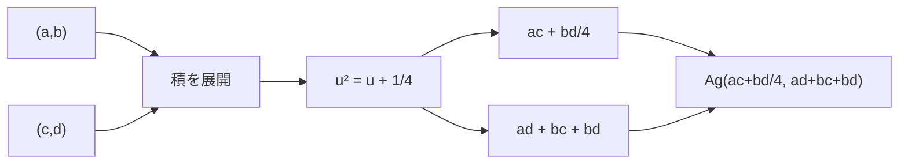

# 白銀単位は二成分代数を閉じる

## 1. 序文

白銀比

$$\sigma=1+\sqrt2$$

を半分にした数を

$$u=\frac{1+\sqrt2}{2}$$

と置く。DkMath ではこの数を `uAg` と呼ぶ。

この $u$ は二乗しても、新しい高次成分を無制限に増やさない。二乗は再び $1$ と $u$ の線形結合へ戻る。

$$u^2=u+\frac14$$

この一つの閉包則によって、すべての数

$$a+bu$$

を二成分 $(a,b)$ のまま乗算できる。白銀単位は、根号を含む世界を二成分座標へ閉じ込める代数核として働く。

## 2. 結果

`DkMath.SilverRatio.Unit.uAg_sq_eq` は、白銀単位の二乗閉包則を確定する。

$$u^2=u+\frac14$$

したがって、差

$$\Delta_{\mathrm{Ag}}=u^2-u$$

は定数となる。`DkMath.SilverRatio.Unit.deltaAg_eq` により、

$$\Delta_{\mathrm{Ag}}=\frac14$$

である。

DkMath は二成分表示を

$$\mathrm{Ag}(a,b)=a+bu$$

と定義する。`DkMath.SilverRatio.Unit.Ag_mul` は、二つの二成分表示の積が再び同じ形へ閉じることを示す。

$$\mathrm{Ag}(a,b)\mathrm{Ag}(c,d)=\mathrm{Ag}\left(ac+\frac{bd}{4},\ ad+bc+bd\right)$$

共役は

$$\mathrm{AgConj}(a,b)=a+b(1-u)$$

であり、ノルムは

$$\mathrm{AgNorm}(a,b)=\mathrm{Ag}(a,b)\mathrm{AgConj}(a,b)$$

と定義される。`DkMath.SilverRatio.Unit.AgNorm_eq` はその閉形式を与える。

$$\mathrm{AgNorm}(a,b)=a^2+ab-\frac{b^2}{4}$$

さらにノルムが零でなければ、`DkMath.SilverRatio.Unit.Ag_inv` により逆数は共役をノルムで割って得られる。

$$\mathrm{Ag}(a,b)^{-1}=\frac{\mathrm{AgConj}(a,b)}{\mathrm{AgNorm}(a,b)}$$

## 3. 一般数学での読み方

$u$ は二次方程式

$$u^2-u-\frac14=0$$

を満たす代数的数である。したがって $u$ の高い冪は、常に $1$ と $u$ の線形結合へ簡約できる。

これは二次体 $\mathbb{Q}(\sqrt2)$ を基底 $\{1,u\}$ で表す考え方の実数係数版である。$u=(1+\sqrt2)/2$ なので、逆に

$$\sqrt2=2u-1$$

が `DkMath.SilverRatio.Unit.sqrt2_eq_two_uAg_sub_one` で確定している。したがって基底 $\{1,\sqrt2\}$ と基底 $\{1,u\}$ は同じ二次拡大を記述する。

乗法公式は、$u^2$ を $u+1/4$ へ置換するだけで得られる。

$$\begin{aligned}(a+bu)(c+du)&=ac+(ad+bc)u+bdu^2\\&=ac+\frac{bd}{4}+(ad+bc+bd)u\end{aligned}$$

第一成分へ $bd/4$ が戻り、第二成分へ混合項 $bd$ が加わる。この二つが、白銀基底での乗法を完全に記録する。

## 4. DkMath での読み方

DkMath の語彙では、$u$ は二乗によって世界の外へ逃げない **白銀単位核** である。

$$u^2=u+\Delta_{\mathrm{Ag}}$$

ここで

$$\Delta_{\mathrm{Ag}}=\frac14$$

は、二乗作用が一次成分へ戻る際に必ず残す固定 Gap である。

通常、基底元を掛け合わせると新しい次数が発生する。しかし $u^2$ は $u$ と定数 Gap へ直ちに還元される。そのため、二成分 $(a,b)$ は乗算後も二成分のまま保存される。

この構造では、

- $a$ はスカラー Core
- $b$ は白銀方向の係数
- $bd/4$ は固定 Gap を通ってスカラー側へ帰還する成分
- $ad+bc+bd$ は白銀方向へ残る混合 Beam

と読める。

## 5. 構造図

二乗成分 $bdu^2$ は消えるのではない。固定 Gap $bd/4$ と白銀成分 $bdu$ に分かれ、二成分世界へ再配置される。

## 6. 例

$\mathrm{Ag}(0,1)=u$ なので、乗法公式へ

$$a=0,\quad b=1,\quad c=0,\quad d=1$$

を入れると、

$$\mathrm{Ag}(0,1)^2=\mathrm{Ag}\left(\frac14,1\right)$$

を得る。実数として読み戻せば、

$$u^2=\frac14+u$$

であり、中心定理 `uAg_sq_eq` と一致する。

別の例として、$1+u$ と $2-u$ を掛ける。

$$\mathrm{Ag}(1,1)\mathrm{Ag}(2,-1)=\mathrm{Ag}\left(2-\frac14,-1+2-1\right)$$

したがって、

$$\mathrm{Ag}(1,1)\mathrm{Ag}(2,-1)=\mathrm{Ag}\left(\frac74,0\right)=\frac74$$

となる。白銀成分が完全に打ち消され、積が純粋なスカラーへ落ちる例である。

## 7. 考察

ここから先は、上記 Lean theorem だけから直接確定する結果ではない。

白銀単位の閉包則は、二次拡大が二成分で閉じる最小模型として読める。指数 $n=2$ では、一つの二次関係が高次項を基底へ戻す。しかし一般次数では、必要な基底数や混合項の構造が増える。

この違いを、DkMath の Core / Beam / Gap と指数構造へ接続できれば、二乗世界がなぜ特別に円環的な保存作用を持ちやすいのかを説明する入口になる可能性がある。

また `AgNorm_eq` の二次形式

$$a^2+ab-\frac{b^2}{4}$$

と、CF2D の正定値平方質量 $x^2+y^2$ は性質が異なる。前者は白銀共役から生じるノルムであり、後者は回転作用を保存する平方質量である。この二種類の二次形式を同じものとみなさず、どの変換が両者を結ぶかを調べることが次の課題となる。

## 8. Lean source anchors

### Source file

- `lean/dk_math/DkMath/SilverRatio/SilverRatioUnit.lean`

### Definitions

- `DkMath.SilverRatio.Unit.uAg`
- `DkMath.SilverRatio.Unit.deltaAg`
- `DkMath.SilverRatio.Unit.Ag`
- `DkMath.SilverRatio.Unit.AgConj`
- `DkMath.SilverRatio.Unit.AgNorm`
- `DkMath.SilverRatio.Unit.AgMulPair`

### Theorems and lemmas

- `DkMath.SilverRatio.Unit.uAg_sq_eq`
- `DkMath.SilverRatio.Unit.deltaAg_eq`
- `DkMath.SilverRatio.Unit.sqrt2_eq_two_uAg_sub_one`
- `DkMath.SilverRatio.Unit.Ag_mul`
- `DkMath.SilverRatio.Unit.AgNorm_eq`
- `DkMath.SilverRatio.Unit.Ag_inv`
- `DkMath.SilverRatio.Unit.AgConj_invol`
