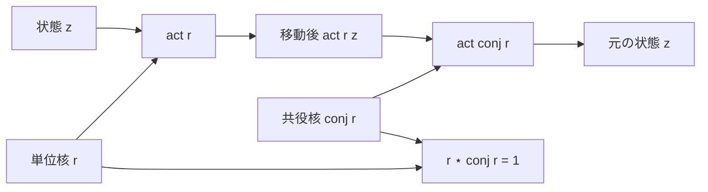

# 共役は単位核の逆作用になる

## 1. 序文

二成分積

$$(a,b)\star(x,y)=(ax-by,ay+bx)$$

は平方質量を乗法的に保つ。平方質量が $1$ の核に限れば、その作用は任意の平方質量境界から外へ出ない。

しかし、保存するだけでは往復可能性までは分からない。本稿では、第二成分の符号を反転する共役

$$\overline{(a,b)}=(a,-b)$$

が、単位核に対して積の逆元として働くことを読む。

## 2. 結果

`Vec.conj` は core 座標を保ち、beam 座標だけを反転する。

$$\mathrm{conj}(x,y)=(x,-y)$$

Lean source は、共役が平方質量を保存することを証明している。

$$q2(\mathrm{conj}(z))=q2(z)$$

また、共役は対合である。

$$\mathrm{conj}(\mathrm{conj}(z))=z$$

共役は二成分積に分配される。

$$\mathrm{conj}(r\star z)=\mathrm{conj}(r)\star\mathrm{conj}(z)$$

任意の二成分状態 $z$ とその共役を掛けると、beam 成分は消え、core 成分に平方質量だけが残る。

$$z\star\mathrm{conj}(z)=(q2(z),0)$$

積の順序を逆にしても同じである。

$$\mathrm{conj}(z)\star z=(q2(z),0)$$

特に単位核 $r$ は $q2(r)=1$ を満たすため、単位核としての共役は両側逆元になる。

$$r\star\mathrm{conj}(r)=1$$

$$\mathrm{conj}(r)\star r=1$$

さらに、核積の作用は作用の合成と一致し、中立核は恒等作用を与える。

$$\mathrm{act}(r\star s,z)=\mathrm{act}(r,\mathrm{act}(s,z))$$

$$\mathrm{act}(1,z)=z$$

したがって、既存定理を組み合わせると、共役核による作用は元の単位核作用を打ち消す。

## 3. 一般数学での読み方

これは複素数の共役と絶対値平方の代数を、任意の可換環上の二成分構造として書いたものである。

複素数 $a+bi$ に対応させれば、

$$\overline{a+bi}=a-bi$$

であり、

$$(a+bi)(a-bi)=a^2+b^2$$

となる。二成分表示では、右辺を実軸上の点 $(a^2+b^2,0)$ として保持する。

単位円上では $a^2+b^2=1$ なので、

$$(a+bi)^{-1}=a-bi$$

に対応する。CF2D の単位核共役は、この逆元公式を除算なしで表している。

## 4. DkMath での読み方

DkMath では、共役は beam の向きを反転しながら平方魔核を保つ反転術式である。

通常の単位核作用が平方質量境界に沿って状態を送るのに対し、共役核は同じ経路を逆向きに辿る。積が中立核へ戻るため、Core と Beam の混合は完全に解け、元の状態へ帰還できる。

$$\mathrm{Kernel}\star\mathrm{ConjugateKernel}=\mathrm{NeutralKernel}$$

これは、保存核が単に状態を壊さないだけでなく、逆方向の作用を内部に持つことを示す。

## 5. 構造図

## 6. 例

実数上で

$$r=\left(\frac35,\frac45\right)$$

と置くと、

$$q2(r)=\frac9{25}+\frac{16}{25}=1$$

なので $r$ は単位核である。その共役は

$$\mathrm{conj}(r)=\left(\frac35,-\frac45\right)$$

であり、積を計算すると、

$$r\star\mathrm{conj}(r)=\left(\frac9{25}+\frac{16}{25},-\frac{12}{25}+\frac{12}{25}\right)=(1,0)$$

となる。

たとえば $z=(2,1)$ に $r$ を作用させれば、

$$\mathrm{act}(r,z)=\left(\frac25,\frac{11}{5}\right)$$

である。そこへ共役核を作用させると、再び $(2,1)$ に戻る。

## 7. 考察

ここから先は本記事の Lean 確定層を越える考察である。

単位核、積、中立核、共役逆元、作用合成が揃ったことで、CF2D の単位核は可換群として整理できる候補を持つ。現行 source には必要な部品が個別定理として存在するが、標準的な `CommGroup` instance として束ねる実装は本記事の対象外である。

また、円環を任意に細分化したとき、各局所作用に共役逆作用が存在するなら、局所セル間の移動は可逆になる。これは、等配置された円環セルが一方向に崩れず、全周で均衡を保つ条件を形式化する入口になり得る。

## 8. Lean source anchors

### Source file

- `lean/dk_math/DkMath/CosmicFormula/Rotation/CF2D/Basic.lean`

### Definitions

- `DkMath.CosmicFormula.Rotation.CF2D.Vec.conj`
- `DkMath.CosmicFormula.Rotation.CF2D.UnitKernel.conj`
- `DkMath.CosmicFormula.Rotation.CF2D.UnitKernel.star`
- `DkMath.CosmicFormula.Rotation.CF2D.UnitKernel.act`

### Theorems

- `DkMath.CosmicFormula.Rotation.CF2D.Vec.q2_conj`
- `DkMath.CosmicFormula.Rotation.CF2D.Vec.conj_conj`
- `DkMath.CosmicFormula.Rotation.CF2D.Vec.conj_star`
- `DkMath.CosmicFormula.Rotation.CF2D.Vec.star_conj_self`
- `DkMath.CosmicFormula.Rotation.CF2D.Vec.conj_star_self`
- `DkMath.CosmicFormula.Rotation.CF2D.UnitKernel.star_conj`
- `DkMath.CosmicFormula.Rotation.CF2D.UnitKernel.conj_star`
- `DkMath.CosmicFormula.Rotation.CF2D.UnitKernel.act_one`
- `DkMath.CosmicFormula.Rotation.CF2D.UnitKernel.act_star`
