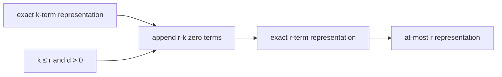

# 冪和充填可能性は零項の追加で単調に拡張できる

## 1. 序文

自然数 $n$ を、ちょうど $r$ 個の $d$ 次冪の和として表せるかを考える。

$$n=\sum_{i\in\mathrm{Fin}(r)}f(i)^d$$

DkMath の `PowerSums.Basic` は、この問いを `FillableByPowSumExact d n r` として定義する。ここで項は `Fin r → ℕ` により添字付けされるため、同じ値を複数回使うことも、値 $0$ を使うことも許される。

この設計では、一度 $k$ 個の項で表現できた数は、指数 $d$ が正なら、末尾へ零項を足すことで任意の $r\ge k$ 個の表現へ拡張できる。項数が増えても、冪和の値は変わらない。

## 2. 結果

### 2.1 ちょうど $r$ 個による充填

Lean source は次を定義する。

$$\mathrm{FillableByPowSumExact}(d,n,r)\iff\exists f:\mathrm{Fin}(r)\to\mathbb N,\ \sum_i f(i)^d=n$$

完全修飾名は `DkMath.NumberTheory.PowerSums.FillableByPowSumExact` である。

### 2.2 高々 $r$ 個による充填

$$\mathrm{FillableByPowSumLE}(d,n,r)\iff\exists k\le r,\ \mathrm{FillableByPowSumExact}(d,n,k)$$

完全修飾名は `DkMath.NumberTheory.PowerSums.FillableByPowSumLE` である。

### 2.3 零は空和で充填できる

任意の次数 $d$ について、零は零個の項で充填できる。

$$\mathrm{FillableByPowSumExact}(d,0,0)$$

これは `DkMath.NumberTheory.PowerSums.fillable_zero_exact_zero` により証明されている。

### 2.4 零項追加による単調拡張

$d>0$、$k\le r$ とする。$n$ がちょうど $k$ 個の $d$ 次冪で充填できるなら、$n$ はちょうど $r$ 個でも充填できる。

$$\mathrm{FillableByPowSumExact}(d,n,k)\land k\le r\land 0<d\Longrightarrow\mathrm{FillableByPowSumExact}(d,n,r)$$

これは `DkMath.NumberTheory.PowerSums.fillable_exact_of_exact_le` で証明されている。Lean proof は元の関数 $f:\mathrm{Fin}(k)\to\mathbb N$ に、値が常に $0$ の関数を `Fin.append` で連結する。

正の指数では $0^d=0$ なので、追加分は総和を変えない。

### 2.5 exact から at-most への忘却

ちょうど $r$ 個で充填できれば、当然、高々 $r$ 個でも充填できる。

$$\mathrm{FillableByPowSumExact}(d,n,r)\Longrightarrow\mathrm{FillableByPowSumLE}(d,n,r)$$

これは `DkMath.NumberTheory.PowerSums.fillable_le_of_exact` により証明されている。

### 2.6 Lean が持つ具体例

平方数について、Lean source は次を確定している。

$$16=4^2$$

$$25=3^2+4^2$$

対応する定理は `DkMath.NumberTheory.PowerSums.fillable_sq_16_exact_one` と `DkMath.NumberTheory.PowerSums.fillable_sq_25_exact_two` である。

立方数については、同じ $216$ に異なる項数の表現が存在する。

$$216=6^3$$

$$216=3^3+4^3+5^3$$

対応する定理は `DkMath.NumberTheory.PowerSums.fillable_cube_216_exact_one` と `DkMath.NumberTheory.PowerSums.fillable_cube_216_exact_three` である。

## 3. 一般数学での読み方

`FillableByPowSumExact d n r` は、重複と零を許した $d$ 次冪和表現の存在命題である。

表現

$$n=a_1^d+\cdots+a_k^d$$

が一つあれば、$d>0$ のもとで

$$n=a_1^d+\cdots+a_k^d+0^d+\cdots+0^d$$

と書ける。したがって、exact な項数についての存在集合

$$E_{d,n}=\{r\in\mathbb N\mid\mathrm{FillableByPowSumExact}(d,n,r)\}$$

は、一度要素 $k$ を持てば、その上側の全自然数を含む上方閉集合になる。

この単調性は、零を許す定義に由来する。各項を正整数に制限した場合や、互いに異なる値だけを許す場合には、そのままでは成立しない。

`FillableByPowSumLE` は exact な項数情報を忘れ、ある上限以内で表現可能という弱い性質だけを保持する。

## 4. DkMath での読み方

DkMath の語彙では、冪和の各項は Big を埋める局所セルとして読める。

既に $k$ 個の実働セルで総量 $n$ が閉じているとき、追加される零項は、配置場所だけを持ち平方質量または高次質量を供給しない空セルである。

```text
実働セル k 個
  ├─ 合計質量 n
  └─ 表現証明書 f : Fin k → ℕ

空セル r-k 個を追加
  ├─ 各寄与 0^d = 0
  └─ 合計質量は n のまま

実働セル + 空セル
  └─ r 個の exact 表現へ拡張
```

ここでは「項数」は質量そのものではなく、質量を収容するスロット数である。正次数では空スロットを追加しても Core は変化しない。

また `ResidualFillableExact d big body r` は、$\mathrm{big}\ge\mathrm{body}$ と、その差が $r$ 個の $d$ 次冪で充填できることを同時に要求する。

$$\mathrm{ResidualFillableExact}(d,\mathrm{big},\mathrm{body},r)\iff\mathrm{big}\ge\mathrm{body}\land\mathrm{FillableByPowSumExact}(d,\mathrm{big}-\mathrm{body},r)$$

これは Big と Body の間に残った residual を、有限個の冪セルで埋めるための入口である。

## 5. 構造図



## 6. 例

Lean で確定している

$$25=3^2+4^2$$

を使う。これは二項の平方和表現である。

$d=2>0$ なので、零項を加えて

$$25=3^2+4^2+0^2$$

$$25=3^2+4^2+0^2+0^2$$

と拡張できる。

従って、`fillable_exact_of_exact_le` により、$25$ は任意の $r\ge2$ について、ちょうど $r$ 個の平方で充填可能である。

同様に $216=6^3$ から、任意の $r\ge1$ に対して

$$216=6^3+0^3+\cdots+0^3$$

という exact $r$ 項表現が得られる。一方、Lean source は零埋めとは別の実働三項表現 $216=3^3+4^3+5^3$ も保持している。

## 7. 考察

この節は Lean theorem から直接確定した結果ではなく、今後の利用候補を分離して記す。

零項追加の単調性により、最小項数を定義する際には「表現が存在する項数の集合が上方閉である」という構造を利用できる可能性がある。ただし現在の `Basic.lean` には、最小の $r$ を返す `FillRank` 自体はまだ定義されていない。

また、零項は exact 項数を形式的に増やすだけで、新しい非零分解を生成しない。したがって、表現の幾何学的多様性や原始性を調べるには、非零項数、support、重複禁止などを別に記録する refine が必要になる。

`ResidualFillableExact` と Core / Beam / Gap 分解を接続すれば、Big と Body の差を何個の高次魔核で閉じられるかという問題へ進める。この接続も本記事の結果節では主張せず、将来の形式化候補とする。

## 8. Lean source anchors

### Source file

- `lean/dk_math/DkMath/NumberTheory/PowerSums/Basic.lean`

### Definitions

- `DkMath.NumberTheory.PowerSums.FillableByPowSumExact`
- `DkMath.NumberTheory.PowerSums.FillableByPowSumLE`
- `DkMath.NumberTheory.PowerSums.ResidualFillableExact`

### Theorems

- `DkMath.NumberTheory.PowerSums.fillable_zero_exact_zero`
- `DkMath.NumberTheory.PowerSums.fillable_exact_of_exact_le`
- `DkMath.NumberTheory.PowerSums.fillable_le_of_exact`
- `DkMath.NumberTheory.PowerSums.fillable_sq_16_exact_one`
- `DkMath.NumberTheory.PowerSums.fillable_sq_25_exact_two`
- `DkMath.NumberTheory.PowerSums.fillable_cube_216_exact_one`
- `DkMath.NumberTheory.PowerSums.fillable_cube_216_exact_three`
