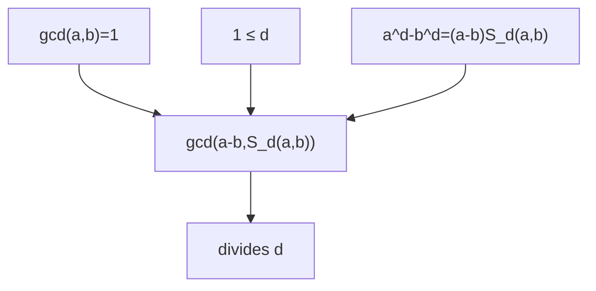

# 差と冪差商の公約数は指数を割る

## 1. 序文

差の冪は、一次因子 $a-b$ と幾何級数型の和へ分解できる。

$$a^d-b^d=(a-b)S_d(a,b)$$

ここで $S_d(a,b)$ は、差の冪を $a-b$ で割ったときに現れる冪差商である。一般には $a-b$ と $S_d(a,b)$ が共通因子を持つ可能性がある。しかし $a$ と $b$ が互いに素なら、その共通部分は指数 $d$ の内部へ閉じ込められる。

本記事では、この「差と冪差商の共有因子は指数を超えて自由に増えられない」という Lean 確定事項を読む。

## 2. 結果

`DkMath.Algebra.DiffPow.diffPowSum` は、可換環上で次の有限和として定義される。

$$S_d(a,b)=\sum_{i=0}^{d-1}a^{d-1-i}b^i$$

`DkMath.Algebra.DiffPow.pow_sub_pow_factor` は、この和が差の冪の因数分解を与えることを示す。

$$a^d-b^d=(a-b)S_d(a,b)$$

整数 $a,b$、自然数 $d$ に対し、$1\le d$ かつ

$$\gcd(a,b)=1$$

を仮定する。`DkMath.NumberTheory.GcdDiffPow.gcd_divides_d` は、次を証明する。

$$\gcd\bigl(a-b,S_d(a,b)\bigr)\mid d$$

したがって、差 $a-b$ と冪差商 $S_d(a,b)$ の双方に現れる素因子は、指数 $d$ の素因子でなければならない。

## 3. 一般数学での読み方

合同式 $a\equiv b\pmod p$ を考えると、冪差商の各項は法 $p$ で同じ値へ揃う。

$$S_d(a,b)\equiv d\,b^{d-1}\pmod p$$

さらに $\gcd(a,b)=1$ であり、$p\mid a-b$ なら、$p$ は $b$ を割らない。よって $p$ が $S_d(a,b)$ も割るなら、残る可能性は $p\mid d$ である。

Lean の主定理は、この素数ごとの直観を整数 gcd の可除関係として一括している。

$$\gcd\bigl(a-b,S_d(a,b)\bigr)\mid d$$

特に $d$ が素数 $q$ のとき、公約数は $1$ または $q$ に制限される。

## 4. DkMath での読み方

DkMath では、$a^d-b^d$ を二層へ分けて読むことができる。

- $a-b$ は入力間の一次 Gap
- $S_d(a,b)$ は指数展開後に残る Body

この二層が共有できる因子は、任意の外部ノイズではない。互いに素な入力条件の下では、その共有核は指数 $d$ の内部にのみ存在できる。

```text
差の冪 a^d - b^d
  ├─ Gap  : a - b
  └─ Body : S_d(a,b)

Gap と Body の共有核
  └─ 指数 d を割る
```

したがって指数は単なる反復回数ではなく、Gap と Body の重複を収容する有限の制御領域として働く。

## 5. 構造図



## 6. 例

### 6.1 指数3

$a=2$、$b=1$、$d=3$ とする。

$$S_3(2,1)=2^2+2\cdot1+1^2=7$$

$$a-b=1$$

したがって、

$$\gcd(1,7)=1\mid3$$

となる。

### 6.2 公約数が指数そのものになる例

$a=4$、$b=1$、$d=3$ とする。$a$ と $b$ は互いに素である。

$$S_3(4,1)=4^2+4\cdot1+1^2=21$$

$$a-b=3$$

よって、

$$\gcd(3,21)=3\mid3$$

となる。差と Body は確かに素因子 $3$ を共有するが、その $3$ は指数から来ている。

### 6.3 指数5

$a=6$、$b=1$、$d=5$ とする。

$$S_5(6,1)=6^4+6^3+6^2+6+1=1555$$

$$a-b=5$$

したがって、

$$\gcd(5,1555)=5\mid5$$

である。ここでも共有素因子は指数の素因子と一致する。

## 7. 考察

この節は Lean theorem から直接は従わない解釈と接続候補を記す。

この定理は、差の冪に現れる素因子を「差側に既に存在する因子」と「冪差商側で新たに現れる因子」へ分離するときの境界条件になる。指数 $d$ を割らない素数は、互いに素な入力の下では両側へ同時に潜り込めない。

このため、Zsigmondy 型の原始素因子、完全冪の $p$ 進指数、FLT 型因数分解を接続するとき、指数に由来する例外素数と新規素数を分離する入口になり得る。ただし、原始素因子の存在や valuation の精密評価は本定理単独からは従わず、別の定理層が必要である。

DkMath の語彙では、指数 $d$ は Gap と Body の重複を許可する例外台帳として読める可能性がある。

$$p\nmid d\Longrightarrow p\text{ は Gap と Body を同時には割れない}$$

この対偶的な読みは、指数ごとの例外構造を有限化する際に有用であろう。

## 8. Lean source anchors

### Source files

- `lean/dk_math/DkMath/Algebra/DiffPow.lean`
- `lean/dk_math/DkMath/NumberTheory/GdcDivD.lean`

### Definitions

- `DkMath.Algebra.DiffPow.diffPowSum`

### Theorems

- `DkMath.Algebra.DiffPow.pow_sub_pow_factor`
- `DkMath.NumberTheory.GcdDiffPow.gcd_divides_d`
