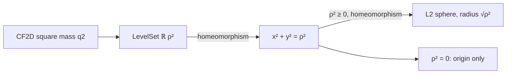

# 平方質量境界はユークリッド円として読める

## 1. 序文

CF2D の平方質量は、二成分状態 $z=(x,y)$ に対して

$$q2(z)=x^2+y^2$$

で与えられる。これまでの記事では、この量を保存する単位核作用を扱った。本稿では一歩手前へ戻り、固定値

$$q2(z)=\rho^2$$

を満たす状態集合そのものが、通常の座標円および Mathlib のユークリッド球面とどのように対応するかを読む。

対象ファイルは、新しい曲線を作るのではなく、既に構成された CF2D level set を標準的なユークリッド幾何へ翻訳する。

## 2. 結果

実数上の平方質量は常に非負である。

$$0\le q2(z)$$

また、平方質量が零になるのは零状態に限る。

$$q2(z)=0\iff z=(0,0)$$

したがって、非零状態と正の平方質量も同値になる。

$$0<q2(z)\iff z\ne(0,0)$$

平方半径を $\rho^2$ として、座標円を

$$\mathrm{EuclideanCircleSq}(\rho^2)=\{(x,y)\in\mathbb R^2\mid x^2+y^2=\rho^2\}$$

と定める。Lean source には、CF2D の level set とこの座標円の間の明示的な位相同型

$$\mathrm{LevelSet}(\mathbb R,\rho^2)\simeq_t\mathrm{EuclideanCircleSq}(\rho^2)$$

が定義されている。

さらに $0\le\rho^2$ の下で、座標対を標準二次元ユークリッド空間へ移す写像は

$$\left\|\mathrm{pairToEuclideanPlane}(x,y)\right\|^2=x^2+y^2$$

を満たす。この恒等式を使い、座標円と半径 $\sqrt{\rho^2}$ の標準 L2 球面の間にも位相同型が定義されている。

$$\mathrm{EuclideanCircleSq}(\rho^2)\simeq_t\mathrm{EuclideanSphereSq}(\rho^2)$$

平方半径が零の場合、座標円は原点一つだけからなる。平方半径が正なら、対応する通常半径も正である。

$$0<\rho^2\Longrightarrow0<\sqrt{\rho^2}$$

## 3. 一般数学での読み方

集合

$$\{(x,y)\in\mathbb R^2\mid x^2+y^2=\rho^2\}$$

は、$\rho^2>0$ なら原点中心・半径 $\sqrt{\rho^2}$ の円である。$\rho^2=0$ では円が原点へ退化する。

本実装の特徴は、最初から半径 $r$ を与えるのではなく、平方半径 $\rho^2$ を基本量として持つ点にある。そのため、平方根を導入する前の代数的な境界方程式と、平方根を用いる標準的な距離球面を分離できる。

また、ここで示されるのは単なる全単射ではない。順方向・逆方向がともに連続な位相同型であるため、CF2D の level set と通常の円は位相構造まで一致する。

## 4. DkMath での読み方

DkMath では $q2$ を二成分平方質量として読む。固定平方質量

$$q2(z)=\rho^2$$

は、同じ保存核を共有する状態の境界である。

本結果により、この抽象的な平方質量境界は、後からユークリッド円として解釈できる。すなわち、円を先に仮定して $q2$ を説明するのではなく、保存量の level set を先に構成し、その後で標準幾何へ移す順序が形式化されている。

```text
平方質量 q2
  ↓ 固定値を取る
CF2D level set
  ↓ 座標を読む
x² + y² = ρ²
  ↓ L2 空間へ移す
半径 √ρ² のユークリッド球面
```

この順序は、単位核作用が level set を保存するという既存結果と自然に接続する。作用保存は純代数の層にあり、円としての意味付けはユークリッド解釈の層にある。

## 5. 構造図



## 6. 例

### 6.1 零境界

$\rho^2=0$ とする。境界条件は

$$x^2+y^2=0$$

である。実数の平方は非負なので、両方が零でなければならない。

$$x=0,\qquad y=0$$

Lean source の `euclideanCircleSq_zero_eq_origin` は、`EuclideanCircleSq 0` の任意の点が原点に等しいことを直接述べる。

### 6.2 単位平方質量境界

$\rho^2=1$ なら、座標境界は

$$x^2+y^2=1$$

となる。標準 L2 空間では半径 $\sqrt1=1$ の単位円として読める。CF2D 側では、これは `q2 z = 1` を満たす状態の level set である。

## 7. 考察

以下は Lean の中心結果から直接は述べられていない解釈である。

平方半径を基本量として円を構成する方法は、DkMath の「見た目の幾何を後から回収する」という設計に適している。まず代数的保存境界を固定し、その上の作用・一意性・分割を調べ、必要になった段階で通常の半径や角度へ翻訳できる。

また、白銀円環や鍵石 $N$ の研究では、特定点が同じ $q2$ level に属することが中心条件になる。本稿の位相同型は、その level set が標準的な円周と同じ位相空間であることを保証する。しかし、特定の未知曲線全体が真円であることや、稠密な単位核作用から半径一定性が従うことまでは、本稿の定理には含まれない。

## 8. Lean source anchors

Source file:

- `lean/dk_math/DkMath/CosmicFormula/Rotation/CF2D/EuclideanPhase.lean`

Definitions:

- `DkMath.CosmicFormula.Rotation.CF2D.EuclideanCircleSq`
- `DkMath.CosmicFormula.Rotation.CF2D.EuclideanPlane`
- `DkMath.CosmicFormula.Rotation.CF2D.EuclideanSphereSq`
- `DkMath.CosmicFormula.Rotation.CF2D.levelSetHomeomorphEuclideanCircleSq`
- `DkMath.CosmicFormula.Rotation.CF2D.pairToEuclideanPlane`
- `DkMath.CosmicFormula.Rotation.CF2D.euclideanPlaneToPair`
- `DkMath.CosmicFormula.Rotation.CF2D.euclideanCircleSqHomeomorphSphere`

Theorems:

- `DkMath.CosmicFormula.Rotation.CF2D.Vec.q2_nonneg`
- `DkMath.CosmicFormula.Rotation.CF2D.Vec.q2_eq_zero_iff`
- `DkMath.CosmicFormula.Rotation.CF2D.Vec.q2_pos_iff_ne_zero`
- `DkMath.CosmicFormula.Rotation.CF2D.euclideanCircleSq_zero_eq_origin`
- `DkMath.CosmicFormula.Rotation.CF2D.euclideanPlaneToPair_pairToEuclideanPlane`
- `DkMath.CosmicFormula.Rotation.CF2D.pairToEuclideanPlane_euclideanPlaneToPair`
- `DkMath.CosmicFormula.Rotation.CF2D.pairToEuclideanPlane_norm_sq`
- `DkMath.CosmicFormula.Rotation.CF2D.sqrt_pos_of_sqRadius_pos`
