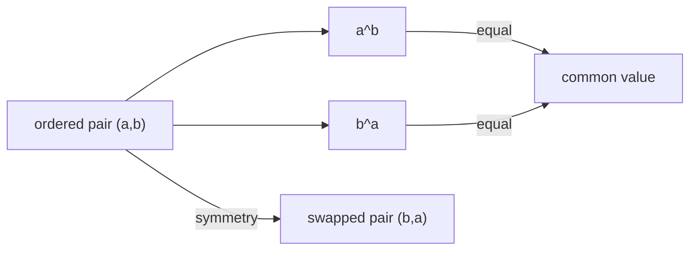

# 冪交換関係は対称で非自明な自然数例を持つ

## 1. 序文

通常、底と指数を交換すると冪の値は変わる。

$$a^b\ne b^a$$

しかし、特別な自然数の組では両者が一致する。DkMath は、この一致を独立した関係 `PowerSwap` として固定している。

本稿では、その最小定義、対称性、非自明例 $(2,4)$、そして一方の座標が $1$ である場合の剛性を読む。

## 2. 結果

自然数 $a,b$ に対する冪交換関係は、次の等式として定義される。

$$\mathrm{PowerSwap}(a,b)\iff a^b=b^a$$

この関係は反射的である。

$$\mathrm{PowerSwap}(a,a)$$

また、冪交換関係は対称である。

$$\mathrm{PowerSwap}(a,b)\Longrightarrow\mathrm{PowerSwap}(b,a)$$

Lean source には、これを同値として表す定理も存在する。

$$\mathrm{PowerSwap}(a,b)\iff\mathrm{PowerSwap}(b,a)$$

自然数上には、対角線 $a=b$ だけでなく非自明な例が存在する。

$$2^4=4^2=16$$

したがって、$(2,4)$ とその対称な組 $(4,2)$ は、ともに `PowerSwap` を満たす。

$$\mathrm{PowerSwap}(2,4)\land\mathrm{PowerSwap}(4,2)$$

この例から、異なる自然数による冪交換解の存在も証明されている。

$$\exists a,b\in\mathbb N,\quad a\ne b\land\mathrm{PowerSwap}(a,b)$$

一方、一方の座標が $1$ なら非自明解は生じない。

$$\mathrm{PowerSwap}(a,1)\Longrightarrow a=1$$

## 3. 一般数学での読み方

方程式

$$a^b=b^a$$

は、底と指数の交換に対して値が不変になる点を探すディオファントス方程式である。

対角線 $a=b$ 上では等式は自明に成立する。しかし $(2,4)$ は対角線外にあり、

$$2^4=16,\qquad4^2=16$$

によって同じ値へ到達する。

関係の対称性は、解 $(a,b)$ が得られれば $(b,a)$ も解になることを意味する。したがって解集合は、座標平面上で対角線に関して対称である。

また、$b=1$ の場合は

$$a^1=1^a$$

すなわち $a=1$ となるため、境界座標 $1$ には非自明な枝が存在しない。

## 4. DkMath での読み方

DkMath では `PowerSwap` を、二つの異なる指数表現が同じ Big へ到達する関係として読める。

```text
(a,b)
  ├─ a^b ─┐
  │       ├─ same Big
  └─ b^a ─┘
```

$(2,4)$ では、一方が細かい底を多く重ねる表現、もう一方が大きい底を少なく重ねる表現になっている。

$$2^4=4^2$$

これは、異なる Core–exponent 座標が同じ値へ合流する最小の自然数標本である。

ただし、`PowerSwap.Basic` が確定しているのは関係の定義、対称性、明示例、存在、および $1$ に関する剛性までである。自然数解の完全分類や実数上の連続分枝は、この Result 節の主張には含めない。

## 5. 構造図



## 6. 例

### 6.1 対角線上の例

任意の自然数 $a$ について、

$$a^a=a^a$$

なので `PowerSwap a a` が成立する。

### 6.2 最小の明示的非自明例

$$2^4=2\cdot2\cdot2\cdot2=16$$

$$4^2=4\cdot4=16$$

よって、

$$\mathrm{PowerSwap}(2,4)$$

である。対称性から、

$$\mathrm{PowerSwap}(4,2)$$

も従う。

### 6.3 座標 $1$ の剛性

`PowerSwap a 1` を仮定すると、

$$a^1=1^a=1$$

であるから $a=1$ となる。したがって $(a,1)$ 型の非自明な自然数解は存在しない。

## 7. 考察

以下は、Lean source の中心定理から直接は主張されていない解釈である。

`PowerSwap` は、同じ数を異なる底と指数で表す「表現の合流」を観測する最小 API として使える。今後、実数上で $a^b=b^a$ を対数化すれば、

$$\frac{\log a}{a}=\frac{\log b}{b}$$

という等高線の問題へ移る。この連続的解釈は `PowerSwap.Basic` の結果そのものではなく、別モジュールとの接続候補である。

また、$(2,4)$ は非自明解の存在を示すが、自然数上の非自明解がこの対称対だけであるとは、本稿の Lean anchors は述べていない。完全分類を論じる際には、追加の定理が必要となる。

## 8. Lean source anchors

Source file:

- `lean/dk_math/DkMath/PowerSwap/Basic.lean`

Definition:

- `DkMath.PowerSwap`

Theorems:

- `DkMath.PowerSwap.powerSwap_refl`
- `DkMath.PowerSwap.powerSwap_symm`
- `DkMath.PowerSwap.powerSwap_two_four`
- `DkMath.PowerSwap.powerSwap_four_two`
- `DkMath.PowerSwap.powerSwap_pair_two_four`
- `DkMath.PowerSwap.exists_powerSwap_nontrivial`
- `DkMath.PowerSwap.powerSwap_with_one`
- `DkMath.PowerSwap.powerSwap_iff_symm`
