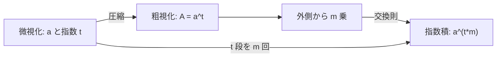

# 冪として束ねた量の反復冪乗は指数積へ戻る

## 1. 序文

数 $A$ が別の数 $a$ の $t$ 乗として既に束ねられているとする。

$$A=a^t$$

この $A$ をさらに $m$ 乗すると、外側の冪乗は内側の指数へ吸収される。

$$A^m=a^{tm}$$

`DkMath.PowerSwap.Exchange` は、この最小交換則を自然数と整数の両方で固定している。本稿では、ひとまとまりの冪を一つの座標として見る粗視化と、元の底と指数へ戻す微視化が、反復冪乗の下で同じ値を与えることを読む。

## 2. 結果

自然数 $a,A,t,m$ について $A=a^t$ なら、次が成立する。

$$A^m=a^{tm}$$

Lean source では、これが `DkMath.PowerSwap.exchange_condition_minimal_nat` として証明されている。

同じ交換則は、底と束ねられた量を整数 $a,A\in\mathbb Z$ とした場合にも成立する。指数 $t,m$ は自然数である。

$$A=a^t\Longrightarrow A^m=a^{tm}$$

これは `DkMath.PowerSwap.exchange_condition_minimal_int` である。

さらに Lean source は、次の具体例を証明している。

$$4^2=2^4$$

$$8^2=2^6$$

$$9^2=3^4$$

$$27^2=3^6$$

それぞれ $4=2^2$、$8=2^3$、$9=3^2$、$27=3^3$ を交換則へ代入した例である。

## 3. 一般数学での読み方

通常の指数法則では、冪の冪は指数の積になる。

$$(a^t)^m=a^{tm}$$

この恒等式自体は基本的であるが、`Exchange.lean` は前提を $A=a^t$ という別名付きの形で受け取る。したがって、計算の途中で $a^t$ を一つの量 $A$ として扱っても、必要な時点で指数積 $tm$ を持つ元の底の冪へ正確に戻せる。

たとえば $8$ を単なる整数として扱う粗い座標と、$8=2^3$ と分解する細かい座標は、平方した後にも一致する。

$$8^2=(2^3)^2=2^6$$

これは値の等しさだけでなく、指数情報を失わずに座標表現を交換できることを表している。

## 4. DkMath での読み方

DkMath では、$A=a^t$ を「$t$ 段分の自己作用を一つの核 $A$ に圧縮した状態」と読める。

```text
微視化された表示: a, t
        ↓ 圧縮
粗視化された核: A = a^t
        ↓ m 回作用
A^m
        ↓ 展開
微視化された表示: a^(t*m)
```

交換則は、圧縮された核を $m$ 回作用させる経路と、元の底 $a$ を合計 $tm$ 回作用させる経路が一致することを保証する。

したがって指数 $t$ は、$A$ という値の内部に保存された層数として振る舞う。外側の指数 $m$ はその層全体を反復し、最終的な層数は加法ではなく積 $tm$ になる。

## 5. 構造図



## 6. 例

### 6.1 $4^2=2^4$

$4=2^2$ と置く。交換則で $m=2$ とすれば、

$$4^2=2^{2\cdot2}=2^4$$

となる。

### 6.2 $27^2=3^6$

$27=3^3$ と置く。交換則で $m=2$ とすれば、

$$27^2=3^{3\cdot2}=3^6$$

となる。

この二例は同じ定理の異なる座標入力であり、個別の数値的偶然ではない。

## 7. 考察

以下は Result 節の Lean theorem から直接には述べられていない解釈である。

この交換則は、DkMath のスケール設計における最小の往復保証として利用できる可能性がある。ある段階で $a^t$ を一つの単位核 $A$ として扱い、別の段階で底 $a$ と総指数 $tm$ へ戻すとき、値の保存はこの定理で閉じる。

ただし、この定理だけから一般の異なる底の冪方程式 $a^b=b^a$ の分類や、冪表示の一意性は従わない。また $A$ から $a$ と $t$ を一意に復元できるとも主張していない。本稿の確定範囲は、既に $A=a^t$ という証明が与えられた場合の反復冪乗の交換に限られる。

## 8. Lean source anchors

Source file:

- `lean/dk_math/DkMath/PowerSwap/Exchange.lean`

Theorems:

- `DkMath.PowerSwap.exchange_condition_minimal_nat`
- `DkMath.PowerSwap.exchange_condition_minimal_int`
- `DkMath.PowerSwap.exchange_example_4_2_eq_2_4`
- `DkMath.PowerSwap.exchange_example_8_2_eq_2_6`
- `DkMath.PowerSwap.exchange_example_9_2_eq_3_4`
- `DkMath.PowerSwap.exchange_example_27_2_eq_3_6`
