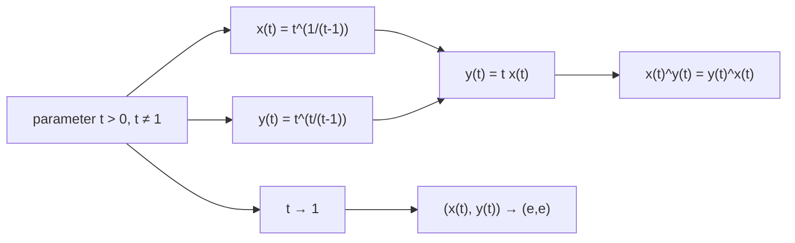

# 冪交換の実数枝は対角点 e へ収束する

## 1. 序文

自然数上の冪交換関係 $a^b=b^a$ には、$(2,4)$ と $(4,2)$ という非自明な格子点がある。`DkMath.PowerSwap.Branch` は、この離散的な一致を実数パラメータ $t$ による連続枝へ広げる。

枝の座標は、$t>0$ かつ $t\ne1$ の領域で次のように定義される。

$$x(t)=t^{1/(t-1)},\qquad y(t)=t^{t/(t-1)}$$

この二座標は常に冪交換式を満たし、欠けたパラメータ点 $t=1$ へ近づくと、両方ともネイピア数 $e$ へ収束する。

## 2. 結果

Lean source では、実数枝の領域を

$$\mathrm{PowerSwapBranchDomain}(t)\iff0<t\land t\ne1$$

として定め、座標を `powerSwapBranchX` と `powerSwapBranchY` に固定している。

正の $t$ では、それぞれ指数関数表示へ書き換えられる。

$$x(t)=\exp\left(\frac{\log t}{t-1}\right)$$

$$y(t)=\exp\left(\frac{t\log t}{t-1}\right)$$

さらに、穴あき近傍 $t\to1$ において二つの指数部がともに $1$ へ収束する。

$$\frac{\log t}{t-1}\longrightarrow1$$

$$\frac{t\log t}{t-1}\longrightarrow1$$

したがって枝の座標対は $(e,e)$ へ収束する。

$$(x(t),y(t))\longrightarrow(e,e)$$

枝の内部では次の比例関係も成立する。

$$y(t)=t\,x(t)$$

そして、領域内の任意の $t$ について実冪の冪交換式が成立する。

$$x(t)^{y(t)}=y(t)^{x(t)}$$

具体的な格子点として、Lean は次を証明している。

$$(x(2),y(2))=(2,4)$$

$$(x(1/2),y(1/2))=(4,2)$$

## 3. 一般数学での読み方

方程式 $x^y=y^x$ を正の実数で考え、$y=tx$ と置く。すると

$$x^{tx}=(tx)^x$$

となり、正の $x$ に対して $x$ 乗根を取れば

$$x^t=tx$$

を得る。$t\ne1$ なら、これを解いて

$$x=t^{1/(t-1)}$$

となり、$y=tx$ から

$$y=t^{t/(t-1)}$$

が得られる。

つまり、このパラメータ表示は冪交換曲線の非対角枝を明示的に記述している。$t=1$ では式に $0$ 除算が現れるため定義されないが、極限は存在し、その欠損点を $(e,e)$ が埋める。

## 4. DkMath での読み方

DkMath では、$t$ を二座標間の相対スケールと読むことができる。

$$y=t\,x$$

一方の座標を $t$ 倍へ移しても、指数側も同時に入れ替わるため、最終的な冪質量は一致する。

$$x^y=y^x$$

$t=2$ と $t=1/2$ は、同じ離散核 $(2,4)$ を互いに反転した二つの観測方向である。そこから $t$ を連続的に $1$ へ近づけると、座標差が消え、枝は対角核 $(e,e)$ へ閉じる。

この意味で $e$ は、冪交換の非対角枝が対称境界へ到達するときの連続的な閉鎖点として現れる。

## 5. 構造図

## 6. 例

### 6.1 $t=2$

$$x(2)=2^{1/(2-1)}=2$$

$$y(2)=2^{2/(2-1)}=4$$

したがって、古典的な非自明例が得られる。

$$2^4=4^2=16$$

### 6.2 $t=1/2$

パラメータを反転すると座標も反転する。

$$x(1/2)=4,\qquad y(1/2)=2$$

この点でも同じ冪交換等式が成立する。

$$4^2=2^4$$

## 7. 考察

以下は Result 節の Lean theorem から直接は述べられていない解釈である。

この枝は、離散的な整数解 $(2,4)$ を孤立した偶然としてではなく、連続な実数曲線上の格子点として位置づける。さらに $(e,e)$ は枝の定義域外にありながら極限として回収されるため、DkMath の Gap 観測における「欠けた一点を極限が埋める」典型例として読める。

ただし、本稿の定理は正の実数解 $(x,y)$ の完全分類を主張していない。また、枝の単調性、全単射性、幾何学的な曲率なども Result 節の範囲には含めていない。

## 8. Lean source anchors

Source file:

- `lean/dk_math/DkMath/PowerSwap/Branch.lean`

Definitions:

- `DkMath.PowerSwap.PowerSwapBranchDomain`
- `DkMath.PowerSwap.powerSwapBranchX`
- `DkMath.PowerSwap.powerSwapBranchY`
- `DkMath.PowerSwap.powerSwapBranchPair`

Theorems:

- `DkMath.PowerSwap.powerSwap_branchX_eq_exp_log_div_sub`
- `DkMath.PowerSwap.powerSwap_branchY_eq_exp_mul_log_div_sub`
- `DkMath.PowerSwap.powerSwap_branchX_tendsto_e_of_log_div_sub_tendsto_one`
- `DkMath.PowerSwap.powerSwap_branchY_tendsto_e_of_mul_log_div_sub_tendsto_one`
- `DkMath.PowerSwap.powerSwap_branch_limit_to_e_of_core_limits`
- `DkMath.PowerSwap.tendsto_log_div_sub_one_at_one_punctured`
- `DkMath.PowerSwap.tendsto_mul_log_div_sub_one_at_one_punctured`
- `DkMath.PowerSwap.powerSwap_branch_limit_to_e`
- `DkMath.PowerSwap.powerSwap_branch_y_eq_t_mul_x`
- `DkMath.PowerSwap.powerSwap_branch_correct`
- `DkMath.PowerSwap.powerSwap_branch_at_two`
- `DkMath.PowerSwap.powerSwap_branch_at_half`
