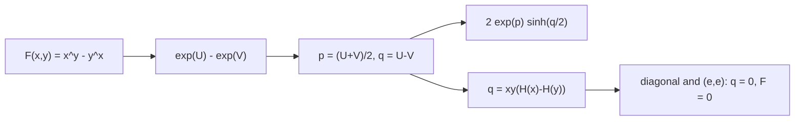

# 冪交換 Gap は双曲線正弦形に分解できる

## 1. 序文

冪交換方程式

$$x^y=y^x$$

を調べるとき、等号そのものだけでなく、両辺がどれだけ離れているかを測る量が役に立つ。`DkMath.PowerSwap.Contours` は、その差を

$$F(x,y)=x^y-y^x$$

として固定し、正の実数領域で指数座標・平均座標・差座標へ分解する。

前の記事では、冪交換の実数枝が $(e,e)$ へ収束することを扱った。本稿では、その枝を囲む Gap の代数的な形を読む。

## 2. 結果

正の実数 $x,y$ に対し、次の指数座標を定める。

$$U=y\log x,\qquad V=x\log y$$

平均座標と差座標は、

$$p=\frac{U+V}{2},\qquad q=U-V$$

である。

Lean source では、冪差がまず指数関数の差へ翻訳される。

$$F(x,y)=e^U-e^V$$

さらに、この差は次の双曲線正弦形へ正確に分解される。

$$F(x,y)=2e^p\sinh\left(\frac q2\right)$$

したがって、$e^p$ は常に正の大きさ成分であり、冪交換 Gap の符号と零点は差座標 $q$ の双曲線正弦によって担われる。

調和座標を

$$H(x)=\frac{\log x}{x}$$

とすると、$x\ne0$ かつ $y\ne0$ の下で、差座標は

$$q=xy\bigl(H(x)-H(y)\bigr)$$

と書ける。

中心 $(e,e)$ では、

$$q(e,e)=0,\qquad p(e,e)=e,\qquad F(e,e)=0$$

が成立する。

また、局所二次モデル

$$Q(u,v)=v^2-u^2$$

は引数交換で符号が反転し、対角上では零になる。

$$Q(v,u)=-Q(u,v),\qquad Q(u,u)=0$$

実際の Gap も局所対角 $x=e+u$, $y=e+u$ 上で零になる。

## 3. 一般数学での読み方

正の $x,y$ では、実数冪は指数関数を用いて

$$x^y=e^{y\log x},\qquad y^x=e^{x\log y}$$

と表せる。そこで二つの指数 $U,V$ を、その平均 $p$ と差 $q$ に取り直すと、

$$U=p+\frac q2,\qquad V=p-\frac q2$$

となる。指数関数の差を括り出せば、

$$e^U-e^V=e^p\left(e^{q/2}-e^{-q/2}\right)=2e^p\sinh\left(\frac q2\right)$$

が得られる。

これは、冪交換方程式の零点条件を

$$x^y=y^x\iff q=0$$

と読むための自然な座標である。ただし本稿の Result 節で直接固定されているのは分解恒等式と中心・対角上の零点であり、この同値の一般形そのものを独立 theorem として掲げているわけではない。

調和座標では、

$$q=xy\left(\frac{\log x}{x}-\frac{\log y}{y}\right)$$

となるため、冪交換は関数 $H(t)=\log t/t$ の同じ高さを持つ二点の関係として見える。

## 4. DkMath での読み方

DkMath の語彙では、$F(x,y)$ は二つの冪世界の差として現れる Gap である。

この Gap は、次の二成分へ分離される。

```text
大きさ成分  exp(p)
符号・偏り  sinh(q/2)
```

平均座標 $p$ は二つの指数世界が共有する全体スケールを持ち、差座標 $q$ はどちら側へ傾いているかを持つ。したがって、

```text
冪交換 Gap
  = 正の共通スケール
  × 反対称な差ビーム
```

と読める。

さらに $q=xy(H(x)-H(y))$ により、冪交換の偏りは調和座標の高さの差へ移される。複雑な可変底・可変指数の比較が、一変数関数 $H$ の比較へ射影されるわけじゃ。

## 5. 構造図



## 6. 例

### 6.1 対角上の零点

$x=y>0$ なら、

$$U=x\log x=V$$

なので $q=0$ となる。双曲線正弦形では、

$$F(x,x)=2e^p\sinh(0)=0$$

と読める。Lean source では、特に局所座標 $x=e+u$, $y=e+u$ に対して `gapF_local_diag_zero` がこれを固定する。

### 6.2 中心 $(e,e)$

$x=y=e$ では、$\log e=1$ なので、

$$U=e,\qquad V=e,\qquad p=e,\qquad q=0$$

となる。その結果、

$$F(e,e)=0$$

である。`gapP_at_e_e`、`gapQ_at_e_e`、`gapF_at_e_e` がこの三点を個別に証明している。

### 6.3 局所二次モデル

局所変位 $(u,v)$ に対する候補モデルは、

$$Q(u,v)=v^2-u^2=(v-u)(v+u)$$

である。対角方向 $u=v$ では零となり、座標を交換すると符号が反転する。このモデルの反対称性と対角零点は Lean で証明済みである。

## 7. 考察

以下は Lean の中心定理から直接は主張されていない解釈である。

双曲線正弦形は、冪交換枝の近傍解析を「共通スケール」と「符号付き差」に分ける入口になる。特に $e^p>0$ なので、Gap の符号変化や零点構造を $q$ に集中させられる可能性がある。

また、$H(x)=\log x/x$ は $x=e$ で極値を持つ古典的な関数である。既存の Branch モジュールが $(e,e)$ を穴あき極限として回収し、Contours モジュールが同じ点で $q=0$ と $F=0$ を回収することから、枝の収束と Gap の中心座標は同じ魔核を別方向から観測していると考えられる。

ただし、`gapQuadraticModel` は source 内でも局所二次主部の候補として定義されている段階である。実際の $F$ との差に対する漸近評価や Taylor 展開の剰余評価は、本稿の確定結果には含めない。

## 8. Lean source anchors

Source file:

- `lean/dk_math/DkMath/PowerSwap/Contours.lean`

Definitions:

- `DkMath.PowerSwap.gapU`
- `DkMath.PowerSwap.gapV`
- `DkMath.PowerSwap.gapP`
- `DkMath.PowerSwap.gapQ`
- `DkMath.PowerSwap.harmonicCoord`
- `DkMath.PowerSwap.gapF`
- `DkMath.PowerSwap.localX`
- `DkMath.PowerSwap.localY`
- `DkMath.PowerSwap.gapQuadraticModel`

Theorems:

- `DkMath.PowerSwap.gapF_eq_expU_sub_expV`
- `DkMath.PowerSwap.gapF_eq_soft_hyperbolic_form`
- `DkMath.PowerSwap.gapQ_eq_xy_mul_Hdiff`
- `DkMath.PowerSwap.gapQ_at_e_e`
- `DkMath.PowerSwap.gapP_at_e_e`
- `DkMath.PowerSwap.gapF_at_e_e`
- `DkMath.PowerSwap.gapQuadraticModel_swap_neg`
- `DkMath.PowerSwap.gapQuadraticModel_diag_zero`
- `DkMath.PowerSwap.gapF_local_diag_zero`
