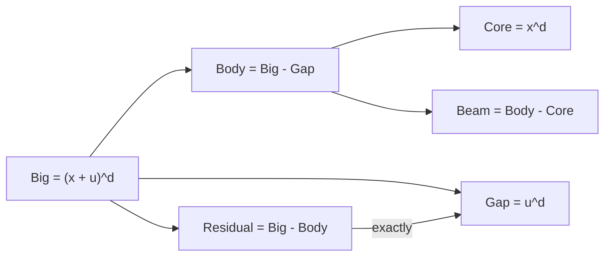

# 自然数減算でも宇宙式の残差は正確に Gap へ戻る

## 1. 序文

自然数の減算は、整数の減算とは異なり、負の値を零へ切り捨てる。そのため

$$a-b+b=a$$

は無条件には成立しない。DkMath の自然数版宇宙式では、この切り捨てが起きないことを先に不等式で保証し、その後で Big / Body / Gap の保存分解を回収する。

本稿では、自然数上で定義された残差

$$\mathrm{residual}=\mathrm{Big}-\mathrm{Body}$$

が、近似ではなく正確に Gap と一致することを読む。

## 2. 結果

自然数 $d,x,u$ に対して、Lean source は次を定義する。

$$\mathrm{big}(d,x,u)=(x+u)^d$$

$$\mathrm{gap}(d,x,u)=u^d$$

$$\mathrm{body}(d,x,u)=\mathrm{big}(d,x,u)-\mathrm{gap}(d,x,u)$$

$$\mathrm{core}(d,x,u)=x^d$$

$$\mathrm{beam}(d,x,u)=\mathrm{body}(d,x,u)-\mathrm{core}(d,x,u)$$

まず、$u\le x+u$ と $x\le x+u$ から、冪の単調性により

$$\mathrm{gap}(d,x,u)\le\mathrm{big}(d,x,u)$$

$$\mathrm{core}(d,x,u)\le\mathrm{big}(d,x,u)$$

が証明されている。

このうち `gap_le_big` が自然数減算の安全条件となり、次の保存式が無条件に成立する。

$$\mathrm{body}(d,x,u)+\mathrm{gap}(d,x,u)=\mathrm{big}(d,x,u)$$

したがって、向きを変えた形も得られる。

$$\mathrm{big}(d,x,u)=\mathrm{body}(d,x,u)+\mathrm{gap}(d,x,u)$$

さらに `core ≤ body` を仮定すれば、Body も Core と Beam に分解される。

$$\mathrm{body}(d,x,u)=\mathrm{core}(d,x,u)+\mathrm{beam}(d,x,u)$$

ゆえに Big 全体は

$$\mathrm{big}(d,x,u)=\mathrm{core}(d,x,u)+\mathrm{beam}(d,x,u)+\mathrm{gap}(d,x,u)$$

と分解できる。

最後に

$$\mathrm{residual}(d,x,u)=\mathrm{big}(d,x,u)-\mathrm{body}(d,x,u)$$

と定めると、Lean は

$$\mathrm{residual}(d,x,u)=\mathrm{gap}(d,x,u)$$

を証明している。

## 3. 一般数学での読み方

自然数の切り捨て減算では、$a-b$ が本来の差を表すために $b\le a$ が必要である。

ここでは

$$u^d\le(x+u)^d$$

が先に確保されているため、Body の定義

$$\mathrm{Body}=(x+u)^d-u^d$$

は情報を失わない。その結果、再び $u^d$ を加えれば元の冪へ戻り、Big から Body を引けば同じ $u^d$ が回収される。

これは、自然数減算を使う際に「差の定義」だけでなく「差が切り捨てられないための順序証明」を同時に管理する標準的な形式化である。

## 4. DkMath での読み方

DkMath では、Gap は単なる計算後の余りではない。Big を Body から復元するときに必要となる、保存された境界成分である。

```text
Big
  ├─ Body
  │    ├─ Core
  │    └─ Beam
  └─ Gap
```

自然数世界では減算に情報消失の可能性がある。しかし `gap_le_big` を発動条件として固定することで、Gap は失われず、反対向きの観測 `Big - Body` から正確に再出現する。

したがって `residual_eq_gap` は、Gap が定義上の飾りではなく、往復可能な保存成分であることを示す。

## 5. 構造図



## 6. 例

$d=2$、$x=3$、$u=1$ とする。

$$\mathrm{Big}=(3+1)^2=16$$

$$\mathrm{Gap}=1^2=1$$

$$\mathrm{Body}=16-1=15$$

$$\mathrm{Core}=3^2=9$$

$$\mathrm{Beam}=15-9=6$$

したがって

$$16=9+6+1$$

であり、反対向きに残差を読むと

$$16-15=1$$

となる。Lean source にも、この数値例が `norm_num` により確認されている。

## 7. 考察

以下は Lean の中心結果から直接は述べられていない解釈である。

自然数版の利点は、対象を非負量として保ったまま保存分解を記述できることにある。一方で、減算ごとに順序条件が必要になる。そのため、より複雑な差分計算では整数版へ移し、自然数版は非負性や有限質量を強調する表示層として使い分ける設計が考えられる。

また `core ≤ body` は全分解の追加発動条件である。本稿の Result は、この条件を無条件に成立すると主張していない。Big / Body / Gap の分解は無条件、Core / Beam まで含む分解は条件付き、という層の違いが重要である。

## 8. Lean source anchors

Source file:

- `lean/dk_math/DkMath/CosmicFormula/ResidualNat.lean`

Definitions:

- `DkMath.CosmicFormula.big`
- `DkMath.CosmicFormula.gap`
- `DkMath.CosmicFormula.body`
- `DkMath.CosmicFormula.core`
- `DkMath.CosmicFormula.beam`
- `DkMath.CosmicFormula.residual`

Theorems:

- `DkMath.CosmicFormula.gap_le_big`
- `DkMath.CosmicFormula.core_le_big`
- `DkMath.CosmicFormula.body_add_gap_eq_big`
- `DkMath.CosmicFormula.beam_add_core_eq_body`
- `DkMath.CosmicFormula.core_add_beam_eq_body`
- `DkMath.CosmicFormula.big_eq_body_add_gap`
- `DkMath.CosmicFormula.big_eq_core_add_beam_add_gap`
- `DkMath.CosmicFormula.residual_eq_gap`
