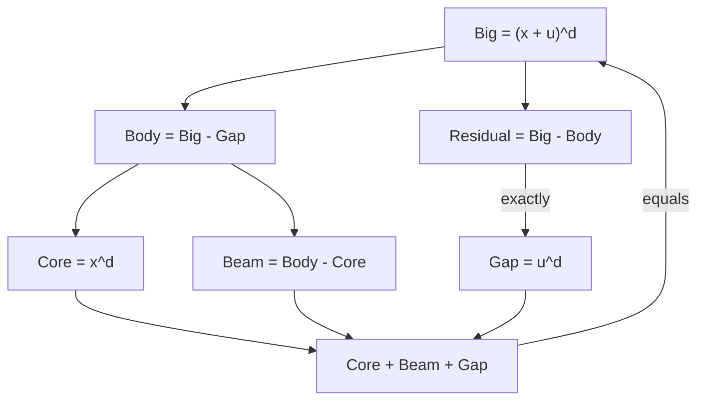

# 整数減算は順序仮定なしで宇宙式分解を回収する

## 1. 序文

自然数の減算は零で切り捨てられるため、差から元の成分を復元するときには大小関係の証明が必要になる。整数では減算が加法群の演算なので、この切り捨ては起こらない。

`DkMath.CosmicFormula.ResidualInt` は、宇宙式の Big / Body / Gap / Core / Beam を整数上で定義し、減算による各層が順序仮定なしに元の保存分解へ戻ることを固定する。

## 2. 結果

自然数 $d$ と整数 $x,u$ に対し、次を定義する。

$$\mathrm{Big}_{\mathbb Z}(d,x,u)=(x+u)^d$$

$$\mathrm{Gap}_{\mathbb Z}(d,x,u)=u^d$$

$$\mathrm{Body}_{\mathbb Z}(d,x,u)=\mathrm{Big}_{\mathbb Z}(d,x,u)-\mathrm{Gap}_{\mathbb Z}(d,x,u)$$

$$\mathrm{Core}_{\mathbb Z}(d,x,u)=x^d$$

$$\mathrm{Beam}_{\mathbb Z}(d,x,u)=\mathrm{Body}_{\mathbb Z}(d,x,u)-\mathrm{Core}_{\mathbb Z}(d,x,u)$$

Lean source では、すべての $d,x,u$ について追加仮定なしに次が証明されている。

$$\mathrm{Body}_{\mathbb Z}+\mathrm{Gap}_{\mathbb Z}=\mathrm{Big}_{\mathbb Z}$$

$$\mathrm{Core}_{\mathbb Z}+\mathrm{Beam}_{\mathbb Z}=\mathrm{Body}_{\mathbb Z}$$

したがって、全分解も成立する。

$$\mathrm{Big}_{\mathbb Z}=\mathrm{Core}_{\mathbb Z}+\mathrm{Beam}_{\mathbb Z}+\mathrm{Gap}_{\mathbb Z}$$

さらに residual を

$$\mathrm{Residual}_{\mathbb Z}=\mathrm{Big}_{\mathbb Z}-\mathrm{Body}_{\mathbb Z}$$

と定めると、常に Gap へ正確に戻る。

$$\mathrm{Residual}_{\mathbb Z}=\mathrm{Gap}_{\mathbb Z}$$

これらの定理には、`gapInt ≤ bigInt` や `coreInt ≤ bodyInt` のような順序条件は置かれていない。

## 3. 一般数学での読み方

整数では、任意の $A,B\in\mathbb Z$ に対して

$$A=(A-B)+B$$

が無条件に成立する。これは減算が加法逆元を用いて

$$A-B=A+(-B)$$

と定義されるためである。

したがって、Body を Big から Gap を引いた量として作れば、Gap を加えるだけで必ず Big を復元できる。同様に、Beam を Body から Core を引いた量として作れば、Core を戻すことで Body が復元される。

自然数版で必要だった大小関係は、整数版では代数構造そのものに吸収される。

## 4. DkMath での読み方

DkMath では、Big を完成全体、Gap を余白、Body を Gap を除いた本体、Core を主核、Beam を Core と Body の間を埋める層として読む。

整数世界では、Gap や Beam が負になる場合も排除されない。しかし符号を含めて記録するため、差分情報は失われない。よって、分解は「各部分が非負な物体分割」というより、符号付き会計として理解できる。

```text
Big
  ├─ Body = Big - Gap
  │    ├─ Core
  │    └─ Beam = Body - Core
  └─ Gap
```

この会計では、引いた量を再び加えれば必ず元へ戻る。整数は、差分を消さずに保存する座標系として働く。

## 5. 構造図



## 6. 例

$d=2$、$x=3$、$u=1$ では、

$$\mathrm{Big}_{\mathbb Z}=16,\qquad \mathrm{Gap}_{\mathbb Z}=1,\qquad \mathrm{Body}_{\mathbb Z}=15$$

$$\mathrm{Core}_{\mathbb Z}=9,\qquad \mathrm{Beam}_{\mathbb Z}=6$$

したがって、

$$16=9+6+1$$

となる。

整数版は負値も扱える。たとえば $d=3$、$x=-2$、$u=5$ では、

$$\mathrm{Big}_{\mathbb Z}(3,-2,5)=(-2+5)^3=27$$

である。また $d=4$、$u=-3$ なら、

$$\mathrm{Gap}_{\mathbb Z}(4,x,-3)=(-3)^4=81$$

となり、符号を含む入力でも同じ定義と復元則が使える。

## 7. 考察

以下は Lean の結果節から直接は述べられていない解釈である。

自然数版と整数版の差は、宇宙式の内容そのものよりも、観測に使う数体系の情報保持能力を表していると考えられる。自然数減算は負の差を零へ潰すため、復元には順序証明が必要になる。整数は負の差を保持するので、保存式が純粋な群演算へ還元される。

この違いは、DkMath の差分・valuation・flow を設計するとき、どの層を自然数に置き、どの層を整数へ持ち上げるべきかを判断する基準になりうる。ただし、整数版の各成分が非負であることや、幾何的な面積分割として読めることは、本稿の定理からは従わない。

## 8. Lean source anchors

Source file:

- `lean/dk_math/DkMath/CosmicFormula/ResidualInt.lean`

Definitions:

- `DkMath.CosmicFormula.bigInt`
- `DkMath.CosmicFormula.gapInt`
- `DkMath.CosmicFormula.bodyInt`
- `DkMath.CosmicFormula.coreInt`
- `DkMath.CosmicFormula.beamInt`
- `DkMath.CosmicFormula.residualInt`

Theorems:

- `DkMath.CosmicFormula.bodyInt_add_gapInt_eq_bigInt`
- `DkMath.CosmicFormula.beamInt_add_coreInt_eq_bodyInt`
- `DkMath.CosmicFormula.coreInt_add_beamInt_eq_bodyInt`
- `DkMath.CosmicFormula.bigInt_eq_bodyInt_add_gapInt`
- `DkMath.CosmicFormula.bigInt_eq_coreInt_add_beamInt_add_gapInt`
- `DkMath.CosmicFormula.residualInt_eq_gapInt`
