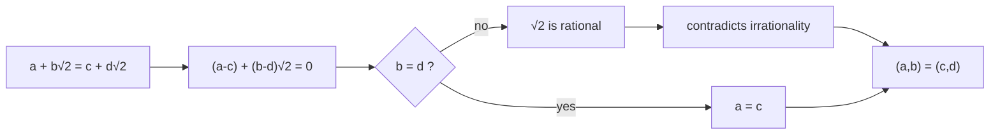

# 平方根2の無理性は有理二成分表示を一意にする

## 1. 序文

実数を二つの有理数 $a,b$ によって

$$x=a+b\sqrt2$$

と表すとき、同じ実数に別の係数対が対応する可能性はあるだろうか。

`DkMath.UniqueRepSimple` は、$\sqrt2$ の無理性を使い、$1$ と $\sqrt2$ が有理数上で独立であることを直接示す。その結果、$\mathbb Q(\sqrt2)$ 型の実数に対する二成分座標 $(a,b)$ は一意に決まる。

## 2. 結果

有理数 $a,b,c,d$ が

$$a+b\sqrt2=c+d\sqrt2$$

を満たすならば、Lean は係数ごとの等式

$$a=c\quad\text{かつ}\quad b=d$$

を証明している。

これは theorem `sqrt2_lin_indep_over_rat'` の内容である。証明では、まず

$$(a-c)+(b-d)\sqrt2=0$$

へ移項する。$b=d$ なら直ちに $a=c$ が得られる。$b\ne d$ なら、$\sqrt2$ が有理数の商として表せることになり、`sqrt2_irrational` と矛盾する。

また、実数 $x$ が

$$x=a+b\sqrt2$$

と何らかの有理数 $a,b$ で表せることを `InQAdjSqrt2 x` と定義する。この条件の下で、theorem `unique_rep_in_Q_sqrt2` は

$$\exists!\,(a,b)\in\mathbb Q\times\mathbb Q,\quad a+b\sqrt2=x$$

を証明している。

## 3. 一般数学での読み方

$1$ と $\sqrt2$ の間に非自明な有理係数の一次関係

$$r+s\sqrt2=0$$

が存在したとする。$s\ne0$ なら

$$\sqrt2=-\frac rs$$

となり、$\sqrt2$ が有理数になってしまう。したがって $s=0$ であり、そのとき $r=0$ でもある。

ゆえに $\{1,\sqrt2\}$ は $\mathbb Q$ 上一次独立である。一次独立な基底方向に沿う座標は、同じ対象に対して二通り存在できない。

## 4. DkMath での読み方

DkMath の二成分世界では、Core 成分 $a$ と $\sqrt2$ 方向の Beam 成分 $b\sqrt2$ を分けて読むことができる。

$$x=\mathrm{Core}+\mathrm{Beam}=a+b\sqrt2$$

ここで $\sqrt2$ の無理性は、二つの方向が有理係数によって互いに吸収されないことを保証する。Core の差を Beam 側へ移したり、Beam の差を Core 側へ隠したりすることはできない。

したがって無理性は、単に「分数で書けない」という性質ではなく、二成分座標の情報を混線させない分離条件として働く。

## 5. 構造図

## 6. 例

たとえば、次の等式を考える。

$$3+2\sqrt2=c+d\sqrt2$$

$c,d$ が有理数なら、Lean の係数一意性から

$$c=3\quad\text{かつ}\quad d=2$$

でなければならない。

見かけ上の変形で $3$ の一部を $\sqrt2$ 係数へ移すことはできない。仮に異なる係数対が存在すれば、その差から $\sqrt2$ の有理表示が生まれるからである。

## 7. 考察

以下は Lean の中心定理から直接は述べられていない解釈である。

この一意性は、白銀比周辺の二成分代数において、表示と計算結果を正規形へ戻す基礎として利用できる。より一般には、無理数 $\alpha$ に対して $1$ と $\alpha$ の有理一次独立性が得られれば、$a+b\alpha$ 型の表示にも同じ議論を適用できる。

ただし本稿の Lean source が直接証明しているのは $\sqrt2$ を用いた実数表示である。一般の二次拡大、環同型、整数係数表示の一意性までは、この二つの theorem の主張には含まれない。

## 8. Lean source anchors

Source file:

- `lean/dk_math/DkMath/UniqueRepSimple.lean`

Definition:

- `DkMath.UniqueRepresentation.SilverRatio.InQAdjSqrt2`

Theorems:

- `DkMath.UniqueRepresentation.SilverRatio.sqrt2_lin_indep_over_rat'`
- `DkMath.UniqueRepresentation.SilverRatio.unique_rep_in_Q_sqrt2`
