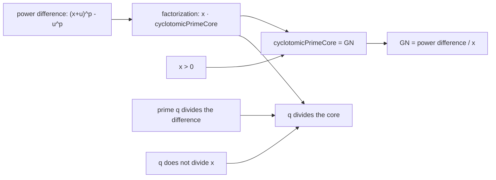

# GN は冪関数の差分商として読める

## 1. 序文

二つの冪 $(x+u)^p$ と $u^p$ の差には、必ず境界差 $x$ が因子として現れる。DkMath の `GN p x u` は、この差から $x$ を取り除いた残りを自然数上で正確に表す。

この記事では `DkMath.CFBRC.Basic` に確定している定理だけを用い、GN が冪関数の離散的な差分商であること、さらに prime divisor を core 側へ運べることを読む。

## 2. 結果

`cyclotomicPrimeCore` について、可換半環上で次の基本分解が成立する。

$$
(x+u)^p=x\,\mathrm{cyclotomicPrimeCore}(p,x,u)+u^p
$$

自然数では、これを減算の形へ戻せる。

$$
(x+u)^p-u^p=x\,\mathrm{cyclotomicPrimeCore}(p,x,u)
$$

さらに $x>0$ なら、`cyclotomicPrimeCore` と `GN` は一致する。

$$
\mathrm{cyclotomicPrimeCore}(p,x,u)=\mathrm{GN}(p,x,u)
$$

したがって、GN は冪差を境界差 $x$ で割った差分商に一致する。

$$
\mathrm{GN}(p,x,u)=\frac{(x+u)^p-u^p}{x}
$$

同じ仮定の下で、`cyclotomicPrimeCore` 自身も同じ商に一致する。

$$
\mathrm{cyclotomicPrimeCore}(p,x,u)=\frac{(x+u)^p-u^p}{x}
$$

また素数 $q$ が冪差を割り、境界差 $x$ を割らないなら、$q$ は core を割る。

$$
q\mid((x+u)^p-u^p)\land q\nmid x\Longrightarrow q\mid\mathrm{cyclotomicPrimeCore}(p,x,u)
$$

## 3. 一般数学での読み方

関数 $f(t)=t^p$ を考えると、GN は $u$ から $u+x$ までの差分商である。

$$
\mathrm{GN}(p,x,u)=\frac{f(u+x)-f(u)}{x}
$$

これは微分係数の有限差分版に相当する。ただし Lean theorem が述べているのは極限や微分ではなく、自然数上の厳密な除法恒等式である。

一方、`cyclotomicPrimeCore` は幾何和型の有限和として構成されており、冪差因数分解の商を除法なしで保持する。$x>0$ を与えたとき、その有限和表示と自然数除法による差分商表示が一致する。

## 4. DkMath での読み方

DkMath の語彙では、$(x+u)^p$ は新しい境界の冪、$u^p$ は基準単位側の Gap、$x$ は二つの境界を隔てる差である。

冪差をいきなり除算する代わりに、まず

$$
(x+u)^p-u^p=x\cdot\mathrm{Core}
$$

という積の形へ固定する。この順序により、素因子が境界差 $x$ に属するのか、それとも core に属するのかを分離できる。`prime_dvd_cyclotomicPrimeCore_of_dvd_sub_not_dvd_left` は、$q\nmid x$ という条件のもとで、冪差に現れた素数 $q$ を core 側へ確実に送る術式である。

## 5. 構造図

## 6. 例

$p=3$、$x=2$、$u=1$ とする。このとき冪差は

$$
(2+1)^3-1^3=27-1=26
$$

であり、境界差 $x=2$ で割ると

$$
\mathrm{GN}(3,2,1)=26/2=13
$$

となる。したがって

$$
(2+1)^3=2\cdot13+1^3
$$

である。

素数 $13$ は冪差 $26$ を割るが $x=2$ を割らないため、Lean theorem の条件により `cyclotomicPrimeCore 3 2 1` を割る。

## 7. 考察

ここから先は Lean theorem の直接の主張ではない。

差分商としての GN は、冪関数の局所変化量と円分多項式由来の core を結ぶ座標として見られる。特に $x$ を小さくする解析的極限や、$p$ を素数に限定した円分構造との接続は自然な次候補である。

また、素因子を「境界差へ吸収されるもの」と「core へ残るもの」に分ける定理は、原始素因子や valuation の議論へ接続し得る。ただし、その一般的な原始性や新規素因子の存在はこの記事の Lean 確定層には含まれていない。

## 8. Lean source anchors

Source file:

- `lean/dk_math/DkMath/CFBRC/Basic.lean`

Definition:

- `DkMath.CFBRC.cyclotomicShiftedHomEval`

Theorems:

- `DkMath.CFBRC.add_pow_eq_mul_cyclotomicPrimeCore_add_gap`
- `DkMath.CFBRC.cyclotomicPrimeCore_eq_GN_nat`
- `DkMath.CFBRC.sub_eq_mul_cyclotomicPrimeCore_nat`
- `DkMath.CFBRC.GN_eq_diffQuot_of_pow`
- `DkMath.CFBRC.cyclotomicPrimeCore_eq_diffPowQuot`
- `DkMath.CFBRC.prime_dvd_cyclotomicPrimeCore_of_dvd_sub_not_dvd_left`
