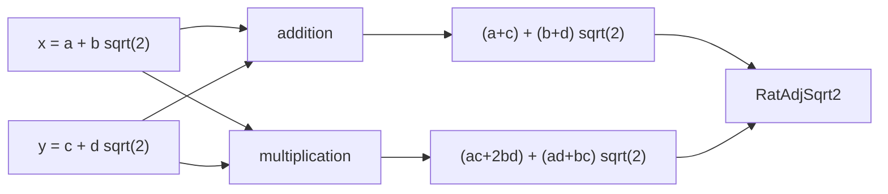

# 有理係数の平方根2形式は加法と乗法で閉じる

## 序文

実数のうち、有理数 $a,b$ を使って $a+b\sqrt2$ と書けるものだけを集める。この集合に属する二つの数を足したり掛けたりしたとき、結果が同じ形から外へ逃げないことは、二成分代数を扱うための最初の閉包性である。

`DkMath.UniqueRepresentation.SilverRatio.RatAdjSqrt2` は、この $a+b\sqrt2$ 型の実数集合を定義する。Lean source は、その集合が加法と乗法の双方で閉じていることを個別の theorem として確定している。

## 結果

`RatAdjSqrt2` は次の集合として定義される。

$$\mathrm{RatAdjSqrt2}=\{x\in\mathbb R\mid\exists a,b\in\mathbb Q,\ a+b\sqrt2=x\}$$

Lean は $x,y\in\mathrm{RatAdjSqrt2}$ ならば、和も同じ集合に属することを証明している。

$$x,y\in\mathrm{RatAdjSqrt2}\Longrightarrow x+y\in\mathrm{RatAdjSqrt2}$$

さらに積についても閉じている。

$$x,y\in\mathrm{RatAdjSqrt2}\Longrightarrow xy\in\mathrm{RatAdjSqrt2}$$

積の閉包性で用いられる係数変換は、$x=a+b\sqrt2$、$y=c+d\sqrt2$ としたとき次の形である。

$$(a+b\sqrt2)(c+d\sqrt2)=(ac+2bd)+(ad+bc)\sqrt2$$

ここで $ac+2bd$ と $ad+bc$ は再び有理数であるため、積も $a+b\sqrt2$ 型に留まる。

## 一般数学での読み方

これは二次拡大体 $\mathbb Q(\sqrt2)$ の基本的な閉包性を、実数の部分集合として直接表したものである。

加法では係数を成分ごとに足す。

$$(a,b)+(c,d)=(a+c,b+d)$$

乗法では $\sqrt2^2=2$ を使い、二次成分を有理成分へ戻す。

$$(a,b)\cdot(c,d)=(ac+2bd,ad+bc)$$

したがって、二成分対 $(a,b)$ のまま計算を閉じることができる。

## DkMath での読み方

DkMath の観点では、$a+b\sqrt2$ は一つの実数に潰す前の二成分座標である。加法は二つの成分を独立に保存し、乗法は $\sqrt2^2=2$ という核関係を通して、高次に現れた成分を再び基底 $1,\sqrt2$ へ折り畳む。

つまり、演算後に新しい第三成分を追加する必要がない。二成分世界の内部だけで演算が完結することが、閉包性として Lean に固定されている。

## 構造図

## 例

$x=1+2\sqrt2$、$y=3-\sqrt2$ とする。和は、

$$x+y=4+\sqrt2$$

となり、係数 $4,1$ はともに有理数である。

積は、

$$xy=(1+2\sqrt2)(3-\sqrt2)=-1+5\sqrt2$$

となる。係数対で計算すれば、

$$(1,2)\cdot(3,-1)=(3+2\cdot2\cdot(-1),-1+2\cdot3)=(-1,5)$$

であり、結果は再び同じ二成分形式に入る。

## 考察

ここから `RatAdjSqrt2` が体または部分環として必要な全構造を備えることまでを、この記事の Lean 確定事項として主張してはいない。今回 source anchor とした theorem が直接確定するのは、集合の定義と加法・乗法に関する閉包性である。

ただし、この閉包性は、共役・ノルム・逆元などを同じ二成分座標上へ接続するための基礎になる。将来それらを一つの代数構造へ再梱包すれば、白銀比モジュールとの接続をさらに明示できる。

## Lean source anchors

- File: `lean/dk_math/DkMath/UniqueRepresentation.lean`
- Definition: `DkMath.UniqueRepresentation.SilverRatio.SimpleForm`
- Definition: `DkMath.UniqueRepresentation.SilverRatio.RatAdjSqrt2`
- Theorem: `DkMath.UniqueRepresentation.SilverRatio.RatAdjSqrt2_add`
- Theorem: `DkMath.UniqueRepresentation.SilverRatio.RatAdjSqrt2_mul`
