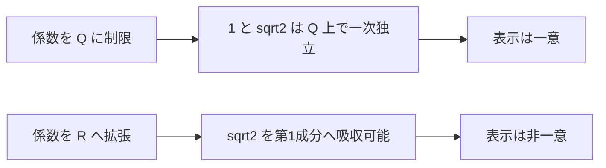

# 実数係数の平方根2座標は一意ではない

## 序文

$1$ と $\sqrt2$ は有理数体 $\mathbb Q$ 上では一次独立であり、$a+b\sqrt2$ の有理係数表示は一意に定まる。ところが係数の範囲を実数全体 $\mathbb R$ へ広げると、この一意性は失われる。

DkMath はこの境界を、同じ `SimpleForm` に異なる実数係数対が写る具体的な反例として Lean に固定している。

## 結果

Lean source では、二成分形式を次で定義する。

$$\mathrm{SimpleForm}(a,b)=a+b\sqrt2$$

そして `SimpleForm_not_injective` は、ある実数 $x,a,b,c,d$ が存在して、係数対が異なるにもかかわらず値が一致することを確定する。

$$\exists x,a,b,c,d\in\mathbb R,\ (a,b)\ne(c,d)\land\mathrm{SimpleForm}(a,b)=\mathrm{SimpleForm}(c,d)$$

Lean の証明で使用される具体的な二組は、

$$(a,b)=(1,1),\qquad(c,d)=(1+\sqrt2,0)$$

である。実際、

$$\mathrm{SimpleForm}(1,1)=1+\sqrt2=\mathrm{SimpleForm}(1+\sqrt2,0)$$

となるため、実数係数上の `SimpleForm` は単射ではない。

## 一般数学での読み方

有理係数の場合、$a+b\sqrt2=c+d\sqrt2$ から

$$(a-c)+(b-d)\sqrt2=0$$

を得る。$a-c$ と $b-d$ が有理数ならば、$\sqrt2$ の無理性により両係数は零でなければならない。

しかし係数自身を実数としてよいなら、$\sqrt2$ を第1成分へ吸収できる。たとえば $b\sqrt2$ を $a$ 側へ移して、

$$a+b\sqrt2=(a+b\sqrt2)+0\sqrt2$$

と書ける。このため、写像

$$\mathbb R^2\longrightarrow\mathbb R,\qquad(a,b)\longmapsto a+b\sqrt2$$

には非自明な核があり、座標表示は一意にならない。

## DkMath での読み方

DkMath の観点では、一意性は式の見た目だけで決まらず、**係数をどの世界に固定したか** に依存する。

$\mathbb Q$ 上では $1$ と $\sqrt2$ が別々の成分として保たれる。一方、$\mathbb R$ 上では $\sqrt2$ 自身がスカラーであるため、第2成分の情報を第1成分へ取り込める。すなわち、基底と係数世界を同時に指定しなければ、二成分構造は保存されない。

## 構造図

## 例

$x=1+\sqrt2$ を考える。この実数には少なくとも次の二表示がある。

$$x=1+1\cdot\sqrt2$$

$$x=(1+\sqrt2)+0\cdot\sqrt2$$

係数対 $(1,1)$ と $(1+\sqrt2,0)$ は異なるが、`SimpleForm` の値は同じである。

## 考察

ここから先は Lean theorem の直接の主張ではない。

この反例は、座標の一意性を議論するとき、基底だけでなく係数体を型として固定する必要があることを示唆する。今後 `RatAdjSqrt2` を部分環や二次拡大として再包装する場合にも、係数世界を明示することが情報保存の発動条件になる。

また、実数係数上の `SimpleForm` の核を明示的に記述すれば、非一意表示の全体を同値類として整理できる可能性がある。ただし、その核の完全な特徴付けは本記事の Lean 確定層には含めない。

## Lean source anchors

- File: `lean/dk_math/DkMath/UniqueRepresentation.lean`
- Definition: `DkMath.UniqueRepresentation.SilverRatio.SimpleForm`
- Theorem: `DkMath.UniqueRepresentation.SilverRatio.SimpleForm_not_injective`
