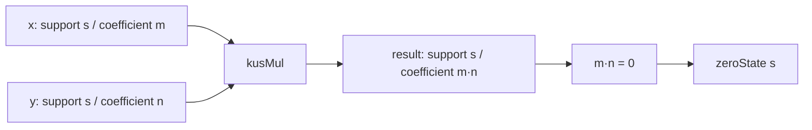

# KUS 乗法は積が零でも support を保持する

## 序文

通常の自然数では、積が $0$ になれば、どの構造上で計算していたかという情報は数値だけからは読めない。KUS は、可視係数と support を分離して保持することで、この情報消失を避ける。

`DkMath.KUS.Mul` は、同じ support を持つ二つの KUS 値について、係数は自然数乗法で計算しながら、結果の support を保存する乗法を定義している。

## 結果

同一 support 条件 `SameSupport x y` のもとで、KUS 乗法は次で定義される。

$$\mathrm{kusMul}(x,y)=\mathrm{ofNat}(\mathrm{extract}(x),\mathrm{toNat}(x)\cdot\mathrm{toNat}(y))$$

Lean は、この乗法の可視係数が通常の自然数積と一致することを確定している。

$$\mathrm{toNat}(\mathrm{kusMul}(x,y))=\mathrm{toNat}(x)\cdot\mathrm{toNat}(y)$$

一方、結果の support は左入力から回収でき、同一 support 条件により右入力の support とも一致する。

$$\mathrm{extract}(\mathrm{kusMul}(x,y))=\mathrm{extract}(x)=\mathrm{extract}(y)$$

特に係数積が $0$ であっても support は失われない。さらに、その場合の結果は、左入力の support を持つ `zeroState` として正確に再構成される。

$$\mathrm{toNat}(x)\cdot\mathrm{toNat}(y)=0\Longrightarrow\mathrm{kusMul}(x,y)=\mathrm{zeroState}(\mathrm{extract}(x))$$

また、各 support 上の `oneState` は左右の単位元として働く。

$$\mathrm{kusMul}(\mathrm{oneState}(\mathrm{extract}(x)),x)=x$$

$$\mathrm{kusMul}(x,\mathrm{oneState}(\mathrm{extract}(x)))=x$$

## 一般数学での読み方

これは、自然数係数 $n$ と、その係数が属する構造ラベル $s$ の組 $(s,n)$ を考え、同じ $s$ を持つものだけを掛ける演算と読める。

$$(s,m)\star(s,n)=(s,mn)$$

通常の自然数射影では $(s,0)$ は単に $0$ に見える。しかし KUS 内部では $s$ が残るため、異なる support 上の零を区別できる。

$$(s,0)\ne(t,0)\quad\text{となり得る}$$

したがって、これは係数演算と構造所属を分離した、型付き状態の乗法である。

## DkMath での読み方

DkMath の観点では、`toNat` は外部から見える量、`extract` はその量を成立させている support の回収路である。

乗法は可視量だけを更新し、support を消さない。積が零になる場合でさえ、零は「何もない状態」ではなく、「どの support 上で零になったか」を保持する状態として残る。これが `zero_tracking` の核心である。

`oneState` も単一の大域的な $1$ ではない。各 support に対応する局所的な単位状態であり、同じ support 上でのみ KUS 乗法の単位元として働く。

## 構造図

## 例

$x$ と $y$ が同じ support $s$ を持ち、可視係数がそれぞれ $0$ と $7$ であるとする。このとき可視係数の積は $0$ である。

$$0\cdot7=0$$

しかし KUS の結果は support を失った裸の零ではなく、$s$ 上の零状態である。

$$\mathrm{kusMul}(x,y)=\mathrm{zeroState}(s)$$

同様に、$s$ 上の単位状態を掛ければ元の状態へ戻る。

$$\mathrm{kusMul}(\mathrm{oneState}(s),y)=y$$

## 考察

ここから先は Lean theorem そのものではなく、構造上の見通しである。

support を保持する零は、計算途中で数値が消えても由来情報を追跡する provenance 付き演算として利用できる可能性がある。たとえば、複数の異なる局所世界で同じ数値 $0$ が発生したとき、通常の数値計算では合流してしまうが、KUS では support により経路を区別できる。

また、`toNat` レベルでは交換則・結合則が証明されているため、今後は SameSupport の証明項を整理し、KUS 値そのものについての代数構造へ持ち上げることが接続候補となる。ただし、その一般化は本記事の確定結果には含めない。

## Lean source anchors

Source file:

- `lean/dk_math/DkMath/KUS/Mul.lean`

Definitions:

- `DkMath.KUS.kusMul`
- `DkMath.KUS.oneState`

Theorems:

- `DkMath.KUS.kusMul.toNat_mul`
- `DkMath.KUS.kusMul.extract_mul_left`
- `DkMath.KUS.kusMul.extract_mul_right`
- `DkMath.KUS.kusMul.zero_tracking`
- `DkMath.KUS.kusMul.kusMul_eq_zeroState`
- `DkMath.KUS.kusMul.one_mul`
- `DkMath.KUS.kusMul.mul_one`
