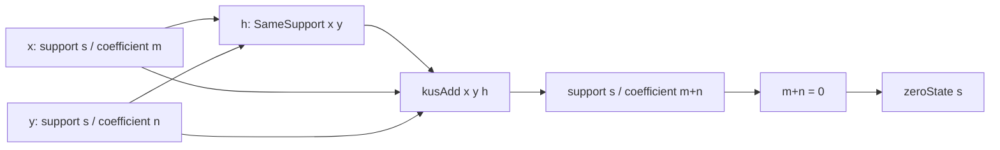

# KUS 加法は構成そのものによって support を保持する

## 序文

自然数の加法は係数だけを返す。計算対象がどの構造に属していたかは、通常の数値 $n+m$ には残らない。

`DkMath.KUS.Add` は、KUS 値の可視係数と support を分けて扱う。加法を実行する前に二つの値が同じ support を持つことを `SameSupport` で要求し、結果を左入力の support 上に再構成する。したがって support 保存は、後から導く付加的性質ではなく、加法の定義へ組み込まれている。

## 結果

二つの KUS 値 $x,y$ が同じ support を持つことは、次の述語として定義される。

$$\mathrm{SameSupport}(x,y)\iff\mathrm{extract}(x)=\mathrm{extract}(y)$$

証明 $h:\mathrm{SameSupport}(x,y)$ のもとで、KUS 加法は左入力の support と係数和から構成される。

$$\mathrm{kusAdd}(x,y,h)=\mathrm{ofNat}(\mathrm{extract}(x),\mathrm{toNat}(x)+\mathrm{toNat}(y))$$

Lean は、結果の可視係数が自然数加法と一致することを確定している。

$$\mathrm{toNat}(\mathrm{kusAdd}(x,y,h))=\mathrm{toNat}(x)+\mathrm{toNat}(y)$$

同時に、結果の support は左入力と一致する。

$$\mathrm{extract}(\mathrm{kusAdd}(x,y,h))=\mathrm{extract}(x)$$

`SameSupport` により、右入力の support とも一致する。

$$\mathrm{extract}(\mathrm{kusAdd}(x,y,h))=\mathrm{extract}(y)$$

係数和が $0$ であっても support 保存は崩れず、結果は左入力の support を持つ `zeroState` として再構成できる。

$$\mathrm{toNat}(x)+\mathrm{toNat}(y)=0\Longrightarrow\mathrm{kusAdd}(x,y,h)=\mathrm{zeroState}(\mathrm{extract}(x))$$

また、各 support 上の `zeroState` は左右の加法単位元になる。

$$\mathrm{kusAdd}(\mathrm{zeroState}(\mathrm{extract}(x)),x,h_0)=x$$

$$\mathrm{kusAdd}(x,\mathrm{zeroState}(\mathrm{extract}(x)),h_1)=x$$

交換則と結合則については、Lean source では KUS 値そのものではなく `toNat` 射影上で確定されている。

$$\mathrm{toNat}(\mathrm{kusAdd}(x,y,h))=\mathrm{toNat}(\mathrm{kusAdd}(y,x,h^{\mathrm{symm}}))$$

## 一般数学での読み方

KUS 値を、support $s$ と自然数係数 $n$ を保持する状態 $(s,n)$ とみなす。同じ support 上では、加法は次のように読める。

$$(s,m)\boxplus(s,n)=(s,m+n)$$

ここで重要なのは、異なる support 間の加法を勝手に定義していないことである。`kusAdd` の第3引数は、二つの入力が同じ繊維に属するという証明である。

したがって、KUS 全体に無条件な加法を置いたのではなく、support ごとに分かれた自然数的加法を定義した構造と解釈できる。

## DkMath での読み方

DkMath の観点では、`toNat` は観測可能な係数であり、`extract` はその係数が属する構造世界を回収する経路である。

`kusAdd` は係数だけを合成し、support は固定する。すなわち、演算によって変化する部分と、保存される核を定義の段階で分離している。`SameSupport` は単なる事後条件ではなく、異なる構造世界を無断で混ぜないための発動条件である。

結果係数が零となる場合にも `zeroState` が support を保持するため、零は「由来を失った無」ではなく、「特定の support 上で係数が零である状態」として残る。

## 構造図

## 例

$x$ と $y$ が同じ support $s$ を持ち、可視係数がそれぞれ $2$ と $3$ であるとする。`toNat_add` により、加算結果の可視係数は $5$ になる。

$$\mathrm{toNat}(x)=2\land\mathrm{toNat}(y)=3\Longrightarrow\mathrm{toNat}(\mathrm{kusAdd}(x,y,h))=5$$

一方、`extract_add_left` と `extract_add_right` により、結果は引き続き support $s$ に属する。

$$\mathrm{extract}(\mathrm{kusAdd}(x,y,h))=s$$

また、$s$ 上の零状態を加えても元の値は変わらない。

$$\mathrm{kusAdd}(x,\mathrm{zeroState}(s),h_0)=x$$

## 考察

ここから先は Lean theorem そのものではなく、構造上の見通しである。

support ごとに加法を分ける設計は、KUS 全体を一つの平坦な数体系として扱うよりも、support を添字とする繊維族として読む方が自然であることを示唆する。各繊維の内部では自然数加法が働き、繊維間の移動や合成には別の明示的な橋が必要になる。

また、現行 source が交換則と結合則を `toNat` レベルで述べている点は重要である。support と係数の両方を含む KUS 値そのものの代数構造へ持ち上げるには、証明引数の違いを吸収する仕組みや proof irrelevance の整理が接続候補になる。ただし、その持ち上げは本記事の確定結果には含めない。

## Lean source anchors

Source file:

- `lean/dk_math/DkMath/KUS/Add.lean`

Definitions:

- `DkMath.KUS.SameSupport`
- `DkMath.KUS.kusAdd`

Theorems:

- `DkMath.KUS.kusAdd.toNat_add`
- `DkMath.KUS.kusAdd.extract_add_left`
- `DkMath.KUS.kusAdd.extract_add_right`
- `DkMath.KUS.kusAdd.zero_tracking`
- `DkMath.KUS.kusAdd.kusAdd_eq_zeroState`
- `DkMath.KUS.kusAdd.zero_add`
- `DkMath.KUS.kusAdd.add_zero`
- `DkMath.KUS.kusAdd.toNat_comm`
- `DkMath.KUS.kusAdd.toNat_assoc`

## 更新情報

- 2026-08-02: `nightly` の `DkMath.KUS.Add` に基づき初版を作成。
