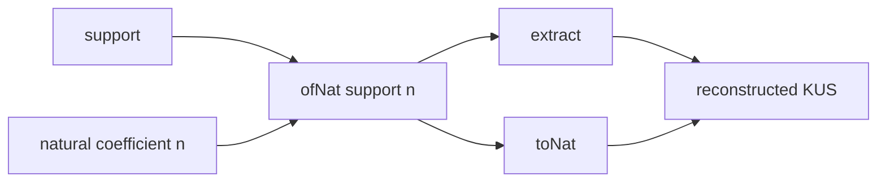

# KUS の往復変換はすべての状態を再構成する

## 序文

KUS は、自然数として見える係数だけでなく、その係数が属する support も同時に保持する状態である。したがって、状態を自然数へ射影しただけでは、由来となる support は読み取れない。

`DkMath.KUS.RoundTrip` は、support と自然数から KUS を構成する `ofNat`、可視係数を読む `toNat`、support を読む `extract` の三者が、情報を失わない往復系をなすことを確定している。

## 結果

任意の support `support` と自然数 `n` について、`ofNat support n` を自然数へ戻すと元の `n` が回収される。

$$\mathrm{toNat}(\mathrm{ofNat}(support,n))=n$$

同じ埋め込みから support を抽出すると、元の `support` が回収される。

$$\mathrm{extract}(\mathrm{ofNat}(support,n))=support$$

さらに任意の KUS 状態 `x` は、その support と可視係数だけから完全に再構成できる。

$$\mathrm{ofNat}(\mathrm{extract}(x),\mathrm{toNat}(x))=x$$

構造保持零 `zeroState (extract x)` は、抽出した support 上へ自然数 `0` を埋め込んだ状態と一致する。

$$\mathrm{zeroState}(\mathrm{extract}(x))=\mathrm{ofNat}(\mathrm{extract}(x),0)$$

以上は `nightly` の Lean source に存在する定理として確定している。

## 一般数学での読み方

通常の直積型として見れば、KUS 状態は概念的に「support と自然数係数の組」に相当する。`extract` と `toNat` は二つの座標射影であり、`ofNat` はその座標から状態を組み立てる写像である。

再構成定理は、二つの座標を同時に保持すれば元の状態を一意に復元できることを述べる。

$$x\longmapsto(\mathrm{extract}(x),\mathrm{toNat}(x))\longmapsto x$$

これは encode / decode の往復則、あるいは product type の eta 則に近い構造である。

## DkMath での読み方

DkMath では零も単なる値 `0` ではない。どの support 上で零になったかを保持する `zeroState` として扱う。

この往復則により、可視係数が零であっても support は消えず、状態の由来を含めて再構成できる。したがって KUS の情報単位は自然数だけではなく、次の二成分である。

$$\mathrm{KUS\ state}=\mathrm{support}+\mathrm{visible\ coefficient}$$

ここで `+` は算術加法ではなく、二種類の情報が同居するという構造的な読み方である。

## 構造図

## 例

ある support `s` の上に係数 `5` を置いた状態を考える。

$$x=\mathrm{ofNat}(s,5)$$

このとき Lean の往復定理により、

$$\mathrm{toNat}(x)=5$$

$$\mathrm{extract}(x)=s$$

が成り立ち、両者から、

$$\mathrm{ofNat}(\mathrm{extract}(x),\mathrm{toNat}(x))=x$$

と元の状態が正確に戻る。

係数を `0` にした場合も、結果は support を捨てた裸の零ではなく、

$$\mathrm{ofNat}(s,0)=\mathrm{zeroState}(s)$$

として support `s` を保持する。

## 考察

以下は Lean の中心定理そのものではなく、この構造から得られる解釈である。

KUS の往復則は、後続の加法・乗法で support 保存を証明するための基礎インターフェースと読める。演算後の状態について `extract` と `toNat` を確定できれば、`reconstruct_from_extract` によって状態全体の等式へ持ち上げられる可能性がある。

また、support を型情報、自然数係数を値情報と見るなら、KUS は「値が零になっても型由来を失わない」追跡可能な数体系の最小模型になっている。この観点を一般の係数半環や valuation 情報へ拡張することは、今後の形式化候補である。

## Lean source anchors

Source file:

- `lean/dk_math/DkMath/KUS/RoundTrip.lean`

Definitions used through imported KUS modules:

- `DkMath.KUS.ofNat`
- `DkMath.KUS.toNat`
- `DkMath.KUS.extract`
- `DkMath.KUS.zeroState`

Theorems:

- `DkMath.KUS.roundTrip_nat`
- `DkMath.KUS.roundTrip_support`
- `DkMath.KUS.reconstruct_from_extract`
- `DkMath.KUS.zeroState_eq_ofNat_extract`
