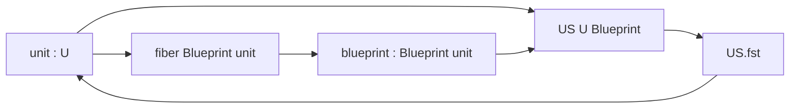

# 単位 support は unit と従属 blueprint を一体として束ねる

## 序文

KUS では、数値係数を消しても「どの構造に属していたか」を失わないことが重要になる。その最小核が `US` である。

`US` は単なる二要素の直積ではない。第2成分の型そのものが第1成分 `unit` に依存するため、unit と blueprint は型の段階で結び付けられる。

## 結果

型 `U` と、各 `u : U` に blueprint の型を割り当てる族 `Blueprint : U → Type` に対して、Lean source は次の構造を定義している。

```lean
@[ext] structure US (U : Type u) (Blueprint : U → Type v) where
  unit : U
  blueprint : Blueprint unit
```

したがって、`x : US U Blueprint` は次の二つを一体として保持する。

1. `x.unit : U`
2. `x.blueprint : Blueprint x.unit`

また `DkMath.KUS.US.fst` は、`US` から unit を取り出す定義である。

```lean
@[simp] def fst (x : US U Blueprint) : U :=
  x.unit
```

ゆえに Lean source が確定している中心構造は、blueprint が任意の共通型に置かれるのではなく、選ばれた unit の fiber `Blueprint x.unit` に所属することである。

## 一般数学での読み方

これは従属和型に近い構造であり、集合論的には次の直和として読める。

$$\mathrm{US}(U,\mathrm{Blueprint})\simeq\coprod_{u\in U}\mathrm{Blueprint}(u)$$

要素は対 $(u,b)$ だが、第2成分には $b\in\mathrm{Blueprint}(u)$ という型依存条件が付く。

通常の直積 $U\times B$ では、すべての unit が同じ型 $B$ の blueprint を共有する。これに対して `US` では、unit ごとに異なる blueprint 型を許す。

## DkMath での読み方

DkMath の語彙では、`unit` は状態の所属先、`blueprint` はその所属先に固有の構造情報である。

係数が零へ落ちたときも、unit だけを裸で残すのではなく、その unit に適合する blueprint と一緒に support として保持する。この最小 support が、後続の `extract`、`zeroState`、KUS 加法・乗法・往復変換の受け皿になる。

重要なのは、異なる unit の blueprint を誤って交換する操作が、値の検査以前に型不一致として拒まれる点である。構造保存は実行時の条件ではなく、型構成そのものへ埋め込まれている。

## 構造図



## 例

unit ごとに異なる設計情報を持つ簡単な族を考える。

```lean
inductive ToyUnit
  | line
  | plane

def ToyBlueprint : ToyUnit → Type
  | .line => Nat
  | .plane => Nat × Nat
```

このとき、線の support は自然数一つを blueprint として持ち、平面の support は自然数対を持つ。

```lean
example : DkMath.KUS.US ToyUnit ToyBlueprint :=
  ⟨.line, 3⟩

example : DkMath.KUS.US ToyUnit ToyBlueprint :=
  ⟨.plane, (3, 4)⟩
```

一方、`.line` に自然数対を与えることはできない。blueprint の型が unit によって決まるからである。

## 考察

ここから先は Lean source の定義そのものではなく、その設計上の意味についての考察である。

`US` は「値を忘れて構造だけを残す」ための小さな型付き封筒とみなせる。KUS が係数と support を分離できるのは、support 側が unit と blueprint の整合性をすでに保証しているためである。

この構造は、単位系、座標系、基底、局所環境など、値が零になっても由来を保存したい場面へ一般化できる可能性がある。ただし、そのような具体的応用は本記事の Result 節で確定した内容には含めない。

## Lean source anchors

- Source file: `lean/dk_math/DkMath/KUS/Unit.lean`
- Definition: `DkMath.KUS.US`
- Definition: `DkMath.KUS.US.fst`
- Source branch: `nightly`
