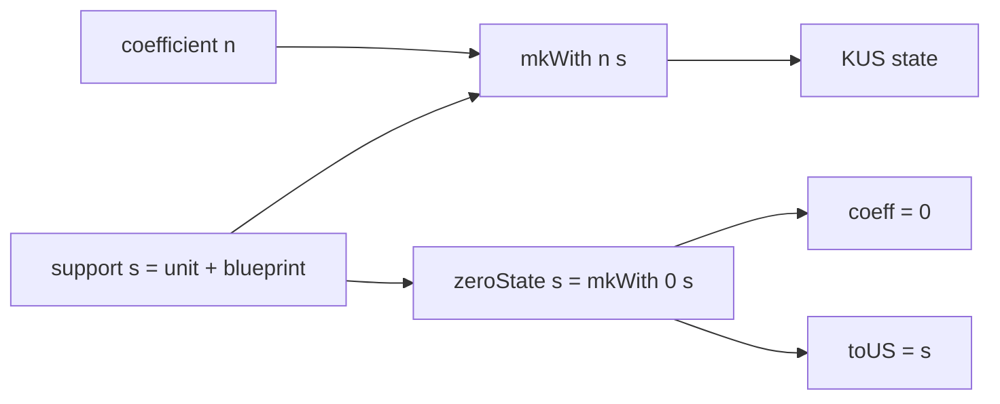

# KUS の零状態は係数だけを消して support を保持する

## 序文

通常の自然数では、値が $0$ になれば、その値がどの構造に属していたかは数そのものからは読めない。KUS はこの情報消失を避けるため、可視係数と support を別成分として保持する。

`DkMath.KUS.Core` の `zeroState` は、状態全体を捨てる零化ではない。係数だけを $0$ に差し替え、unit と blueprint からなる support は元のまま残す。

## 結果

`DkMath.KUS.KUS` は、自然数係数 `coeff`、unit、そしてその unit に依存する blueprint を持つ。

```lean
@[ext] structure KUS (U : Type u) (Blueprint : BlueprintFamily U) where
  coeff : Nat
  unit : U
  blueprint : Blueprint unit
```

`DkMath.KUS.toUS` は KUS から support 側だけを抽出する。

```lean
@[simp] def toUS (x : KUS U Blueprint) : US U Blueprint where
  unit := x.unit
  blueprint := x.blueprint
```

固定 support 上で係数だけを差し替える構成が `DkMath.KUS.mkWith` である。

```lean
@[simp] def mkWith (coeff : Nat) (support : US U Blueprint) : KUS U Blueprint where
  coeff := coeff
  unit := support.unit
  blueprint := support.blueprint
```

Lean は、`mkWith` の可視係数が指定値に一致し、support がそのまま回収されることを確定している。

$$\mathrm{coeff}(\mathrm{mkWith}(n,s))=n$$

$$\mathrm{toUS}(\mathrm{mkWith}(n,s))=s$$

`DkMath.KUS.zeroState` は `mkWith 0 support` として定義される。

```lean
@[simp] def zeroState (support : US U Blueprint) : KUS U Blueprint :=
  mkWith 0 support
```

したがって、零状態では係数だけが $0$ となり、support は保存される。

$$\mathrm{coeff}(\mathrm{zeroState}(s))=0$$

$$\mathrm{toUS}(\mathrm{zeroState}(s))=s$$

これらはそれぞれ `DkMath.KUS.coeff_zeroState` と `DkMath.KUS.toUS_zeroState` として Lean source に存在する。

## 一般数学での読み方

KUS 状態を概念的に

$$x=(n,s)$$

と読む。ここで $n\in\mathbb N$ は観測される係数、$s$ は型付き support である。

`mkWith` は support を固定したまま係数を交換する写像、`toUS` は第2成分への射影に対応する。

$$\mathrm{mkWith}(m,(n,s))=(m,s)$$

零化は

$$\mathrm{zeroState}(s)=(0,s)$$

であり、通常の単なる $0$ とは異なる。係数は同じ $0$ でも、異なる support $s_1,s_2$ に対して $(0,s_1)$ と $(0,s_2)$ は別の構造状態として保持される。

## DkMath での読み方

DkMath では、零を「すべての情報が消えた点」とは限らず、「可視量だけが零になった状態」として扱う。

KUS の核は、次の二層を分離する。

- `coeff`: 観測され、加法や乗法で変化する量
- `US`: unit と従属 blueprint からなる所属構造

この分離により、演算結果の係数が $0$ になっても、どの unit 世界・どの blueprint に属していたかを保持できる。零は support を忘却する終点ではなく、support 上に存在する局所的な零状態となる。

## 構造図



## 例

二つの異なる support $s_A$ と $s_B$ を考える。

$$z_A=\mathrm{zeroState}(s_A)$$

$$z_B=\mathrm{zeroState}(s_B)$$

両者の可視係数はともに $0$ である。

$$\mathrm{coeff}(z_A)=\mathrm{coeff}(z_B)=0$$

しかし support の抽出結果は異なるまま保持される。

$$\mathrm{toUS}(z_A)=s_A$$

$$\mathrm{toUS}(z_B)=s_B$$

したがって、係数だけを観測すれば同じ零に見えても、KUS 全体では由来の異なる零状態を区別できる。

## 考察

以下は Lean theorem そのものではなく、確定した構造から得られる設計上の読み方である。

`zeroState` は、型付き演算系における「零の多重化」を実現する基礎部品とみなせる。これは通常の代数で零元が一つであるという主張を変更するものではない。KUS 全体が単一の半環であると確定したわけでもない。ここで保持されるのは、同じ係数値 $0$ に付随する support 情報である。

今後、同一 support 上の演算を束ねて代数構造を構成するなら、`zeroState support` はその support ごとの局所零元候補となる。ただし、どの演算・公理まで備わるかは各モジュールの theorem によって個別に確認する必要がある。

## Lean source anchors

Source file:

- `lean/dk_math/DkMath/KUS/Core.lean`

Definitions:

- `DkMath.KUS.KUS`
- `DkMath.KUS.toUS`
- `DkMath.KUS.mkWith`
- `DkMath.KUS.zeroState`

Theorems:

- `DkMath.KUS.coeff_mkWith`
- `DkMath.KUS.toUS_mkWith`
- `DkMath.KUS.coeff_zeroState`
- `DkMath.KUS.toUS_zeroState`
