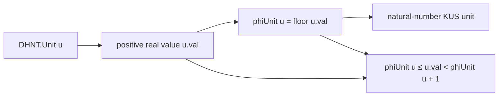

# 床関数による離散化は順序を保ち unit を幅1に閉じ込める

## 1. 序文

`DkMath.KUS.Bridge` は、正の実数値を unit とする DHNT の連続スケール世界から、自然数 unit を持つ KUS の離散 support 世界へ接続する。

その入口に置かれる `phiUnit` は、正の実数 unit を自然数床へ写す離散化写像である。単なる丸め処理ではなく、順序を保ち、元の実数 unit を連続する二つの整数境界の間へ閉じ込めることが Lean により確定されている。

## 2. 結果

DHNT unit `u` に対し、`phiUnit` は `u.val` の自然数床として定義される。

$$\mathrm{phiUnit}(u)=\lfloor u.\mathrm{val}\rfloor_{\mathbb N}$$

`phiUnit` が正であることは、元の unit 値が少なくとも $1$ であることと同値である。

$$0<\mathrm{phiUnit}(u)\iff 1\le u.\mathrm{val}$$

値 $1$ の unit は自然数 $1$ へ写る。

$$\mathrm{phiUnit}(1)=1$$

また、unit 値の大小関係は離散化後にも保存される。`u.val ≤ v.val` ならば、

$$\mathrm{phiUnit}(u)\le\mathrm{phiUnit}(v)$$

が成り立つ。

さらに、離散化値と元の unit 値は次の床関数境界を満たす。

$$\mathrm{phiUnit}(u)\le u.\mathrm{val}<\mathrm{phiUnit}(u)+1$$

したがって `phiUnit` は、元の unit を幅 $1$ の半開区間へ必ず閉じ込める。

## 3. 一般数学での読み方

一般数学では、これは正の実数に対する床関数の基本構造である。写像

$$\phi(x)=\lfloor x\rfloor$$

は単調非減少であり、任意の正の実数 $x$ について、

$$\phi(x)\le x<\phi(x)+1$$

を満たす。

この二つの不等式は、連続値 $x$ を整数格子上へ落としたときの情報損失が $1$ 未満であることを表す。床値そのものは小数部分を忘れるが、どの整数区間に属していたかは失わない。

## 4. DkMath での読み方

DkMath では、unit は単なる数値ラベルではなく、量が属する世界または support を指定する成分として扱われる。

`phiUnit` は連続 unit を自然数 support へ送る忘却射影であるが、次の二本の beam を残す。

- 順序 beam: 元の unit の順序は逆転しない。
- 境界 beam: 元の unit は離散 support とその次の support の間に存在する。

ゆえに離散化後の自然数 unit は、連続世界の完全な値ではないものの、その値が存在した局所区間を指す座標として働く。

## 5. 構造図

## 6. 例

たとえば連続 unit の値が $2.7$ なら、床離散化は $2$ を返す。

$$\phi(2.7)=2$$

同時に、境界は

$$2\le 2.7<3$$

となる。小数部分 $0.7$ は離散 unit から消えるが、元の unit が support $2$ と support $3$ の間にあったことは境界として保持される。

また $2.7\le 4.1$ なので、単調性により

$$\phi(2.7)=2\le4=\phi(4.1)$$

となり、離散化によって順序が逆転することはない。

## 7. 考察

ここから先は Lean theorem が直接主張する内容ではない。

`phiUnit` の床関数境界は、連続量を KUS support へ移すときの量子化セルを明示している。この幅 $1$ のセル構造を利用すれば、複数の連続 unit が同じ自然数 support へ合流する条件や、離散化前後の誤差を係数と組み合わせて評価する設計へ接続できる。

実際の `Bridge.lean` には `embedQty` と `kusAbsVal` も存在し、非負係数のもとで離散化後の実体値が元の `Qty.absVal` を超えないことまで形式化されている。本記事では中心テーマを unit の床離散化に限定し、その後段の量評価は別記事へ残す。

## 8. Lean source anchors

Source file:

- `lean/dk_math/DkMath/KUS/Bridge.lean`

Definition:

- `DkMath.KUS.Bridge.phiUnit`

Theorems:

- `DkMath.KUS.Bridge.phiUnit_pos`
- `DkMath.KUS.Bridge.phiUnit_one`
- `DkMath.KUS.Bridge.phiUnit_mono`
- `DkMath.KUS.Bridge.phiUnit_lt_succ`
- `DkMath.KUS.Bridge.lt_phiUnit_succ`
