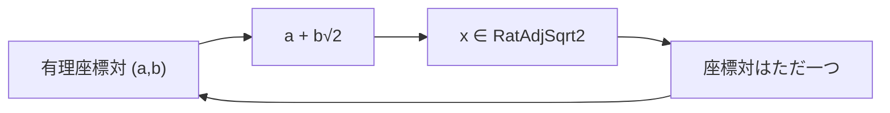

# 有理平方根2拡大の各元は一意な座標対を持つ

## 1. 序文

実数全体では $a+b\sqrt2$ という表示は一意ではない。しかし係数を有理数に制限し、対象を実際にその形で表せる実数へ限定すると、表示は再び一意になる。

この記事では、集合 `RatAdjSqrt2` の各元が、有理数対 $(a,b)$ をただ一つ持つことを記録する。これは「存在」と「一意性」を同時に確定し、さらに座標を明示的に取り出せる形へ展開した結果である。

## 2. 結果

`DkMath.UniqueRepresentation.SilverRatio.RatAdjSqrt2` は、ある有理数 $a,b$ によって次の形で表せる実数全体として定義される。

$$\mathrm{RatAdjSqrt2}=\{x\in\mathbb R\mid \exists a,b\in\mathbb Q,\ a+b\sqrt2=x\}$$

`DkMath.UniqueRepresentation.SilverRatio.unique_rep_in_rat_adj_sqrt2` は、任意の $x\in\mathrm{RatAdjSqrt2}$ に対して、有理数対 $p=(p_1,p_2)$ がただ一つ存在し、次を満たすことを確定する。

$$\exists!p\in\mathbb Q\times\mathbb Q,\ \mathrm{SimpleForm}(p_1,p_2)=x$$

ここで `SimpleForm` は次の実数値である。

$$\mathrm{SimpleForm}(a,b)=a+b\sqrt2$$

さらに `DkMath.UniqueRepresentation.SilverRatio.unique_rep_constructive` は、同じ事実を座標成分へ展開した形で与える。すなわち、ある $a,b\in\mathbb Q$ が存在し、$a+b\sqrt2=x$ であり、ほかの有理数対 $(a',b')$ が同じ $x$ を表すなら必ず $a'=a$ かつ $b'=b$ となる。

$$\exists a,b\in\mathbb Q,\ a+b\sqrt2=x\land\forall a',b'\in\mathbb Q,\ a'+b'\sqrt2=x\rightarrow a'=a\land b'=b$$

## 3. 一般数学での読み方

これは二次拡大 $\mathbb Q(\sqrt2)$ を、基底 $\{1,\sqrt2\}$ による二次元の有理ベクトル空間として読む標準的な座標表示である。

存在性は、$x\in\mathrm{RatAdjSqrt2}$ の定義そのものから得られる。一意性は、二つの表示

$$a+b\sqrt2=c+d\sqrt2$$

を比較し、$1$ と $\sqrt2$ が $\mathbb Q$ 上一次独立であることから

$$a=c\land b=d$$

を得ることで従う。

したがって、写像

$$\Phi:\mathbb Q^2\to\mathrm{RatAdjSqrt2},\quad \Phi(a,b)=a+b\sqrt2$$

は全単射として読める。Lean の定理は、この全単射のうち「各元に対して逆像がただ一つ存在する」という点を直接述べている。

## 4. DkMath での読み方

DkMath の語彙では、$x$ は表面に現れる一つの実数値であり、$(a,b)$ はその内部構造を記述する二成分 blueprint と読める。

係数領域を $\mathbb Q$ に固定すると、同じ値へ異なる blueprint が重なることはない。すなわち、値から構造へ戻る逆向きの読み取りが一意になる。

一方、係数を $\mathbb R$ に広げると、$\sqrt2$ 自身を第1成分へ吸収できるため、この一意性は崩れる。ゆえに一意表現は数式の形だけでなく、係数領域と所属集合を同時に固定して初めて成立する。

## 5. 構造図

## 6. 例

次の実数を考える。

$$x=3-2\sqrt2$$

$a=3$、$b=-2$ は有理数なので、$x\in\mathrm{RatAdjSqrt2}$ である。

仮に別の有理数 $c,d$ が

$$c+d\sqrt2=3-2\sqrt2$$

を満たすなら、一意表現定理により

$$c=3\land d=-2$$

でなければならない。したがって、この集合の内部では $x$ の二成分座標は $(3,-2)$ に固定される。

## 7. 考察

以下は Lean theorem が直接述べる結果ではなく、その構造から見える接続候補である。

この一意座標を明示的な同値写像として梱包すれば、`RatAdjSqrt2` 上の加法・乗法を $\mathbb Q^2$ 上の演算へ移送できる。加法は成分ごとの和となり、乗法は $\sqrt2^2=2$ を用いて次の形になる。

$$ (a,b)\cdot(c,d)=(ac+2bd,ad+bc) $$

既存の閉包定理と組み合わせれば、集合として定義された `RatAdjSqrt2` を、座標演算を備えた二成分代数として再構成する橋になる。将来的には、構造体・環同型・共役・ノルムを同じ座標系へ集約する入口になり得る。

## 8. Lean source anchors

- Source file: `lean/dk_math/DkMath/UniqueRepresentation.lean`
- Definition: `DkMath.UniqueRepresentation.SilverRatio.SimpleForm`
- Definition: `DkMath.UniqueRepresentation.SilverRatio.RatAdjSqrt2`
- Theorem: `DkMath.UniqueRepresentation.SilverRatio.unique_rep_in_rat_adj_sqrt2`
- Theorem: `DkMath.UniqueRepresentation.SilverRatio.unique_rep_constructive`
