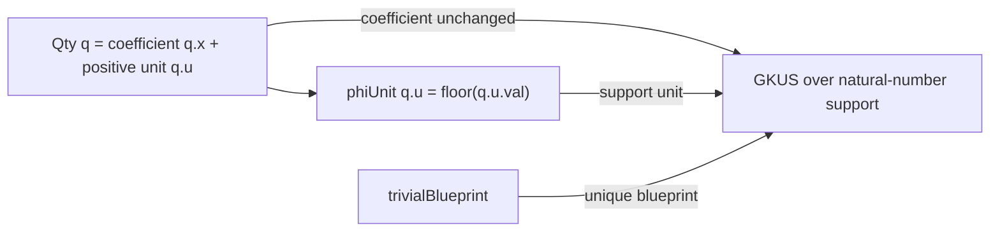

# Qty 埋め込みは係数を保存し support を離散化する

## 序文

`DHNT.Qty` は、実数係数 `x` と正の実数 unit `u` を持つ連続スケールの量である。一方、`GKUS ℝ ℕ DHNTBlueprint` は係数を実数に保ちながら、support の unit を自然数で管理する。

`DkMath.KUS.Bridge.embedQty` は、この二つの世界を結ぶ一方向の埋め込みである。埋め込みでは係数を変更せず、unit だけを自然数床 `phiUnit` によって離散化する。

## 結果

Lean source では、DHNT 接続用 blueprint family を unit に依存しない一元型として定める。

```lean
abbrev DHNTBlueprint : BlueprintFamily ℕ := fun _ => Fin 1
```

各自然数 unit には、その唯一の blueprint 値 `trivialBlueprint n` が与えられる。

正の実数 unit `u` の離散化は自然数床である。

$$\mathrm{phiUnit}(u)=\lfloor u.\mathrm{val}\rfloor_{\mathbb N}$$

`Qty q` の埋め込みは、係数 `q.x` と、離散 unit `phiUnit q.u` を持つ support から構成される。

```lean
noncomputable def embedQty (q : Qty) : GKUS ℝ ℕ DHNTBlueprint :=
  mkGWith q.x ⟨phiUnit q.u, trivialBlueprint (phiUnit q.u)⟩
```

この定義について Lean は次の二点を確定している。

$$\mathrm{toCoeff}(\mathrm{embedQty}(q))=q.x$$

$$\bigl(\mathrm{extract\_g}(\mathrm{embedQty}(q))\bigr).\mathrm{unit}=\mathrm{phiUnit}(q.u)$$

したがって `embedQty` は、可視係数をそのまま保存し、support unit だけを床関数で自然数へ移す。

## 一般数学での読み方

`Qty` を対 $(x,u)$ と見れば、埋め込みは概念的に次の写像である。

$$E(x,u)=\bigl(x,\lfloor u\rfloor_{\mathbb N}\bigr)$$

第1成分は恒等写像であり、第2成分だけが連続値から離散値へ写される。blueprint は各離散 unit に一つしかないため、この段階では追加の選択情報を持たない。

これは全情報を保つ同型ではない。異なる実数 unit が同じ床を持てば、同じ自然数 support unit へ送られる。しかし係数成分については情報損失がない。

## DkMath での読み方

DkMath の言葉では、`Qty` の量的な係数を傷つけずに、所属世界を表す unit だけを KUS の自然数 support へ投影する術式である。

連続 unit は細かな尺度を持つが、KUS 側ではその床を support の住所として採用する。`trivialBlueprint` は、住所ごとの設計図を一意に固定し、埋め込み時に blueprint の選択で分岐が生じないようにする。

ゆえに `embedQty` は、連続世界の量を離散 support 世界へ移す最小橋であり、係数保存と support 離散化を明確に分離しておる。

## 構造図



## 例

$q.x=7/2$、$q.u.val=3.8$ とする。このとき、

$$\mathrm{phiUnit}(q.u)=\lfloor3.8\rfloor_{\mathbb N}=3$$

埋め込み後の係数はそのまま $7/2$ であり、support unit は $3$ となる。

$$\mathrm{toCoeff}(\mathrm{embedQty}(q))=\frac72$$

$$\bigl(\mathrm{extract\_g}(\mathrm{embedQty}(q))\bigr).\mathrm{unit}=3$$

この数値例は定義の読み方を示すものであり、特定の `Qty` 値を構成する Lean theorem が追加されているという意味ではない。

## 考察

ここから先は Lean の二つの射影補題そのものを越えた解釈である。

`embedQty` は unit の小数部分を忘れるため、一般には単射ではない。たとえば unit 値 $3.2$ と $3.8$ は同じ support unit $3$ へ写る。この情報損失を誤差として評価する補題や、区間情報を blueprint 側へ保持する拡張は、より精密な連続・離散接続の候補になり得る。

一方、係数を完全に保存する設計は、後続の KUS 演算で「量の変化」と「support の変更」を別々に追跡するうえで有効である。これは今後の接続方針であり、本記事の結果節で確定した命題には含めない。

## Lean source anchors

Source file:

- `lean/dk_math/DkMath/KUS/Bridge.lean`

Definitions:

- `DkMath.KUS.Bridge.DHNTBlueprint`
- `DkMath.KUS.Bridge.trivialBlueprint`
- `DkMath.KUS.Bridge.phiUnit`
- `DkMath.KUS.Bridge.embedQty`

Theorems:

- `DkMath.KUS.Bridge.toCoeff_embedQty`
- `DkMath.KUS.Bridge.extract_g_embedQty`
