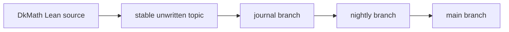

# DkMath Journal

DkMath Journal は、Lean が確定した DkMath の定義・補題・定理を、一般数学の言葉へ翻訳して記録する研究ジャーナルである。

完成した巨大理論を一度に説明するのではなく、一つの構造を一つの記事として読み解く。

## Issues

- [2026年7月号](JOURNAL-2607.md)

## Purpose

DkMath Journal は次の三層を分離する。

```text
Lean source
  厳密な定義・定理・証明

Journal result
  Lean が確定した事実の人間向け解説

Journal consideration
  次の接続候補・解釈・未形式化の見通し
```

各記事は Lean の完全修飾識別子を記録する。
この記録は、全定理集合から解説済み定理集合を除き、まだ記事になっていない対象を探す字引きとして利用する。

$$T_{\mathrm{unwritten}}=T_{\mathrm{all}}\setminus T_{\mathrm{journal}}$$

## Publication flow



- `journal`: 記事作成、索引更新、機械可読カタログ更新
- `nightly`: 内容レビュー、必要に応じた Lean Sample 接続
- `main`: 公開済み Journal

## Article selection

通常の記事候補は、次の順で選ぶ。

1. Journal に未掲載である。
2. 最終変更日時が古く、現在の形式化作業と衝突しにくい。
3. Lean definition または theorem による明確な確定層がある。
4. 一つの記事として独立した数学的意味を持つ。
5. 既存記事と内容が重複しない。

## Files

- [FORMAT.md](FORMAT.md): 記事形式とメタデータ規格
- [CATALOG.jsonl](CATALOG.jsonl): 記事と Lean 識別子の機械可読対応表

## Schedule

通常運用では、6時間ごとに候補を探索し、一日最大4記事を追加する。
適切な安定テーマがない場合は、記事を無理に生成しない。
