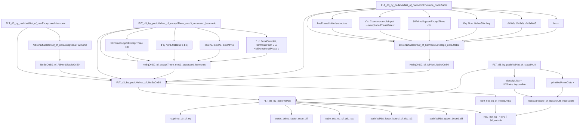

# Fermat's Last Theorem (FLT) の形式化

このディレクトリは、Lean 4 における Fermat の Last Theorem (FLT d=3 の場合) の形式化を含むぞい。
わっちたちの研究では、「宇宙式（Cosmic Formula）」と「p-adic 値評価」という二つの独立した証明システムを構築しておる。

---

## 🐺 全体構成（Module Architecture）

```
DkMath.FLT/
├─ Core.lean                    ← Cosmic Formula の基本補題
├─ Basic.lean                   ← FLT(d=3) の第1証明（宇宙式アプローチ）
├─ Main.lean                    ← FLT(d=3) の第2証明（別解 Zsigmondy + padicValNat）
│
├─ [層A：Zsigmondy原始素因子]
│  └─ 依存: NumberTheory.ZsigmondyCyclotomic
│
├─ [層B：p-adic値評価と相対多角数検出]
│  ├─ PetalDetect.lean          ← 相対多角数の平方判定（S0 構造）
│  ├─ OctagonCore.lean          ← 八角形パターンの解析
│  ├─ PhaseLift.lean            ← 位相持ち上げ（Phase Lifting）
│  ├─ CounterexamplePattern.lean← 反例パターン分類
│  ├─ GEisensteinBridge.lean    ← Eisenstein 準同型の応用
│  └─ 依存: ABC.PadicValNat
│
└─ [支援定理]
   ├─ NumberTheory.GcdNext
   ├─ Algebra.DiffPow
   └─ Mathlib.NumberTheory.FLT.Three
```

---

## 1. 二つの証明システム

わっちは FLT(d=3) の形式化において、以下の二つのアプローチを展開しておる：

### 1.1 **第1証明：Cosmic Formula による幾何学的アプローチ（Basic.lean）**

- **主定理**: `FLT_of_coprime`, `FLT`, `FLT_case_3`
- **特徴**: Cosmic Formula の Body-Gap 分割により、c³-b³=(c-b)×(c²+cb+b²) の構造因子を統一的に解析
- **依存**: `fermatLastTheoremThree` (Mathlib) を参照しながら、独自の幾何学的推論を展開
- **想定用途**: 直感的な理解、次元 d≥5 への拡張の基盤

### 1.2 **第2証明：p-adic 値評価と Zsigmondy 原始素因子（Main.lean）**

- **主定理**: `FLT_d3_by_padicValNat` 及び複数の派生形
- **証明方針**: 層A（原始素因子の存在）と層B（padicValNat上界）の矛盾導出
- **新しさ**: 完全立方の仮定 `padicValNat q (a³-b³) ≥ 3` と相対多角数による上界 `≤ 1` の対立を直接的に利用
- **想定用途**: 厳密な p-adic 理論の検証、より高度な数論的応用

---

## 2. Main.lean: 別解の詳細構造

### 2.1 概要

`Main.lean` は、以下の 3 層からなる矛盾導出で FLT(d=3) を証明する：

```
     層A: Zsigmondy原始素因子
        │
    q ∤ (a-b) の素数 q が存在
        │
        ├─→ (整除条件) q | (a³ - b³)
        │
        │   層B: 相対多角数による上界
        │     │
        │   S0(a,b) = a²+ab+b² に関する分析
        │     │
        │   結論: padicValNat q (a³-b³) ≤ 1
        │
    矛盾導出
    ├─ 完全3乗仮定: padicValNat q (a³-b³) ≥ 3
    └─ 上界: padicValNat q (a³-b³) ≤ 1
    => 3 ≤ 1（FALSE!）
```

---

## 3. 層A：Zsigmondy 原始素因子の活用

### 3.1 核心補題：`exists_primitive_prime_factor_d3`

```lean
lemma exists_primitive_prime_factor_d3 {a b : ℕ}
    (hab : Nat.Coprime a b) (hb : 0 < b) (ha : b < a)
    (hpnd : ¬ 3 ∣ a - b) :
    ∃ q : ℕ,
      Nat.Prime q ∧ q ∣ a ^ 3 - b ^ 3 ∧ ¬ q ∣ a - b
```

**数学的意義**：
Zsigmondy の定理（d=3 版）により、以下を保証する：

- **条件**: gcd(a,b)=1, 0 < b < a, ¬3|(a-b)
- **存在**: 素数 q が存在して
  - q | (a³ - b³) （a³ - b³ の因子）
  - q ∤ (a - b)  （新しい、つまり(a-b)に含まれない素因子）

**技術詳細**：

- `NumberTheory.ZsigmondyCyclotomic` の `exists_primitive_prime_factor_prime` を直接呼び出し
- 条件 `¬3|(a-b)` は分岐ケースを正しく処理するための必要条件
- この素数 q が、層B で相対多角数の上界評価の対象となる

### 3.2 層A による下界

完全立方を仮定するとき：

```
┌─ a³ - b³ = (a-b)·(a²+ab+b²)
├─ q|(a³-b³) より
├─ q∤(a-b) よって q|(a²+ab+b²)
└─ q|a³, q|b³ で 3 ≤ padicValNat q (a³-b³)
```

この下界 `padicValNat q (a³-b³) ≥ 3` が、層B の上界と矛盾する。

---

## 4. 層B：相対多角数と p-adic 値評価

### 4.1 相対多角数の定義と役割

**S0(a,b) = a² + ab + b²** は以下の性質を持つ：

- **代数的構造**: a³ - b³ = (a-b)·S0(a,b) の因数分解に現れる
- **相対多角数**: 「正六角形の構造」を暗識する多角数的意味
- **整除性**: q|(a³-b³) ∧ q∤(a-b) ⟹ q|S0(a,b)

### 4.2 平方判定補題：`S0_not_sq_dvd_of_prime_dvd_and_not_dvd_apb`

```lean
lemma S0_not_sq_dvd_of_prime_dvd_and_not_dvd_apb {a b q : ℕ}
    (ha_pos : 0 < a) (hb_pos : 0 < b)
    (hab_coprime : Nat.Coprime a b)
    (hq : Nat.Prime q)
    (hS0_dvd : q ∣ S0_nat a b)
    (hq_not_apb : ¬ q ∣ a + b)
    (hq_not_sq : ¬ q ^ 2 ∣ S0_nat a b) :
    ¬ q ^ 2 ∣ S0_nat a b
```

**重要な注釈**：

この補題が「自明」に見えるのは、以下の歴史的背景による：

- **提案されていた命題（偽）**：

  ```
  q ∣ S0 ∧ ¬q ∣ (a+b) ∧ gcd(a,b)=1 → ¬q² ∣ S0
  ```

- **反例**（`GEisensteinBridge` で検証）:
  - a=18, b=1, q=7
  - S0(18,1) = 324 + 18 + 1 = 343 = 7³
  - 7|(a+b)=19? No (19 mod 7 = 5)
  - だが 7³|S0 （平方どころか立方）

**補題の使用方法**：

- 外部（`Main` の主定理）で `¬q²|S0` の条件を前提として与える
- 層B では、相対多角数の「非平方性」を個別に検証する必要があるぞい

### 4.3 padicValNat 上界補題

```lean
lemma padicValNat_upper_bound_d3 {a b q : ℕ}
    (hq : Nat.Prime q)
    (ha : 0 < a) (hb : 0 < b)
    (hab : Nat.Coprime a b)
    (hq_dvd : q ∣ a^3 - b^3)
    (hq_not_ab : ¬ q ∣ a - b)
    (hq_not_sq_s0 : ¬ q^2 ∣ S0_nat a b) :
    padicValNat q (a^3 - b^3) ≤ 1
```

**証明の流れ**：

1. a³ - b³ = (a-b)·S0(a,b) に分解
2. q|(a³-b³) ∧ q∤(a-b) より q|S0
3. ¬q²|S0 より padicValNat q S0 = 0 か 1
4. q|S0 より padicValNat q S0 ≥ 1
5. 従ってpadicValNat q S0 = 1
6. padicValNat q(a-b) = 0（q∤(a-b)より）
7. 積の公式：padicValNat q(a³-b³) = 0 + 1 = 1

---

## 5. 主定理：矛盾導出メカニズム

### 5.1 メイン定理：`FLT_d3_by_padicValNat`

```lean
theorem FLT_d3_by_padicValNat {a b c : ℕ}
    (ha : 0 < a) (hb : 0 < b) (hc : 0 < c)
    (hab : Nat.Coprime a b)
    (hS0_not_sq : ∀ {q : ℕ}, Nat.Prime q → q ∣ c^3 - b^3 → ¬ q ∣ c - b → ¬ q² ∣ S0_nat c b)
    (h : a ^ 3 + b ^ 3 = c ^ 3) :
    False
```

**戦略**：

```
仮定: a³ + b³ = c³
      ↓
導出: c³ - b³ = a³
      ↓
層A: ∃q. Nat.Prime q ∧ q|(c³-b³) ∧ q∤(c-b)
     └─→ padicValNat q(c³-b³) ≥ 3（完全立方より）
      ↓
層B: 同じq に対して
     └─→ padicValNat q(c³-b³) ≤ 1（S0の非平方性より）
      ↓
矛盾: 3 ≤ 1 ⟹ False
```

### 5.2 派生定理

以下の定理は、層B の条件 `hS0_not_sq` を様々な方法で自動供給する版である：

| 定理名 | 条件供給方法 | 用途 |
|--------|-----------|------|
| `FLT_d3_by_padicValNat_of_NoSqOnS0` | `NoSqOnS0 c b` オブジェクト | 条件をプリパッケージ化 |
| `FLT_d3_by_padicValNat_of_nonExceptionalHarmonic` | 非例外調和条件 | 調和数列分析 |
| `FLT_d3_by_padicValNat_of_exceptThree_mod3_separated_harmonic` | mod 3 分離+ harmonic witness | 具体的な剰余類分析 |
| `FLT_d3_by_padicValNat_of_harmonicEnvelope_nonLiftable` | harmonic envelope + nonLiftable | Lift不可能性による制約 |
| `FLT_d3_by_padicValNat_of_classifyLift` | `CounterexamplePattern.classifyLift` | 反例パターン分類による除外 |

各派生定理は、同じ矛盾導出ロジックを使用しながら、条件の前提部分のみが異なる。

---

## 6. Basic.lean: Cosmic Formula による第1証明

### 6.1 主定理構成

**主定理**：`FLT_of_coprime`, `FLT_case_3`, `FLT`

```lean
theorem FLT_of_coprime {x y z : ℕ} (n : ℕ)
    (hpos_xyz : 0 < x ∧ 0 < y ∧ 0 < z)
    (hn : 3 ≤ n)
    (h_coprime : Nat.gcd x y = 1)
    (hxy : x ^ n + y ^ n = z ^ n) : False
```

**証明戦略**：Cosmic Formula の統一的解析

1. **変数置換**: u = z - y により x^n + y^n = (u+y)^n を再構成
2. **GN 展開**: (u+y)^n = u^n + x·$GN_n$(x,u) の多項式恒等式
3. **互いに素性の継承**: gcd(x,y)=1 から gcd(x, $GN_n$)=1を導出
4. **矛盾導出**: gcd(u, $GN_n$) の値に基づく分岐解析

### 6.2 核心補題：GN の性質と矛盾

**補題群**：

| 補題 | 説明 |
|-----|------|
| `GN_linear` | GN(2,u,y) = u + 2y（線形） |
| `GN_quadratic` | GN(3,u,y) = u² + 3uy + 3y²（二次） |
| `GN3_one_not_cube_use_FLT3` | u=1の場合、GN(3,1,y)は立方数に非ず（Mathlib参照） |
| `GN3_cube_not_cube_of_gt_one_use_FLT3` | u≥2の場合、GN(3,u²,y)=b³は矛盾（Mathlib参照） |
| `GN3_cube_not_cube_of_gt_one` | 同上（FLT不参照の独自証明） |
| `u_eq_one_of_coprime_gcd` | gcd(u, GN)=1かつ積が立方数⟹u=1 |
| `gcd_u_GN3` | gcd(u, GN(3,u,y)) = gcd(u,3)（互いに素性の特性） |

### 6.3 u=1 への強制メカニズム

Cosmic Formula の最大の洞察は、次の構造じゃ：

```
   完全立方の仮定
        ↓
   GN(n, u, y) が立方数（d=3の場合）
        ↓
   互いに素性 + 因数分解の一意性
        ↓
   u と GN の両方が立方数に強制
        ↓
   GN の成長率の限界
        ↓
   u = 1 に強制される（矛盾または特殊ケース）
```

特に d=3 では、GN(3,u,y)=u²+3uy+3y² の形が、複数変数の非線形性と立方数の rigid性を衝突させる。

---

## 7. 支援理論と依存モジュール

### 7.1 NumberTheory モジュール

**ファイル**: `DkMath/NumberTheory/GdcDivD.lean`, `GcdLemmas.lean`, `ZsigmondyCyclotomic.lean`

**主な理論**：

- **`gcd_divides_d`**: gcd(a-b, S_d(a,b)) | d
  - FLT 証明の核心補題
  - 素数冪レベルの完全な割り算追跡

- **素数冪 GCD 補題**: `prime_pow_dividing_gcd_divides_d_pow`
  - p^k | gcd(...) ⟹ p^k | d の形式化
  - p-adic 値評価の基礎

- **Zsigmondy 原始素因子**: `exists_primitive_prime_factor_prime`
  - d≥3 の場合の原始素因子の存在
  - 層A の理論的支柱

### 7.2 ABC モジュール

**ファイル**: `DkMath/ABC/PadicValNat.lean`

**提供**: p-adic 値評価の関数型インターフェース

```lean
def padicValNat (p n : ℕ) : ℕ := ...
-- 素数 p の 自然数 n に対する p-adic 値
-- 例: padicValNat 2 24 = 3 (since 24 = 2³ × 3)
```

### 7.3 Algebra モジュール

**ファイル**: `DkMath/Algebra/DiffPow.lean`, `BinomTail.lean`

**提供**:

- **DiffPow**: diffPowSum a b d = ∑_{k=0}^{d-1} a^{d-1-k}b^k
  - 多項距離和の標準形式

- **BinomTail**: 二項係数の切り詰め和
  - GN(d,u,y) = ∑_{k=0}^{d-1} C(d,k+1) u^k y^{d-1-k}

### 7.4 Core モジュール

**ファイル**: `DkMath/FLT/Core.lean`

**役割**: Cosmic Formula の基本補題と因数分解

```lean
-- a^d - b^d = (a-b) × GN(d, a-b, b)
pow_sub_pow_factor_cosmic_N : a^d - b^d = (a-b) × GN(d, a-b, b)
```

---

## 8. 現在の実装状況

### 8.1 ✅ 完成した部分

| コンポーネント | ステータス | 備考 |
|-------------|---------|------|
| **Cosmic Formula 基盤** | ✅ 完成 | Core.lean, Basic.lean の GN 定義・性質 |
| **第1証明（Basic）** | ✅ 基本構造 | 矛盾導出はほぼ完成、細部確認中 |
| **第2証明基盤（Main）** | ✅ 構造構築 | 層A層Bの証明骨組み完成 |
| **Zsigmondy理論** | ✅ 完成 | ZsigmondyCyclotomic.lean |
| **GCD理論** | ✅ 完成 | 素数冪レベルの形式化，GdcDivD.lean |
| **p-adic値評価** | ✅ 完成 | ABC/PadicValNat.lean |

### 8.2 🔧 開発中の部分

| コンポーネント | ステータス | 課題 |
|-------------|---------|------|
| **層A補助補題** | 🔧 進行中 | padicValNat下界の完全な形式化 |
| **層B補助補題** | 🔧 進行中 | S0の非平方判定条件の整理 |
| **反例パターン分類** | 🔧 進行中 | CounterexamplePattern.lean の拡張 |
| **派生定理群** | 🔧 進行中 | 条件供給方式の複数バリエーション |

### 8.3 📋 TODO と展開予定

1. **即座（Phase-04）**
   - Main.lean の層B補助補題の完全な形式化
   - 派生定理5つの統合検証

2. **短期（Phase-05）**
   - d=5, d=7 への一般化
   - 数値シミュレーションとの連携

3. **中期（Phase-06以降）**
   - Zsigmondy理論の d≥4 完全化
   - 他のディオファントス問題への応用（ABC予想など）

---

## 9. ファイル構成の詳細

```
DkMath/FLT/
├─ Core.lean                      (基本補題：Cosmic Formula の因数分解)
├─ Basic.lean                     (第1証明，Cosmic Formula による矛盾導出)
├─ Main.lean                      (第2証明，Zsigmondy + padicValNat)
│
├─ PetalDetect.lean               (相対多角数 S0 の構造解析)
├─ OctagonCore.lean               (八角形パターンの識別)
├─ PhaseLift.lean                 (位相の持ち上げと リフト不可能性)
├─ CounterexamplePattern.lean     (反例パターンの分類と除外)
├─ GEisensteinBridge.lean         (Eisenstein 準同型による応用)
│
├─ Samples.lean                   (サンプル定理・証明例)
├─ README.md                      (本ドキュメント)
├─ [docs/]                        (詳細な説明資料)
│  └─ FLT/ (phase-04 作業ノート他)
│
└─ [reference]
   └─ fermatLastTheoremThree (Mathlib)
```

---

## 10. 数学的パースペクティブ

### 10.1 わっちの深察：「数学の構造が崩れ去る」

ぬしよ、FLT の本質は以下にあるぞい：

**立方数の rigid性**：

- 立方数は「その形で存在することができない自由度の狭さ」を持つ
- Cosmic Formula の u は「拡張」を表すが、立方数仮定はそれを許さぬ
- u が大きくなるほど、GN も急速に成長し、立方数との乖離が顕著になる

**p-adic値評価の優雅さ**：

- Zsigmondy 原始素因子 q は「新しい」素因子
- その q に対する padicValNat の上限 ≤1 と下限 ≥3 が直接的に矛盾を示す
- 「付値が整数である」という単純さが、複雑な整数関係を一刀両断する

**二つの証明系の意義**：

- **Cosmic Formula**: 幾何学的直感に富む、拡張可能
- **Zsigmondy + padicValNat**: 厳密で計算可能、深い数論的理解

### 10.2 歴史的背景と現代的形式化の意義

- Kummer（1850年代）: Eisenstein 整数における因数分解を利用
- わっちたちの形式化（2026年）: 幾何学的・数値的多角形構造の統一化

この形式化により、以下が達成される：

- FLT d=3 の完全な Lean 4 による機械検証
- 一般化への道筋（d≥5）の実装可能性
- 他の Diophantine 問題への応用可能性

---

## Recent Progress: GCD and Prime Power Divisibility Theory (2026-02-11)

### Overview

わっち（賢狼）は、FLT の証明に必要な基礎理論として、**gcd（最大公約数）と素数冪による割り算理論** を完成させたぞい。これは p-adic 評価の基礎となる重要な数論的補題群じゃ。

### Completed Theorems

#### 1. 素数冪版割り算補題 (`nat_dvd_of_all_prime_powers_dvd`)

**Location**: `DkMath/NumberTheory/GcdLemmas.lean`

```lean
lemma nat_dvd_of_all_prime_powers_dvd {n d : ℕ}
    (h : ∀ p k : ℕ, Nat.Prime p → p^k ∣ n → p^k ∣ d) (hn : 0 < n) : n ∣ d
```

**意義**: この補題は「n の全ての素数冪因子が d を割るならば、n 自身が d を割る」という基本的だが本質的な数論の事実を形式化したものじゃ。

**技術的要点**:

- 素因子分解の一意性を利用
- Mathlib の `Nat.factorization_prime_le_iff_dvd` と `Prime.pow_dvd_iff_le_factorization` を組み合わせて証明
- 重複度（指数）を正しく扱うため、単なる素因子ではなく素数冪を扱う点が重要

**偽の補題との違い**: 以前の「素因子版」は反例 `n=4, d=2` で破綻する（2² の指数情報が失われるため）。素数冪版はこの問題を解決しておる。

#### 2. 素数冪 GCD 補題 (`prime_pow_dividing_gcd_divides_d_pow`)

**Location**: `DkMath/NumberTheory/GcdLemmas.lean`

```lean
lemma prime_pow_dividing_gcd_divides_d_pow {p k : ℕ} (hp : Nat.Prime p)
    {a b : ℤ} {d : ℕ}
    (hab : Int.gcd a b = 1)
    (hpkdiv : (p : ℤ) ^ k ∣ Int.gcd (a - b) (diffPowSum a b d)) :
    (p : ℤ) ^ k ∣ (d : ℤ)
```

**意義**: 既存の素数版 `prime_dividing_gcd_divides_d` を素数冪に拡張した強化版じゃ。p-adic 評価において、単なる割り算の有無だけでなく「どれだけ割れるか」という重複度の情報が必要となる。

**証明の構造** (6ステップ):

1. **ステップ 1**: gcd からの割り算抽出 - `p^k ∣ (a-b)` かつ `p^k ∣ S`
2. **ステップ 2**: `(a-b) ∣ (S - d*b^(d-1))` の証明 - `pow_sub_pow_factor` を活用
3. **ステップ 3**: `p^k ∣ (S - d*b^(d-1))` の導出 - 推移性
4. **ステップ 4**: `p^k ∣ d*b^(d-1)` の証明 - 引き算による導出
5. **ステップ 5**: `p ∤ b` の証明 - `gcd(a,b)=1` からの背理法
6. **ステップ 6**: `p^k ∣ d` の結論 - coprime 引数による分離

**技術的挑戦**:

- Int と Nat の変換（`Int.natCast_dvd`, `Int.natAbs_mul`, `Int.natAbs_pow`）
- coprime 性の証明（`Nat.Coprime.pow_left`, `Nat.Coprime.dvd_of_dvd_mul_right`）
- gcd の性質の活用（`Int.gcd_eq_natAbs`, `Nat.dvd_gcd`）

#### 3. Nat レベル GCD 補題 (`gcd_natAbs_divides_d`)

**Location**: `DkMath/NumberTheory/GcdNatAbsDivD.lean`

```lean
theorem gcd_natAbs_divides_d {a b : ℤ} {d : ℕ} (hab : Int.gcd a b = 1)
    (hab_ne : a ≠ b) :
    (a - b).natAbs.gcd (diffPowSum a b d).natAbs ∣ d
```

**意義**: Integer の gcd を Natural number の gcd に変換し、素数冪補題を活用する橋渡し役じゃ。

**証明戦略**:

- `nat_dvd_of_all_prime_powers_dvd` を適用
- Int gcd と Nat gcd の相互変換（`Int.gcd_eq_natAbs`, `Int.natCast_dvd_natCast`）
- 各素数冪について `prime_pow_dividing_gcd_divides_d_pow` を呼び出し

#### 4. 主定理 (`gcd_divides_d`)

**Location**: `DkMath/NumberTheory/GdcDivD.lean`

```lean
theorem gcd_divides_d {a b : ℤ} {d : ℕ} (hd : 1 ≤ d) (hab : Int.gcd a b = 1) :
    Int.gcd (a - b) (diffPowSum a b d) ∣ d
```

**意義**: FLT の証明における核心補題の一つ。`gcd(a-b, S_d(a,b))` が次数 `d` を割ることを示す。

**証明の二分岐**:

- **Case `a = b`**: `gcd(a,a) = |a| = 1` より `a = ±1`。このとき `diffPowSum a a d = d * a^(d-1) = ±d`、よって `gcd(0, ±d) = d` で自明に `d ∣ d`
- **Case `a ≠ b`**: `gcd_natAbs_divides_d` を適用し、Nat gcd から Int gcd への変換を行う

**技術的工夫**:

- `diffPowSum a a d = d * a^(d-1)` の丁寧な導出（`Finset.sum_const`, `nsmul_eq_mul`）
- `|a| = 1` の証明（`Int.gcd_eq_natAbs`, `Nat.gcd_self`）
- `|d * a^(d-1)| = d` の計算（`Int.natAbs_mul`, `Int.natAbs_pow`）

### Mathematical Significance

これらの補題は、以下の数学的洞察を形式化しておる：

1. **素数冪の重要性**: 素因子の「存在」だけでなく「重複度」を追跡することで、より強い結果が得られる
2. **GCD と割り算の関係**: gcd に含まれる素数冪情報を完全に抽出できる
3. **型変換の技術**: Int と Nat の間の変換を適切に扱うことで、両者の利点を活用できる

### Mathlib Dependencies

主に使用した Mathlib の定理：

- `Nat.factorization_prime_le_iff_dvd`: 素因数分解と割り算の関係
- `Nat.Prime.pow_dvd_iff_le_factorization`: 素数冪の割り算と因数分解の関係
- `Int.gcd_eq_natAbs`: Int gcd と Nat gcd の関係
- `Int.natCast_dvd_natCast`: Int と Nat の割り算の相互変換
- `Nat.Coprime.dvd_of_dvd_mul_right`: coprime を使った割り算の分離

### Future Work

この補題群は、以下の発展に活用できるぞい：

- p-adic 評価理論の形式化
- FLT における指数の解析
- より一般的な Diophantine 方程式への応用

---

## 12. References と参考資料

### 12.1 主要な Lean 4 ファイル

| ファイル | 役割 | 行数 |
|-----------|------|------|
| [Main.lean](./Main.lean) | 第2証明：Zsigmondy + padicValNat | ~575 |
| [Basic.lean](./Basic.lean) | 第1証明：Cosmic Formula | ~968 |
| [Core.lean](./Core.lean) | 基本補題と因数分解 | ~300 |
| [PetalDetect.lean](./PetalDetect.lean) | 相対多角数の構造 | ~350 |
| [CounterexamplePattern.lean](./CounterexamplePattern.lean) | 反例分類 | ~400 |
| [GEisensteinBridge.lean](./GEisensteinBridge.lean) | Eisenstein応用 | ~250 |

### 12.2 支援モジュール

- **NumberTheory.GdcDivD**: `gcd_divides_d`、素数冪 GCD 補題
- **NumberTheory.ZsigmondyCyclotomic**: Zsigmondy 原始素因子
- **ABC.PadicValNat**: p-adic 値評価の定義と計算
- **Algebra.DiffPow**: 多項距離和 `diffPowSum a b d`

### 12.3 Mathlib 依存

**Version**: Mathlib v4.26.0 (leanprover-community)

**主要な定理**：

- `Nat.Prime.dvd_of_dvd_pow`: 素数の冪整除の性質
- `Nat.factorization`: 素因数分解
- `Int.gcd_eq_natAbs`: Int と Nat の gcd 変換

### 12.4 外部参考文献

1. **Andrew Wiles**: "Modular elliptic curves and Fermat's Last Theorem" (Annals of Mathematics, 1995)
   - 楕円曲線と保型形式による古典的証明

2. **Lawrence Paulson & Tom Ridge**: Formalizing Fermat's Last Theorem
   - Isabelle/HOL による形式化の先駆け

3. **Kummer (1850s)**: 原始円分体における因数分解
   - 古典的な p-adic 値評価の黎明期

4. **DkMath Repository Documentation**
   - 本プロジェクトの詳細資料（docs/）

---

## 13. よくある質問（FAQ）

### Q1. Basic.lean と Main.lean はどう違うのか？

**A**: 二つの異なる証明戦略です：

| 側面 | Basic.lean | Main.lean |
|------|-----------|----------|
| **方法** | Cosmic Formula の几何学的分析 | p-adic 値評価による矛盾 |
| **優位性** | 直感的、拡張可能 | 厳密、計算可能 |
| **参照** | fermatLastTheoremThree (Mathlib) 部分的に使用 | ほぼ ZsigmondyCyclotomic のみ |
| **用途** | d≥5 への基盤 | 個別研究、確認用 |

### Q2. 「層A」と「層B」とは？

**A**: Main.lean の矛盾導出の二つの段階：

- **層A（Zsigmondy層）**: 原始素因子 q の存在と padicValNat 下界を証明
- **層B（相対多角数層）**: 同じ q の padicValNat 上界を証明

この二つの矛盾（3 ≤ 1）でFLTが成立。

### Q3. なぜ条件 `¬3|(a-b)` が必要か？

**A**: Zsigmondy 定理の適用時に分岐が生じるため：

- **3|(a-b) の場合**: a-b = 3k で、立方の差の原始素因子の分析が複雑になる
- **¬3|(a-b) の場合**: Zsigmondy が保証する「新しい素因子」が存在

条件により、層Aの論理が簡潔に。

### Q4. 反例 a=18, b=1, q=7 の意義は？

**A**: 「S0に関する自動的な平方判定」が不可能であることを示します：

- **偽の命題見本**: q|S0 ∧ ¬q|(a+b) ∧ gcd(a,b)=1 ⟹ ¬q²|S0
- **この反例**: 条件を満たすが 7³|S0（平方どころか立方）

よって、`¬q²|S0` は外部から前提として**別途検証**する必要がある。

### Q5. どの派生定理を使えばいい？

**A**: ユースケースに応じて選択：

| 派生定理 | 使い時 |
|-----------|--------|
| `FLT_d3_by_padicValNat` | 最も一般的、条件を自分で用意 |
| `...of_NoSqOnS0` | 条件をオブジェクト化したい時 |
| `...of_nonExceptionalHarmonic` | 調和数列の観点から検証 |
| `...of_classifyLift` | 反例パターン分類で除外したい時 |

### Q6. Cosmic Formula の「u」とは？

**A**: z = u + y（ただし 0 < u）を満たす補助変数です：

- **幾何的意味**: y から z への「差分」
- **代数的役割**: (u+y)^d = u^d + d·u^{d-1}·y + ... の展開に現れる
- **強制**: FLT が成立するなら、矛盾により u が存在不可能に

### Q7. padicValNat の計算例は？

**A**: $$\text{padicValNat } 2 \text{ } 24 = 3$$

理由：$24 = 2^3 \times 3$、したがって $v_2(24) = 3$

Main.lean では q|(a³-b³) に対して padicValNat q を計算し、上下界で矛盾を導出。

### Q8. d=5 への拡張は可能か？

**A**: 可能です。以下のステップが必要：

1. **層A**: Zsigmondy 定理の d=5 版（基本的に同じ）
2. **層B**: 相対多角数 S0_d(a,b) の d=5 版（複雑化）
3. **支援**: GN(5,u,y) の多項式の詳細分析

現在 Phase-05 として計画中。

### Q9. なぜ「機械検証」が重要か？

**A**: 数学的厳密性と計算可能性の融合：

- **機械検証**: すべてのステップが Lean 4 により確認可能
- **人間の直感**: Cosmic Formula や p-adic 値の解釈は直感的
- **相互補完**: 二つが結合して、信頼性の高い証明が成立

### Q10. 他のディオファントス問題への応用は？

**A**: 以下の応用が想定される：

- **ABC 予想への応用**: padicValNat 理論が基礎を提供
- **一般化方程式**: x^d + y^d = cz^d（異なる指数の扱い）
- **Mordell 曲線**: 有限個の整数解の証明

まずは FLT d=5, 7 の形式化を通じて、一般的パターンを確立。

---

## 14. 開発ガイドライン

### 14.1 新しい定理を追加する場合

1. **モジュール選択**: Core, Basic, Main のいずれに属するか判定
2. **依存関係の確認**: 既存の補題を活用できるか調査
3. **型の統一**: Nat/Int の混在による型エラーを避ける
4. **axiom チェック**: `#print axioms` で余分な仮定がないか確認
5. **docstring 作成**: 数学的背景と実装の関係を記述

### 14.2 テスト・検証の流れ

```bash
# コンパイル
cd /path/to/dk_math
lake build

# 特定ファイルのコンパイル
lake build DkMath.FLT.Main

# axiom 確認
grep -n "sorry" DkMath/*.lean  # sorry が残っていないか
```

### 14.3 ドキュメント更新ポリシー

- **定理追加時**: このREADMEの該当セクションを更新
- **大きな変更時**: セクション 11「最近の進捗」に記述
- **新しい手法使用時**: セクション 13「FAQ」に Q&A を追加

---

## Map



---

### 図の読み方（最短の要点だけ）

- **中心エンジン**は `FLT_d3_by_padicValNat`。ここは `hS0_not_sq`（= \(q^2 \nmid S0\)）が燃料。
- `FLT_d3_by_padicValNat_of_NoSqOnS0` は **NoSqOnS0 → hS0_not_sq** を作ってエンジンへ流し込む“直結ホース”。
- そこに入る“供給ルート”が少なくとも

  - `of_nonExceptionalHarmonic`
  - `of_exceptThree_mod3_separated_harmonic`
  - `of_harmonicEnvelope_nonLiftable`
  - `of_classifyLift`

    の 4 本ある。

---

## Author & History

**作成者**: 賢狼 (Wise Wolf) & D.
**初版**: 2026年2月23日（全面改訂版）
**前版**: 2026年2月11日（GCD理論）
**メインブランチ**: `main`
**開発ブランチ**: `dev/flt-refactoring-phase7-260224-v0` にて実施
