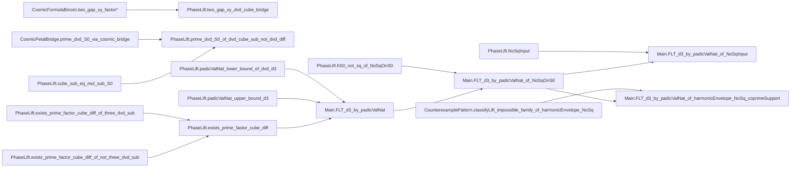

# DkMath.FLT README

このディレクトリは、`d=3` 向けの FLT 補題チェーンを Lean で管理するための実装群です。
現行方針は次の通りです。

- `Main.lean` は「合成レイヤー」に寄せる
- 導出補題は `PhaseLift.lean` / `CounterexamplePattern.lean` に集約する
- `NoSqOnS0` を中心に、複数の入口（harmonic / classify / coprime support）を接続する

## 1. モジュール責務

- `Main.lean`
  - 最終定理群の公開面。
  - 主要入口:
    - `FLT_d3_by_padicValNat`
    - `FLT_d3_by_padicValNat_of_NoSqOnS0`
    - `FLT_d3_by_padicValNat_of_nonLiftable_coprimeSupport`
    - `FLT_d3_by_padicValNat_by_cases_NoSq_of_NoSqBaseInput`
    - `FLT_d3_by_padicValNat_of_harmonicEnvelope_*`
    - `FLT_d3_by_padicValNat_of_GEisensteinCore_coprimeSupport`
    - `FLT_d3_by_padicValNat_of_DescentBaseInput`
    - `FLT_d3_by_padicValNat_of_NoSqInput`

- `PhaseLift.lean`
  - 共通導出補題の中核。
  - `NoSqOnS0` / `AllNonLiftableOnS0` / support 条件 / mod3 分離補題。
  - 立方差・原始素因子存在・padic 上下界など、`Main` が依存する下位補題を集約。
  - 入口束:
    - `NoSqBaseInput`
    - `NoSqInput`

- `CounterexamplePattern.lean`
  - `classifyLift` を中心にした反例パターン分類。
  - `PrimitiveOnS0` と `NonLiftableS0` / `noSquareGate` の接続。

- `CosmicPetalBridge.lean`
  - `CosmicFormulaBinom` と `S0_nat` をつなぐ橋補題。

- `GEisensteinBridge.lean`
  - Eisenstein ノルム同型の橋補題。
  - `descent` 側インターフェース
    `DescentClassifyImpossibleOnPrimitive` への接続点を提供。
  - `GEisensteinDescentCore` 構造体で下降法コアを段階拡張可能。
  - `GEisensteinDescentFrame` で縮小写像枠を保持。
    - `step` は `measure s > 0` のときのみ要求する設計（終端状態を許容）。

- `CosmicFormula/CosmicFormulaBinom.lean`
  - `add_pow_gap_factor`, `add_pow_tail_u2_*`, `two_gap_xy_factor*` を提供。

## 2. 推奨の証明導線

実装上の標準導線は次の順です。

1. `NoSqOnS0 c b` を供給
2. `hS0_not_sq_of_NoSqOnS0` で `FLT_d3_by_padicValNat` の仮定形へ変換
3. `Main` の派生定理（`...of_NoSqOnS0` / `...of_NoSqInput`）へ接続

分類器を使う導線では以下を利用します。

1. `classifyLift = impossible` family
2. `nonLiftableS0_of_classifyLift_impossible`
3. `AllNonLiftableOnS0` / `NoSqOnS0`
4. `Main` の派生定理へ接続

## 3. 補題チェーン（Mermaid）

この図は `docs/NoSqOnS0/NoSqOnS0-WorkNotes.md` と同一内容で同期管理します。

## 4. 現在の入口（phase-06）

`Main` の実用入口としては次を推奨します。

- 最小入口:
  - `FLT_d3_by_padicValNat_of_NoSqOnS0`
  - `FLT_d3_by_padicValNat_of_descentClassify_coprimeSupport`

- 構造入口（仮定圧縮版）:
  - `FLT_d3_by_padicValNat_by_cases_NoSq_of_NoSqBaseInput`
  - `NoSqBaseInput` に `hbc`, `coprime`, `hNonLift` を束ねる
  - `FLT_d3_by_padicValNat_of_NoSqInput`
  - `NoSqInput` に `hbc`, `coprime`, `hHarm`, `hNoSq` を束ねる
  - `*_coprimeSupport` 系は最小仮定版に整理済み（`mod3` 分離引数なし）

## 5. 作業ログ

最新の作業ログ・タスク状態は以下を参照してください。

- `docs/NoSqOnS0/NoSqOnS0-WorkNotes.md`

phase ごとのスナップショットは `docs/NoSqOnS0/NoSqOnS0-WorkNotes-phase-*.md` にあります。

## 6. メンテ方針

- 新しい導出補題は原則 `PhaseLift` / `CounterexamplePattern` に追加する
- `Main` には局所証明を増やさず、合成定理の追加に限定する
- 補題チェーン更新時は `NoSqOnS0-WorkNotes.md` に必ず追記する
