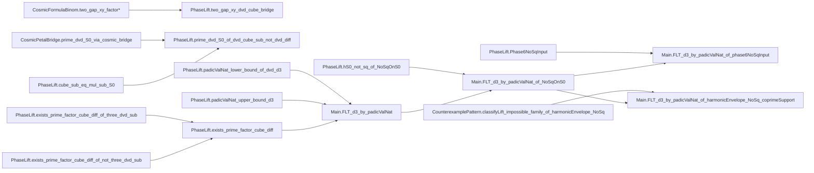

# No Square on S0 Work Notes

status: 作業中 - phase-07: ドキュメント branch: `dev/flt-refactoring-phase7-260224-v0`

## Index

※以前の作業は以下、アーカイブログへ移しました。

[NoSqOnS0: phase-01](NoSqOnS0-WorkNotes-phase-01.md)
[NoSqOnS0: phase-02](NoSqOnS0-WorkNotes-phase-02.md)
[NoSqOnS0: phase-03](NoSqOnS0-WorkNotes-phase-03.md)
[NoSqOnS0: phase-04](NoSqOnS0-WorkNotes-phase-04.md)
[NoSqOnS0: phase-05](NoSqOnS0-WorkNotes-phase-05.md)
[NoSqOnS0: phase-06](NoSqOnS0-WorkNotes-phase-06.md)

## 課題

- [x] なし

## 状況タスク

phase-07（ドキュメント）
[README.md](../../README.md) のドキュメントを最新コードベースに合わせて更新（刷新）する。

- [x] 1. Mermaid 図の再生成
  - 現行コードベースに合わせて補題チェーン図を更新
- [x] 2. README.md のドキュメント刷新
  - Mermaid 図を最新に差し替え
  - 定理や補題の説明文を現行コードに合わせて更新
  - 全体の構成や流れも必要に応じて見直し

## 作業ログ 2026/02/24  5:16 より

- phase-07 実装ステップ（README の刷新）
  - `DkMath/FLT/README.md` を現行コードベースに合わせて再編。
  - 内容を以下へ更新:
    - モジュール責務（`Main` / `PhaseLift` / `CounterexamplePattern`）
    - 推奨導線（`NoSqOnS0` / classify）
    - phase-06 入口（`Phase6NoSqInput`）
    - メンテ方針

- phase-07 実装ステップ（Mermaid 図の再生成）
  - README に「補題チェーン（Mermaid）」を追加。
  - 主要導線:
    - `CosmicFormulaBinom -> PhaseLift`
    - `PhaseLift -> Main`
    - `CounterexamplePattern -> Main`

- build（再確認）
  - ドキュメント更新のみ（ビルド対象の Lean ファイル変更なし）

## 補題チェーン（Mermaid）

README と同一内容を記録（更新時は両方を同期）。

