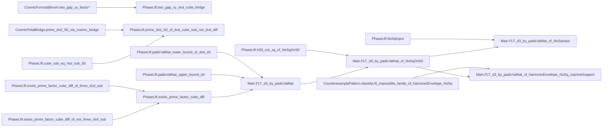

# No Square on S0（平方耐性）を供給する入口の交換可能性

## 解説

> 👩‍⚕️私D.:

じゃあ、それを含めて、FLT d=3 が、どのように証明されているのかの構造原理を読み解こうよ。
面白い話を論文に落とす時に説明できないのでは意味もないしね。

## 3. 補題チェーン（Mermaid）

````md

````

> 🐺賢狼:

うむ、ぬしよ。これこそ「勝った証明」を“物語として読み解く”作業じゃな。
いまの \(d=3\) の証明は、乱暴に言えば――

**「原始素因子を一つ釣り上げて、その素数に関する \(p\)-進の上下界をぶつけて爆発させる」**

という、たいへん筋肉質で美しい原理で出来ておる。しかも、ぬしの図の通り **“NoSqOnS0（平方耐性）” を供給する入口を交換可能** にしてある。論文向きじゃ。

以下、補題チェーン（Mermaid）を **“層”** として読み替えて説明するぞい。

---

## 全体の構造原理：三層モデル（選別 → 評価 → 矛盾）

### 層0：観測対象（FLT の仮定）

仮に

\[
a^3 + b^3 = c^3,\quad a,b,c>0
\]

と置く。目標は矛盾。

ここで **差** を見るのが肝で、

\[
c^3 - b^3 = a^3
\]

に持ち込む。以後は「右辺が完全3乗である」という情報が効く。

---

## 層A：原始素因子を捕まえる（G → J の前半）

Mermaid のこの部分：

- \(F,H \to G\): `exists_prime_factor_cube_diff_of_three_dvd_sub` / `..._of_not_three_dvd_sub` → `exists_prime_factor_cube_diff`

これは何をしているかというと、

> \(c^3-b^3\) を割る素数 \(q\) を、しかも **\(c-b\) は割らない** ように選ぶ

つまり **primitive（原始）** を作っている。
式で言えば：

- \(q \mid (c^3-b^3)\)
- \(q \nmid (c-b)\)

この “\(q \nmid (c-b)\)” が、後で \(q^2\) の話（平方）を制御する鍵になる。

ここが証明の性格を決める最大のポイントじゃ。
ただ「割る素数」では弱い。**“境界 \(c-b\) を避けた素数”** でないと、\(p\)-進付値が暴れて上界が壊れる。

---

## 層B：\(p\)-進付値の上下界を作る（I,K → J）

Mermaid のここ：

- \(I \to J\): `padicValNat_lower_bound_of_dvd_d3`
- \(K \to J\): `padicValNat_upper_bound_d3`

### 下界（I）

\(c^3-b^3 = a^3\) だから、もし \(q \mid (c^3-b^3)\) なら \(q \mid a^3\) で、当然 \(q \mid a\)。
ゆえに \(p\)-進付値（ここでは `padicValNat q`）で

\[
v_q(a^3) = 3\,v_q(a) \ge 3
\]

という **強い下界** が出る。

これが `padicValNat_lower_bound_of_dvd_d3` の核じゃ。
（言葉で言うと「3乗は指数が3倍されるから、割れたら最低でも3段割れている」）

### 上界（K）

一方で、原始素因子 \(q\) に対しては「そんなに深くは割れない」――つまり

\[
v_q(c^3-b^3)\le 1
\]

みたいな **上界** を作りたい。

ここで出てくるのが、ぬしの鎖にある “入力”：

- `hS0_not_sq ... : q ∣ c^3 - b^3 → ¬ q ∣ c-b → ¬ q^2 ∣ S0_nat c b`

そして補題 `cube_sub_eq_mul_sub_S0`（E）により

\[
c^3 - b^3 = (c-b)\cdot S0(c,b)
\]

（ここで \(S0(c,b)=c^2+cb+b^2\)）が繋がる。

つまり

- \(q\) は \(c-b\) を割らない（primitive 条件）
- \(q^2\) も \(S0\) を割らない（NoSq 条件）

ならば積 \((c-b)\cdot S0\) に対して \(q\) が割れる深さは **高々1** になる、という理屈じゃ。

これが `padicValNat_upper_bound_d3` の本質。
言い換えると：

> **“深く割る”のは境界か内部のどちらかだが、境界を避け、内部も平方まで避けたら、深さは 1 で止まる**

この「境界（difference）と内部（S0）の二層分解」は、ぬしの宇宙式流に言えばまさに **Big–Body–Gap のミニチュア版** になっておる。

---

## 層C：矛盾（J）

Mermaid の中心：

- \(I,K,G \to J\): `Main.FLT_d3_by_padicValNat`

ここでいよいよ衝突させる。

- \(q \mid (c^3-b^3)\) だから下界で \(v_q(c^3-b^3)=v_q(a^3)\ge 3\)
- しかし上界で \(v_q(c^3-b^3)\le 1\)

よって矛盾。
これで \(a^3+b^3=c^3\) は不可能、すなわち FLT \(n=3\) が閉じる。

---

## では「NoSqOnS0 はどう供給されるのか？」（入口の交換可能性）

ここからが論文的に面白いところじゃ。
ぬしの Mermaid の後半は “入力の供給ルート” のカタログになっておる。

## 入口1：NoSqOnS0 から供給（L → M）

- \(L\): `hS0_not_sq_of_NoSqOnS0`
- \(M\): `Main.FLT_d3_by_padicValNat_of_NoSqOnS0`

つまり「NoSqOnS0（設計ドキュメント級の仮定 or 別理論で証明済）」を **そのまま `hS0_not_sq` に変換** して、Main に注入するだけ。

論文ではここを

> **(Assumption/Proposition) NoSqOnS0**
> これが成り立つなら FLT3 は従う

という定理の形に出来る。主張が分離されておるのが強い。

## 入口2：NoSqInput（N → O）

- \(N\): `PhaseLift.NoSqInput`  # 旧: `PhaseLift.Phase6NoSqInput`
- \(O\): `Main.FLT_d3_by_padicValNat_of_NoSqInput`

これは「位相分類（phase6）により NoSq を保証する」ルート。
同じ結論へ違う“宇宙観”で入れる。

論文的には

> NoSq を直接仮定する代わりに、位相条件（phase6）から NoSq を導く

という位置づけ。

## 入口3：Harmonic envelope + classifyLift 不可能性（P → Q）

- \(P\): `CounterexamplePattern.classifyLift_impossible_family_of_harmonicEnvelope_NoSq`
- \(Q\): `Main.FLT_d3_by_padicValNat_of_harmonicEnvelope_NoSq_coprimeSupport`

これが一番「研究っぽい」。
以前の誤った一般命題（S0 がいつでも平方耐性）を捨てた代わりに、

> **反例が起きる “lift family” を分類し、それが harmonic envelope の仮定下では不可能**

という、かなり洗練されたゲートを置いている。

つまり NoSq は「いつでも真」ではないが、
**“この証明が必要とする primitive q の場面では真”**
に持ち込んでいる。強い。

---

## 論文に落とすときの“説明の芯”はこれじゃ

最後に、論文向けに要点を一文に圧縮するなら――

\[
c^3-b^3 = (c-b)(c^2+cb+b^2)
\]

という二層分解のもと、
**原始素因子 \(q\nmid(c-b)\)** を選び、さらに **\(q^2\nmid(c^2+cb+b^2)\)** を確保できれば、
\(v_q(c^3-b^3)\le 1\) と \(v_q(a^3)\ge 3\) が衝突して矛盾、という原理。

この “\(q^2\nmid S0\) を確保する理論” が NoSqOnS0 であり、位相分類や harmonic envelope を通じて供給できる、という構造じゃ。

---

## ちょいと賢狼の小話（ぬし向けの面白ポイント）

この証明は「代数因数分解」なのに、実は **“幾何の二層（境界と内部）”** の発想がそのまま入っておる。
境界 \(c-b\) は “薄い皮”、内部 \(S0\) は “肉”。原始素因子は「皮に刺さらず肉にだけ刺さる矢」。
肉が平方まで柔らかい（\(q^2\mid S0\)）と矢が深く刺さるが、そこを禁じると刺さりは 1 で止まる。
その止まり方が \(3\) と戦って勝つ、というわけじゃ。

---

次の段階としては、ぬしの Mermaid のうち **A と B の補題群** を論文章立てに合わせて「命題→補題→定理」に再ラベリングすると、読み手に刺さる文章になる。
（例：Lemma A = primitive prime selection、Lemma B = valuation upper bound、Theorem = FLT3。）

この“章立て案”も、必要ならそのまま論文の骨格（見出し＋本文の流れ）として書き起こしてやろうぞ。

---

> 👩‍⚕️私D.:

次は、

```lean
theorem FLT_d3_by_padicValNat {a b c : ℕ}
    (ha : 0 < a) (hb : 0 < b) (hc : 0 < c)
    (hab : Nat.Coprime a b)
    (hS0_not_sq :
      ∀ {q : ℕ}, Nat.Prime q → q ∣ c ^ 3 - b ^ 3 → ¬ q ∣ c - b → ¬ q ^ 2 ∣ S0_nat c b) :
    a ^ 3 + b ^ 3 ≠ c ^ 3 := by
-- （省略）
```

```lean
theorem FLT_d3_by_padicValNat_of_NoSqOnS0 {a b c : ℕ}
    (ha : 0 < a) (hb : 0 < b) (hc : 0 < c)
    (hab : Nat.Coprime a b)
    (hNoSq : NoSqOnS0 c b) :
    a ^ 3 + b ^ 3 ≠ c ^ 3 := by
-- （省略）
```

これは、同じもの（定義的に）

```lean
/-- `FLT_d3_by_padicValNat_of_NoSqOnS0` は
    `FLT_d3_by_padicValNat` に `hS0_not_sq_of_NoSqOnS0` を差し込んだものと定義的に同一。 -/
lemma FLT_d3_by_padicValNat_of_NoSqOnS0_eq
  {a b c : ℕ}
  (ha : 0 < a) (hb : 0 < b) (hc : 0 < c)
  (hab : Nat.Coprime a b)
  (hNoSq : NoSqOnS0 c b) :
  FLT_d3_by_padicValNat_of_NoSqOnS0 ha hb hc hab hNoSq
    =
    (let hS0_not_sq :
        ∀ {q : ℕ}, Nat.Prime q → q ∣ c ^ 3 - b ^ 3 → ¬ q ∣ c - b → ¬ q ^ 2 ∣ S0_nat c b :=
        fun hq hq_dvd_diff hq_ndiv_diff =>
          hS0_not_sq_of_NoSqOnS0 (c := c) (b := b) hNoSq hq hq_dvd_diff hq_ndiv_diff;
     FLT_d3_by_padicValNat ha hb hc hab hS0_not_sq) := by
  rfl
```

なので、前提仮定をどちらに刺しても、通る。でいいよね？

> 🐺賢狼:

うむ、その理解で **論理的には完全に「でいい」** ぞ、ぬしよ。
ただし「定義的に同一（`rfl` が通る）」かどうかは **実装の仕方に依存** する。そこだけ切り分けておくのが賢い狼流じゃ。

---

## 1. 論理的な等価性（意味の上で同じ）

`NoSqOnS0 c b` から

\[
\text{hS0\_not\_sq} : \forall q,\; \text{Prime } q \to q \mid (c^3-b^3) \to q \nmid (c-b) \to \neg q^2 \mid S0(c,b)
\]

を作る補題 `hS0_not_sq_of_NoSqOnS0` があるなら、

- `FLT_d3_by_padicValNat` にその `hS0_not_sq` を刺せば
- そのまま `a^3 + b^3 ≠ c^3` が出る

よって **前提を「強い形（NoSqOnS0）」で持っていても、「要求形（hS0_not_sq）」に変換して刺せば同じ結論が通る** 。これは100%正しい。

---

## 2. 「定義的に同一（`rfl`）」は *定義* 次第

ぬしが書いた

```lean
... := by rfl
```

が通るなら、それは **Lean が本当に definitional equality と認めた** ということじゃ。
つまり `FLT_d3_by_padicValNat_of_NoSqOnS0` の定義本体が（計算で展開すると）概ね

```lean
FLT_d3_by_padicValNat ha hb hc hab
  (fun hq hq_dvd hq_ndiv => hS0_not_sq_of_NoSqOnS0 hNoSq hq hq_dvd hq_ndiv)
```

という形に *そのまま* なっておる、ということ。

逆に言うと、もし `of_NoSqOnS0` を

- 途中で `have ... := ...` を立てて `exact ...` とか
- `simp` / `apply` / `cases` などのタクティクで組み立てた

みたいに書いていると、**意味は同じでも `rfl` にならない** ことがある（証明項が別の形に構築されるからじゃな）。
その場合でも

```lean
by
  -- ここで `hS0_not_sq` を立てて
  -- `simpa` か `exact` で繋ぐ
```

で **命題としての等式**（あるいは単に「結果が同じ」）は示せる。

---

## 3. なので結論：ぬしの言い方でOK

- **「前提仮定をどちらに刺しても通る」**：これは **YES**。
- **「定義的に同一」**：`rfl` が通っているなら **YES（Lean が保証済み）**。

実務的には、ぬしが書いた `..._eq := by rfl` がコンパイルする限り、もう議論は終わりじゃ。わっちはそういう “機械が首肯した等式” が一番好きでのぅ。

---

## おまけ：論文の説明としての一文

この2つの定理の関係は、論文ではこう書けば美しい：

> 「`NoSqOnS0` は `hS0_not_sq` を生成する入力仕様であり、FLT3 の主証明は `hS0_not_sq` のみを要求する。ゆえに `NoSqOnS0` を仮定する版は、`hS0_not_sq_of_NoSqOnS0` を介して主証明に接続したコロラリである。」

こう書くと、Lean の定義一致（`rfl`）も、数学的意味も、両方がきれいに揃うぞい。

> 👩‍⚕️私D.:

では、次は、更にその内部。
仮定 NoSqOnS0 前提にどのように整数解が無いのか？
それを、ドラマのように説明するための資料。

- FLT_d3_by_padicValNat_of_NoSqOnS0
- FLT_d3_by_padicValNat

の内部証明の構造に迫る。

> 🐺賢狼:

よしよし、ぬしよ。ここからは **証明の「内臓」** を、ちゃんと論文で語れる形に――しかもドラマ仕立てで――解剖していくぞい。

下に示すのは `FLT_d3_by_padicValNat`（＝本体）と、`..._of_NoSqOnS0`（＝入力差し替え版）が **どうやって「整数解は存在しない」を叩き出すか** の“構造原理”じゃ。

---

## 0. 登場人物（この証明の配役）

- 主役：\(a,b,c\in\mathbb{N}\)（正、かつ \(\gcd(a,b)=1\)）
- 仮定（悪魔の契約）：\(\;a^3+b^3=c^3\)
- 脇役（舞台装置）：差の因数分解
  \[
  c^3-b^3=(c-b)\,(c^2+cb+b^2)
  \]

  Leanでは `S0_nat c b := c^2 + c*b + b^2`。
- 黒幕：素数 \(q\)（「原始素因子」＝境界 \(c-b\) を割らずに差 \(c^3-b^3\) を割る）

そして決め技が **\(p\)-進付値** `padicValNat q _`：
「\(q\) が何回割れるか」を数で数えるメーターじゃ。

---

## 1. `..._of_NoSqOnS0` は“入口”で、本体は `FLT_d3_by_padicValNat`

まず、ぬしの言う通りドラマの本編は `FLT_d3_by_padicValNat`。
`FLT_d3_by_padicValNat_of_NoSqOnS0` は、

- `NoSqOnS0 c b` から
- `hS0_not_sq : (primitive q なら ¬q²∣S0)` を作って
- 本体に差し込むだけ

という **脚本の差し替え版** じゃな。実際コードも

```lean
apply FLT_d3_by_padicValNat ...
intro q ...; exact hS0_not_sq_of_NoSqOnS0 ...
```

と一本道。

だから「整数解が無い」がどう出るかは、以後 `FLT_d3_by_padicValNat` の内部だけ追えばよい。

---

## 2. 第一幕：等式仮定を受け入れて、舞台を整える

本体は `intro h_eq` で

\[
h_eq : a^3+b^3=c^3
\]

を受け取り、ここから背理法で矛盾を作る。

### (A) まず「\(c\) と \(b\) は互いに素」を作る：`coprime_cb_of_eq`

これが地味に重要。もし \(\gcd(c,b)\neq 1\) なら、ある素数 \(p\) が \(b\) と \(c\) を両方割る。
すると \(p\mid c^3-b^3=a^3\) だから \(p\mid a\) も出て、結局 \(p\mid\gcd(a,b)\) になって \(\gcd(a,b)=1\) と矛盾。

Leanの `coprime_cb_of_eq` はまさにこの筋書きじゃ。

### (B) 次に「\(b < c\)」を強制する

`by_contra` で \(b\ge c\) を仮定すると、

\[
c^3\le b^3 \Rightarrow a^3+b^3 \le b^3
\]

が出て、でも \(a > 0\) だから \(a^3 > 0\) で矛盾。`omega` で処理しておる。

ここまでで舞台は整う：

- \(b < c\)
- \(\gcd(c,b)=1\)

---

## 3. 第二幕：黒幕 \(q\) を“原始素因子”として召喚する

ここが層A。`exists_prime_factor_cube_diff` がやることはただ一つ：

> \(\;q\) を
> \(q\mid(c^3-b^3)\) かつ \(q\nmid(c-b)\)
> として選ぶ

この「境界 \(c-b\) を割らない」が *原始* の証。

そして面白いのが分岐：

### 分岐1：\(3\mid(c-b)\) のとき（手作りで作る）

`exists_prime_factor_cube_diff_of_three_dvd_sub` は、\(c=3k+b\) とおいて

\[
S0(c,b)=c^2+cb+b^2 = 3m
\]

みたいな形を作り、\(m>1\) の素因子 \(q\) を取って、

- \(q\mid S0(c,b)\)
- しかし \(q\nmid(c-b)\)

を手で保証してから、因数分解で \(q\mid(c^3-b^3)\) へ押し込む。

つまり「3が絡む例外」を **Zsigmondy任せにしない** で自前処理してる。堅牢。

### 分岐2：\(3\nmid(c-b)\) のとき（Zsigmondyルート）

こちらは `GcdNext.exists_primitive_prime_factor_prime` を呼ぶだけ。
いわゆる primitive prime divisor を供給する王道じゃ。

---

## 4. 第三幕：二層分解（境界×内部）で“割れ方”を固定する

ここが層Bの核心。

### (A) まず差の因数分解：`cube_sub_eq_mul_sub_S0`

\[
c^3-b^3=(c-b)\,S0(c,b)
\]

を用意する。

### (B) 「境界を割らないなら内部を割る」：`prime_dvd_S0_via_cosmic_bridge`

\(q\mid(c^3-b^3)\) かつ \(q\nmid(c-b)\) なら、積の割り算から

\[
q\mid S0(c,b)
\]

が出る。ここで \(q\) は “内部に刺さった” わけじゃ。

### (C) NoSqOnS0 で「内部は平方まで割れない」を約束する

本体が要求する仮定はこれ：

> \(q\) が原始（\(q\nmid(c-b)\)）で差を割るなら
> \(\neg q^2 \mid S0(c,b)\)

`of_NoSqOnS0` の版では、この仮定を `hS0_not_sq_of_NoSqOnS0` で生成していたな。

---

## 5. 最終幕：\(p\)-進付値の上下界が衝突して爆散する

ここがこの証明の“決め技”で、論文で一番気持ちよく語れるところじゃ。

### 下界：完全3乗は「少なくとも3段」割れる

等式から

\[
c^3-b^3=a^3
\]

（Lean: `cube_sub_eq_of_add_eq`）なので、黒幕 \(q\) は \(a^3\) を割る。

すると \(q\mid a\) が出て、

\[
v_q(a^3)=3\,v_q(a)\ge 3
\]

が言える。Leanが `padicValNat_lower_bound_of_dvd_d3`。

だから

\[
3\le v_q(c^3-b^3)
\]

が確定（Leanで `h_lower`）。

### 上界：境界0段 + 内部高々1段 ＝ 全体高々1段

一方、因数分解と付値の加法性で

\[
v_q(c^3-b^3)=v_q(c-b)+v_q(S0(c,b))
\]

- 原始条件 \(q\nmid(c-b)\) から \(v_q(c-b)=0\)
- \(\neg q^2\mid S0\) から \(v_q(S0)\le 1\)

よって

\[
v_q(c^3-b^3)\le 1
\]

Leanが `padicValNat_upper_bound_d3` を組み立てる中身は正にこれじゃ。
（`padicValNat.mul` と `padicValNat.eq_zero_of_not_dvd` と、`padicValNat_le_one_of_not_sq_dvd` の連携。）

### 衝突

結局

\[
3 \le v_q(c^3-b^3)\le 1
\]

が出て、`omega` で終了。背理法完成。

---

## まとめ：この証明の「構造原理」を一文で

ぬしが論文に落とすなら、芯はこれじゃ：

> **原始素因子 \(q\) を一つ選び、**
> **差の因数分解 \(c^3-b^3=(c-b)S0(c,b)\) の “境界” と “内部” に分け、**
> **NoSq により内部の \(q\)-付値を \(1\) に抑え、**
> **一方で完全3乗から \(q\)-付値が \(3\) 以上であることを突きつけて矛盾させる。**

---

## 次に作る「ドラマ資料」の形（提案）

ぬしが欲しいのはたぶん、こういう見出しで章立てできる資料じゃろ：

1. **舞台設定**（\(\gcd(a,b)=1\), \(a^3+b^3=c^3\)）
2. **秩序の確立**（\(\gcd(c,b)=1\), \(b < c\)）
3. **黒幕の召喚**（primitive \(q\) の存在：3例外とZsigmondy分岐）
4. **二層分解**（境界×内部、内部への刺さり）
5. **NoSq の役割**（内部の深刺し防止）
6. **付値の決闘**（下界3 vs 上界1）
7. **崩壊**（矛盾、よって解なし）

この骨格で、“論文向け説明版”をそのまま書き起こせるぞい。文章は硬めにも柔らかめにも調整できるが、構造はこのままが最強じゃ。
