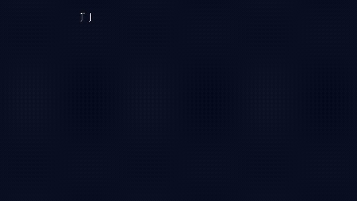

# Hackathon: OpenAI Build Week - 260715 @ Devpost

> [!IMPORTANT]
> **OpenAI Build Week project entry point**
>
> This directory is the compact Lean-facing entrance to the submission.
> The complete project record—including the mathematical contract, Codex
> instructions, checkpoints, verification reports, visualization pipeline,
> and post-video research update—is available here:
>
> **[Open the complete OpenAI Build Week project documentation](../../docs/hackathon/cosmic-formula-inversion-260715/README.md)**

## DkMath — Verifiable AI Mathematical Research

DkMath is an experiment in human-directed, AI-assisted mathematical research
with a mechanically checkable result surface.

The working loop is:

```text
human mathematical direction
→ GPT-5.6 reasoning, review, and scope control
→ Codex repository investigation and implementation
→ Lean verification
→ reproducible explanation and publication artifacts
```

The AI systems help explore, implement, review, and communicate the work.
Lean—not the AI-generated prose—is the verification gate for accepted theorem
declarations.

## Two Build Week Tracks

### Track 1 — Finite-prime escape and Cosmic completion

The recorded demonstration begins with a finite set of known primes, forms its
product `P`, chooses a coprime offset `u`, and proves that every prime divisor
of `P + u` lies outside the original finite set.

The same construction is displayed through the Cosmic Formula completion:

$$
P(P+2u)+u^2=(P+u)^2
$$

The public example uses:

$$
P=2\cdot3\cdot5\cdot7=210,\qquad u=11
$$

and therefore:

$$
P+u=221=13\cdot17.
$$

Lean entry points:

- [`FinitePrimeEscape.lean`](./FinitePrimeEscape.lean)
- [`CosmicCompletion.lean`](./CosmicCompletion.lean)
- [`Demo.lean`](./Demo.lean)

### Track 2 — Post-video GN5 / exponent-five formalization

The original video ended with the local observation that
`GN(5,1,1) = 31` is not a perfect fifth power.

After that recording, the same GPT-5.6 → Codex → Lean workflow continued on a
second implementation track. The repository now contains a Lean-checked
formalization whose public theorem surface includes:

```lean
goldenZeroSectorFactorExclusion
goldenZeroSectorArithmeticExclusion
flt5Target
fermatFive_no_positive_solution
```

The encoded public statement is:

$$
x,y,z\in\mathbb N_{>0}\Longrightarrow x^5+y^5\ne z^5.
$$

The final descent uses the golden lift

$$
T(r,s)=(r^2+rs+s^2,s^2)
$$

to reconstruct the same invariant with a strictly smaller second-coordinate
measure.

Review and implementation entry points:

- [PR #56 — signed golden zero-sector descent](https://github.com/Deskuma/dkmath/pull/56)
- [`DkMath.FLT.Five.Main`](../FLT/Five/Main.lean)
- [`SignedGoldenZeroSectorDescent.lean`](../FLT/Five/SignedGoldenZeroSectorDescent.lean)
- [`SignedGoldenZeroSectorFinal.lean`](../FLT/Five/SignedGoldenZeroSectorFinal.lean)
- [Axiom-surface inspection](../../DkMathTest/FLT/Five/CheckAxioms.lean)
- [Final implementation report](../FLT/Five/docs/repo-flt5-cp-005-final.md)

> [!NOTE]
> This is presented as a Lean-checked repository result under the stated
> theorem contract. It is now open for independent mathematical inspection,
> dependency review, axiom-surface inspection, and build reproduction. This
> page does not claim completed external peer review or established acceptance
> by the mathematical community.

## Watch the Project



The first-track animation is also stored in the repository:

▶️ **[Cosmic Formula animated learning prototype (MP4)](../../docs/hackathon/cosmic-formula-inversion-260715/visual/media/videos/cosmic_formula_scene/720p30/CosmicFormulaPrototype.mp4)**

The final narrated Build Week video includes the post-recording exponent-five
update and is exactly three minutes long.

To find the public upload on YouTube, search for:

```text
DkMath A Lean-Checked Formalization of the Exponent-5 Case Open for Review
```

Devpost project page:

- [DkMath — Verifiable AI Mathematical Research](https://devpost.com/software/dkmath-verifiable-ai-mathematical-research)

## How GPT-5.6 and Codex Contributed

### GPT-5.6

GPT-5.6 was used to:

- turn informal observations into explicit theorem contracts;
- inspect proof strength, dependencies, and possible overclaims;
- connect new targets to the existing DkMath architecture;
- define bounded implementation checkpoints and stopping rules;
- review completed Lean reports and identify the next obstruction;
- prepare the explanation, narration, and public documentation.

### Codex

Codex was used to:

- inspect a large existing Lean repository;
- locate reusable definitions and theorem surfaces;
- implement and refactor the finite-prime and FLT5 routes;
- repair proof failures under Lean feedback;
- record checkpoint reports and dependency decisions;
- create the Manim, Kokoro TTS, subtitle, and FFmpeg pipelines;
- assemble the final synchronized video artifacts.

### Human researcher

The human researcher selected the mathematical direction, evaluated the
interpretation, controlled the research scope, and accepted only theorem
surfaces checked by Lean.

## Reproduction

From the Lean workspace:

```bash
cd lean/dk_math
lake build DkMath.Hackathon.Demo
lake build DkMath.FLT.Five.Main
lake build DkMathTest.FLT.Five.CheckAxioms
```

For the complete development history, documentation map, verification policy,
and publication artifacts, continue to the
[full Build Week project record](../../docs/hackathon/cosmic-formula-inversion-260715/README.md).
