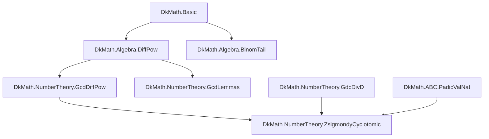
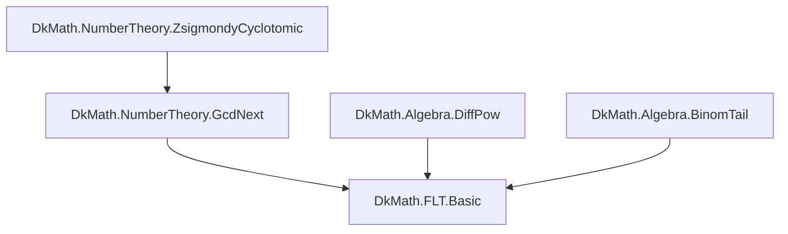
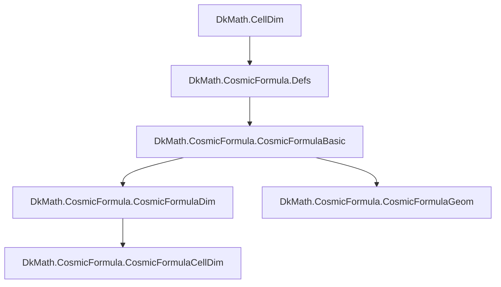
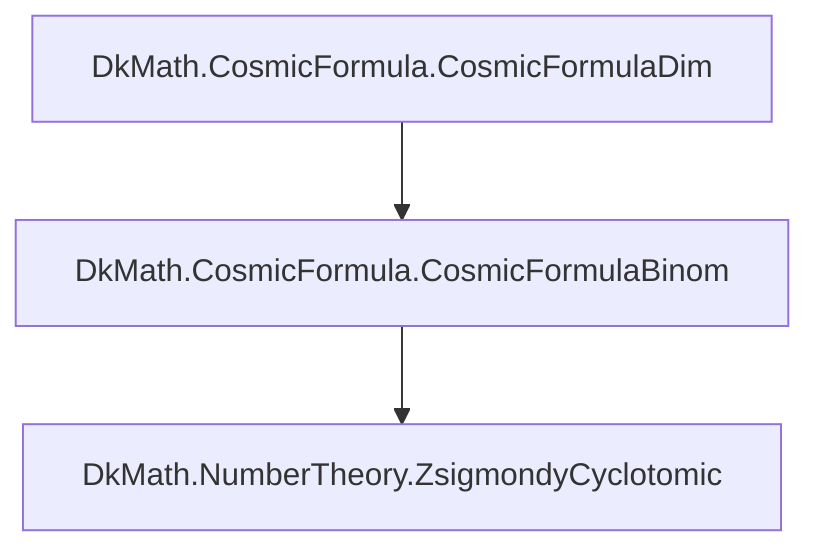
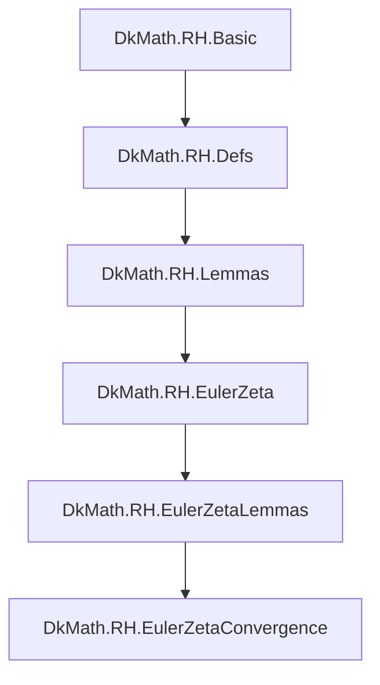
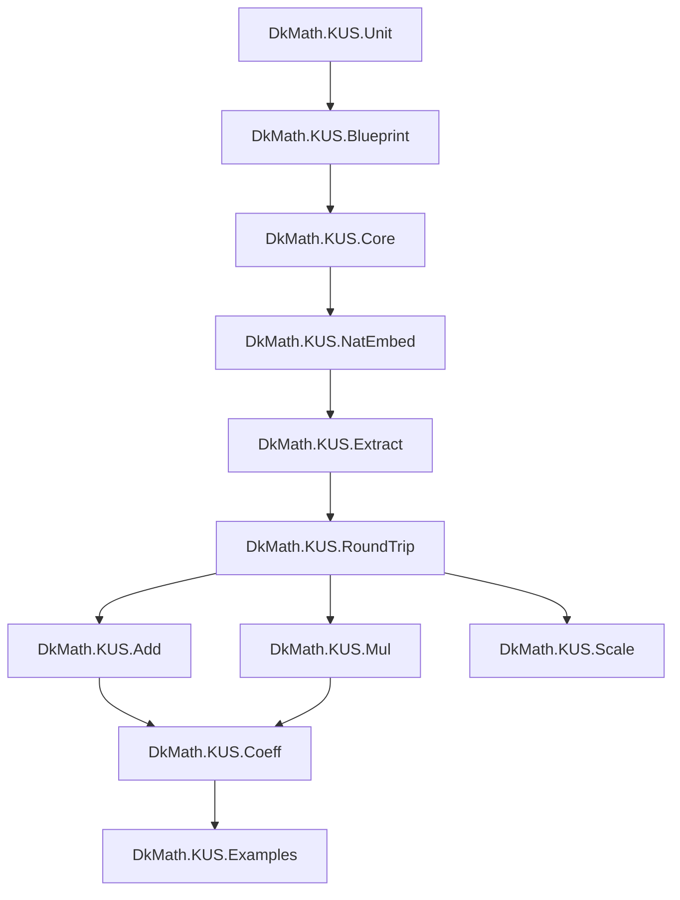

# dkmath (nightly) 構成マップ（目次・補題/定理インデックス案）

> 目的：リポジトリ全体を「何がどこにあるか」「どんな定理・補題が積み上がっているか」の観点で、**見出し/目次**として眺められる 1 枚 Markdown を作る。
>
> 注：nightly ブランチは `sorry` を含み得る（ビルドは通っている前提）。このドキュメントは \*\*現状の“地図”\*\*であり、証明完了度のラベル（✅/🚧/⚠️）は後で埋められるようにしてある。
>
> **最終更新**: 2026-03-10（`logs/summary_report` と `DkMath.lean` の実データで更新）
---

## 1. トップレベル（リポジトリ直下）

（直下は Lean 以外も含む：ドキュメント、Python、各種スクリプト、ログなど）

- `README.md`
- `CODE_OF_CONDUCT.md` / `CONTRIBUTING.md` / `LICENSE`
- `create-summary-report-data.sh` : サマリーレポート生成
- `docs/` : 研究ノート/記事/解説（構造説明・結果ログ）
- `lean/` : Lean プロジェクト本体
- `logs/` : 自動レポート・差分・スナップショット
- `python/` : 実験・可視化・数値検証
- （他：設定ファイル、CI、ライセンスなど）

---

## 2. Lean パッケージの入口

### 2.1 `lean/README.md`

- Lean 側の概要・ビルド手順・方針

### 2.2 `lean/dk_math/`

- Mathlib 上に構築された `DkMath` ライブラリ。
- エントリポイント：`DkMath.lean`

---

## 3. `DkMath.lean`（import グラフの最上位）

`DkMath.lean` は、外部へ見せたいモジュールをまとめて import している「目次ファイル」。

### 3.1 コア

- `DkMath.Basic`
- `DkMath.Samples`
  - 推奨導線サンプル: `DkMath.Samples.UniqueFactorizationGNFacade`
  - 最終推奨入口（NumberTheory 側）:
    `DkMath.NumberTheory.unique_factorization_nat_e2e_autoGNVal_nonExcFacade_boundaryFacade_autoExcNonExcMK`

### 3.2 ABC まわり

- `DkMath.ABC`
- `DkMath.ABC.PadicValNat`
- `DkMath.ABC.CountPowersDividing2n1`

### 3.3 コラッツ

- `DkMath.Collatz.Collatz2K26`

### 3.4 宇宙式（Cosmic Formula）

- `DkMath.CosmicFormula`

### 3.4.1 Zsigmondy ブリッジ

- `DkMath.Zsigmondy`

### 3.5 ポリオミノ／トロミノ

- `DkMath.Polyomino`
- `DkMath.PolyominoPrototype`
- `DkMath.Tromino`

### 3.6 白銀比・表示の一意性

- `DkMath.SilverRatio`
- `DkMath.UniqueRepSimple`
- `DkMath.UniqueRepresentation`

### 3.7 DHNT（動的調和数論）

- `DkMath.DHNT`

### 3.8 RH（リーマン予想関連）

- `DkMath.RH`

### 3.9 単位巡回

- `DkMath.UnitCycle`

### 3.10 FLT（フェルマー最終定理関連）

- `DkMath.FLT`

### 3.11 KUS（単位構造演算）

- `DkMath.KUS.Unit` — `US` 構造（unit + blueprint 束）
- `DkMath.KUS.Blueprint` — `BlueprintFamily` / `BlueprintAt` 型エイリアス
- `DkMath.KUS.Core` — `KUS` 構造・`mkWith`・`zeroState`
- `DkMath.KUS.NatEmbed` — `ofNat` / `toNat`
- `DkMath.KUS.Extract` — `extract`（support 取り出し）
- `DkMath.KUS.RoundTrip` — 往復定理（`reconstruct_from_extract` 等）
- `DkMath.KUS.Add` — `kusAdd`・`SameSupport`
- `DkMath.KUS.Mul` — `kusMul`・`oneState`
- `DkMath.KUS.Scale` — `ScaleSpec`（異 support 間スケール写像）
- `DkMath.KUS.Monoid` — `Fiber` 型エイリアス
- `DkMath.KUS.Coeff` — `GKUS`（汎用係数型）・`gOp`/`gAdd`/`gMul`/`gDiv` 等
- `DkMath.KUS.Examples` — `ToyUnit` / `toyX` / `toyScale` サンプル

---

## 3.12 理論依存グラフ（章立て再編）

ここからは「理論の流れ」で再構成する。

---

# I. FLT幹線（代数 → gcd → 原始素因子 → FLT）

## I-1. 構造の中核：差の冪と gcd 制御



- `DiffPow` が **指数構造の分解装置**。
- `GcdDiffPow` / `GcdLemmas` が **整除制御層**。
- `ZsigmondyCyclotomic` が **原始素因子エンジン**。

## I-2. 最終合流点：FLT



- `ZsigmondyCyclotomic` の完成度が FLT の進捗を決定する。
- 構造的には **ここが本丸**。

---

## I-3. Zsigmondy 中心・補題インデックス（FLT幹線コア）

ここでは `NumberTheory.ZsigmondyCyclotomic` を中心に、 **役割ごとに補題群を分解して管理する。**

### I-3-a. 基礎分解層（差の冪の構造）

主に `Algebra.DiffPow` / `Algebra.BinomTail`。

**（抽出）**

- `def diffPowSum`
- `lemma diffPowSum_sub_const_mul`
- `theorem pow_sub_pow_factor`
- `def BodyPow`
- `theorem BodyPow_factor`
- `def diffPowSum'`
- `theorem pow_sub_pow_factor'`
- `theorem pow_sub_pow_nat`

**（抽出）**

- `lemma add_pow_tail_exists`
- `lemma binom_tail_nat_dvd`

役割：

- 冪差 \(a^d-b^d\) を「線形因子 × 高次項」に分解する。
- 二項展開の“尾項”を \(u^2\) で束ね、以後の p-adic 制御へ渡す。

---

### I-3-b. gcd 制御層

主に `NumberTheory.GcdDiffPow` / `NumberTheory.GcdLemmas` / `NumberTheory.GdcDivD`。

**（抽出）**

- `theorem gcd_divides_d`

**（抽出）**

- `theorem prime_dividing_gcd_divides_d`
- `def quotientPrimePow`
- `lemma pow_sub_pow_eq_diff_mul_quotient`
- `lemma quotientPrimePow_gt_one`
- `lemma exists_prime_divisor_not_dividing_diff_of_prime_exp`

**（抽出）**

- `lemma nat_dvd_of_all_prime_powers_dvd`
- `lemma prime_pow_dividing_gcd_divides_d_pow`
- `lemma nat_dvd_of_all_prime_factors_dvd`

役割：

- 「既知の素因子」と「新しい素因子」を分離する（primitive の前提）。
- `gcd(...) ∣ d` 型の制御で、指数の情報を素因子側へ押し込む。

---

### I-3-c. 原始素因子層（Zsigmondy 本体）— さらに分解

モジュール：`DkMath.NumberTheory.ZsigmondyCyclotomic`

ここは「Zsigmondy の心臓部」ゆえ、補題を **機能ブロック**に切り分けて管理する。

---

#### I-3-c1. 宇宙式コア（因数分解の“器”）

（※この節は `ZsigmondyCyclotomic` 内にある **cosmic 系因数分解補題**を指す。）

- `lemma pow_sub_pow_factor_cosmic`（ℤ 上の因数分解）
- `lemma pow_sub_pow_factor_cosmic_N`（ℕ 上の因数分解）

役割：

- \(a^d-b^d=(a-b)\,G(a,b,d)\) 型の分解を **Zsigmondy 側から直接呼べる形**にする。

---

#### I-3-c2. primitive（原始性）の抽出

- `lemma exists_primitive_prime_factor_basic`
- `lemma prime_exp_not_dvd_diff_imp_primitive`（群論・位数で primitive を出す）
- `lemma exists_primitive_prime_factor_prime`

役割：

- 「ある素数 q が a^d - b^d を割る」だけでなく、 「k < d の差の冪を割らない」という **新規性**（primitive）を保証する。

---

#### I-3-c3. cyclotomic（円分多項式）ブロック

- `lemma cyclotomic_dvd_pow_sub_one`
- `lemma cyclotomic_squarefree`
- `lemma cyclotomic_eval_divides`

役割：

- 一般 d の Zsigmondy を「円分多項式 Φ\_d」経由で実装するための足場。
- squarefree 性は p-adic 上界（valuation ≤ 1）に直結しやすい。

---

#### I-3-c4. padicValNat（p-adic valuation）ブロック

- `lemma padicValNat_factorization`
- `lemma padicValNat_of_primitive_prime_factor_via_G`
- `lemma squarefree_implies_padic_val_le_one`
- `lemma padicValNat_primitive_prime_factor_ge_one`
- `lemma padicValNat_primitive_prime_factor_le_one`
- `lemma padicValNat_le_one_of_prime_divisor_case_three` 🚧
- `lemma padicValNat_le_one_of_prime_divisor_case_three_strong`

役割：

- 原始素因子 \(q\) について \(v_q(a^d-b^d)\) を押さえ、 「高い冪（\(d\) 乗）」の形を拒否する。

（`🚧` はこの最新版スナップショットでも `sorry` が残る箇所。）

---

#### I-3-c5. 二項係数の p-adic（Lucas/Kummer）

- `lemma lucas_theorem_for_binomial_coeff`
- `lemma kummer_theorem_for_binomial_coeff`

役割：

- 二項係数の p-進評価を通じて、 G(a,b,d) の係数や項の割れ方を制御する。

---

#### I-3-c6. d = 3 の“特化エンジン”（明示計算）

- `lemma G_three_explicit`
- `lemma GN_three_explicit`
- `lemma prime_divides_G3`
- `lemma padicValNat_binomial_coeff_three`
- `lemma padicValNat_G_three_coeffs_le_one`
- `lemma padicValNat_le_one_of_prime_divisor_case_three`（未完の可能性：d=3最終）

役割：

- 一般論が重い部分を、d=3 で「明示計算」に落として閉じる。
- FLT の具体指数（3,5,7…）を先に締める戦略にも使える。

---

#### I-3-c7. 例外ケース管理（Zsigmondy の“落とし穴”）

Zsigmondy は「ほとんど常に」原始素因子が出るが、古典的に例外がある。 （例：よく知られた (a,b,n)=(2,1,6) 型など）

このリポジトリの設計としては：

- **例外条件の前提化**（`¬ d ∣ a - b` など）
- **d=3 特化での反例検査**（具体値が紛れ込む場合の条件精査）
- **squarefree/p-adic 上界が要る箇所**を「研究課題」として隔離

…という方針で「本体ルート（FLTへ）」が塞がらないようにする。

---

#### I-3-c8. 別解ルート：p-adic値による FLT d=3（Main.lean）✅

**新規追加**（2026-02-22 完成）

モジュール：`DkMath.FLT.Main`（「別解」として展開）

本ファイルは、従来の Cosmic Formula + coprimality ルートとは異なる
**Zsigmondy 原始素因子 + p-adic値評価**による FLT d=3 の形式化証明である。

- `lemma cube_sub_eq_of_add_eq`：立方差の基本恒等式
- `lemma coprime_cb_of_eq`：互いに素性の遺伝
- `lemma exists_prime_factor_cube_diff`：立方差の原始素因子存在（3整除分岐対応）
- `lemma exists_primitive_prime_factor_d3`：Zsigmondy d=3 版
- `lemma S0_not_sq_dvd_of_prime_dvd_and_not_dvd_apb`：平方非整除条件（外部化）
- `lemma padicValNat_lower_bound_of_dvd_d3`：p-adic下界 `v_q(c³) ≥ 3`
- `lemma padicValNat_upper_bound_d3`：p-adic上界 `v_q(a³-b³) ≤ 1`
- **`theorem FLT_d3_by_padicValNat`**：メイン定理（矛盾導出）✅ PROVEN

**アクシオム依存**：  
`[propext, Classical.choice, Quot.sound]`（標準的） — **追加仮定なし**

**詳細資料**：  
補題チェーン、依存グラフ、論文化ガイドは `docs/FLT_LEMMA_CHAIN.*` に完全記述。

---

### I-3-d. 橋渡し層（GcdNext → FLT.Basic）

モジュール：`NumberTheory.GcdNext` と `FLT.Basic`。

**（抽出）**

- `def Sd` / `def Body`
- `theorem gcd_specialized_divides_d`
- `lemma dvd_padicVal_of_eq_pow`
- `lemma padicVal_mul_eq_add_of_coprime`
- `lemma prime_not_dvd_d_of_gcd_dvd`
- `theorem pow_sub_pos`
- `lemma gcdAg_eq_one_imp_coprime_after_factor2` 🚧
- `lemma coprime_of_gcdAg_eq_one`
- `lemma phi_bit_structure_diff`
- `lemma apb_not_dvd_S0_coprime`
- `lemma petal_phi_detection`
- `theorem body_not_perfect_pow` 🚧
- `lemma padicValNat_d3_upper_bound`
- `lemma padicValNat_general_upper_bound` 🚧
- `lemma padicValNat_upper_bound_integrated`

**（抽出）**

- `lemma GN_linear` / `lemma GN_quadratic`
- `lemma GN3_one_not_cube_use_FLT3`
- `lemma coprime_of_mul_eq_cube`
- `lemma u_eq_one_of_coprime_gcd`
- `lemma x3_div_u2`
- `lemma gcd_u_GN3`
- `theorem FLT_case_3`
- `theorem FLT_of_coprime`
- `theorem FLT`

役割：

- 原始素因子（Zsigmondy）や p-adic 上界を、 「\(n\) 乗は作れない」形の矛盾へ翻訳する。

---

### I-3-e. 作業優先順位（戦略）

構造から見た優先順位：

1. `ZsigmondyCyclotomic` の原始素因子補題を完了
2. `GcdNext` の橋渡し補題を整理
3. `FLT.Basic` の最終矛盾導出を閉じる

→ 下層から順に固めるのが合理的。

---

---

# II. Cosmic幹線（幾何 → 次元 → 二項 → 数論接続）

## II-1. 幾何からの流入



- `CellDim` → `Defs` が宇宙式の幾何的入口。
- `Dim` / `Geom` / `CellDim` が宇宙式の主戦場。

## II-2. 数論側への橋



- CosmicFormulaBinom が NumberTheory 幹線へ接続する。
- 幾何と数論がここで融合する。

---

# III. RH柱（解析的構造の塔）



- Defs → Lemmas → EulerZeta → Convergence の縦構造。
- 解析塔は FLT 幹線とは独立した別宇宙。

---

# IV. 独立柱（SilverRatio / Collatz / UnitCycle / DHNT）

- SilverRatio / UniqueRepresentation は **代数的独立柱**。
- Collatz は **動的離散系の実験塔**。
- UnitCycle / DHNT は **宇宙式と接続可能な補助構造**。

---

# V. KUS柱（単位構造演算）

## V-1. 設計概要



- **KUS** = Knowledge Unit Structure（単位構造演算体）
- `coeff` が観測される可視係数、`unit` + `blueprint` が「構造保持側（US）」。
- 係数が 0 になっても US は消えない — これが **zero tracking** 保証。
- **GKUS** = Generic KUS：`Nat` 以外の任意係数型 `C` を扱う汎用版。

---

## V-2. 補題インデックス

### V-2-a. 基盤層（Unit / Blueprint / Core）

主に `DkMath.KUS.Unit` / `DkMath.KUS.Blueprint` / `DkMath.KUS.Core`。

- `structure US` : unit + blueprint を束ねる構造保持核
- `abbrev BlueprintFamily` : `U → Type v` のエイリアス
- `structure KUS` : coeff + unit + blueprint の最小核
- `def toUS` : KUS → US の forgetful map
- `def mkWith` : 係数と support から KUS を構築
- `def zeroState` : 係数 0 の zero state

---

### V-2-b. 埋め込み・抽出層（NatEmbed / Extract / RoundTrip）

主に `DkMath.KUS.NatEmbed` / `DkMath.KUS.Extract` / `DkMath.KUS.RoundTrip`。

- `def ofNat` : Nat → KUS 埋め込み
- `def toNat` : KUS → Nat 可視係数取り出し
- `def extract` : KUS → US 構造取り出し
- `theorem roundTrip_nat` : `toNat (ofNat s n) = n`
- `theorem roundTrip_support` : `extract (ofNat s n) = s`
- `theorem reconstruct_from_extract` : `ofNat (extract x) (toNat x) = x` ✅

---

### V-2-c. 演算層（Add / Mul / Scale）

主に `DkMath.KUS.Add` / `DkMath.KUS.Mul` / `DkMath.KUS.Scale`。

- `def SameSupport` : 2 つの KUS が同一 support を持つ述語
- `theorem SameSupport.symm` / `theorem SameSupport.trans`
- `def kusAdd` : SameSupport 保証付き Nat 係数加算
- `def kusMul` : SameSupport 保証付き Nat 係数乗算
- `def oneState` : 乗法単位元 KUS
- `theorem kusAdd.zero_tracking` : 和が 0 でも extract は support を保持
- `theorem kusMul.zero_tracking` : 積が 0 でも extract は support を保持
- `structure ScaleSpec` : 異 support 間スケール写像
- `theorem scale_toKUS` / `theorem extract_scale_toKUS` / `theorem toNat_scale_toKUS_add`

---

### V-2-d. 汎用係数層 GKUS（Coeff）✅

モジュール：`DkMath.KUS.Coeff`

- `structure GKUS C U Blueprint` : 係数型 `C` を汎用化した KUS
- `def mkGWith` / `def extract_g` / `def toCoeff`
- `def GSameSupport` : GKUS 版同一 support 述語
- `def gOp (op : C → C → C)` : 基底二項演算（全操作の共通カーネル）
- `abbrev gAdd [Add C]` / `abbrev gMul [Mul C]` / `abbrev gSub [Sub C]` / `abbrev gDiv [Div C]`
- `theorem gAdd.zero_tracking` / `theorem gMul.zero_tracking` / …（各演算版）
- `def kusToGKUS` / `def gKUSToKUS` / `theorem gKUSToKUS_roundtrip` ✅

**section Algebra（代数法則）✅**  型クラス `[DivisionRing C]` / `[CommMonoid C]` / `[Distrib C]` 等：

- `theorem gAdd_comm [AddCommMonoid C]`
- `theorem gAdd_assoc [AddSemigroup C]`
- `theorem gMul_comm [CommMonoid C]`
- `theorem gMul_assoc [Semigroup C]`
- `theorem gMul_gAdd [Distrib C]` — 左分配則
- `theorem gAdd_gMul [Distrib C]` — 右分配則
- `theorem gDiv_one [DivisionRing C]`
- `theorem gDiv_add_distrib [DivisionRing C]`
- `theorem gMul_gDiv_assoc [DivisionRing C]`

---

### V-2-e. Examples（おもちゃ例）

- `ToyUnit = Nat`, `ToyBlueprint (u) = Fin (u + 1)`
- `toySupport`, `toyX`, `toyY`, `toyMul`
- `toyScale : ScaleSpec ToyUnit ToyBlueprint ToyUnit ToyBlueprint`

---

## V-3. 設計原則

- **二層分離**: 観測層（coefficient）× 構造層（support = US）
- **zero tracking 保証**: 係数が 0 になっても support は消えない（gAdd/gMul/gSub/gDiv すべてで保証）
- **gOp 抽象化**: 全演算の共通カーネル — `gAdd/gMul/gSub/gDiv` は `gOp` の特殊化
- **証明パターン**: `GKUS.ext` → 3 サブゴール → `simp [gOp, <代数則>]`

## V-4. 関連ドキュメント

- `DkMath/KUS/docs/KUS-CoeffDesign.md` — GKUS 設計背景
- `DkMath/KUS/docs/GKUS-Design-Synthesis.md` — 設計総括（論文形式、phase-18 作成）
- `DkMath/KUS/docs/KUS-History.md` — 開発履歴（Work Unit 27–32）
- `DkMath/KUS/docs/KUS-WorkNotes.md` — 作業ノート（phase-14〜18 ログ）

---

## 3.13 ダッシュボード（規模と未完集中）

（この節は 2026-03-10 時点のワークツリー実測から更新。）

### 3.13.1 宣言（`def/lemma/theorem`）の総数

- `rg -n "^(theorem|lemma|def)\\s+" lean/dk_math/DkMath -S` で抽出：**2612 件**
- 対象 Lean ファイル数（`find lean/dk_math/DkMath -name "*.lean"`）：**163 ファイル**

※以前の集計（`rg` ベース）と差が出るのは、

- 対象ファイル集合の違い（Lean全体 vs 一部スナップショット）
- `theorem/lemma/def` の抽出ルール差（属性/インデント/生成コードなど）

が理由としてあり得る。

### 3.13.2 `sorry`（証明穴）の総数

- `rg -n --type-add 'lean:*.lean' --type lean "\\bsorry\\b" lean/dk_math/DkMath -S` で抽出：**25 件**

#### `sorry` 集中（上位）

- `DkMath/ABC/ABC021.lean`（10 件）
- `DkMath/ABC/ABC038.lean`（3 件）
- `DkMath/NumberTheory/GcdNextResearch.lean`（2 件）
- `DkMath/Collatz/V2#pending.lean`（2 件）
- `DkMath/ABC/ABC039.lean`（2 件）
- その他（詳細は `logs/summary_report/__sorries.txt` 参照）

**注記**：`DkMath/FLT/Main.lean` は ✅ **sorry-free**（2026-03-10 再確認）。

→ 現状は **ABC 系（特に `ABC021.lean`）への集中**が大きい。詳細は `logs/summary_report/__sorries.txt` 参照。

---

## 4. モジュール別ガイド（詳細は自動分析に委ねる）

> **方針変更（2026-02-22）**: 各モジュールの詳細リスト（補題名、定理一覧）は、
> 手で管理する代わりに **サマリーレポート** に委ねる。
> ここは「概説」と「参照先」のみを記載。

### 4.1 補題・定理の自動索引

以下をリポジトリ直下（またはGitHub Pages等）で常時更新：

| ファイル | 内容 | 更新 |
|---------|------|------|
| `logs/summary_report/__theorems-heading.txt` | 補題/定理の見出し（全ファイル） | 自動 |
| `logs/summary_report/___theorems-with-filename.txt` | 補題・定理と所属ファイル | 自動 |
| `logs/summary_report/__sorries.txt` | `sorry` の位置と文脈 | 自動 |
| `logs/summary_report/__imports.txt` | import グラフ | 自動 |
| `logs/summary_report/__file_tree_in_dkmath.txt` | ファイル構成ツリー | 自動 |

**使い方**：このINDEX.md で「概要」を把握した後、詳細は上記ファイルから検索。

---

### 4.2 主要モジュール（紹介＆参照ガイド）

各モジュールの**詳細な補題リスト**は自動生成済みです。以下は概要のみ

#### 代数系

- `DkMath.Algebra.DiffPow`（差の冪）：詳細は `__theorems-heading.txt` 参照
- `DkMath.Algebra.BinomTail`（二項尾項）：詳細は `__theorems-heading.txt` 参照

#### 数論系

- `DkMath.NumberTheory.GcdDiffPow`（gcd と冪差）
- `DkMath.NumberTheory.ZsigmondyCyclotomic`（**原始素因子エンジン**）
- `DkMath.NumberTheory.GcdNext`（橋渡し層、未完部分あり）

**未完情報**：`logs/summary_report/__sorries.txt` で sorry の位置を確認

#### ABC・数値系

- `DkMath.ABC.PadicValNat`（p-adic 値評価）
- `DkMath.ABC`
- `DkMath.Collatz.Collatz2K26`

#### 幾何・組合せ系

- `DkMath.CosmicFormula`（宇宙式全般）：階層構造は `__file_tree_in_dkmath.txt` 参照
- `DkMath.Polyomino` / `DkMath.Tromino`：タイル・格子構造
- `DkMath.CellDim`：セル次元

#### 代数的独立柱

- `DkMath.SilverRatio`（白銀比、√2）
- `DkMath.UniqueRepresentation`（一意表現）

#### その他

- `DkMath.RH`（リーマン予想関連）
- `DkMath.DHNT`（動的調和数論）
- `DkMath.UnitCycle`（単位巡回）

#### **FLT**（フェルマー最終定理）— 本丸

- **`DkMath.FLT.Main`** ✅ — **別解ルート（Zsigmondy + p-adic）**【2026-02-22 完成】
- `DkMath.FLT.Basic` — 従来ルート
- `DkMath.FLT.PetalDetect` — 多角数構造
- `DkMath.FLT.GEisensteinBridge` — Eisenstein 多項式

---

## 5. 自動分析ツール（実装済み）

このINDEX.mdの定形部分（補題リスト、ファイルツリーなど）は、
以下の **自動生成スクリプト**によって定期的に更新されます。

### 5.1 生成済みレポート（毎回更新）

```bash
# repository root で実行
./create-summary-report-data.sh
```

生成ファイル（`logs/summary_report/`）：

```
__theorems-heading.txt          補題/定理の見出し（ALL）
___theorems.txt                 補題コード片（ALL）
___theorems-with-filename.txt   ファイル所属付き補題
__sorries.txt                   sorry の位置と文脈
__imports.txt                   import グラフ
__file_tree_in_dkmath.txt       ファイル構成ツリー
```

### 5.2 参照方法

このINDEX.mdで「詳細は __XXX.txt を参照」の指示後、
実際には以下の方法で確認：

```bash
# 補題をモジュール別に検索
grep "DkMath/NumberTheory" logs/summary_report/__theorems-heading.txt | head -20

# sorry の箇所を確認
grep -A3 "GcdNext.lean" logs/summary_report/__sorries.txt | head -20

# ファイル構成を眺める
cat logs/summary_report/__file_tree_in_dkmath.txt
```

### 5.3 スクリプト詳細（整備済み）

シェルスクリプト `create-summary-report-data.sh`（リポジトリ直下）が以下を実装：

- **定理ヘッダ抽出**：`rg -n "^(theorem|lemma|def)\s+" lean/dk_math/DkMath -S -A5 -B2 --heading`
- **sorry ロケーション**：`rg -n --type-add 'lean:*.lean' --type lean "\bsorry\b" -S -A5 -B5 --heading`
- **import グラフ**：`rg -n "^import\s+" lean/dk_math/DkMath -S --heading`
- **ツリー出力**：`tree lean/dk_math/DkMath`（`tree` 非搭載時は `find` へフォールバック）

---

## 6. 次の編集ポイント（手書き部分）

- ✅/🚧/⚠️ の進捗ラベルを各モジュールに付ける（`sorry` 有無もここで管理）。
- 「宇宙式」「FLT」「ABC」「RH」を"論理の流れ"で再配置した 2nd 目次を作る。
- README と実ファイルのズレ（例：Polyomino の分割構成）をこの地図で検知できるようにする。

---

## 付録：メモ欄

- 命名規則と設計ルール（テンプレとして重要）
- 新しい定理を追加した際の docstring テンプレ

---

**最後に**: このドキュメントは「**目次との参照**」設計です。  
詳細は常に  `logs/summary_report/` を**真実の源泉**と見なしてください。🧠

- `theorem|lemma|def` の行だけ拾える。
- これをモジュール単位に整形して「見出し化」すると、かなり高品質な索引になる。

### 5.2 Python で Markdown 生成（雛形）

```python
# tools/make_index.py （例）
import re
from pathlib import Path

ROOT = Path("lean/dk_math/DkMath")
PAT = re.compile(r"^(theorem|lemma|def)\s+([A-Za-z0-9_']+)")

out = []
for p in sorted(ROOT.rglob("*.lean")):
    rel = p.relative_to(ROOT)
    names = []
    for line in p.read_text(encoding="utf-8", errors="ignore").splitlines():
        m = PAT.match(line.strip())
        if m:
            names.append((m.group(1), m.group(2)))
    if names:
        out.append(f"## {rel.as_posix()}\n")
        for k, n in names[:40]:
            out.append(f"- `{k} {n}`")
        if len(names) > 40:
            out.append(f"- … ({len(names)-40} more)")
        out.append("")

Path("docs/INDEX_AUTO.md").write_text("\n".join(out), encoding="utf-8")
print("wrote docs/INDEX_AUTO.md")
```

- まずは「名前だけ」の索引を吐く。
- 次に、docstring 先頭（`/-- ... -/`）も抽出して 1 行概要を付ければ“辞書”になる。
