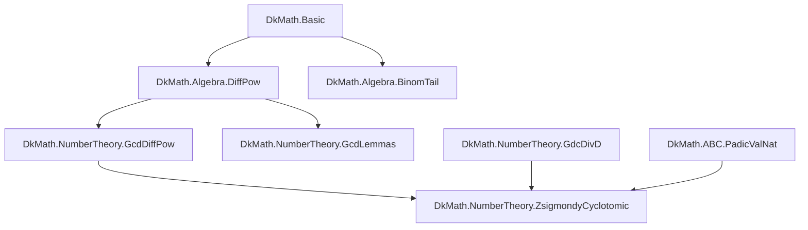
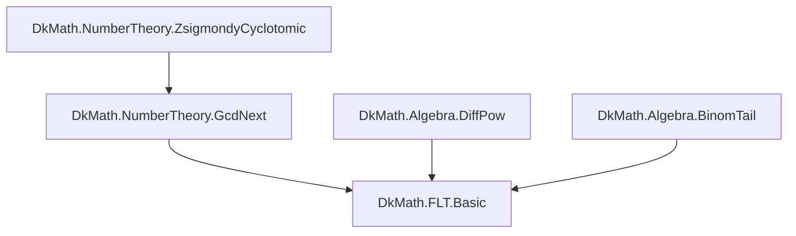
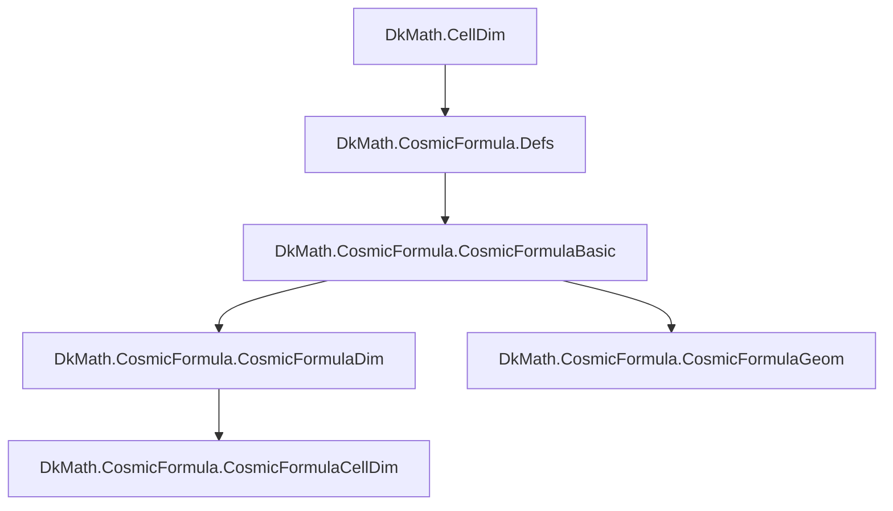
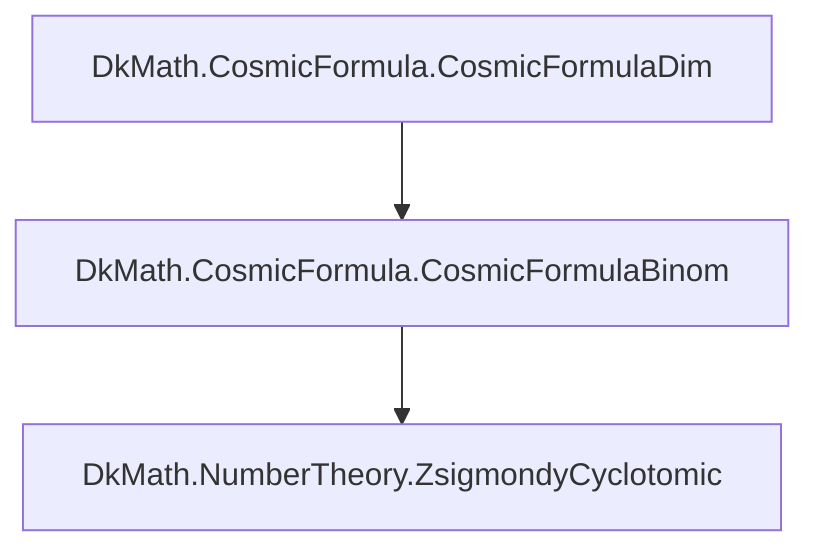
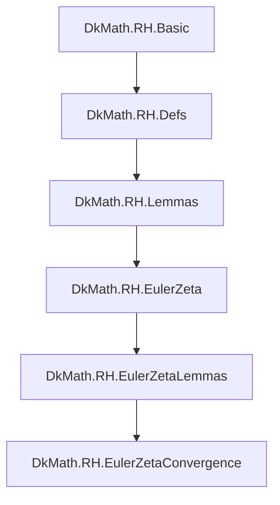

# dkmath (nightly) 構成マップ（目次・補題/定理インデックス案）

> 目的：リポジトリ全体を「何がどこにあるか」「どんな定理・補題が積み上がっているか」の観点で、**見出し/目次**として眺められる 1 枚 Markdown を作る。
>
> 注：nightly ブランチは `sorry` を含み得る（ビルドは通っている前提）。このドキュメントは \*\*現状の“地図”\*\*であり、証明完了度のラベル（✅/🚧/⚠️）は後で埋められるようにしてある。

---

## 1. トップレベル（リポジトリ直下）

（直下は Lean 以外も含む：ドキュメント、画像、LaTeX、Python、各種スクリプトなど）

- `README.md`
- `docs/` : 研究ノート/記事/解説（構造説明・結果ログ）
- `lean/` : Lean プロジェクト本体
- `python/` : 実験・可視化・数値検証
- `latex/` : 論文/図版
- `images/` : 図・出力
- `scripts/` : 補助スクリプト
- `text/` : テキストログ/メモ
- （他：設定ファイル、CI、ライセンスなど）

---

## 2. Lean パッケージの入口

### 2.1 `lean/README.md`

- Lean 側の概要・ビルド手順・方針

### 2.2 `lean/dk_math/`

- Mathlib 上に構築された `DkMath` ライブラリ。
- エントリポイント：`DkMath.lean`

---

## 3. `DkMath.lean`（import グラフの最上位）

`DkMath.lean` は、外部へ見せたいモジュールをまとめて import している「目次ファイル」。

### 3.1 コア

- `DkMath.Basic`
- `DkMath.Samples`

### 3.2 ABC まわり

- `DkMath.ABC.Basic`
- `DkMath.ABC.PadicValNat`
- `DkMath.ABC.CountPowersDividing2n1`

### 3.3 コラッツ

- `DkMath.Collatz.Collatz2K26`

### 3.4 宇宙式（Cosmic Formula）

- `DkMath.CosmicFormula`

### 3.5 ポリオミノ／トロミノ

- `DkMath.Polyomino`
- `DkMath.PolyominoPrototype`
- `DkMath.Tromino`

### 3.6 白銀比・表示の一意性

- `DkMath.SilverRatio`
- `DkMath.UniqueRepSimple`
- `DkMath.UniqueRepresentation`

### 3.7 DHNT（動的調和数論）

- `DkMath.DHNT`

### 3.8 RH（リーマン予想関連）

- `DkMath.RH`

### 3.9 単位巡回

- `DkMath.UnitCycle`

### 3.10 FLT（フェルマー最終定理関連）

- `DkMath.FLT`

---

## 3.11 理論依存グラフ（章立て再編）

ここからは「理論の流れ」で再構成する。

---

# I. FLT幹線（代数 → gcd → 原始素因子 → FLT）

## I-1. 構造の中核：差の冪と gcd 制御



- `DiffPow` が **指数構造の分解装置**。
- `GcdDiffPow` / `GcdLemmas` が **整除制御層**。
- `ZsigmondyCyclotomic` が **原始素因子エンジン**。

## I-2. 最終合流点：FLT



- `ZsigmondyCyclotomic` の完成度が FLT の進捗を決定する。
- 構造的には **ここが本丸**。

---

## I-3. Zsigmondy 中心・補題インデックス（FLT幹線コア）

ここでは `NumberTheory.ZsigmondyCyclotomic` を中心に、 **役割ごとに補題群を分解して管理する。**

### I-3-a. 基礎分解層（差の冪の構造）

主に `DiffPow` / `BinomTail` に依存。

- 型：`a^n - b^n = (a - b) * G(a,b,n)`
- 二項展開尾項：`u^2 ∣ ((u+y)^n - y^n - n*y^(n-1)*u)`

役割：

- 冪差を「線形因子 × 高次項」に分解する。
- 原始素因子が出現する“容器”を作る。

---

### I-3-b. gcd 制御層

主に `GcdDiffPow`, `GcdLemmas`, `GdcDivD`。

典型テーマ：

- `gcd(a^n - b^n, a - b)` の評価
- `gcd(a^m - b^m, a^n - b^n)` の制御
- `gcd(a^d - b^d, a - b) ∣ d` 型

役割：

- 「既知の素因子」と「新しい素因子」を分離する。
- 原始性（primitive）の定義を支える。

---

### I-3-c. 原始素因子層（Zsigmondy 本体）

モジュール：`NumberTheory.ZsigmondyCyclotomic`

目標形（概念レベル）：

- ある素数 p が a^n - b^n を割る
- かつ p は k < n のとき a^k - b^k を割らない

依存：

- 差の冪分解
- gcd 制御
- 円分多項式的構造（将来）

ここが：

- FLT の指数制限
- 高次冪の排除

を直接担う層。

`sorry` が集中しているのもここ。

---

### I-3-d. 橋渡し層（GcdNext → FLT.Basic）

モジュール：

- `NumberTheory.GcdNext`
- `FLT.Basic`

役割：

- 原始素因子の存在から
- 「n 乗は作れない」へ翻訳する。

ここでやること：

1. 反例仮定
2. 原始素因子抽出
3. 指数の矛盾導出

---

### I-3-e. 作業優先順位（戦略）

構造から見た優先順位：

1. `ZsigmondyCyclotomic` の原始素因子補題を完了
2. `GcdNext` の橋渡し補題を整理
3. `FLT.Basic` の最終矛盾導出を閉じる

→ 下層から順に固めるのが合理的。

---

# II. Cosmic幹線（幾何 → 次元 → 二項 → 数論接続）

## II-1. 幾何からの流入



- `CellDim` → `Defs` が宇宙式の幾何的入口。
- `Dim` / `Geom` / `CellDim` が宇宙式の主戦場。

## II-2. 数論側への橋



- CosmicFormulaBinom が NumberTheory 幹線へ接続する。
- 幾何と数論がここで融合する。

---

# III. RH柱（解析的構造の塔）



- Defs → Lemmas → EulerZeta → Convergence の縦構造。
- 解析塔は FLT 幹線とは独立した別宇宙。

---

# IV. 独立柱（SilverRatio / Collatz / UnitCycle / DHNT）

- SilverRatio / UniqueRepresentation は **代数的独立柱**。
- Collatz は **動的離散系の実験塔**。
- UnitCycle / DHNT は **宇宙式と接続可能な補助構造**。

---

## 3.12 ダッシュボード（規模と未完集中）

- 定義/補題/定理総数：**819**
- `sorry` 総数：**54**

### 未完集中

- `NumberTheory.ZsigmondyCyclotomic`（24）
- `FLT.Basic`（14）
- `FLT.PetalDetect`（3）
- `NumberTheory.GcdNext`（3）

→ 構造的に見ると、**Zsigmondy 幹線を塞ぐことが全体収束の鍵**。

---

## 4. モジュール別：中身の見出し（現状把握）

ここから下は「各モジュールが何を提供しているか」を見出し化する。

### 4.1 `DkMath.Basic`

- **用途**：全体の基本定義・ユーティリティ。
- **TODO（後で追記）**：公開 API（`def`/`lemma`/`theorem` の目玉）

### 4.2 `DkMath.Samples`

- **用途**：サンプル・実験的な定義／例。
- **TODO**：代表例の列挙

---

### 4.3 `DkMath.Algebra.DiffPow`

- **主題**：「差の冪」
  - 典型形：\(a^d - b^d\) を \((a-b)\) と和へ分解する。
- **ここに置くと便利なもの**（例）：
  - 因数分解コア（`a^d - b^d = (a-b) * G` 型）
  - `CommSemiring` / `CommRing` での一般形
- **TODO**：代表補題名の抜粋（grep で自動生成できる）

### 4.4 `DkMath.NumberTheory.*`

#### 4.4.1 `DkMath.NumberTheory.GcdDiffPow`

- **主題**：\(\gcd\) と \(a^n-b^n\) の相互作用、差の冪の gcd 制御。

#### 4.4.2 `DkMath.NumberTheory.GdcDivD`

- **主題**：`gcd(a^d-b^d, a-b)` の性質など、指数 \(d\) との関係（`... ∣ d` 型の補題）。

#### 4.4.3 `DkMath.NumberTheory.GcdNext`

- **主題**：`gcd`・`rad`・原始素因子（Zsigmondy 方向）へ向かう橋。
- **メモ**：この辺は Zsigmondy/Cyclotomic 連携の「足場」になりやすい。

---

### 4.5 ABC 系 (`DkMath.ABC.*`)

#### 4.5.1 `DkMath.ABC.Basic`

- **用途**：ABC 周りの基本語彙（`rad`、`padicVal`、補助定義など）。

#### 4.5.2 `DkMath.ABC.PadicValNat`

- **用途**：`padicValNat` の使い方・周辺補題を固める。

#### 4.5.3 `DkMath.ABC.CountPowersDividing2n1`

- **用途**：`2^n-1` に対する「何回割れるか」系の計数。
- **備考**：探索・実験・補題の収集が混ざりやすいので、後で整理候補。

---

### 4.6 Collatz (`DkMath.Collatz.Collatz2K26`)

- **用途**：コラッツ変換の特定パラメータ（`2K26`）に関する検証・補題。

---

### 4.7 Cosmic Formula (`DkMath.CosmicFormula`)

- **目的**：\(\text{Body} + \text{Gap} = \text{Big}\) 型の恒等式（宇宙式）を、 二項・多項・次元一般化・幾何（Cell/Polyomino）へ接続する。

#### 4.7.1 サブモジュール（現状：import レベルの目次）

- `DkMath.CosmicFormula.Defs`
- `DkMath.CosmicFormula.CosmicFormulaBasic`
- `DkMath.CosmicFormula.CosmicFormulaLinear`
- `DkMath.CosmicFormula.CosmicFormulaGeom`
- `DkMath.CosmicFormula.CosmicFormulaDim`
- `DkMath.CosmicFormula.CosmicFormulaBinom`
- `DkMath.CosmicFormula.CosmicFormulaExp`
- `DkMath.CosmicFormula.CosmicFormulaTrominoLink`

#### 4.7.2 README から拾える「定理カタログ（抜粋）」

（※ここは後で増やす。まず“見出し”として固定。）

- `cosmic_formula_dim_theorem`
- `cosmic_formula_cell_dim_intro`
- `cosmic_formula_cell_dim_theorem`
- `cosmic_formula_cell_dim_theorem'`
- `cosmic_formula_cell_dim_theorem''`
- `cosmic_formula_cell_dim_theorem'''`
- `cosmic_formula_cell_dim_theorem''''`

---

### 4.8 Polyomino / Tromino

#### 4.8.1 `DkMath.Polyomino`

- **用途**：ポリオミノ一般・タイル・格子集合などの基礎（設計の置き場）。

#### 4.8.2 `DkMath.PolyominoPrototype`

- **用途**：試作・設計実験（後で本体へ取り込み）。

#### 4.8.3 `DkMath.Tromino`

- **用途**：トロミノ（L 型）を中心にした構造。

---

### 4.9 Silver Ratio / Unique Representation

#### 4.9.1 `DkMath.SilverRatio`（入口）

- `DkMath.SilverRatio.Basic`
- `DkMath.SilverRatio.Sqrt2Lemmas`
- `DkMath.SilverRatio.SilverRatioUnit`
- `DkMath.SilverRatio.SilverRatioCircle`

#### 4.9.2 `DkMath.UniqueRepSimple`

- **主題**：\(\mathbb{Q}(\sqrt{2})\) における表示の一意性。
- **キー補題（実例）**
  - `sqrt2_lin_indep_over_rat'`
  - `unique_rep_in_Q_sqrt2`

#### 4.9.3 `DkMath.UniqueRepresentation`

- **用途**：上のファイル群をまとめた入口。

---

### 4.10 DHNT (`DkMath.DHNT`)

- import：
  - `DkMath.DHNT.DHNT_Base`
  - `DkMath.DHNT.UnitNatLayers`
- **TODO**：公開 API 抜粋（現状はこの doc からは未抽出）

---

### 4.11 RH (`DkMath.RH`)

#### 4.11.1 ファイル構成

- `DkMath.RH.Basic`（モジュール識別子・説明）
- `DkMath.RH.Defs`（縦線パス、トルク、位相速度、アンラップなどの定義）
- `DkMath.RH.Lemmas`（代数コアと同値変形）
- `DkMath.RH.Theorems`（積分による位相アンラップの微分可能性など）
- `DkMath.RH.EulerZeta`（Euler 積としての ζ の定義枠）
- `DkMath.RH.EulerZetaLemmas`（magnitude の同値性・下界補題など）
- `DkMath.RH.EulerZetaConvergence`（収束性の足場：σ>1 など）

#### 4.11.2 代表的な補題（抜粋：見出しとして固定）

- `denom_eq_normSq`
- `im_div_eq_torque_div_normSq`
- `driftFreeLocal_iff_im_div_eq_zero`
- `phaseVel_eq_torque_div_normSq`
- `driftFreeAt_iff_phaseVel_eq_zero`
- `phaseUnwrap_hasDerivAt`

EulerZeta 側（抜粋）

- `eulerZetaFactor`
- `eulerZeta`（無限積としての定義枠）
- `eulerZetaFactorMag_eq_sqrt`
- `norm_exp_sub_one_lower`
- `eulerZetaFactorMag_bound_sigma_gt_one`

---

### 4.12 UnitCycle (`DkMath.UnitCycle`)

- **用途**：単位の巡回・周期構造（設計の置き場）。
- **TODO**：公開 API 抜粋

---

### 4.13 FLT (`DkMath.FLT`)

- **目的**：FLT に絡む宇宙式的補題（差の冪・gcd 制御・原始素因子方向の足場）を集約。
- 入口：`DkMath.FLT`
- 実体：`DkMath.FLT.Basic`（など）

---

## 5. （提案）この目次を“自動生成”する方法

このドキュメントは手で整えられるようにしてあるが、定期的に更新するなら自動化が強い。

### 5.1 まずは最小：ripgrep で一覧

```bash
rg -n "^(theorem|lemma|def) " lean/dk_math/DkMath -S
```

- `theorem|lemma|def` の行だけ拾える。
- これをモジュール単位に整形して「見出し化」すると、かなり高品質な索引になる。

### 5.2 Python で Markdown 生成（雛形）

```python
# tools/make_index.py （例）
import re
from pathlib import Path

ROOT = Path("lean/dk_math/DkMath")
PAT = re.compile(r"^(theorem|lemma|def)\s+([A-Za-z0-9_']+)")

out = []
for p in sorted(ROOT.rglob("*.lean")):
    rel = p.relative_to(ROOT)
    names = []
    for line in p.read_text(encoding="utf-8", errors="ignore").splitlines():
        m = PAT.match(line.strip())
        if m:
            names.append((m.group(1), m.group(2)))
    if names:
        out.append(f"## {rel.as_posix()}\n")
        for k, n in names[:40]:
            out.append(f"- `{k} {n}`")
        if len(names) > 40:
            out.append(f"- … ({len(names)-40} more)")
        out.append("")

Path("docs/INDEX_AUTO.md").write_text("\n".join(out), encoding="utf-8")
print("wrote docs/INDEX_AUTO.md")
```

- まずは「名前だけ」の索引を吐く。
- 次に、docstring 先頭（`/-- ... -/`）も抽出して 1 行概要を付ければ“辞書”になる。

---

## 6. 次の編集ポイント（ここから先は手で整える場所）

- ✅/🚧/⚠️ の進捗ラベルを各モジュールに付ける（`sorry` 有無もここで管理）。
- 「宇宙式」「FLT」「ABC」「RH」を“論理の流れ”で再配置した 2nd 目次を作る。
- README と実ファイルのズレ（例：Polyomino の分割構成）をこの地図で検知できるようにする。

---

## 付録：メモ欄

- TODO：ここに “命名規則” と “ディレクトリ設計ルール” を追加（テンプレとして使うなら強い）。
