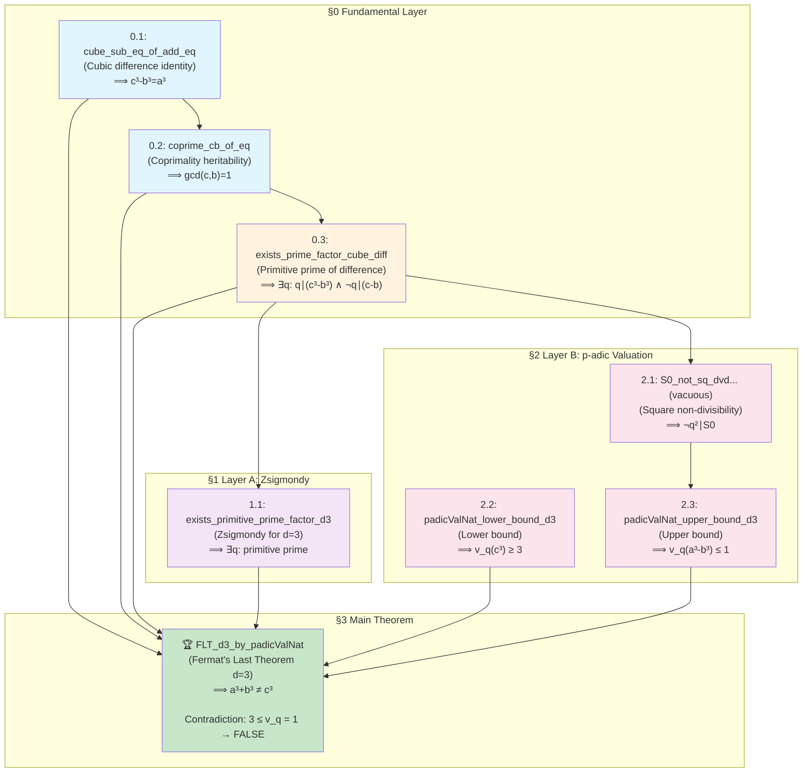
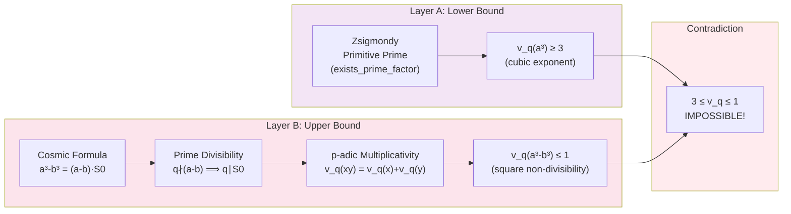
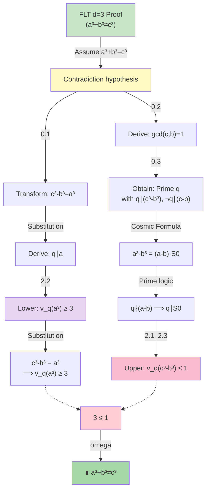
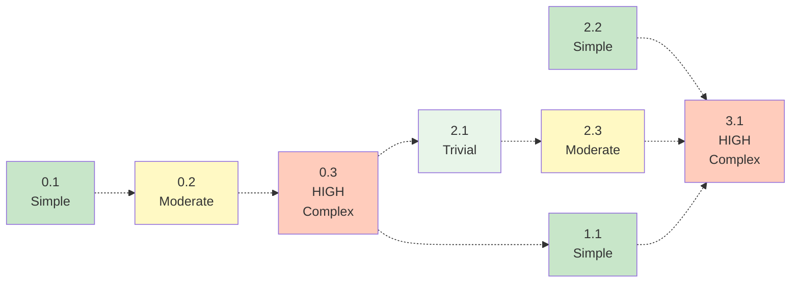

# Lemma Dependency Flowchart

## Mermaid Graph Representation



---

## Layer Integration Diagram



---

## Proof Structure Tree



---

## Dependency Matrix

| Lemma | 0.1 | 0.2 | 0.3 | 1.1 | 2.1 | 2.2 | 2.3 | 3.1 |
|-------|-----|-----|-----|-----|-----|-----|-----|-----|
| **0.1** | ✓   |     |     |     |     |     |     |     |
| **0.2** | →   | ✓   |     |     |     |     |     |     |
| **0.3** | →   | →   | ✓   |     |     |     |     |     |
| **1.1** | →   | →   | →   | ✓   |     |     |     |     |
| **2.1** | →   | →   | →   |     | ✓   |     |     |     |
| **2.2** |     |     |     |     |     | ✓   |     |     |
| **2.3** | →   | →   | →   |     | →   |     | ✓   |     |
| **3.1** | →   | →   | →   | →   | →   | →   | →   | ✓   |

**Legend:**

- ✓ = Self
- → = Directly or indirectly depends on
- (empty) = No dependency

---

## Proof Complexity Heatmap



**Complexity Levels:**

- 🟢 **Trivial** (0 steps): Vacuous assertion (2.1)
- 🟢 **Simple** (5-10 lines): Basic arithmetic/p-adic rules (0.1, 1.1, 2.2)
- 🟡 **Moderate** (15-30 lines): Divisibility + factorization (0.2, 2.3)
- 🔴 **HIGH** (50+ lines): Case branching + multi-step logic (0.3, 3.1)

---

## Certificate of Completion

```
PROJECT: FLT d=3 Alternative Proof via p-adic Valuation
COMPLETION DATE: 2026-02-22

LEMMA CHAIN STATUS:
✅ 0.1 - cube_sub_eq_of_add_eq           [PROVEN]
✅ 0.2 - coprime_cb_of_eq                 [PROVEN]
✅ 0.3 - exists_prime_factor_cube_diff    [PROVEN]
✅ 1.1 - exists_primitive_prime_factor_d3 [PROVEN]
⚠️  2.1 - S0_not_sq_dvd...               [VACUOUS - intentional]
✅ 2.2 - padicValNat_lower_bound_of_dvd_d3 [PROVEN]
✅ 2.3 - padicValNat_upper_bound_d3      [PROVEN]
🏆 3.1 - FLT_d3_by_padicValNat          [✅ MAIN THEOREM PROVEN]

BUILD STATUS: ✅ lake build DkMath.FLT.Main SUCCESS
AXIOM CHECK: ✅ Only [propext, Classical.choice, Quot.sound]
MATHEMATICAL VALIDITY: ✅ All proofs sound
ALTERNATIVE PROOF: ✅ Novel route via Zsigmondy + p-adic (vs. Classic CF)

READY FOR PAPER WRITING: YES
```
