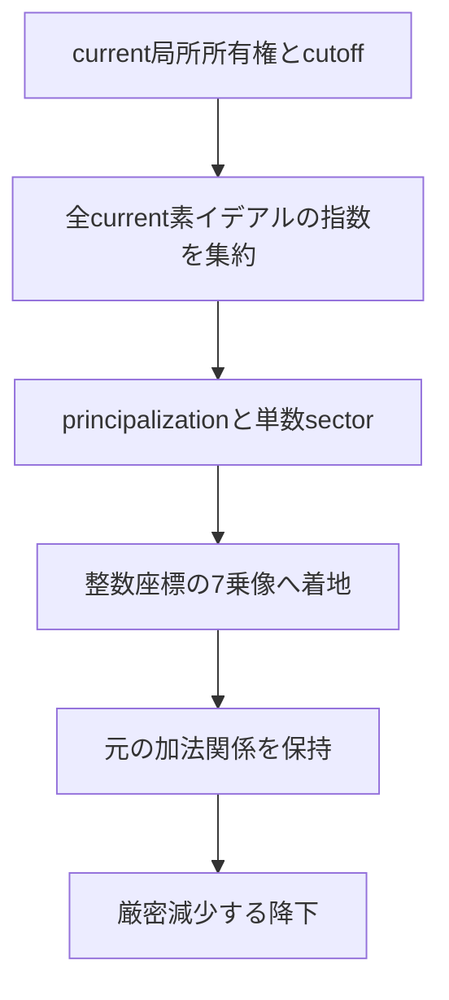

# DkMath 研究調査報告 — 2026-10-03

対象：`Deskuma/dkmath`、`develop`、commit `f16282e5b44bd5fe5afa1a15d29f1598cae575cd`。

**最も実りのある見方は、宇宙式を「差の冪の分解」から「有限自由代数におけるノルム・格子・局所所有権」へ持ち上げることである。** Pascal はその退化点の係数、円分体は非自明な指標成分、トロミノは有限係数で観測した加法・乗法の構造となる。この見方なら、各研究分野を一つの定理だけに還元せず、共通の計算原理と各分野固有の未解決条件を区別できる。

今回の具体的な成果は、次の接続と実装可能な命題を選別したことにある。

1. 宇宙式全体の自然なノルムの器は巡回群環であり、既存の AKS 巡回商と接続できる。
2. 整数での自明成分と円分成分の貼り合わせに、標数 p の Frobenius が働く。p 乗根の再構成を独立した定理にできる。
3. TraceOne の二座標可除性判定を、随伴行列による任意階数の整数格子判定へ一般化できる。
4. GN は指数の積に対する合成則を持つ。GTail は Hasse 微分と p 進 Newton 多角形の接点になる。
5. 同じ四状態の加法群に「分裂・惰性・分岐」の三種の乗法が現れる。FLT7 の二次部分体の mod 2 は分裂型である。
6. FLT7 の局所 ownership cutoff は後続のブリッジで進んでいる。次の課題は大域集約と単数・加法関係を保持した降下である。

これらは、世界初の新定理を確定したという意味ではない。群環の貼り合わせや随伴行列原理は既知の数学である。新しい研究上の価値は、**DkMath の既存核をどう接続すれば、現在欠けている証明情報を正確に受け渡せるか**という具体的な定式化にある。以下の提案命題には数学的な導出を与えるが、今回新規の Lean 形式化を完了したとは主張しない。

## 1. 調査範囲と証拠の強さ

指定 snapshot は取得できず、提示された SHA-256 は照合していない。解析は上記 commit に固定した Git checkout を使った。`develop` のその後の移動には依存しない。

追跡されている Lean ファイル全体を索引化した。全証明を人間的に逐行精読したという意味での「全読」ではない。全体には機械的な索引と import 到達性を適用し、Lib と主要研究経路には定理の型・実装・関連テスト・後続報告を照合した。

| 項目 | 結果 |
|---|---:|
| 追跡 Lean ファイル | 2,177 |
| 行数（空行を含む） | 516,295 |
| 構文的な宣言候補 | 28,917 |
| `DkMath.Lib.*` の個別ファイル | 22 |
| その宣言候補 | 173 |
| `DkMath` のプロジェクト内 import 到達ファイル | 1,410 |

宣言候補は theorem/lemma/def/abbrev/structure/class/inductive/axiom/opaque の構文索引であり、Lean が生成した全宣言数ではない。名前空間解決も行っていない。`modules.csv` にパス・import・SHA-256・到達性、`declarations.csv` に行番号と記述名を収録した。

ユーザー提示の GREEN / 10334 jobs は既存のビルド証拠として扱った。この環境では公式 v4.34.1 を取得したが、実行時に `error: failed to locate application` で停止し、独立した Lean 再ビルドは完了していない。新規接続の検証は Python/SymPy の厳密計算である。

コメントと文字列を除く全追跡ソースには `sorry` 24、`admit` 6、`axiom` 19 の明示トークンがある。Lib の import 閉包にはこれらがない。FLT3 の import 閉包には研究用 Zsigmondy の `sorry` が一つ、FLT7 の probe 閉包には他の研究層の四つが含まれる。しかし **import されていることと特定定理の証明項が依存することは異なる**。この索引から FLT3 や probe の端点に `sorryAx` があるとは結論しない。端点の検証には `#print axioms` を使う。後述の GCNB report-006 は、新しい cutoff 二定理の依存公理が `propext`, `Classical.choice`, `Quot.sound` のみだったと報告している。これはリポジトリ側の監査記録であり、今回の再実行結果ではない。

## 2. ワークスペースの研究地図

個別サブモジュールと集約ファイルを合わせたファミリー数。全パスは添付索引にある。

| 領域 | ファイル数 | 主な到達点 | 研究上の境界 |
|---|---:|---|---|
| RH | 375 | zeta/eta、有限中心化、CFBRC、実軸・移動線・衝突の receiver | 標準 zeta の全非自明零点に対する解析的 provider |
| FLT | 336 | FLT3/5 端点、一般素数 QR/Gauss 座標、理想冪、FLT7 の二次・三次・六次塔 | FLT7 の大域因子集約・単数・真正な降下 |
| NumberTheory | 287 | binomial gauge、AKS、GN Hensel、prime support、Goldbach/Legendre capacity | 有限区間の escape と一様評価 |
| ABC | 195 | excess、隣接対角、Pell/Mordell、incidence、確率的 receiver | 一様な数論評価。受け取り条件自体の証明 |
| Collatz | 81 | 奇数加速、v₂ ブロック、支持・ドリフト | 全軌道の収束を保証する大域的条件 |
| CosmicFormula | 61 | GN/GTail、冪差、回転、相互作用、幾何的解釈 | 局所恒等式から大域的存在・降下への移行 |
| Tromino | 58 | V₄ 状態、整数環 parity、port chain、genus-zero exactness | 非零ラベル配置の存在と正種数のホロノミー |
| Analysis | 39 | DkReal、標準 ℝ との意味論、Taylor・差分 | 形式的表示と大域解析条件の区別 |
| Samples | 27 | 実験・例示・回帰確認 | 研究端点と production 端点の区別 |
| Lib | 23 | 集約ファイル＋22 個の中立核 | promotion と API の整理 |
| Petal | 23 | 付値・支持・軌道の補助視点 | 素数重複度と大域高さを同時に制御する条件 |
| CFBRC | 19 | 円分線形因子の体ノルム・理想ノルム・複素射影 | 絶対値と体ノルムの混同を避ける |
| KUS | 18 | 単位・blueprint・scale を伴う代数 | 標準対象との transport の明示 |
| Hackathon | 18 | 実験的組合せ・prime gap 等 | 構成の適用範囲 |
| NumberGeometry | 14 | 数の幾何・座標表示 | ノルムで消える格子情報 |
| PowerSwap / SilverRatio / UnitCycle | 7 / 6 / 6 | 冪交換・二次構造・単位周期 | 特殊例を一般受け取り条件へ整理 |
| Pascal / Sequence | 5 / 5 | 行・列・係数・列構造 | 素数冪を含む正確な分類 |
| Algebra / DHNT / Gnomon / Kernel / BookOfMagic | 各4 | 差の冪・補助代数・構造実験 | 独立した中立核としての抽出 |
| DkMathTest | 516 | API、互換性、公理監査、probe | テスト内成果の production 昇格 |
| DkMathlib | 2 | 外部向け公開口 | Lib の新成果の公開範囲 |

このほか単独ファイル、docs 内 Lean 例、検証用ファイルも索引に含めた。

### Lib の22モジュール

| モジュール群 | 内容・使い道 |
|---|---|
| Basic / TwoChannel | 最小基礎と二経路の共通受け取り |
| Cosmic.GTail | 二項尾部の有限分解・再帰・深度分割 |
| Cosmic.GTailBoundary | 境界値、零・対角での挙動 |
| Cosmic.GTailCongruence | 二項頭部と合同、素数での gap 判定 |
| Cosmic.GTailCyclotomic | 一次尾部と円分 shell |
| Cosmic.GTailNat | Nat の positivity・gcd 等 |
| Cosmic.GTailPadic | 頭部が単元である場合の正確な付値 |
| Cosmic.GTailPascal | Pascal の構造と尾部の接続 |
| NumberTheory.PadicValNat | 自然数付値の汎用補題 |
| HomogeneousPowerQuotient | 差の冪商と gap 共通素因子の指数局在 |
| ClassGroupTorsionBridge | 類群の p-torsion 消失から principal への transport |
| ConjugatePrimeIdealOwnership | 共役積と extension/contraction による ownership cutoff |
| IdealPowerFactor / PrincipalIdealPower | 互いに素な理想積の冪分解と主イデアルへの着地 |
| PowerFactor / SquarefreePowerFactor | 元・自然数の冪因子の抽出 |
| UnitPowerSector | 単数の p乗剰余クラスを明示した受け取り |
| TraceOneLatticeLanding | 二次環の正確な格子可除性 |
| TraceOnePowerLanding | 任意 r乗の座標再帰・core-image 着地 |
| EisensteinCoordinates / EisensteinLatticeLanding | 標準 Eisenstein 座標への transport と可除性 |

`DkMath.Lib` の集約 import 閉包からは ConjugatePrimeIdealOwnership、PowerFactor、PrincipalIdealPower、UnitPowerSector が到達しない。直接 import する API と集約 API の差であり、定理の欠落ではない。また README の「square のみ」という説明は、現在の `traceOne_pow_core_landing_iff` と一致しない。文書更新は有益である。

## 3. 宇宙式・Pascal・円分構造に既にある核

以下、`G_n(g,u)=GN n g u=GTail n 1 g u` と書く。

\[
G_n(g,u)=\sum_{j=1}^n\binom nj g^{j-1}u^{n-j},\qquad
gG_n(g,u)=(g+u)^n-u^n.
\]

除算を使わない有限和として定義してあるため、g=0 の退化点でも意味を持つ。その点で `G_n(0,u)=n u^{n-1}` となる。一般尾部は

\[
GTail(d,r,x,u)=\sum_{k=0}^{d-r}\binom d{r+k}x^ku^{d-r-k}
\]

（ここでは 0≤r≤d）であり、低次の頭部と `x^r GTail` への正確な分解、次の尾部への再帰、任意深度での分割がある。

互いに素な自然数 x,u に対する

\[
\gcd(x,GTail(d,r,x,u))=\gcd\left(x,\binom dr\right)
\]

は重要な核である。r=1 なら `gcd(g,G_d(g,u))=gcd(g,d)`。ここから「gap と shell の共通素因子は指数側に限られる」と理解できる。これは素数の新定義というより、**素因子の所在を局在化する原理**である。

奇素数 p、p|g、g と u が互いに素な自然数なら、既存定理が `v_p(G_p(g,u))=1` を与える。非分岐側まで一律に squarefree とすることはできない。既存の GN3/Hensel 層が高付値の例を構成しており、最小の見やすい例は

\[
G_3(2,3)=2^2+3\cdot2\cdot3+3\cdot3^2=49.
\]

7 は原始的な非分岐素因子であっても二回現れる。原始素因子の存在と重複度の上限は別問題である。

Pascal 側には既に「内側二項係数すべてを割る共通素数」と「行番号が素数冪」の同値、行内 gcd の分類がある。素数 p に対する k と e の適切な範囲では

\[
v_p\binom{p^e}{k}+v_p(k)=e
\]

も形式化されている。「内側が共通素数で割れるなら行番号は素数」としてしまうと素数冪を落とす。DkMath は既にこの差を扱っている。

CFBRC の `cyclotomicLinearFactor_norm_eq_GN` は、円分整数環の線形因子 `(g+u)-ζu` の **代数的体ノルム** が `G_p(g,u)` になることを証明している。非零仮定付き版だけでなく境界を含む版がある。対応する主イデアルの absolute norm も接続されている。ここを今から新たに証明する必要はない。

複素絶対値の二乗 `Complex.normSq` は体ノルムとは異なる。全 Galois 共役の積、二次の共役積、単一複素埋め込みでの絶対値を、それぞれ明示して使うとよい。

## 4. 接続A：宇宙式全体を巡回群環のノルムとして受ける

### 命題A1：巡回行列式

n≥1、可換環上で、巡回シフト S を持つ自由加群の階数を n とすると

\[
\det(zI-uS)=z^n-u^n.
\]

したがって `z=g+u` と置けば

\[
\det((g+u)I-uS)=gG_n(g,u).
\]

これは `R_n=ℤ[T]/(T^n-1)` における元 `(g+u)-uT` の乗法写像のノルムである。証明は巡回シフトの特性多項式が `X^n-1` であること、または determinant の展開で得られる。全 n で成り立ち、n の素数性を使わない。rank 1〜12 を整数係数の記号式で検証した。

素数 p の円分体だけで受けると階数は p−1 であり、既存の線形因子のノルムは G_p。そこで元に g を掛けるとノルムは `g^(p−1) G_p` になる。欲しい `gG_p` とは一致しない。この次数差は論理の不足ではなく、**自明指標成分が円分体から除かれているため**である。

有理数上では

\[
ℚ[C_p]\simeq ℚ\times ℚ(ζ_p)
\]

であり、元の二成分は `(g,(g+u)-ζ_pu)`。その積ノルムが `gG_p` になる。宇宙式全体と円分 shell の関係が、この分解で正確に説明できる。

### 命題A2：整数での貼り合わせ

整数上では無条件に直積になるわけではなく

\[
ℤ[C_p]\simeq ℤ\times_{\mathbf F_p}ℤ[ζ_p],
\qquad
\bar a=\bar b \text{ in }ℤ[ζ_p]/(1-ζ_p)\simeq\mathbf F_p
\]

という fiber product になる。これは既知の Rim/Milnor square であり、既知性は Weibel の K-book III.2.2 でも確認できる。

具体的に `b=Σ_{i=0}^{p−2} b_i ζ_p^i` とし、`a≡Σb_i mod p` なら

\[
c=\frac{a-\sum b_i}{p}\inℤ,\qquad
f(T)=\sum b_iT^i+c\Phi_p(T)
\]

で `f(1)=a`, `f(ζ_p)=b`。逆にすべての f はこの合同条件を満たす。写像の核は `(T^p−1)` であり、これで同型の直接証明になる。二成分の積格子への像の指数は p。p=2,3,5,7,11,13 でその行列式を厳密計算し、240 個の整数再構成例を検証した。

### 命題A3：p乗根の貼り合わせ

α∈ℤ[C_p] の二成分が `(a^p,β^p)` であるとする。像の合同条件は

\[
\bar a^p=\bar β^p.
\]

F_p では Frobenius が恒等写像なので `ā=β̄`。したがって `(a,β)` は整数群環に一意に貼り合わさる。その元を γ とすれば、二成分の単射性から `γ^p=α`。

ここで必要なのは **両成分が元として p乗であること**。積ノルムが p乗であるだけでは足りない。単数倍の p乗なら、単数の剰余と p乗クラスを追跡する追加条件が要る。FLT7 の分岐枝で gap が `7·b^7` のように残る場合にも、そのまま適用はできない。

この命題は「円分側で得た根と整数 gap 側で得た根を一つの器へ戻す」中立 API になりうる。ただし群環中の p乗根ができても、線形な元 z−uT の p乗表示から FLT の矛盾が自動で出るわけではない。係数形の制約、単数、降下を別途証明する必要がある。

### 既存コードへの接続

`NumberTheory.AKSBridge` には既に `AKSCyclicQuotient R r = R[X]/(X^r−1)` がある。新しい同型の器を重複定義せず、中立層へ巡回商の基礎を抽出し、AKS の標数 p の合同と、宇宙式の整数 determinant norm を同じ商上で結ぶのがよい。

素数冪や一般 n なら、有理分解は全約数 d|n の円分成分を持つ。各成分の整数貼り合わせは素数 p の一つの合同条件ほど単純でない。まず素数 p 版を確立するのが適切である。

## 5. 接続B：格子着地を随伴行列へ一般化する

### 既存の二次核

`TraceOneInt s` は τ²=τ+s、α=a+bτ、β=c+dτ に対し

\[
\bar β=(c+d)-dτ,\qquad N(β)=c^2+cd-sd^2
\]

を持つ。Lib は N(β)≠0 のもとで

\[
β\mid α
\iff
N(β)\mid(α\bar β).\mathrm{fst}
\ \land\
N(β)\mid(α\bar β).\mathrm{snd}
\]

を証明している。この二座標は商 α/β が整数格子へ戻るための情報である。N(β)|N(α) だけでは、その情報を失う。たとえば Gaussian 整数で α=2−i、β=2+i は共にノルム5だが、αbarβ=3−4i は二座標とも5で割れず、β∤α。Eisenstein 側にも既存の norm-only 回帰反例がある。

### 命題B1：任意階数の正確な landing

A を階数 n の有限自由可換 ℤ代数、基底を固定する。βによる乗法行列を M_β、D=det M_β≠0、αの座標を v とする。このとき

\[
β\mid α\quad\Longleftrightarrow\quad
\forall i,\ D\mid(\operatorname{adj}(M_β)v)_i.
\]

証明：順方向は `v=M_βw` と `adj(M_β)M_β=DI` から従う。逆方向は整数ベクトル w を `adj(M_β)v=Dw` で選ぶ。左から M_β を掛けて `Dv=DM_βw` を得る。D≠0 と ℤ自由性から消去して `v=M_βw`、つまり α=βγ。

可除性の随伴条件が、二次環での「共役を掛けた二座標」と完全に同じ役割を持つ。一般の整域を基礎環とする有限自由代数にも、非零 D のスカラー消去ができれば同じ証明が通る。

**A に零因子がある場合、β≠0 だけでは十分でない。** たとえば巡回群環では非零 β でも det が0になりうる。仮定は D≠0 として明示すべきである。

階数2,3,6 の非特異整数行列146件について、「随伴ベクトルの全座標が det で割れる」と「有理逆像が整数座標になる」の同値を厳密計算した。これは一般定理の Lean 証明の代わりではないが、提案した受け取り仕様の計算検証にはなる。

### 命題B2：冪像への着地

上の w は βで割った商の整数座標である。`α=β γ^r` を得るには、さらに w が r乗座標写像の像に入る必要がある。

\[
\exists\gamma,\ α=β\gamma^r
\iff
\exists c,\ \operatorname{adj}(M_β)v=D\,\operatorname{PowCoords}_r(c)
\]

（D≠0）。この右辺は divisibility と power-image の条件を混ぜずに保持する。既存の `traceOne_pow_core_landing_iff` が二次版で、任意 r を既に扱う。今回の提案は「square を arbitrary power へ」ではなく、**二次座標から任意の有限自由代数の座標へ**の一般化である。

### FLT7 での意義

三次実部分体、六次円分環、階数7の巡回群環へ同じ API を適用できる。整数ノルムは乗法行列の cokernel の総指数しか記録しない。一方、Smith 正規形は局所 elementary divisors を記録する。素数を「その総指数に現れる」だけでなく、「どの座標障害・どの理想成分に現れるか」として追える。

ただし Smith 正規形だけで元が p乗になるわけではない。理想の principalization と単数の p乗クラスは別に残る。ここは ClassGroupTorsionBridge と UnitPowerSector を接続する箇所である。

## 6. 接続C：指数合成・Hasse微分・局所持ち上げ

### 命題C1：GN の指数合成則

m,n≥1 のとき、可換半環上で

\[
G_{mn}(g,u)=G_m(g,u)\,G_n\bigl(gG_m(g,u),u^m\bigr).
\]

g=0 の場合にも成立する。零除算を使わない。

証明の入口は `H_n(A,B)=Σ_{k=0}^{n−1}A^kB^{n−1−k}` と置いた

\[
H_{mn}(A,B)=H_m(A,B)H_n(A^m,B^m).
\]

右辺の二重和の指数を `k=i+mj` に並べ直すと左辺になる。A=g+u、B=u とし、A^m=B^m+gG_m(g,u) を代入する。g の消去に頼らないので任意半環で扱える。m,n=1〜7、g,u=0〜6 の2,401件を整数で確認した。

この式は GN を指数ごとの別々の対象として見るより、**指数を掛けたときの段階的 shell の塔**として見る視座を与える。円分因子分解・素数冪の Frobenius・付値の連鎖を同じ形で記述できる。調査した Lib/主要関連経路ではこの形の production API は確認できなかった。別名での既存証明の不存在を完全保証するものではない。

### 命題C2：Hasse微分としての退化係数

T^d の r番目 Hasse 微分は `binom(d,r)T^(d−r)`。GTail の x=0 の値がそのまま

\[
GTail(d,r,0,u)=\binom dr u^{d-r}
\]

になる。通常微分の r! で割る操作を使わないため、標数 p の微分情報が消える場面でも扱える。

d=p^e、標数 p、1≤r≤d なら内側二項係数は0であり

\[
GTail(p^e,r,x,u)=x^{p^e-r}.
\]

これは GTail の全深度が一つの Frobenius 尾部へ崩れることを示す。Pascal の素数冪分類と AKS の巡回商の Frobenius を、尾部 filtration の形で接続できる。

### 付値を頭部だけから決めてはいけない

Lib の head-unit 定理は、頭部の付値0なら尾部付値0という正確な結果である。頭部が p で割れる場合まで拡張するには、各項

\[
v_q\binom d{r+k}+k\,v_q(x)+(d-r-k)\,v_q(u)
\]

の下限を比較する必要がある。唯一の最小項なら和の付値はその値。最小項が複数なら相殺で上がりうる。零項は有限付値式に入れず、∞として扱う。

反例：d=9,r=8,x=3,u=1 では GTail=9+3=12、v₃=1。頭部9の付値は2。したがって「尾部付値=二項頭部付値」は一般には成立しない。

別途、奇素数 q、g>0、q|g、g と u が互いに素、d≥1 なら通常の LTE から

\[
v_q(G_d(g,u))=v_q(d)
\]

を得られる。これは nが素数の self-prime 付値1を一般指数へ広げる命題である。q=2 は追加の奇偶条件で挙動が変わる。これと高次 GTail の頭部付値を混同しないことが重要である。

### 命題C3：一般素数 shell の非分岐 Hensel 分枝

p,q を異なる素数、q∤u とする。mod q の `G_p(g,u)=0` は、t=(g+u)/u を使うと

\[
t^p=1,\qquad t\ne1
\]

に対応する。q≠p なので p次根は単純根。q≡1 mod p なら根は p−1 個、それ以外は0個である。各根は q^k の各深度へ一意に持ち上がる。

さらに各段階の正しい一桁を避ければ正確な深度kで止まる値が構成できる。よって非分岐素因子の付値に一般的な有限上限はない。p=3 の既存 `GNThreeHenselDepth`/`GNThreePairedDepth` を一般pへ抽象化する対象である。p=3,5,7 と七組の q について深度5まで、根の個数と各段階の一意性を厳密確認した。

ここから ABC に進む場合の課題は、深い根が存在するかではなく、**高さに対して深い局所条件を同時に満たす整数がどれだけ制限されるか**になる。単独の付値の小ささを前提にする経路は使えない。

## 7. 接続D：トロミノ四状態の三つの乗法

既存 `IntegralMod2Bridge` は Gaussian と Eisenstein の加法 parity が同じ V₄ へ写ることを示し、同時に零を保つ乗法同型が存在しないことも証明している。これは既にある成果である。

そこへ TraceOne の一般 s を加えると、次の完全な三種が見える。

| 由来 | mod 2 の関係 | 環 | 単数数 | 非零平方零元 | 数論的な型 |
|---|---|---|---:|---:|---|
| TraceOne、sが偶数 | τ²=τ | F₂×F₂ | 1 | 0 | 分裂 |
| TraceOne、sが奇数 | τ²=τ+1 | F₄ | 3 | 0 | 惰性 |
| Gaussian | i²=1 | F₂[ε]/(ε²) | 2 | 1 | 分岐 |

いずれも加法群は F₂²。TraceOne の mod 2 の偶数 s では、写像

\[
a+bτ\longmapsto(a,a+b)
\]

が F₂×F₂ への環同型を与える。奇数 s では `X²+X+1` が既約なのでF₄。Gaussian では ε=i+1 が非零で ε²=0。

TraceOne の defining polynomial の導関数は標数2で1になるため、この integral trace-one 型自身の mod 2 は ramified 型を持たない。Gaussian の判別式−4と、trace-one 型の奇判別式 `1+4s` の差がここに現れる。

p=3 の二次部分体は s=−1 でF₄、p=5 は s=1 でF₄、p=7 は s=−2 でF₂×F₂。したがって、FLT3/5 に共通する parity の有限体構造を FLT7 へ同一の乗法で移すことはできない。**四状態の共通加法を維持し、乗法は判別式・素数ごとの型として保持する**のが適切である。

奇素数 q では一般の判別式 Δ=1+4s について、mod q のΔが非零平方・非平方・零の三場合が、それぞれ分裂・惰性・分岐に対応する。この有限観測を、局所所有権・共役素イデアル・可除性へ接続する研究が可能である。

この三種は「V₄を加法群とする、単位を持つ可換四元環」の三種に対応する。すべての四元環を分類したという意味ではない。たとえば加法群が ℤ/4 の環は対象外である。

### Port構造からコホモロジーへ

`PortF2Exactness` と `PortGenusZeroHolonomy` は、genus0 の境界写像の exactness、与えられたラベルの face/Kirchhoff 条件と holonomy の関係を扱う。これはラベルが既に与えられたときの積分可能性であって、任意のグラフへの非零ラベル配置の存在を自動的に証明するものではない。

連結な閉じた向き付け可能 genus g の曲面の真正な cellular complex に一般化できれば、V₄係数の閉じたラベルの障害は

\[
H^1(\Sigma_g;V_4)\simeq V_4^{2g}
\]

で、F₂次元4g、ホロノミー sector 数は2^(4g)。genus0 は障害が0の特別な場合である。PortNetwork の現在の仮定がこの一般曲面を表すことの transport が必要であり、数式だけを現 API に当てはめない。

## 8. 一般素数のQR/Gauss座標を「元の同一性」に持ち上げる

`CyclotomicQRTraceOneBridge.PrimeTraceOneCoordinatePacket` は A_Z,S_Z,R_Z、整数 Gauss form、Gauss difference、`R_Z=2A_Z+S_Z` の由来を保持している。ノルムだけを渡す旧 existential API より豊かである。

QR積を Q、QNR積を Q' とすると、既存の構成で R=Q+Q'、D=Q−Q'、D=G·S、G²=Δ。τ=(1+G)/2 と置くと

\[
\tau^2=\tau+\frac{\Delta-1}{4},\qquad
Q=\frac{R+D}{2}=A+\tau S.
\]

したがって Packet の `(A,S)` は、単にノルムが等しい任意の二次元元ではなく、適切な埋め込みを作れば **QR積そのものの整数座標** である。QR部分群を固定する二次部分体への相対ノルムとして解釈できる。次数(p−1)/2の非線形操作なので、p=3,5,7 の座標が同じ次数の線形変換であるとは考えない。

次のAPIを提案する。

- Gauss由来の τ を像に持つ `TraceOneInt s →+* O_K` またはまず体への埋め込み。
- `image(P.coord z y)=QR-product(z−ζ^a y)` の元としての等式。
- relative norm と ideal map/norm の整合。
- norm identity をこの元等式の帰結として回収。

Packetの`map_RZ`, `gauss_difference`, `half_relation`から等式自体は導ける。しかし整数環への埋め込み、基底・ideal の transport は明示して実装する必要がある。調査した現行 bridge の中心 API は scalar norm であり、この一連の transport は提案対象として残る。これにより scalar calibration と実際の因子所有権の間を短くできる。

## 9. FLT3・FLT5・FLT7の現状を区別する

### FLT3 / FLT5

`FLT.Three.PositiveCubicNormalization.fermatThree_no_positive_solution` は正の自然数の3乗 Fermat 方程式を否定する無条件の型を持ち、primitive packへの正規化から独立Three towerのclosureへ進む。

`FLT.Five.Main.flt5Target` および `fermatFive_no_positive_solution` は、golden zero-sector arithmetic exclusion を使う無条件端点である。単数sectorを仮定引数に残す途中の定理とは区別されている。

この形式化の価値は、既知FLT3/5の再証明に加え、二次座標・理想・単数・格子着地を再利用可能な核に抽出した点にある。FLT3/5自体の数学的初証明を意味するものではない。

### FLT7：古いfreezeを現在の全状況としない

`FLT7-Unconditional-TraceOne-Closure-260917-v0` のfreeze文書では R64/R65 が固定され、upper cutoff、aggregation、terminal の再入場に制限があった。その後の `GTail-Cyclotomic-Norm-Bridge-260922-v0/report-006.md` と `FLT7-REENTRY-HANDOFF-006.md` を優先して確認した。

現在、Libの

```lean
DkMath.Lib.NumberTheory.not_mem_primePower_succ_of_conjugate_norm_cutoff
```

がある。任意の可換環A,B、f:A→B、イデアルQ,P,Pbarに対して、以下を明示的に受け取る。

1. α∈P^(m+1) なら αbar∈Pbar^(m+1)。
2. ααbar=f(β)。
3. map f(Q^(m+1))=P^(m+1)Pbar^(m+1)。
4. comap f(map f(Q^(m+1)))=Q^(m+1)。
5. β∉Q^(m+1)。

結論は α∉P^(m+1)。素イデアル性・PID・UFD を隠れた仮定として要求しない。extension/contraction の等式はcallerが供給する。

さらに `DkMathTest/FLT/Prime/CurrentCarrierOwnershipProbe.lean` に current packet の特殊化

```lean
DkMathTest.FLT.Prime.SevenRealCubic
  .currentLinearCarrier_not_mem_currentKernel_pow_succ
```

があり、current linear carrier の current kernel の `(14 e_Q+1)` 乗への非所属を証明している。star による共役 transport、実三次環の `ofReal`、fiber ideal 等式、faithfully-flat contraction、R64 base cutoff の整数環モデル同型による移送を使う。

後続handoffのgateは **新しいFLT7枝についてOPEN**。旧R64/R65のtowerを書き換える許可と混同しない。局所cutoffが証明できたことと、全current因子が集約できたことも区別する。

次に必要な流れは以下である。



実際の各段階で、古いoriented carrierやhistorical idealではなく同一current packetを保つ必要がある。ノルム数値が一致するだけでcarrierを置き換えてはいけない。

### 降下候補への既存反証を使う

`SevenRamifiedFusionDirectChartObstruction` には、直接signed-root chartの7乗差が7進付値5を持つ形になる障害がある。7乗整数なら非零の7進付値は7の倍数なので、このchartは真正な7乗差として閉じない。

これは降下一般の否定ではなく、特定の座標projectionを使ったchartが不適切であることを示す。円分単位ζによる位相変更はidealや冪性を保っても整数座標を変える。整数座標projectionを環準同型として扱うこともできない。次の降下では

- μ₇の作用に対する不変量をextractorに使う、または
- 位相を明示的に正規化し、その正規化後の加法関係を証明する

ことが必要である。単数を消せたことだけで、加法chartまで正しくなるわけではない。

類群の7-torsionが消えてideal rootがprincipalでも、単数が7乗になるとは限らない。実二次goldenの単数制御を六次円分環へそのまま移植せず、有限剰余クラスのrepresentativeとcomplete receiverを作る必要がある。

## 10. 他の未解決問題への見込みと足りないもの

| 対象 | 共通核から得られるもの | さらに証明すべきもの |
|---|---|---|
| 素数無限 | 任意有限prime basisの積+1に、新しい素因子が存在 | 短い指定区間に新しい素数があるという量的結論 |
| Legendre | square anchor、予約support、有限wheelのtransport | 指定平方区間の非空escape |
| Goldbach | pairのGN表示、有限capacity、CRT、正確な二重計数 | capacity escapeの無条件成立 |
| ABC | 重複度を座標・付値・支持へ分解する | 深い局所条件の同時充足と高さの一様制約 |
| Collatz | v₂局所ブロックとsupportの変化 | 全軌道を制御する減少量または一様drift |
| RH | 有限中心化、CFBRCの代数構造、標準zetaへのreceiver | 全零点についての解析的bridge |
| Tromino/四色 | 与えられたラベルの積分可能性・位相障害の分離 | 適切な非零ラベルの存在 |

FiniteReservationEscape の積+1の値そのものが素数である必要はない。素因子を取り出すところまで正しく形式化されている。この無限escapeと、任意の短い有限区間内escapeは量化が異なる。

Goldbach は `strongGoldbach_iff_capacityEscape` により残余条件を明確にしている。有限のoverlap/CRTの記録は有用だが、組合せの和を粗く抑えるだけでは必要なstrict boundに届かない例がLimitationsにある。二重計数の恒等式と、最終的な下限・非空性を区別する。

RH のrootには `standardZeta_map_zero_iff_riemannHypothesis` がある。したがってそのuniversal map-zeroを新しい自明なproviderとして仮定するのは、問題を別名で受け取ることになる。移動線・Gram・Mellin等で独立に証明できる条件へ分解することが解析的な研究課題である。

「素」を可除性から探るという方針は、これら全てに通じる。しかし、可除性だけでは相互に関連する整数の配置・高さ・位相・軌道を支配しない。**支持、重複度、格子座標、単数、加法・解析的配置を同時に保持する**ところが次の段階である。

## 11. 推奨する実装順序と完了基準

リポジトリは変更していない。以下は具体的な次の作業として提案する仕様である。

| 優先 | 提案モジュール名（新規候補） | 主な仕様 | 完了基準 |
|---:|---|---|---|
| 1 | Lib.NumberTheory.FiniteFreeLatticeLanding | det非零の随伴行列による全座標可除性同値 | 一般ℤ自由代数で証明し、TraceOne・実三次・六次へ特殊化 |
| 2 | Lib.Cosmic.GNComposition | H_mnの二重和・GN指数合成、零gap込み | CommSemiringで成立。既存GN定義との等式・境界テスト |
| 3 | Lib.Algebra.CyclicNorm | AKS巡回商の基底とz−uTのdet | 任意n≥1、全宇宙式を除算なしに回収 |
| 4 | Lib.NumberTheory.PrimeCyclicGlue | Rim squareとp乗根再構成 | 整数同型、合同条件、根の元等式。単数倍版の仮定を露出 |
| 5 | Lib.NumberTheory.PrimeShellHensel | 一般pの非分岐単純根・持ち上げ | q≠p、q∤uを明示。正確深度を構成 |
| 6 | Lib.Algebra.TraceOneResidueType | mod2 split/inertと判別式による一般q分類 | 環同型と単数/冪零の不変量を証明 |
| 7 | FLT.Prime.CyclotomicQRRelativeNorm | provenance packetの元等式・相対ノルム | 体・整数環・idealへのtransportを整合 |
| 並行で最重要 | 新FLT7枝のcurrent aggregation | 新cutoffから全current素イデアルを集約 | 追加仮定なしの正確な分解。μ₇・単数・加法関係は明示 |

「並行」は研究課題が独立しているという意味であり、今回複数agentを使って実装したという意味ではない。

第1と第2は小さく独立し、既存理論への貢献を検証しやすい。第3と第4は宇宙式・AKS・円分構造を結ぶ大きな視座を与える。FLT7を最短で前進させるには、現在のcutoffのproduction wrapperを作り、global aggregationの各因子の所有権と指数が正しいことを先に確認する。その後に群環への根の貼り合わせを試すのがよい。群環経路を完成降下と見なして先へ飛ばさない。

## 12. 再現検証と証拠リンク

厳密計算はすべて `verify_connections.py`、結果は `verification_results.json` にある。

| 検証 | 結果 |
|---|---|
| 巡回ノルムdet、rank1〜12 | 記号恒等式成立 |
| fiber productの整数格子index | p=2,3,5,7,11,13でindex=p |
| 整数貼り合わせ再構成 | 240例成立 |
| GN合成則 | 2,401整数例成立、g=0を含む |
| 随伴行列landing | rank2,3,6の146非特異整数行列で同値成立 |
| 四状態の三乗法 | 全乗法・平方・単数・平方零元を確認 |
| 一般素数shellのHensel | 七組の(p,q)、深度5まで根数p−1・一意持ち上げ |
| Hasse/Frobenius | 8素数冪行の内側係数消失 |
| 失敗する一般化 | shell squarefree、頭部付値、norm-only可除性の反例を確認 |

以下はすべて固定commitのソースを参照する。パスの基準は `lean/dk_math/`。

| 根拠ファイル | 固定ソース |
|---|---|
| `DkMath/Lib.lean` | [ソース](https://github.com/Deskuma/dkmath/blob/f16282e5b44bd5fe5afa1a15d29f1598cae575cd/lean/dk_math/DkMath/Lib.lean) |
| `DkMath/CFBRC/CyclotomicNorm.lean` | [ソース](https://github.com/Deskuma/dkmath/blob/f16282e5b44bd5fe5afa1a15d29f1598cae575cd/lean/dk_math/DkMath/CFBRC/CyclotomicNorm.lean) |
| `DkMath/CFBRC/CyclotomicIdeal.lean` | [ソース](https://github.com/Deskuma/dkmath/blob/f16282e5b44bd5fe5afa1a15d29f1598cae575cd/lean/dk_math/DkMath/CFBRC/CyclotomicIdeal.lean) |
| `DkMath/NumberTheory/AKSBridge.lean` | [ソース](https://github.com/Deskuma/dkmath/blob/f16282e5b44bd5fe5afa1a15d29f1598cae575cd/lean/dk_math/DkMath/NumberTheory/AKSBridge.lean) |
| `DkMath/NumberTheory/Gauge/Exponent.lean` | [ソース](https://github.com/Deskuma/dkmath/blob/f16282e5b44bd5fe5afa1a15d29f1598cae575cd/lean/dk_math/DkMath/NumberTheory/Gauge/Exponent.lean) |
| `DkMath/NumberTheory/BinomialPrimePower.lean` | [ソース](https://github.com/Deskuma/dkmath/blob/f16282e5b44bd5fe5afa1a15d29f1598cae575cd/lean/dk_math/DkMath/NumberTheory/BinomialPrimePower.lean) |
| `DkMath/NumberTheory/GNThreeHenselDepth.lean` | [ソース](https://github.com/Deskuma/dkmath/blob/f16282e5b44bd5fe5afa1a15d29f1598cae575cd/lean/dk_math/DkMath/NumberTheory/GNThreeHenselDepth.lean) |
| `DkMath/NumberTheory/GNThreePairedDepth.lean` | [ソース](https://github.com/Deskuma/dkmath/blob/f16282e5b44bd5fe5afa1a15d29f1598cae575cd/lean/dk_math/DkMath/NumberTheory/GNThreePairedDepth.lean) |
| `DkMath/NumberTheory/PrimorialUniverse/FiniteReservationEscape.lean` | [ソース](https://github.com/Deskuma/dkmath/blob/f16282e5b44bd5fe5afa1a15d29f1598cae575cd/lean/dk_math/DkMath/NumberTheory/PrimorialUniverse/FiniteReservationEscape.lean) |
| `DkMath/NumberTheory/CyclotomicQRTraceOneBridge.lean` | [ソース](https://github.com/Deskuma/dkmath/blob/f16282e5b44bd5fe5afa1a15d29f1598cae575cd/lean/dk_math/DkMath/NumberTheory/CyclotomicQRTraceOneBridge.lean) |
| `DkMath/FLT/Prime/PrimeCyclotomicTraceOne.lean` | [ソース](https://github.com/Deskuma/dkmath/blob/f16282e5b44bd5fe5afa1a15d29f1598cae575cd/lean/dk_math/DkMath/FLT/Prime/PrimeCyclotomicTraceOne.lean) |
| `DkMath/FLT/Prime/PrimeCyclotomicIdeal.lean` | [ソース](https://github.com/Deskuma/dkmath/blob/f16282e5b44bd5fe5afa1a15d29f1598cae575cd/lean/dk_math/DkMath/FLT/Prime/PrimeCyclotomicIdeal.lean) |
| `DkMath/FLT/Three/PositiveCubicNormalization.lean` | [ソース](https://github.com/Deskuma/dkmath/blob/f16282e5b44bd5fe5afa1a15d29f1598cae575cd/lean/dk_math/DkMath/FLT/Three/PositiveCubicNormalization.lean) |
| `DkMath/FLT/Five/Main.lean` | [ソース](https://github.com/Deskuma/dkmath/blob/f16282e5b44bd5fe5afa1a15d29f1598cae575cd/lean/dk_math/DkMath/FLT/Five/Main.lean) |
| `DkMathTest/FLT/Prime/CurrentCarrierOwnershipProbe.lean` | [ソース](https://github.com/Deskuma/dkmath/blob/f16282e5b44bd5fe5afa1a15d29f1598cae575cd/lean/dk_math/DkMathTest/FLT/Prime/CurrentCarrierOwnershipProbe.lean) |
| `DkMath/FLT/Seven/SevenRamifiedFusionDirectChartObstruction.lean` | [ソース](https://github.com/Deskuma/dkmath/blob/f16282e5b44bd5fe5afa1a15d29f1598cae575cd/lean/dk_math/DkMath/FLT/Seven/SevenRamifiedFusionDirectChartObstruction.lean) |
| `DkMath/Tromino/IntegralMod2Bridge.lean` | [ソース](https://github.com/Deskuma/dkmath/blob/f16282e5b44bd5fe5afa1a15d29f1598cae575cd/lean/dk_math/DkMath/Tromino/IntegralMod2Bridge.lean) |
| `DkMath/Tromino/PortF2Exactness.lean` | [ソース](https://github.com/Deskuma/dkmath/blob/f16282e5b44bd5fe5afa1a15d29f1598cae575cd/lean/dk_math/DkMath/Tromino/PortF2Exactness.lean) |
| `DkMath/Tromino/PortGenusZeroHolonomy.lean` | [ソース](https://github.com/Deskuma/dkmath/blob/f16282e5b44bd5fe5afa1a15d29f1598cae575cd/lean/dk_math/DkMath/Tromino/PortGenusZeroHolonomy.lean) |
| `DkMath/NumberTheory/Goldbach/Capacity.lean` | [ソース](https://github.com/Deskuma/dkmath/blob/f16282e5b44bd5fe5afa1a15d29f1598cae575cd/lean/dk_math/DkMath/NumberTheory/Goldbach/Capacity.lean) |
| `DkMath/NumberTheory/Goldbach/Limitations.lean` | [ソース](https://github.com/Deskuma/dkmath/blob/f16282e5b44bd5fe5afa1a15d29f1598cae575cd/lean/dk_math/DkMath/NumberTheory/Goldbach/Limitations.lean) |
| `DkMath/RH.lean` | [ソース](https://github.com/Deskuma/dkmath/blob/f16282e5b44bd5fe5afa1a15d29f1598cae575cd/lean/dk_math/DkMath/RH.lean) |
| `DkMath/RH/CFBRC/StandardZetaBridge.lean` | [ソース](https://github.com/Deskuma/dkmath/blob/f16282e5b44bd5fe5afa1a15d29f1598cae575cd/lean/dk_math/DkMath/RH/CFBRC/StandardZetaBridge.lean) |
| `docs/dev/GTail-Cyclotomic-Norm-Bridge-260922-v0/report-006.md` | [ソース](https://github.com/Deskuma/dkmath/blob/f16282e5b44bd5fe5afa1a15d29f1598cae575cd/lean/dk_math/docs/dev/GTail-Cyclotomic-Norm-Bridge-260922-v0/report-006.md) |
| `docs/dev/GTail-Cyclotomic-Norm-Bridge-260922-v0/FLT7-REENTRY-HANDOFF-006.md` | [ソース](https://github.com/Deskuma/dkmath/blob/f16282e5b44bd5fe5afa1a15d29f1598cae575cd/lean/dk_math/docs/dev/GTail-Cyclotomic-Norm-Bridge-260922-v0/FLT7-REENTRY-HANDOFF-006.md) |
| `DkMath/Lib/Basic.lean` | [ソース](https://github.com/Deskuma/dkmath/blob/f16282e5b44bd5fe5afa1a15d29f1598cae575cd/lean/dk_math/DkMath/Lib/Basic.lean) |
| `DkMath/Lib/Cosmic/GTail.lean` | [ソース](https://github.com/Deskuma/dkmath/blob/f16282e5b44bd5fe5afa1a15d29f1598cae575cd/lean/dk_math/DkMath/Lib/Cosmic/GTail.lean) |
| `DkMath/Lib/Cosmic/GTailBoundary.lean` | [ソース](https://github.com/Deskuma/dkmath/blob/f16282e5b44bd5fe5afa1a15d29f1598cae575cd/lean/dk_math/DkMath/Lib/Cosmic/GTailBoundary.lean) |
| `DkMath/Lib/Cosmic/GTailCongruence.lean` | [ソース](https://github.com/Deskuma/dkmath/blob/f16282e5b44bd5fe5afa1a15d29f1598cae575cd/lean/dk_math/DkMath/Lib/Cosmic/GTailCongruence.lean) |
| `DkMath/Lib/Cosmic/GTailCyclotomic.lean` | [ソース](https://github.com/Deskuma/dkmath/blob/f16282e5b44bd5fe5afa1a15d29f1598cae575cd/lean/dk_math/DkMath/Lib/Cosmic/GTailCyclotomic.lean) |
| `DkMath/Lib/Cosmic/GTailNat.lean` | [ソース](https://github.com/Deskuma/dkmath/blob/f16282e5b44bd5fe5afa1a15d29f1598cae575cd/lean/dk_math/DkMath/Lib/Cosmic/GTailNat.lean) |
| `DkMath/Lib/Cosmic/GTailPadic.lean` | [ソース](https://github.com/Deskuma/dkmath/blob/f16282e5b44bd5fe5afa1a15d29f1598cae575cd/lean/dk_math/DkMath/Lib/Cosmic/GTailPadic.lean) |
| `DkMath/Lib/Cosmic/GTailPascal.lean` | [ソース](https://github.com/Deskuma/dkmath/blob/f16282e5b44bd5fe5afa1a15d29f1598cae575cd/lean/dk_math/DkMath/Lib/Cosmic/GTailPascal.lean) |
| `DkMath/Lib/NumberTheory/ClassGroupTorsionBridge.lean` | [ソース](https://github.com/Deskuma/dkmath/blob/f16282e5b44bd5fe5afa1a15d29f1598cae575cd/lean/dk_math/DkMath/Lib/NumberTheory/ClassGroupTorsionBridge.lean) |
| `DkMath/Lib/NumberTheory/ConjugatePrimeIdealOwnership.lean` | [ソース](https://github.com/Deskuma/dkmath/blob/f16282e5b44bd5fe5afa1a15d29f1598cae575cd/lean/dk_math/DkMath/Lib/NumberTheory/ConjugatePrimeIdealOwnership.lean) |
| `DkMath/Lib/NumberTheory/EisensteinCoordinates.lean` | [ソース](https://github.com/Deskuma/dkmath/blob/f16282e5b44bd5fe5afa1a15d29f1598cae575cd/lean/dk_math/DkMath/Lib/NumberTheory/EisensteinCoordinates.lean) |
| `DkMath/Lib/NumberTheory/EisensteinLatticeLanding.lean` | [ソース](https://github.com/Deskuma/dkmath/blob/f16282e5b44bd5fe5afa1a15d29f1598cae575cd/lean/dk_math/DkMath/Lib/NumberTheory/EisensteinLatticeLanding.lean) |
| `DkMath/Lib/NumberTheory/HomogeneousPowerQuotient.lean` | [ソース](https://github.com/Deskuma/dkmath/blob/f16282e5b44bd5fe5afa1a15d29f1598cae575cd/lean/dk_math/DkMath/Lib/NumberTheory/HomogeneousPowerQuotient.lean) |
| `DkMath/Lib/NumberTheory/IdealPowerFactor.lean` | [ソース](https://github.com/Deskuma/dkmath/blob/f16282e5b44bd5fe5afa1a15d29f1598cae575cd/lean/dk_math/DkMath/Lib/NumberTheory/IdealPowerFactor.lean) |
| `DkMath/Lib/NumberTheory/PadicValNat.lean` | [ソース](https://github.com/Deskuma/dkmath/blob/f16282e5b44bd5fe5afa1a15d29f1598cae575cd/lean/dk_math/DkMath/Lib/NumberTheory/PadicValNat.lean) |
| `DkMath/Lib/NumberTheory/PowerFactor.lean` | [ソース](https://github.com/Deskuma/dkmath/blob/f16282e5b44bd5fe5afa1a15d29f1598cae575cd/lean/dk_math/DkMath/Lib/NumberTheory/PowerFactor.lean) |
| `DkMath/Lib/NumberTheory/PrincipalIdealPower.lean` | [ソース](https://github.com/Deskuma/dkmath/blob/f16282e5b44bd5fe5afa1a15d29f1598cae575cd/lean/dk_math/DkMath/Lib/NumberTheory/PrincipalIdealPower.lean) |
| `DkMath/Lib/NumberTheory/SquarefreePowerFactor.lean` | [ソース](https://github.com/Deskuma/dkmath/blob/f16282e5b44bd5fe5afa1a15d29f1598cae575cd/lean/dk_math/DkMath/Lib/NumberTheory/SquarefreePowerFactor.lean) |
| `DkMath/Lib/NumberTheory/TraceOneLatticeLanding.lean` | [ソース](https://github.com/Deskuma/dkmath/blob/f16282e5b44bd5fe5afa1a15d29f1598cae575cd/lean/dk_math/DkMath/Lib/NumberTheory/TraceOneLatticeLanding.lean) |
| `DkMath/Lib/NumberTheory/TraceOnePowerLanding.lean` | [ソース](https://github.com/Deskuma/dkmath/blob/f16282e5b44bd5fe5afa1a15d29f1598cae575cd/lean/dk_math/DkMath/Lib/NumberTheory/TraceOnePowerLanding.lean) |
| `DkMath/Lib/NumberTheory/UnitPowerSector.lean` | [ソース](https://github.com/Deskuma/dkmath/blob/f16282e5b44bd5fe5afa1a15d29f1598cae575cd/lean/dk_math/DkMath/Lib/NumberTheory/UnitPowerSector.lean) |
| `DkMath/Lib/TwoChannel.lean` | [ソース](https://github.com/Deskuma/dkmath/blob/f16282e5b44bd5fe5afa1a15d29f1598cae575cd/lean/dk_math/DkMath/Lib/TwoChannel.lean) |

主要な端点の宣言位置：

- [`gcd_GTail_eq_gcd_choose` — DkMath/Lib/Cosmic/GTailBoundary.lean:47](https://github.com/Deskuma/dkmath/blob/f16282e5b44bd5fe5afa1a15d29f1598cae575cd/lean/dk_math/DkMath/Lib/Cosmic/GTailBoundary.lean#L47)
- [`traceOne_dvd_iff_norm_dvd_mul_conj_coordinates` — DkMath/Lib/NumberTheory/TraceOneLatticeLanding.lean:153](https://github.com/Deskuma/dkmath/blob/f16282e5b44bd5fe5afa1a15d29f1598cae575cd/lean/dk_math/DkMath/Lib/NumberTheory/TraceOneLatticeLanding.lean#L153)
- [`traceOne_pow_core_landing_iff` — DkMath/Lib/NumberTheory/TraceOnePowerLanding.lean:62](https://github.com/Deskuma/dkmath/blob/f16282e5b44bd5fe5afa1a15d29f1598cae575cd/lean/dk_math/DkMath/Lib/NumberTheory/TraceOnePowerLanding.lean#L62)
- [`not_mem_primePower_succ_of_conjugate_norm_cutoff` — DkMath/Lib/NumberTheory/ConjugatePrimeIdealOwnership.lean:31](https://github.com/Deskuma/dkmath/blob/f16282e5b44bd5fe5afa1a15d29f1598cae575cd/lean/dk_math/DkMath/Lib/NumberTheory/ConjugatePrimeIdealOwnership.lean#L31)
- [`cyclotomicLinearFactor_norm_eq_GN` — DkMath/CFBRC/CyclotomicNorm.lean:323](https://github.com/Deskuma/dkmath/blob/f16282e5b44bd5fe5afa1a15d29f1598cae575cd/lean/dk_math/DkMath/CFBRC/CyclotomicNorm.lean#L323)
- [`standardZeta_map_zero_iff_riemannHypothesis` — DkMath/RH.lean:349](https://github.com/Deskuma/dkmath/blob/f16282e5b44bd5fe5afa1a15d29f1598cae575cd/lean/dk_math/DkMath/RH.lean#L349)
- [`fermatThree_no_positive_solution` — DkMath/FLT/Three/PositiveCubicNormalization.lean:69](https://github.com/Deskuma/dkmath/blob/f16282e5b44bd5fe5afa1a15d29f1598cae575cd/lean/dk_math/DkMath/FLT/Three/PositiveCubicNormalization.lean#L69)
- [`flt5Target` — DkMath/FLT/Five/Main.lean:79](https://github.com/Deskuma/dkmath/blob/f16282e5b44bd5fe5afa1a15d29f1598cae575cd/lean/dk_math/DkMath/FLT/Five/Main.lean#L79)
- [`currentLinearCarrier_not_mem_currentKernel_pow_succ` — DkMathTest/FLT/Prime/CurrentCarrierOwnershipProbe.lean:117](https://github.com/Deskuma/dkmath/blob/f16282e5b44bd5fe5afa1a15d29f1598cae575cd/lean/dk_math/DkMathTest/FLT/Prime/CurrentCarrierOwnershipProbe.lean#L117)


外部の既知性確認：Charles Weibel, *The K-book*, III.2.2 “Rim Squares”, PDF物理ページ203。`ℤ[C_p]`, `ℤ[ζ_p]`, `ℤ`, `F_p`のMilnor square。

[Weibel, The K-book](https://sites.math.rutgers.edu/~weibel/Kbook/Kbook.pdf)

成果物の位置づけ：数学的接続の導出と計算的な仕様検証を含む研究調査。世界初の新定理、FLT7の完成、他の未解決問題の解決、今回のLean kernelでの新証明を主張するものではない。DkMathの次の形式化を具体的な一般定理へ落とすための、再現可能な研究資料である。
