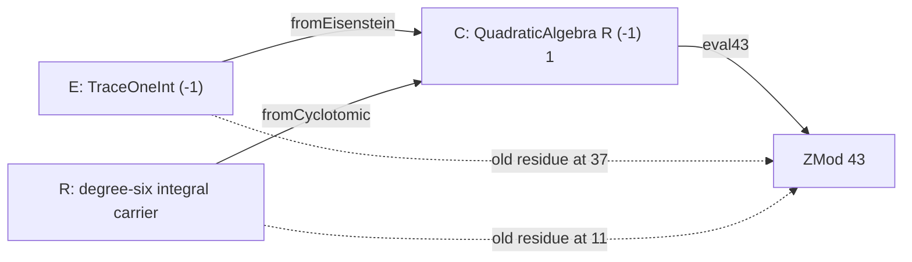

# Step034 — actual common quadratic receiver and kernel contractions

2026-10-11。**COMPLETE / Outcome B**。Step034 で停止。
Branch: `feature/GTail-SelectiveGap-FLT7-261009-v0`。
Base HEAD: `cb44d90a3efe0b35354cf42fbf312c457eeb629f`。

C = QuadraticAlgebra R (-1) 1 を構築し、実際の E→+*C と R→+*C がともに単射であると
証明した。q43 の共通評価 C→+*ZMod43 は既存の二つの residue RingHom と可換であり、
その kernel M43 は E へ収縮すると P37、R へ収縮すると seventhRootKernel11 に戻る。
R 側の slot 0 表示、共通評価の全射性、M43 の極大性・素性も検証した。

これは第三の環を介する型付きの接続である。Step033 の直接 E↔R RingHom の非存在は
維持される。元の Fermat 方程式の正確な収支や降下、拡大したイデアル・冪の等式、
signed packet は今回構成していない。



## 各段階で検証した構成

事前の型・API 比較は [source-inventory-034.md](source-inventory-034.md) に記載した。
Mathlib の二次代数は ω²=a+bω を満たす。今回の C の係数環は実際の R であり、
E の discriminant −3 に合わせて a=−1, b=1 を選んだ。
TraceOneResidueType.residueMap は有限体係数、traceOneRatHom と gaussEmbedding は別の
受け入れ先を使うため、今回の C への写像をそのまま供給する API ではなかった。

Gate1 では fromEisenstein x=⟨cast x.fst, cast x.snd⟩ の零・単位・加法・乗法の保存を
実ソースの演算則で証明した。τ↦ω、整数の像の一致、ω の二次関係も検証した。
R からの写像は algebraMap で、単射性は QuadraticAlgebra.algebraMap_injective による。
E からの写像の単射性は二つの係数を比較し、R の座標 z.re.fst で整数を取り出して証明した。
Gate1 の build02 が成功した後に、共通 residue 評価へ進んだ。

Gate2 では private な実際の residueR43 を係数に適用し、
eval43 x=evR x.re+37·evR x.im と定義した。
乗法の保存は re_mul / im_mul と 37²−37+1=0 から linear_combination で証明した。
QuadraticAlgebra.lift の API も確認したが、追加の R-algebra instance を導入せず、
直接の座標計算で RingHom を構成した。evR の単射性や、R 内の根の持ち上げは仮定しない。
build03 で可換三角形と生成元・整数の剰余が検証できた。

Gate3 では M43=ker eval43 を定義した。収縮の所属条件を合成写像の零条件に読み替え、
可換三角形を書き換えて Ideal E と Ideal R の等式を得た。
R 側の slot 0 は sixRootKernel / sixSlotRoot と pow_one で正規化する。
evR の全射性と R 側の三角形から eval43 の全射性を導き、素体への kernel が極大である
という既存 API を適用した。build04 でこの段階が成功した。

## 全公開23宣言の正確な署名

namespace DkMath.FLT.Seven.GTailCommonReceiver。
open TraceOneQuadratic / Lib.NumberTheory。q43 に固定した契約のelaborationではlocalFact prime43。
23宣言はCarrier の abbreviation 1件、RingHom の定義3件、Ideal の定義1件、定理18件。
各definitionの式・mulobligationsは上記phase説明と実sourceを参照。

```lean
abbrev Carrier := QuadraticAlgebra SevenCyclotomicDegreeSixInt.Ring (-1) 1
```

```lean
def fromCyclotomic : SevenCyclotomicDegreeSixInt.Ring →+* Carrier
```

```lean
def fromEisenstein : TraceOneInt (-1) →+* Carrier
```

```lean
theorem fromEisenstein_tau : fromEisenstein (tau (-1)) = (QuadraticAlgebra.omega : Carrier)
```

```lean
theorem fromEisenstein_intCast (n : ℤ) : fromEisenstein (n : TraceOneInt (-1)) = (n : Carrier)
```

```lean
theorem fromCyclotomic_zeta : fromCyclotomic SevenCyclotomicDegreeSixInt.zeta =
    algebraMap SevenCyclotomicDegreeSixInt.Ring Carrier SevenCyclotomicDegreeSixInt.zeta
```

```lean
theorem scalar_images_eq (n : ℤ) : fromEisenstein (n : TraceOneInt (-1)) =
    fromCyclotomic (n : SevenCyclotomicDegreeSixInt.Ring)
```

```lean
theorem omega_relation : (QuadraticAlgebra.omega : Carrier) ^ 2 - QuadraticAlgebra.omega + 1 = 0
```

```lean
theorem fromCyclotomic_injective : Function.Injective fromCyclotomic
```

```lean
theorem fromEisenstein_injective : Function.Injective fromEisenstein
```

```lean
def eval43 : Carrier →+* ZMod 43
```

```lean
theorem eval43_comp_cyclotomic : eval43.comp fromCyclotomic =
    evalCyclotomicFromSeventhRoot (11 : ZMod 43) (by decide) (by decide) (by decide)
```

```lean
theorem eval43_comp_eisenstein : eval43.comp fromEisenstein =
    eisensteinResidueRingHom (37 : ZMod 43) (by decide)
```

```lean
theorem eval43_zeta : eval43 (fromCyclotomic SevenCyclotomicDegreeSixInt.zeta) = 11
```

```lean
theorem eval43_tau : eval43 (fromEisenstein (tau (-1))) = 37
```

```lean
theorem eval43_scalar (n : ℤ) : eval43 (fromEisenstein (n : TraceOneInt (-1))) = (n : ZMod 43) ∧
    eval43 (fromCyclotomic (n : SevenCyclotomicDegreeSixInt.Ring)) = (n : ZMod 43)
```

```lean
def M43 : Ideal Carrier
```

```lean
theorem M43_comap_eisenstein : Ideal.comap fromEisenstein M43 =
    eisensteinResidueIdeal (37 : ZMod 43) (by decide)
```

```lean
theorem M43_comap_cyclotomic : Ideal.comap fromCyclotomic M43 =
    seventhRootKernel (11 : ZMod 43) (by decide) (by decide) (by decide)
```

```lean
theorem M43_comap_cyclotomic_slot_zero : Ideal.comap fromCyclotomic M43 =
    sixRootKernel (11 : ZMod 43) (by decide) (by decide) (by decide) 0
```

```lean
theorem eval43_surjective : Function.Surjective eval43
```

```lean
theorem M43_isMaximal : M43.IsMaximal
```

```lean
theorem M43_isPrime : M43.IsPrime
```

## 最終37examplesと実際のGTailwitness

| Checked contract | Lean result |
|---|---|
| 実ソース→C maps | 両方とも unital RingHom であり、単射 |
| generator/scalars | Eτ→ω；Rζ→algebraMapζ；すべての整数 n の像が一致 |
| quadraticlaw/mul/add | actualω²−ω+1=0；E の乗法と R の加法を保存 |
| eval43 の可換三角形 | eval43.comp iE=evE37、eval43.comp iR=evR11 |
| 生成元の剰余 | eval43(iEτ)=37、eval43(iRζ)=11 |
| 整数の剰余 | すべての整数の像が ZMod43 のキャストと一致 |
| contractions | M43 の E への収縮は P37；seventhRootKernel11/R 内の slot 0 |
| 剰余写像と kernel の性質 | eval43 は全射；M43 は極大かつ素 |
| 生成元の像 | iEτ≠iRζ 異なる剰余から証明 |
| α=gtailSevenNormCoord 1166 1857 | α∈P37；α²∈P37*P37、excludedP7/scalarE43 |
| F0=gtailCyclotomicFactor 1858 1165 0 | F0∈K0²、henceF0∈K0 |
| 写した実際の元 | eval43(iEα)=0、eval43(iRF0)=0、両方の像が M43 に属する |
| 追加の元の非等式 | iEα≠iRF0 C.im の射影と元の整数の剰余の非零性から証明 |
| 既存の直接写像非存在 | noE→R/noR→E signatures；q29 の二次多項式と q13 の Φ7 に根がない |
| Fermat 方程式の不成立 | ¬Fermat7Equation1166 1857 1858 |
| companion の型の区別 | cyclotomicSevenToTraceOne targetsTraceOneInt(-2)；discriminants−3/−7 |

αmembership・squareaddressとF0squaresupportは実際の既存の一般定理を呼び、root37/11と
inverseSlot0をtypednormalizationする。共通residuezerosはprovedtrianglesから得ており、
無関係なlargepolynomialnumericalevaluationへすり替えていない。
共通 kernel への所属はtypedcontractionsから得る。元の環の K²をCのイデアル冪の定理へ
transportしたとは主張しない。

追加inequalityは正の座標を明示する補題 gtailSevenNormCoord_eqを使う。
iEαのC.imはcast1857、iRF0のC.imは0。等しいと仮定するとactualevR43へのcastは
(1857:ZMod43)=0を強制するが、decideで非零と確認。**共通の剰余評価が零になることでも実際の像は違う。**
α²=F0やextendedidealsのequalityは一切主張していない。

## 実際の中間修正とbuild証拠

- 01: initialsourcegate失敗。nestedQuadraticAlgebra/R/realcubicの`ext`が深く展開し、
  one-coordinate projectionのnormalizationで未解決goalが残った。
  map_one/omega_relationを`apply QuadraticAlgebra.ext`で二つの座標に限定し、re_one/im_oneを明示。
- 02: gate1成功、ただし既にsimpが解いたgoalへのringがunused/unreachableでwarning4。
  冗長なringを削除し、大域的なオプションは変更していない。
- 03: phase2成功、warning0。04: phase3成功、warning0。05: 初期36件の example成功。
- 06: 追加inequalitytest失敗。changeで第二座標をcast(-1857)と誤って置いた。
  actualgtailSevenNormCoord_eqは⟨a,b⟩を与えるので、explicitnormalizationとcast1857に修正。
  他のmaps/contractsの数学的仮定は変更していない。
- 07: 最終37件の example と全公開宣言の公理成功、warning0。
- 08/09: Step033/Step032範囲を限定した回帰テスト成功、warning0。

全 Lake 実行はlean/dk_mathにて逐次、process-local LEAN_NUM_THREADS=2。
logs/runs.jsonは`.lake/build/gtail-step034/`。

| Log | Exact command | Exit | Seconds |
|---|---|---:|---:|
| 01-build.log | `LEAN_NUM_THREADS=2 lake build DkMath.FLT.Seven.GTailEisensteinCyclotomicCommonReceiver` | 1 | 18.0 |
| 02-build.log | `LEAN_NUM_THREADS=2 lake build DkMath.FLT.Seven.GTailEisensteinCyclotomicCommonReceiver` | 0 | 16.61 |
| 03-build.log | `LEAN_NUM_THREADS=2 lake build DkMath.FLT.Seven.GTailEisensteinCyclotomicCommonReceiver` | 0 | 17.94 |
| 04-build.log | `LEAN_NUM_THREADS=2 lake build DkMath.FLT.Seven.GTailEisensteinCyclotomicCommonReceiver` | 0 | 22.15 |
| 05-build.log | `LEAN_NUM_THREADS=2 lake build DkMathTest.FLT.Seven.GTailEisensteinCyclotomicCommonReceiver` | 0 | 19.56 |
| 06-build.log | `LEAN_NUM_THREADS=2 lake build DkMathTest.FLT.Seven.GTailEisensteinCyclotomicCommonReceiver` | 1 | 17.78 |
| 07-build.log | `LEAN_NUM_THREADS=2 lake build DkMathTest.FLT.Seven.GTailEisensteinCyclotomicCommonReceiver` | 0 | 21.65 |
| 08-build.log | `LEAN_NUM_THREADS=2 lake build DkMathTest.FLT.Seven.GTailEisensteinCyclotomicNoDirectHom` | 0 | 9.03 |
| 09-build.log | `LEAN_NUM_THREADS=2 lake build DkMathTest.FLT.Seven.GTailGlobalBalanceFirewall` | 0 | 8.68 |

最終production04/test07と指定の回帰テスト08/09はexit0、warning0。
LakeReplayedを含むfocusedbuildsであり、全体の clean ビルドとは記載しない。
Step033regressionのq29/q13obstructionsとStep032の38localcompatibilityexamplesを保持。

## 実際の全公開宣言の公理とsource/import/style監査

07-build.logの全23public `#print axioms`出力：

```text
'DkMath.FLT.Seven.GTailCommonReceiver.Carrier' does not depend on any axioms
'DkMath.FLT.Seven.GTailCommonReceiver.fromCyclotomic' depends on axioms: [propext, Quot.sound]
'DkMath.FLT.Seven.GTailCommonReceiver.fromEisenstein' depends on axioms: [propext, Quot.sound]
'DkMath.FLT.Seven.GTailCommonReceiver.fromEisenstein_tau' depends on axioms: [propext, Quot.sound]
'DkMath.FLT.Seven.GTailCommonReceiver.fromEisenstein_intCast' depends on axioms: [propext, Quot.sound]
'DkMath.FLT.Seven.GTailCommonReceiver.fromCyclotomic_zeta' depends on axioms: [propext, Quot.sound]
'DkMath.FLT.Seven.GTailCommonReceiver.scalar_images_eq' depends on axioms: [propext, Quot.sound]
'DkMath.FLT.Seven.GTailCommonReceiver.omega_relation' depends on axioms: [propext, Quot.sound]
'DkMath.FLT.Seven.GTailCommonReceiver.fromCyclotomic_injective' depends on axioms: [propext, Quot.sound]
'DkMath.FLT.Seven.GTailCommonReceiver.fromEisenstein_injective' depends on axioms: [propext, Quot.sound]
'DkMath.FLT.Seven.GTailCommonReceiver.eval43' depends on axioms: [propext, Classical.choice, Quot.sound]
'DkMath.FLT.Seven.GTailCommonReceiver.eval43_comp_cyclotomic' depends on axioms: [propext, Classical.choice, Quot.sound]
'DkMath.FLT.Seven.GTailCommonReceiver.eval43_comp_eisenstein' depends on axioms: [propext, Classical.choice, Quot.sound]
'DkMath.FLT.Seven.GTailCommonReceiver.eval43_zeta' depends on axioms: [propext, Classical.choice, Quot.sound]
'DkMath.FLT.Seven.GTailCommonReceiver.eval43_tau' depends on axioms: [propext, Classical.choice, Quot.sound]
'DkMath.FLT.Seven.GTailCommonReceiver.eval43_scalar' depends on axioms: [propext, Classical.choice, Quot.sound]
'DkMath.FLT.Seven.GTailCommonReceiver.M43' depends on axioms: [propext, Classical.choice, Quot.sound]
'DkMath.FLT.Seven.GTailCommonReceiver.M43_comap_eisenstein' depends on axioms: [propext, Classical.choice, Quot.sound]
'DkMath.FLT.Seven.GTailCommonReceiver.M43_comap_cyclotomic' depends on axioms: [propext, Classical.choice, Quot.sound]
'DkMath.FLT.Seven.GTailCommonReceiver.M43_comap_cyclotomic_slot_zero' depends on axioms: [propext,
 Classical.choice,
 Quot.sound]
'DkMath.FLT.Seven.GTailCommonReceiver.eval43_surjective' depends on axioms: [propext, Classical.choice, Quot.sound]
'DkMath.FLT.Seven.GTailCommonReceiver.M43_isMaximal' depends on axioms: [propext, Classical.choice, Quot.sound]
'DkMath.FLT.Seven.GTailCommonReceiver.M43_isPrime' depends on axioms: [propext, Classical.choice, Quot.sound]
```

Carrierはaxiom依存なし、他もpropext/Classical.choice/Quot.soundの範囲内。新axiomなし。
#check QAalgebraMap_injective/re_mul/im_mul/lift、Ideal.mem_comap/ext、RingHom.mem_kerも実行。
source/testのcomment/stringを除外したforbiddenscanで
sorry/admit/axiom/unsafe/native_decide/set_option/explicit False.elimは0。
MIT2026 D. and Wise Wolf header、import後file-print、既存indentation/ソースの lintを確認。

新 production の直接 importはStep033一つ、新 testはnewproduction一つ。
必要なQuadraticAlgebraAPIは既存closure内で追加の Mathlib import不要。
source の依存範囲8949/local169、test8950/local170、local の和集合170cycle0。
Step033比newowner1のみ、Mathlib追加0、削除0。
neutralRealTraceroot1907/local20からFLT到達0。全27到達可能な Lib ownersからFLT到達0。
FLT.Sevenfacade、degree-sixdomain、global oriented factorization、oriented valuation owner、
Kummer principalization、CyclotomicQRTraceOneBridgeはnewsource/testclosureにない。
既存 carrier 由来の広い依存範囲は維持されるが、proofは実際の座標/residue/kerAPIのみ。
既存 closure / signed packetを新しくimport/inhabit/editしない。

新5filesとROADMAPappendのtabs/trailingwhitespace/最終改行検査成功。
ROADMAPHEADbyteprefixを保持し、旧3行目のMarkdownhard-break末尾2空白を維持。
git diff --check成功、tracked変更はROADMAPappendのみ。
以前のE/Rdefinitions、oldproviders/owners、neutralLib、facades、reports/reviews/ledger/statusは不変。
監査証拠はimports.json/import-impact.json/audit.json。

## Lean 結果からの気づき・試した命題・今後の提案

1. 直接の RingHom がない二つの環でも、第三の二次代数へは単射で写せた。
   R 上に新しい生成元 ω を追加したことが、Step033 の非存在証明と両立する理由である。
2. 同じ素 kernel を収縮して、元の二つの local address を別々の型で回収できた。
   E のイデアルと R のイデアルの型を維持したまま、共通の受け入れ先を扱う API になっている。
3. 追加の非等式 example では、共通 kernel に入る α と F0 の像が C 内で異なると証明できた。
   共通の零剰余から元の一致を推定できないことを、実際の数値例で確認した。
4. 整数の単射性は入れ子の座標の一つを取り出すだけで証明できた。
   IsDomain、field、Dedekind、DVR などの追加仮定は必要なかった。
5. 単射性、slot 0、全射性、極大性・素性の任意項目はすべて検証できた。
   一般の q 向けの評価構成は今回は追加しない。今後再利用するなら、同じ ZMod q に
   二つの根が供給される場合だけを入力にする契約を保つ必要がある。
6. 次の代数的な提案では、proper なイデアルの拡大・収縮と冪に必要な条件、
   ソースに結び付いた非循環の共通等式、signed carrier や provider の各 field に何を
   供給するのかを先に明示するとよい。C の domain / field / compositum / rank12 basis /
   flatness / tensor isomorphism / valuation theory は未検証である。
   [frontier-034.md](frontier-034.md) に検証済み契約と残る境界を整理した。

STOP034。Outcome B は二つの実際の単射、q43 の共通評価、素 kernel の型付き収縮の完成を意味する。
正確な FLT 収支、拡大したイデアル・冪の等式、新しい primitive packet、class / unit の
持ち上げ、signed packet、away descent、FLT7 矛盾は供給していない。
