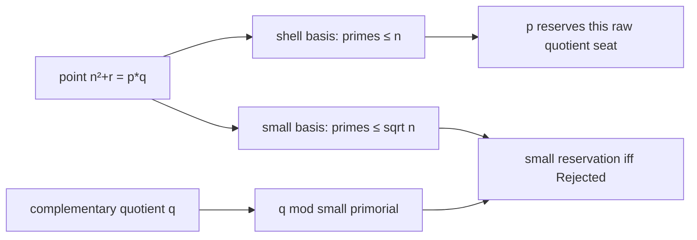

# Instruction 016 — square-anchor 反例 packet と residue-owner 遷移

指定文書を実装仕様として既存の定義を監査し、production 4 モジュールを追加して Legendre facade に公開した。全被覆、residue union、wheel image、sqrt-rough census、補正付き quotient conservation を同じ仮説へ接続した。投影の完全な単射性分類、初等的な primorial 周期下界、最小 owner の局所遷移制約まで Lean で証明した。uniform な全被覆の排除は得ていない。

新規 production 宣言は **61**、新規 regression/calibration 宣言は **26**。[宣言一覧](logs/declaration-coverage-016.json)の全 87 件を `#check` / `#print axioms` の対象とした。実行結果と検査範囲は[検証記録](validation-016.md)、既存 API の正確な名前は[ソース監査](source-inventory-016.md)、段階ごとの記録は[findings](findings-016.md)に分けた。

以下では `S_n=primeScalesUpTo n`、`M_n=finitePrimeBasisProduct S_n`、`G_n=oddGnomon n` とする。既存の `G_n=2n+1`、開 shell の席数 `2n`、次の gnomon `2n+3` を保持した。`open_shell_card_add_one_eq_oddGnomon` と `three_consecutive_odd_gnomons` が境界席との区別を明示する。

## 1. 全被覆を記述する exact residue-class cover

`squareResidueCoverFiber n q` は既存の `squareOffsets n` の filter：

```text
CoverFiber(n,q) = { r in squareOffsets n | r mod q = (q - n² mod q) mod q }.
```

`mem_squareResidueCoverFiber` は `q>0` のもとで membership と `SquareOffset n r ∧ q∣n²+r` の同値を、既存の modular arithmetic 辞書から証明する。

`coveredSquareOffsets_eq_residue_union` と `fullyCovered_iff_residue_union` により、全 n について

```text
coveredSquareOffsets n = S_n.biUnion (squareResidueCoverFiber n)
SquareOffsetsFullyCovered n ↔ squareOffsets n = S_n.biUnion (squareResidueCoverFiber n).
```

`fullyCovered_iff_pointwise_forbidden_residue` が各 offset に covering prime と禁止剰余の一致を与える。

## 2. whole shell の primorial wheel 表現

`squareShellWheelImage n` は `r∈squareOffsets n` に対する `(n²+r) mod M_n` の有限 image。既存 `squareShellWheelProjection_eq_anchor_add` により各座標は `(a_n+r) mod M_n`、`a_n=n² mod M_n` である。

`fullyCovered_iff_wheel_image_reserved` は全 n に対して全被覆と image の全点 reservation を同値にする。`not_fullyCovered_iff_wheel_image_survivor` は `n≥2` に対して非全被覆と image 中の survivor の存在を同値にする。

`squareShellWheelSurvivorImage` は image の survivor filter。`squareShell_survivor_filter_eq_image_escaping` は escaping seats の image と一致することを証明し、投影の多重度を保存する。`squareShell_survivor_card_eq_uncovered` により `n≥5` ではその card は U に等しい。

`n=1` は明示的な carrier 境界である。旧素数 basis は空、M=1、whole-shell escaping card は 2、parity-safe U は 1、projected survivor は 0。したがって「projected survivor がない ⇒ 全被覆」を n=1 へ拡張してはいけない。

## 3. 単射性と小さい例外

`squareShellWheelProjection_eq_iff_modEq`：投影の一致は `r≡s [MOD M_n]` と同値。

`squareShellWheelProjection_injOn_iff`：

```text
InjOn projection (squareOffsets n) ↔ 2*n ≤ M_n.
```

等号は安全である。完全分類 `squareShellWheelProjection_injOn_classification` は **n=0、n=3、または n≥5**。n=0 は空 carrier。非単射なのは n=1,2,4 のみ。

|n|M_n|width|collision / result|
|---|---:|---:|---|
|1|1|2|offset 1 と 2 はともに 0|
|2|2|4|offset 1 と 3 はともに 1|
|3|6|6|等号でも単射|
|4|6|8|offset 1 と 7 はともに 5|
|5|30|10|以後は全 n で単射|
|6|30|12|composite threshold、basis と周期は据え置き|
|7|210|14|prime threshold、basis と周期が拡大|

`squareShell_period_exceeds_width` は全 `n≥5` について **`2*n+4<M_n`** を証明した。証明は M=2K とおき、K が奇数かつ K≥15 であることを示す。奇数 K−2 を割る旧素数は、K も割るなら 2 を割ってしまうため存在しない。もし K−2≤n ならその minFac が旧 basis に入って矛盾する。従って n<K−2。Bertrand や解析的評価を使っていない。この新しい周期下界だけでは、特定の square-anchor run の survivor は導けない。

## 4. 仮想反例の必要条件 packet

`squareAnchor_counterexample_packet (hn : 0<n) (hfull : SquareOffsetsFullyCovered n)` は同時に次を供給する。R は既存 sqrt-rough carrier の card、C/X/D/T は Cube/Cross/Repeated/Triple の key card、J は全 rough owner の Rejected card の和、Q は raw quotient card の和。

1. 全 shell seat の old-prime support が nonempty。
2. whole-shell wheel image に survivor がない。
3. `paritySafeUncoveredCandidates n = ∅`。
4. `roughZeroSeats n` の card は 0。
5. `R=C+X+D+T`。
6. `Q=X+C+2D+3T+J`。
7. `Q=R+D+2T+J`。

全て Nat の加法等式であり、反例の存在を仮定する宣言や、不明な分布評価は追加していない。whole-shell owner partition と R の carrier は異なる。全 covered seat には 2 や anchor の素因子による被覆もあるが、R は reduced かつ sqrt-rough な部分 carrier である。

## 5. 同値と単なる帰結の区別

全 n で「全 seat の support が nonempty」は全被覆と同値 (`fullyCovered_iff_all_support_nonempty`)。`n≥2` では以下も全被覆と同値として証明した。

- U が空 (`fullyCovered_iff_uncovered_empty`)。
- sqrt-rough zero stratum の card=0 (`fullyCovered_iff_rough_zero_card`)。
- whole-shell projected survivor がない (`fullyCovered_iff_no_wheel_image_survivor`)。
- collapsed census `R=C+X+D+T` (`fullyCovered_iff_collapsed_census`)。
- corrected numerical balance `Q=R+D+2T+J` (`fullyCovered_iff_corrected_balance`)。

最後の数値式は弱い必要条件にとどまらない。`sqrt_counterexample_balance_with_uncovered` が全 n について

```text
Q + U = R + D + 2*T + J
```

を証明するため、右辺と Q の差は正確に U である。一方、`Q=X+C+2D+3T+J` は全 n で成り立つ恒等式であり、それだけでは全被覆を特徴付けない。上記同値定理の range を n=1 に自動で拡大していない。

## 6. cover owner と因数分解型

`squareResidueCoverOwner n r=(n²+r).minFac` は whole-shell の total function。covered seat に対する `squareResidueCoverOwner_packet` が prime、≤n、divisibility、forbidden residue、実 support 内の最小性を証明する。escaping seat では minFac は cover owner としては使わない。

`residue_owner_fibers_disjoint`、`coveredSquareOffsets_eq_owner_union`、`residue_owner_fiber_sum` は disjoint な owner-fiber partition と card identity。reduced covered carrier では `squareResidueCoverOwner_eq_paritySafeCanonical` により既存最小 owner と一致する。sqrt-rough canonical-root ledger は複製していない。

|型|actual bounded support|最小 cover owner|定理|
|---|---|---|---|
|Cube p³|{p}|p|`sqrt_cube_residue_owner`|
|Cross pq、q>n|{p}|p|`sqrt_cross_residue_owner`|
|Repeated p²q / pq²、p<q|{p,q}|常に p|`sqrt_repeated_residue_owner`|
|Triple pqs、p<q<s|{p,q,s}|p|`sqrt_triple_residue_owner`|

「owner は繰り返される素数」という規則は偽。有限探索で最初に出た natural-anchor 反例は **n=8, point=75=3·5²**、owner=3。prime-anchor では **n=29, point=847=7·11²**、owner=7。これらの値を kernel regression に残した。多重 quotient owners の n=13 と triple の n=19 も 015 の certificate へ接続した。

## 7. square-anchor CRT の exact formulation

`SquareAnchorWheelFullyReserved n` は、この square anchor の offset 1..2n だけに対する

```text
∀ r∈squareOffsets n, ReservedByPrimeBasis S_n ((a_n+r) mod M_n)
```

である。`squareAnchorWheelFullyReserved_iff_full` は全 n で全被覆との同値を証明する。

既存 `SquareAnchorPhaseFiber` の prime-coordinate 同期、`FinitePrimeSynchronization` の共通倍数/product API、`WheelProjection` の reservation 辞書を監査した。新しい CRT、residue vector、primitive primorial は作っていない。任意の wheel gap の最大値や Jacobsthal bound へ anchor を置き換えていない。

## 8. 三つの odd gnomon と successor obstruction

幾何は `G_(n-1)=2n−1, G_n=2n+1, G_(n+1)=2n+3`。`squareAnchor_old_basis_succ` は **同じ旧 basis** で `a_(n+1)=(a_n+G_n) mod M_n`、`squareAnchor_prime_threshold_projects_old` は prime threshold で拡大した wheel state を旧 state へ正確に投影する。

二つの covered seat の最小 owner が等しければ、次を満たす。

- lower channel：owner∣G_n (`residue_owner_persistence_lower`)。
- upper channel：owner∣2(n+1) (`residue_owner_persistence_upper`)。
- prime upper threshold：owner=2 (`residue_owner_persistence_prime_upper`)。odd upper seat なら owner は変わる。

`residue_owner_no_three_lower` は既存 `not_dvd_oddGnomon_succ` を使って二回連続の lower persistence を排除した。さらに **`residue_owner_changes_lower` は一回ごとの lower least-owner persistence 自体を排除する**。lower displacement は奇数なので point parity が反転し、even point の最小 owner は 2、odd point の最小 owner は 2 以外となるためである。

ここで矛盾するのは「同じ最小 owner が残る」という局所パターンだけである。全被覆は別 owner へ移れる。n=7,r=6 の points55→70 は素数5という common support が残るが最小 owner は5→2。n=13,r=6 の covered seats は owner5→2→3 と移る。両方を kernel で確認した。`fullyCovered_three_lower_owner_change` は仮想 full states に同じ制約を適用するが、full cover の伝播や不存在を主張しない。

`primorial_sqrt_address` は a=√M に対して `a²≤M<(a+1)²` と L+U=2a+1 を証明した。square M の場合も有効。一方、`sqrt M_n≥n` は n=6,M=30,sqrt=5 で偽。この address と square-shell escape を結ぶ新しい算術的 bridge は得ていない。

## 9. 二段の wheel は mathematically exact か

rough owner p と raw quotient q について exact である。`sqrt_small_prime_dvd_product_iff_quotient` は `p>sqrt n` と u が prime、u≤sqrt n のもとで `u∣pq ↔ u∣q`。`sqrt_small_basis_reservation_product_iff` が小 basis 全体へ拡張する。



`sqrt_rejected_iff_quotient_wheel_reserved` は quotient projection の小 basis reservation と Rejected を同値にする。`sqrt_two_level_reservation_packet` は raw quotient seat の shell cover が常に成立し、その **complete point の小 basis reservation** が Rejected と同値であることを同時に供給する。whole-shell cover と small-wheel reservation を同一視していない。

n=11,p=5,q=27,point135,offset14 では shell は5で cover され、quotient は3で small-wheel reserved となる。`rejected_eleven_two_levels` が既存 rejection certificate と residue fiber を接続する。

## 10. 残る最小 provider と次の実装提案

次に必要な定理を一つに固定する。以下は **未証明の提案** であり、production に axiom や仮の証明として追加していない。

```lean
-- Proposed arithmetic provider; not an implemented theorem.
theorem squareAnchor_corrected_gap (n : ℕ) (hn : 5 ≤ n) :
    (∑ p ∈ roughActiveLabels n (Nat.sqrt n), (sqrtRoughQuotientFiber n p).card) <
      (canonicalRoughCandidates n (Nat.sqrt n)).card + (sqrtRoughRepeatedKeys n).card +
      2 * (sqrtRoughTripleProductsInShell n).card +
      ∑ p ∈ roughActiveLabels n (Nat.sqrt n), (sqrtRoughRejectedFiber n p).card
```

`prime_squareCell_of_corrected_counterexample_gap` はこの strict gap の **consumer** として実装した。仮想 full cover の等式と strict inequality が矛盾し、U>0 と square-cell prime を導く。n<5 は有限の別検証範囲となる。

この provider の uniform 証明は、既存の恒等式からは出ない。`Q+U=R+D+2T+J` により strict gap は実質 U>0 を表すため、Legendre の困難な算術内容を保った契約である。「period>width」や owner の parity alternation による言い換えだけでは証明にならない。

次の実装は、この一つの provider を測定する有限 certificate 層へ進める。既存 reduced quotient interval から小 basis の Rejected 下界を CRT と floor counts で評価し、R、D、T の別途検証した値/下界と合わせて strict gap を確認する。まず今回の near-miss と n=297 の有限 stress case で余裕を測り、composite anchor の `p∤n` 条件も保持する。新しい wrapper を uniform bound と呼ばず、成立した有限 certificate と不足した bound を分けて記録する。owner 遷移の制約を計数評価へ使うなら、owner の変更が許されることを織り込む算術評価が必要になる。

## 有限探索と calibration の範囲

[探索コード](checks/discovery-016.py)と[完全な 301 行の診断](logs/discovery-016.json)を保存した。範囲は **全 natural anchors 1..300（300 行）と別枠 n=1031（1 行）**。各行に square coordinate、M、2n、image card、distinct projected survivors、canonical owner-fiber card、support-overlap histogram、first escape、census と Q/J、lower/upper common-support histogram、owner persistence を記録した。

全探索行で owner-fiber の総和+escape=2n、census、corrected quotient conservation、Q+U balance、投影分類、lower owner persistence=0 を照合した。full cover は観測されなかった。有限探索の結果を全 n に拡張していない。

|n|R|U|Cube|Cross|Repeated|Triple|Rejected|Qtotal|
|---:|---:|---:|---:|---:|---:|---:|---:|---:|
| 5 | 4 | 2 | 1 | 1 | 0 | 0 | 0 | 2 |
| 8 | 8 | 4 | 0 | 3 | 1 | 0 | 0 | 5 |
| 11 | 6 | 4 | 1 | 1 | 0 | 0 | 1 | 3 |
| 13 | 8 | 5 | 0 | 2 | 1 | 0 | 1 | 5 |
| 19 | 12 | 6 | 0 | 5 | 0 | 1 | 2 | 10 |
| 29 | 14 | 8 | 0 | 5 | 1 | 0 | 8 | 15 |
| 297 | 109 | 45 | 0 | 61 | 1 | 2 | 39 | 108 |
| 1031 | 316 | 160 | 0 | 138 | 3 | 15 | 472 | 661 |

上表の exact counts は Python diagnostics。Lean に移した calibration は n=5 の escape set {4,6}、projected survivors {29,1}、U=2 と非全被覆、および既存 n=1031 certificate からの非全被覆・projected survivor 存在・survivor card≥18・corrected full-cover balance の否定である。1031 の exact U=160、J=472 は今回 kernel で再計算していない。既存の `quotient1031_structural_endpoint` を再利用して保全しており、新規 endpoint とは数えていない。

n≥5 の absolute near-miss は n=5（survivors2/width10、M30、anchor25、owner fibers2↦5,3↦2,5↦1、first escape4）。n≥30 の有限相対 stress は n=297（45/594、first escape2）。最少 absolute survivor の他の例は n=7,9 の3点、n=6,8,11,14 の4点。small n の projection multiplicity と n=1 の empty-wheel 境界をランキングから切り分けた。n=4 の既存 `primorialWheelBridge_four_one` は regression から直接使用した。

新しい局所制約は得られたが、それと full cover を両立不能にする uniform counting/arithmetic provider は得ていない。成果は exact 反例 packet と部分的な transition leverage であり、Legendre、Jacobsthal、PNT/RH、Bertrand、FLT/ABC の結論を追加していない。

Outcome B - COUNTEREXAMPLE PACKET COMPLETE, TRANSITION LEVERAGE PARTIAL
