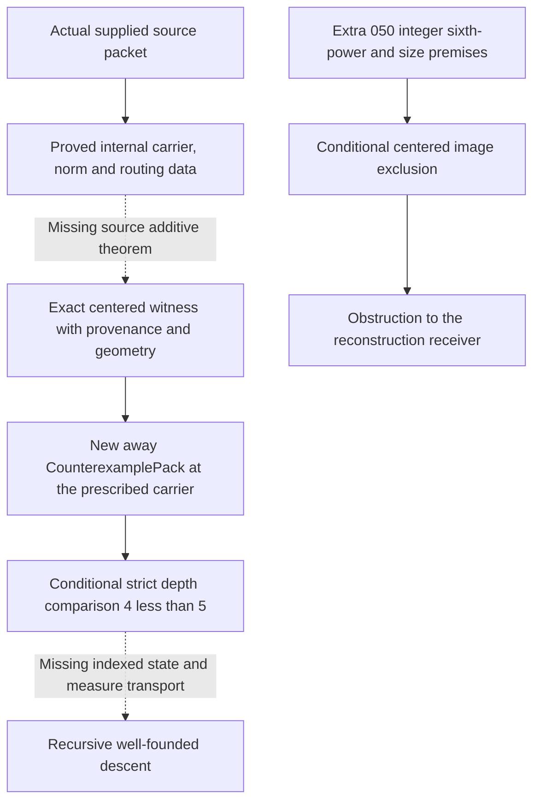

# Report 051 - source-to-centered reconstruction stopping audit

## Result

**Outcome C.** The audited production routes supply exact quadratic and
real-cubic power equations, coprime prime ownership, an oriented cyclotomic
element equation, and the internal depth drop. They do not supply a center
for the prescribed new natural chart, or the integer sixth-power and size
premises of 050. No source-to-centered transport theorem or independent
source contradiction was obtained.

A source-derived coprime allocation can be extracted from routing column
three. A scalar center invariant under residual-root twisting can also be
read from the *existing* signed endpoints. These are concrete objects, but
they are not a joint witness of the 049 condition: the existing signed
chart has a different gap and a different target. This mismatch is detailed
below rather than attributed solely to a missing phase choice.

This checkpoint adds this report and a reproducible source/reference audit
[check-051.py](checks/check-051.py), with
[source-audit-051.json](evidence/MANIFEST.md#log-9be486761540d1d5) and
[check-051.txt](evidence/MANIFEST.md#log-7edcc68aab7391dc). No Lean declaration, receiver, filter,
calibration family, or facade import was added. The 049/050 APIs are
preserved. The present reconstruction refinement campaign stops here.

## Source definitions and provenance inspected

The checkout audited is `fdac826b2e3be97b74db685bf2185b39c41e17c1`.
Line numbers below refer to that unchanged source. The JSON inventory
records declaration locations and SHA-256 fingerprints for the referenced
production files; these are source references, not proofs of entailment.

For a supplied `p : RamifiedSignedRootRoutingPacket`, use the abbreviations

```text
packet = p.signedDepth.balanced.axisDrop.depthLedger.exactPower.upToUnit.normPacket
eta = packet.quadratic.innerRoot : TraceOneInt (-2)
A = eta.fst, B = eta.snd, m = packet.innerSndRoot, M = |m|
L = p.signedDepth.signedLeftRoot, R = p.signedDepth.signedRightRoot
g = p.signedDepth.gapRoot, e = p.signedDepth.quotientRoot
V = packet.quadratic.canonical.verticalGapRoot
C = packet.quadratic.compensationRoot
```

Here absolute values used as natural numbers mean `Int.natAbs`. Integer,
natural, quadratic, real-cubic, and degree-six equations are kept distinct.

| Source reference | Equation or provenance actually inspected |
| --- | --- |
| [Basic.lean](../../../DkMath/FLT/Seven/Basic.lean), line 18 | `CounterexamplePack` requires positive natural endpoints, primitive coprimality, and the Fermat-seven equation. |
| [SevenBaseTerminalRamifiedSummit.lean](../../../DkMath/FLT/Seven/SevenBaseTerminalRamifiedSummit.lean), line 43 | The preceding summit already has its own signed Fermat equation, gap `7^6*gapRoot^7`, residual quotient `7*residualRoot^7`, and coordinate equation `sevenAxis*root^7`. These are old summit endpoints, not endpoints at the new prescribed carrier. |
| [SevenBaseTerminalRamifiedCanonicalSplit.lean](../../../DkMath/FLT/Seven/SevenBaseTerminalRamifiedCanonicalSplit.lean), line 19 | The canonical vertical/horizontal split retains the terminal summit and the exact compensation and second-coordinate product identities. |
| [SevenBaseTerminalRamifiedQuadraticInnerRoot.lean](../../../DkMath/FLT/Seven/SevenBaseTerminalRamifiedQuadraticInnerRoot.lean), lines 242, 258, 290, 304, 313, 405, 433, 453 | The quadratic packet contains an inhabited `RamifiedCubicGapSeventhShapeReceiver`; its constructor requires that receiver. It supplies `summit.root=eta^7`, the old coordinate `sevenAxis*eta^49`, primitive `A,B`, the residual norm, the inner product identity, exact depth four, and separate seventh-power roots. |
| [SevenBaseTerminalRamifiedRealCubicNorm.lean](../../../DkMath/FLT/Seven/SevenBaseTerminalRamifiedRealCubicNorm.lean), lines 52, 111, 135 | `B=7^4*m^7`; the two cubic forms are `L^7,R^7`; `R^7-L^7=7*A*B*(A+B)`; the algebraic source difference is `normalizedAxis^6*normalizedWitness(m)^7`. |
| [SevenRealCubicInt.lean](../../../DkMath/FLT/Seven/SevenRealCubicInt.lean), lines 260, 263, 288 | `normalizedAxis` and `normalizedWitness` are real-cubic elements. The sixth power is an algebraic axis factor, not a natural integer sixth root of `M/r`. |
| [SevenRealCubicUnitClass.lean](../../../DkMath/FLT/Seven/SevenRealCubicUnitClass.lean), line 766 | The exact algebraic roots have seventh powers equal to the two source elements; their difference equation retains the axis factor. |
| [SevenRealCubicAxisDrop.lean](../../../DkMath/FLT/Seven/SevenRealCubicAxisDrop.lean), lines 533, 543, 556, 567, 840, 857 | Norms of the algebraic roots are exactly `L,R`. The norm difference is not identified with the norm of the difference. The ledger retains theta depths 13, 3, 10 and balanced axis-cube times seventh-power presentations. |
| [SevenRamifiedSignedRootDepth.lean](../../../DkMath/FLT/Seven/SevenRamifiedSignedRootDepth.lean), line 49 | Signed roots agree with the norm packet. `R-L=7^4*g`, `signedSeventhQuotient R L=7*e`, `g*e=A*(A+B)*m^7`, and `g,e` are seven-units. |
| [SevenRamifiedSignedRootRouting.lean](../../../DkMath/FLT/Seven/SevenRamifiedSignedRootRouting.lean), lines 19, 36 | Board rows are `|g|,|e|,1`; columns are `|A|,|A+B|,M^7`. The coherent constructor proves the product and pairwise coprimality from the supplied source equations. |
| [CoprimeTripleRouting.lean](../../../DkMath/FLT/Seven/CoprimeTripleRouting.lean), line 59, and [SevenRamifiedFusionRoutingAudit.lean](../../../DkMath/FLT/Seven/SevenRamifiedFusionRoutingAudit.lean), lines 55, 87 | The board retains row/column product equations and cell coprimality. The third row is neutral and the active cells are seven-units, hence positive. |
| [SevenRamifiedFusionRealPairCoprimalityNormGate.lean](../../../DkMath/FLT/Seven/SevenRamifiedFusionRealPairCoprimalityNormGate.lean), lines 540, 565, 593, 604, 624 | The row-two loads are gcd addresses; column three splits cellwise into seventh powers; `|e|=c21*c22*root23^7`. |
| [SevenRamifiedFusionLoadedCore.lean](../../../DkMath/FLT/Seven/SevenRamifiedFusionLoadedCore.lean), lines 66, 165, 175 | The loaded-core synthesis retains real-pair seventh-power residuals and quotient-prime addresses. Absolute load norms are exactly `c21,c22`, with no new integer additive chart. |
| [SevenRamifiedFusionLoadedResidualIdealBridge.lean](../../../DkMath/FLT/Seven/SevenRamifiedFusionLoadedResidualIdealBridge.lean), lines 186, 191, 236 | `row2ResidualNormRoot` is chosen from the exact row-two decomposition. Quotient prime exponents are load exponents plus seven times residual exponents. |
| [SevenRamifiedFusionSeventhPowerResidualIdealExtraction.lean](../../../DkMath/FLT/Seven/SevenRamifiedFusionSeventhPowerResidualIdealExtraction.lean), lines 255, 271, 481 | The loaded ideal retains the ramifier and routed loads; the residual ideal retains the corresponding seventh-root exponents; `span(carrier)=loadedIdeal*residualIdeal^7`. |
| [SevenRamifiedFusionElementLevelOrientedPower.lean](../../../DkMath/FLT/Seven/SevenRamifiedFusionElementLevelOrientedPower.lean), lines 84, 110, 149 | Choice of a principal generator supplies an exact element equation, with the associated unit absorbed into the load. The choice is not a proved phase normalization. |
| [SevenRamifiedFusionCyclotomicAdditiveChartBoundary.lean](../../../DkMath/FLT/Seven/SevenRamifiedFusionCyclotomicAdditiveChartBoundary.lean), lines 126, 161, 209, 232, 394, 503 | The full phase product is the embedded integral norm; the carrier norm is `7*e`; the sparse carrier coordinates recover the existing signed endpoints; root twisting leaves ideal/power/load data intact but changes full root coordinates. |
| [SevenRamifiedFusionAllocationThreshold.lean](../../../DkMath/FLT/Seven/SevenRamifiedFusionAllocationThreshold.lean), lines 308, 354 | The actual source core has a strict branch selector and a positive complementary root `N`, with `M*N=V*C`, `Coprime M N`, and `|seventhPowerSndCore A B|=N^7`. The branch selector excludes one branch; it does not inhabit the other. |

The quadratic packet's earlier receiver is already part of the supplied
source tower. Its presence must not be confused with inhabiting the new
depth-four reconstruction obligation. The source packet is also not an
indexed recursive transition carrying a proved identification of every
new state with an original counterexample state.

## Actual source allocations and center candidates

Take a `Col3SeventhPowerSplit p` and set
`alpha=split.root13`, `beta=split.root23`. The neutral third row has
`c33=1`. The column equation gives

```text
alpha^7*beta^7 = M^7, hence M=alpha*beta.
```

Seven-unit margins make these roots positive. Column coprimality gives
`Coprime alpha beta`. Thus `r=alpha,s=beta`, or the swapped allocation,
is a genuine source-only positive supported coprime split of the actual M.
This is a consequence of the existing column split, not a new Lean result.
It does not select an allocation satisfying all 049 guards or supply q.

| Attempt | Supported allocation | Natural center / parity | Branch and primitive endpoints | Exact target and source-only status |
| --- | --- | --- | --- | --- |
| Column-three roots, `r=alpha` or `beta` | Positive coprime divisors of actual `M`; `s=M/r` | No center supplied by the split | The existing threshold comparison excludes one branch, without constructing endpoints in the permitted branch | Neither `P D q=448*s^49` nor all 049 guards follow from the column split. |
| `r=1`, `u=|A|`, `q=D+2*u` | `1` divides positive `M`; complement is `M`; coprimality is automatic | Natural and congruent to `D` modulo two | `q>D`, `u>0`; source coprimality and `7`-unit data give `Coprime u (7*M)` | Missing `GN 7 (7^27) |A|=7*M^49`. No source equation equates this GN value to that target. Geometric construction alone does not prove the equation or allocation guards. |
| Any supported `r`, same `q=D+2*|A|` | Requires a coprime split, such as the column split above | Natural, correct parity | Positive primitive GN endpoints can be written down; the source threshold may exclude this proposed branch | Missing `GN 7 D |A|=7*s^49`. Choosing q to force a branch does not make it a solution. |
| `r=M`, `s=1` | Positive supported coprime split | Arbitrary q would still need its own construction | Already impossible under the old necessary guard `343*r^7<M`, since `M>=1` | This is an old coarse-bound obstruction, not new pruning of a surviving allocation. |
| Existing signed center `q0=|R+L|` | May be paired with a supported r, but has no source identification with its D | Natural; parity is proved relative to `H=|R-L|`, not automatically to D | Coprime signed endpoints are known; their signs/order do not provide the required new chart | The actual equation has gap H and target e, as derived below. It is not the desired equation at D and `s^49`. |
| Raw coordinates or coordinate sum of the selected residual generator | Generator data do not by themselves choose a divisor r | Individual coordinates are integers and change under `mu_7`; naturalization and target parity need proofs | No source-proved positive primitive natural chart | Full-coordinate decoding is excluded by the existing theorem. No weaker successful extractor was found. |

The coprimality used in the GN rows is not assumed: primitive `A,B` and
`B=7^4*m^7` imply coprimality of `|A|` with `M`; `7` does not divide A.
The coherent routing proof explicitly extracts coprimality with `m^7`.
None of these rows assumes reconstruction when producing its tentative
numbers. None produces the required exact center witness.

## The phase-invariant signed center lands at the wrong gap and target

The existing 049 integer identity at
`x=L`, `E=R-L`, `Q=R+L` gives

```text
64*(R^7-L^7) = E*P_Z(E,Q),
P_Z(E,Q) = 7*Q^6+35*E^2*Q^4+21*E^4*Q^2+E^6.
```

The source proves `E=7^4*g` and `R^7-L^7=7^5*g*e`.
Because g is a seven-unit, it is nonzero. Cancellation in the integers
therefore gives the source scalar relation

```text
P_Z(7^4*g, R+L) = 448*e.
```

All powers of E and Q in P are even. With `H=7^4*|g|` and
`q0=|R+L|`, this is the natural polynomial relation
`P H q0=448*|e|`: positivity of `H^6` first implies `e>0`.
This paragraph is an explicit algebraic deduction from the cited source
and integer identity, not a newly compiled Lean declaration.

It explains what the source actually supplies, and why it does not solve
049. For every supported divisor r of M, the existing seven-unit theorem
gives `7` not dividing r. Consequently

```text
depth_7(H)=4, whereas depth_7(D)=27, D=7^27*r^49.
```

In particular H cannot be D. Also the source target is e, whose actual
natural decomposition is `c21*c22*beta^7`, not `(M/r)^49`.
There is no equality transporting both the gap and the target to the new
scale. Even a normalization of the old signed endpoints would have to
prove new arithmetic compatibility; choosing a phase is not enough.

This is consistent with the preexisting
`no_direct_signedFermatSevenChart` at
[SevenRamifiedFusionDirectChartObstruction.lean](../../../DkMath/FLT/Seven/SevenRamifiedFusionDirectChartObstruction.lean),
line 84: their seventh-power difference has exact seven-adic depth five,
so it cannot be a seventh power. That theorem is retained as an existing
obstruction, not presented as progress made in 051.

## Residual-generator gauge and the exact normalization boundary

Write `W=R-zeta*L`, `load=orientedLoadElement p`, and
`gamma=orientedResidualRoot p`. Production supplies

```text
W = load*gamma^7,
span(gamma)=globalOrientedResidualIdeal,
coordinates(W)=[R,0,0,-L,0,0],
7*e=Norm(load)*Norm(gamma)^7.
```

The sparse coordinate constraints are on the complete product W. They do
not say that gamma lies in a two-coordinate integer endpoint slice.
The ramified factor and associated unit remain in load. In particular,
the actual exact equation is stronger than an unspecified power up to a
unit, but it still has this load and is not a natural additive equation.

Replacing gamma by `zeta*gamma` preserves its ideal and seventh power,
and preserves this same load and W. It changes the full root coordinates.
[SevenRamifiedFusionDepthFourReconstructionAudit.lean](../../../DkMath/FLT/Seven/SevenRamifiedFusionDepthFourReconstructionAudit.lean),
line 74 proves the failure of a full-coordinate decoder on this actual
ideal. Its quantifier ranges over every valid generator; it does not
rule out all invariant scalar extractors, or prevent a choice-based
generator from being named.

The weaker invariant quantities inspected have the following boundaries:

- The norm and six-phase product retain a multiplicative target, not a
  primitive additive chart. Taking their absolute value does not change
  this limitation. Integer coordinate projection is not multiplicative;
  there is also no unital ring homomorphism from this carrier to the
  integers (boundary module, lines 148 and 161).
- The ideal and exact seventh power are invariant input data. No audited
  theorem converts them into a natural q with the required parity,
  geometry, and exact centered identity. The decoder obstruction alone
  is not a proof that such a weaker theorem cannot exist.
- The coordinates of the complete product W are invariant under the
  residual `mu_7` change, and already yield `q0=|R+L|`. The preceding
  calculation shows exactly why that invariant center belongs to a
  different scalar equation. Thus the gauge ambiguity is not the sole
  reason this particular invariant attempt fails.

A phase-dependent approach would need an actual normalization theorem:
a chosen representative `gamma'` in the residual gauge orbit, its
coordinate equalities defining new integer endpoints, and a compatibility
equation tying those endpoints to the prescribed gap or sum D and to
`7*s^49`. A mere assertion that `gamma'` has the same ideal/power, or
that four coordinates of `load*gamma'^7` vanish, supplies none of this
new compatibility. The report does not assert a canonical phase exists,
and does not add that missing equation as a packet field.

There is a separate proved obstruction to reusing eta as the new away
root. At the prescribed carrier, the transfer equation forces the new
root's second-coordinate depth to be three. Eta has depth four.
The exact results are `internalDepthFourReconstructedRoute_root_depth`
and `internalDepthFourReconstructedRoute_root_ne_innerRoot` in the audit
module, lines 30 and 42. They are independent of the residual generator
phase and are also preexisting results.

## What remains missing, and what 050 does not supply

For a concretely source-defined supported coprime allocation, a genuine
construction must prove one of these equations with the actual endpoint
and allocation provenance:

```text
GN branch:
  u>0, Coprime u (7*M), GN 7 (7^27*r^49) u = 7*s^49;
  q=D+2*u.

Alternating branch:
  u,v>0, u<=v, u+v=D, Coprime u D,
  alternatingCyclotomicSeven u v = 7*s^49;
  q=v-u.
```

Here `M=r*s` and `s=M/r`; D is fixed by this r. The equation must be
proved from the original source data, rather than assumed as a chart or
centered candidate. The other 049 guards and the selected branch must
also be justified. Writing this goal down is not a new bridge theorem.
For the explicit primitive GN attempt `u=|A|`, the smaller concrete
missing equation is exactly `GN 7 D |A|=7*s^49`; there is no argument
establishing it in the audited equations.

The complement product `M*N=V*C` and coprimality prove prime ownership.
They do not prove that a selected complement s has all prime exponents
divisible by six, or that its integer sixth root is at least `9*r^2`.
The natural routed residual is a seventh root. The algebraic
`normalizedAxis^6` is in another ring and is an axis factor. The 048
condition `SixthPowerAllocationSieve r s` states only a sixth-power
residue modulo `r^49`. None supplies the 050 integer perfect power.

The preserved 050 calibrations at
[CenteredGnomonGapCalibration.lean](../../../DkMathTest/FLT/Seven/CenteredGnomonGapCalibration.lean),
lines 92, 105, and 126 distinguish these issues: `64002` can pass residue
support without being a sixth power; `729=3^6` passes the old numeric
allocation filters but fails the required size at r=1; a coprime
complement product can coexist with the nonperfect core. These are
source-free examples. They are not inhabitants of a source packet or
countermodels to a theorem about all such packets.

No 050 power premise, size premise, universal family premise, or new
source-indexed adjacent bracket was proved in 051. The retained 050
conditional exclusion remains a separate result:

```text
s=t^6 and 9*r^2<=t -> no natural q solves P D q=448*s^49.
```

Its fixed-allocation source wrapper and universal-family wrapper are in
[SevenRamifiedFusionCenteredGnomonGap.lean](../../../DkMath/FLT/Seven/SevenRamifiedFusionCenteredGnomonGap.lean),
lines 156 and 168. Excluding one allocation does not exclude other
allocations. Even the universal wrapper concludes only
`not InternalDepthFourCounterexampleReconstructionObligation p`, with
an unproved family premise; it does not conclude `False` from p.

## Dependency diagram and stopping recommendation



The two dotted arrows are the requested `-X->` missing implications;
they do not denote failed Lean builds. There is no proved source arrow
to H, and no arrow from O to an original-source contradiction.

The Q-to-A arrow reuses
`internalDepthFourReconstruction_iff_centered`,
[SevenRamifiedFusionCenteredPolynomial.lean](../../../DkMath/FLT/Seven/SevenRamifiedFusionCenteredPolynomial.lean),
line 259. Its condition at lines 233-239 preserves divisor support,
coprimality, coarse/residue guards, parity, primitive endpoints, and branch
geometry. The A-to-D arrow is the existing strict-descent equivalence and
conditional constructor in
[SevenRamifiedFusionStrictDescentFailureBoundary.lean](../../../DkMath/FLT/Seven/SevenRamifiedFusionStrictDescentFailureBoundary.lean),
lines 90 and 110.

In contrast, `AwayCoordinateNormalForm` already requires an actual new
`CounterexamplePack`, and `AwayValuationTransferPacket` requires that
normal form and a carrier source. Their constructors cannot fill in the
missing natural Fermat equation from an internal coordinate alone; see
[CoordinateNormalForm.lean](../../../DkMath/FLT/Seven/CoordinateNormalForm.lean),
line 15, and
[AwayValuationTransfer.lean](../../../DkMath/FLT/Seven/AwayValuationTransfer.lean),
lines 69 and 79. Routing an already supplied counterexample does not
prove the necessary prescribed-carrier equality for a new one.

The recommended next action is to freeze 049/050 and this audited boundary.
Further implementation should resume only with an independently justified
source argument for the displayed additive compatibility, or an actual
source-level contradiction. If such an argument is found, implement its
concrete r and endpoints, prove the exact equation and provenance, and
invoke the existing reverse reconstruction theorem. No additional receiver
structure is needed. If using phase normalization, prove its endpoint
equalities and arithmetic compatibility first; a phase choice alone is
not a sufficient implementation proposal.

An indexed recursive descent would subsequently require a coherent source
state, a transition producing another state of that same type, and a
well-founded measure that strictly drops along that transition. The present
depth comparison does not identify such a system. This is a statement of
the remaining logical requirements, not a design for Instruction 052.
No further modular refinement, large enumeration, conditional exclusion
family, or Legendre import is proposed at this stopping checkpoint.

## Validation performed

- `python3 .../checks/check-051.py`: source declaration locations,
  fingerprints and equality with HEAD, preserved facade/root/calibration
  files, report links and declaration line references, and whitespace were
  checked. This covers 31 production source files, four preserved Lean
  files, 86 declaration locations, and the facade's 198 direct imports.
  The full inventory is recorded in the accompanying JSON and log.
- `python3 .../checks/check-050.py`: the retained 050 source, regression
  inventory, standard-axiom evidence, and its stored four successful build
  logs were rechecked. This validates the earlier evidence against the
  unchanged files; it is not a new Lean compilation in 051.
- No Lean declarations were added or changed, and no Lean builds or new
  `#print axioms` runs were performed for 051. In accordance with the pure
  Outcome C contract, no dummy production theorem was introduced. The
  algebraic deduction above is identified as an audit argument, not a new
  kernel proof. Existing Lean headers and traditional file-print commands
  remain unchanged.

Outcome C closes the bounded audit. It does not prove impossibility of
every conceivable source-to-chart map, establish an original FLT7
contradiction, or convert the conditional reconstruction into descent.
