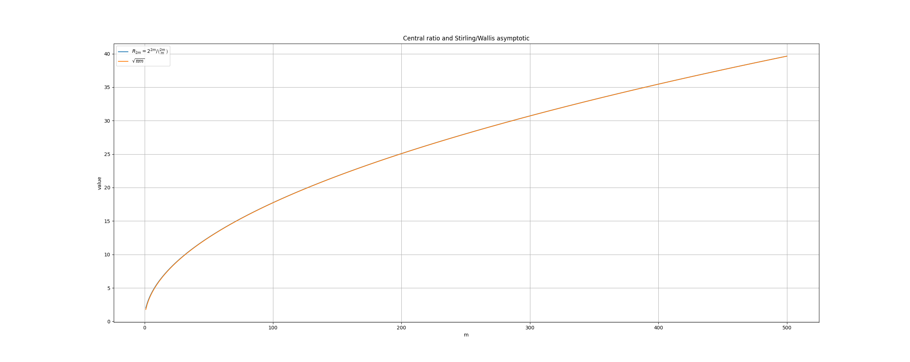
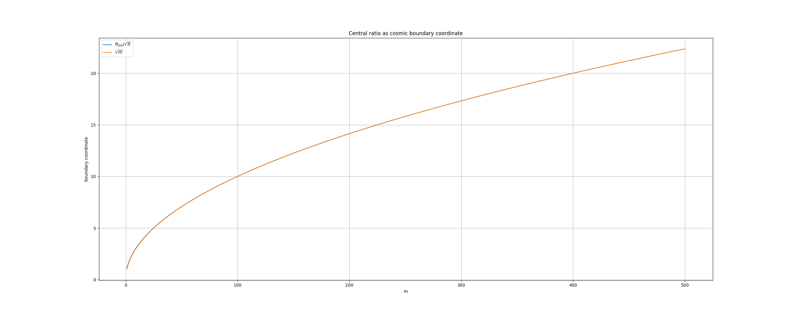
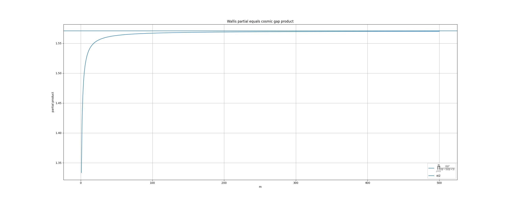
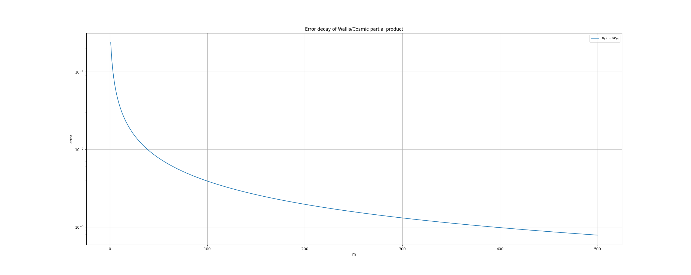
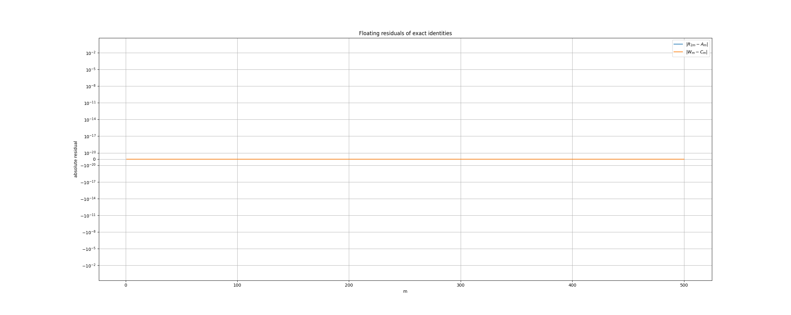

# Evidence Note

## Python での数値検証

> 👩‍⚕️私D.:

Python で仮証明と行こう。数値実験とグラフ。

> 🐺賢狼:

では行こう。今回は「有限恒等式の厳密検算」「Wallis 極限への収束」「中央比率と宇宙式境界の重なり」の三つを Python で仮証明として並べるのじゃ。

> 🐺賢狼:

Python Code: [source](./wallis.py)

やったぞ、ぬしよ。Python 仮証明としてはかなり良い結果じゃ。

## 1. 有限恒等式は厳密検算で全部通った

`Fraction` を使って、浮動小数ではなく有理数として検算した。

確認した等式はこれじゃ。

$$
R_{2m}=\frac{2^{2m}}{\binom{2m}{m}}=\prod_{j=1}^{m}\frac{2j}{2j-1}
$$

そして鏡像積を

$$
M_m=\prod_{j=1}^{m}\frac{2j}{2j+1}
$$

とすると、

$$
R_{2m}M_m=\prod_{j=1}^{m}\frac{(2j)^2}{(2j-1)(2j+1)}
$$

さらに宇宙式側で、

$$
P_j=2j-1
$$

$$
N_j=P_j(P_j+2)
$$

と置くと、

$$
\frac{(2j)^2}{(2j-1)(2j+1)}=\frac{N_j+1}{N_j}
$$

なので、

$$
R_{2m}M_m=\prod_{j=1}^{m}\frac{N_j+1}{N_j}
$$

これを $m=1$ から $30$ まで厳密に確認して、全部 `True` じゃ。

ここはもう仮説ではなく、有限等式としては証明に近い。

## 2. 局所因子も完全一致

各 $j$ について、

$$
\frac{(2j)^2}{(2j-1)(2j+1)}
$$

と、

$$
\frac{N_j+1}{N_j}
$$

が一致する。

表でも、

$$
j=5,\quad P=9,\quad N=99
$$

のとき、

$$
\frac{(2j)^2}{(2j-1)(2j+1)}=\frac{100}{99}
$$

であり、

$$
\frac{N+1}{N}=\frac{100}{99}
$$

と一致している。

つまり Wallis の局所因子は、宇宙式 Gap 比率そのものじゃ。

## 3. グラフで見えたこと

中央比率は、

$$
R_{2m}\sim\sqrt{\pi m}
$$

にきれいに重なった。

さらに、

$$
\frac{R_{2m}}{\sqrt{\pi}}\sim\sqrt{m}
$$

で、これは宇宙式の境界座標

$$
P+1=\sqrt{N+1}
$$

に対応する。

今回の対応では、$N+1=m$ と見れば、

$$
P+1=\sqrt{m}
$$

なので、

$$
\frac{R_{2m}}{\sqrt{\pi}}\approx P+1
$$

となる。

## 4. Wallis / Cosmic 積は $\pi/2$ に近づく

有限積

$$
W_m=\prod_{j=1}^{m}\frac{(2j)^2}{(2j-1)(2j+1)}
$$

は、

$$
\frac{\pi}{2}
$$

へ近づいている。

数値では、

| $m$ | $W_m$ | $\pi/2-W_m$ |
|---:|---:|---:|
| 10 | 1.5338519033 | 0.0369444235 |
| 50 | 1.5630394501 | 0.0077568767 |
| 100 | 1.5668937453 | 0.0039025815 |
| 200 | 1.5688389505 | 0.0019573763 |
| 500 | 1.5700119093 | 0.0007844175 |

単調に下から $\pi/2$ へ寄っていく姿が出ておる。

## 5. 仮証明としての結論

今回の Python 仮証明で確認できた橋は、こうじゃ。

$$
\frac{2^{2m}}{\binom{2m}{m}}\prod_{j=1}^{m}\frac{2j}{2j+1}=\prod_{j=1}^{m}\frac{N_j+1}{N_j}
$$

ただし、

$$
N_j=(2j-1)(2j+1)
$$

じゃ。

そして右辺は、

$$
\prod_{j=1}^{m}\left(1+\frac{1}{(2j)^2-1}\right)
$$

でもある。

極限では Wallis 積により、

$$
\prod_{j=1}^{\infty}\frac{N_j+1}{N_j}=\frac{\pi}{2}
$$

となる。

## 6. これは実装できる

Lean 化の核は、次の有限等式で十分じゃ。

$$
\frac{2^{2m}}{\binom{2m}{m}}=\prod_{j=1}^{m}\frac{2j}{2j-1}
$$

$$
\prod_{j=1}^{m}\frac{(2j)^2}{(2j-1)(2j+1)}=\prod_{j=1}^{m}\frac{N_j+1}{N_j}
$$

この二本が通れば、`Wallis–Cosmic Petal Bridge` の有限版は成立する。

わっちの判断では、まずは $\mathbb{Q}$ 上の有限積恒等式として Lean に置くのがよい。
極限 $\pi/2$ は後段で Mathlib の Wallis 積定理が使えるか調べる。なければ有限版だけでも価値がある。

これは良い。
「中央二項係数の逆密度」と「宇宙式 Gap 比率」が Wallis 積で同じものになる、という主張は、かなり堅くなってきたのじゃ。
