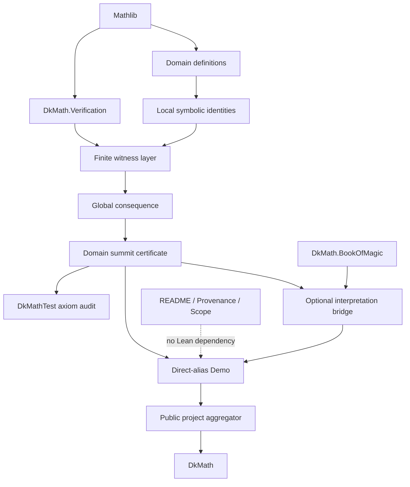

# Report: BMV-001

BMV-001 Breaking Math Verification Architecture Reconnaissance

## Conclusion

Jacob​​ian プロジェクトから、再利用可能な枠組みを直ちに抽出できます。ただし、抽出対象は巨大な `VerificationBundle` ではありません。

最小構成は次の二層です。

1. Lean 上の小さな汎用 collision certificate API
2. theorem、audit、provenance、scope、Demo を配置する検証プロジェクト規約

`BreakingMathClaim`、`FiniteCertificate`、`VerificationBundle`、`ProvenanceRecord`、`TrustAudit` を一括して structure 化する必要はありません。特に provenance と axiom audit は、Lean の数学的対象とは異なるメタデータ／検査工程です。

推奨 Outcome は **Outcome A** です。

---

## Current Jacobian Verification Pipeline

現在の依存鎖は次のとおりです。

```text
Basic
  ↓
PolynomialMap
  ├──────────────→ Collision
  ↓                   │
Jacobian              │
  ↓                   │
Determinant           │
  └──────────────┬────┘
                 ↓
           Counterexample
                 ↓
            ComplexLift
                 ↓
             Normalized
                 ↓
         GapCrystalBridge ← DkMath.BookOfMagic
                 ↓
               Demo
                 ↓
 JacobianCounterexample3 aggregator
                 ↓
              DkMath
```

監査は公開 aggregator を読みます。

```text
DkMath
  ↑
JacobianCounterexample3
  ↑
DkMathTest/.../CheckAxioms
```

文書は Lean の依存グラフ外です。

```text
README
DEMO_CONTRACT
PROVENANCE
roadmap
```

### A. Mathematical object definition

| Module | Definitions |
|---|---|
| `Basic.lean` | `Var3`, `Poly3Q`, `Point3Q` |
| `PolynomialMap.lean` | `x`, `y`, `z`, `counterexampleP/Q/R`, `counterexamplePoly`, `evalCounterexampleQ` |
| `Collision.lean` | `p0Q`, `p1Q`, `p2Q`, `targetQ` |
| `ComplexLift.lean` | `Poly3C`, `Point3C`, `qToC`, `polyMapQC`, `castPointQC`, complex points and map |
| `Normalized.lean` | `normalizeOutputC`, `normalizedTargetC`, `normalizedCounterexamplePolyC`, normalized evaluation |
| `GapCrystalBridge.lean` | `NormalizedGapFamilyC`, `normalizedRestoreRelC` |

### B. Local symbolic identity

- `eval_p0Q`, `eval_p1Q`, `eval_p2Q`
- `jacobianMatrixQ_eq_explicit`
- `jacobianMatrixQ_det_eq_neg_two`
- `evalCounterexampleC_castPointQC`
- `jacobianMatrixC_eq_map`
- `jacobianMatrixC_det_eq_neg_two`
- `evalNormalizedCounterexampleC_eq_normalizeOutput`
- `normalizedJacobianMatrixC_eq_scale_mul`
- `outputScaleDiagonalC_det`
- `normalizedJacobianMatrixC_det_eq_one`
- `eval_add_sub_eval_eq_mul_GNFiniteDifference`
- `differenceQuotient_eq_GNFiniteDifference`

### C. Finite witness certificate

- `p0Q_ne_p1Q`, `p0Q_ne_p2Q`, `p1Q_ne_p2Q`
- `three_point_collision_Q`
- `three_point_collision_C`
- `normalized_three_point_collision_C`

These are、有限個の明示的 witness と等式／不等式を束ねた証明書です。

### D. Global property refutation

- `evalCounterexampleQ_notInjective`
- `evalCounterexampleQ_noLeftInverse`
- `evalCounterexampleC_notInjective`
- `evalCounterexampleC_noLeftInverse`
- `evalNormalizedCounterexampleC_notInjective`
- `evalNormalizedCounterexampleC_noLeftInverse`
- `normalizedTargetC_not_uniqueGap`
- `normalizedForgetGap_notInjective`

ここで初めて、有限 witness から大域的性質の否定へ移ります。

### E. Normalization / transport

`ComplexLift.lean`:

```text
ℚ-polynomial → ℂ-polynomial
ℚ-point → ℂ-point
evaluation transport
pderiv transport
determinant transport
```

`Normalized.lean`:

```text
(P,Q,R) → (-P/2,Q,R)
det = -2 → det = 1
collision target (-1/4,0,0) → (1/8,0,0)
```

### F. Reusable abstract API

現在明確に再利用可能なのは以下です。

- `UniqueGap`
- `not_uniqueGap_of_two`
- `GapFiber`
- `GapCrystal`
- `CrystalWorld`
- `forgetGap`
- `forgetGap_notInjective_of_two_gaps`
- `GNFiniteDifference`
- その一般多項式定理

これらは Jacobian の定義を import していません。

### G. Trust / axiom audit

`DkMathTest/Hackathon/JacobianCounterexample3/CheckAxioms.lean` が、最終 certificate 群に対して `#print axioms` を実行します。

これは有効な既存規約です。

- audit は `DkMathTest` に置く
- summit theorem を直接検査する
- `sorryAx` と project-specific axioms を失敗条件とする
-通常の Lean/Mathlib 基盤公理を明示的に記録する

### H. Provenance and scope documentation

現在の役割分担は適切です。

- `README.md`: 検証対象、結果、module map、build、trust boundary
- `PROVENANCE.md`: 外部ソースと DkMath 独自作業の分離
- `DEMO_CONTRACT.md`: 発表順序と theorem surface
- roadmap: checkpoint と deferred work

provenance は Lean structure にせず、文書として管理すべきです。

### I. Public Demo surface

`Demo.lean` は次の直接 alias のみを公開します。

```text
jacobianDemo_det_eq_one
jacobianDemo_three_point_collision
jacobianDemo_notInjective
jacobianDemo_noLeftInverse
jacobianDemo_target_notUniqueGap
jacobianDemoCertificateC
```

この「計算を再実行せず、証明済み theorem を並べる」という設計は、そのまま Breaking Math Verification の標準にできます。

---

## Existing Reusable APIs

### 1. Book of Magic API

`UniqueGap` と `GapCrystal` は既に十分抽象的です。

```lean
def UniqueGap
    (RestoreRel : (core : Core) → Gap core → Prop)
    (core : Core) : Prop

structure GapCrystal
    (Core : Type u)
    (Gap : Core → Type v)
    (RestoreRel : (core : Core) → Gap core → Prop)
```

ただし、これは全検証案件の基盤ではありません。

適用できるのは、対象を「Core と、その復元 witness」という関係として自然に読める場合です。Jacob​​ian collision への適用は interpretation bridge であり、検証 certificate 本体とは分離されています。この境界は維持すべきです。

### 2. Existing obstruction patterns

`DkMath.Petal.Obstruction` には既に、

```text
same address + distinct indices → contradiction
same value + injectivity → contradiction
same label + recovery + injectivity → equal indices
```

という有限衝突から大域契約を壊すパターンがあります。

ただし、これらは `Finset`、`Set.InjOn`、Petal address に特化しています。新しい API はこれを置換せず、その下にある一般的な二点 collision のみを抽出すべきです。

### 3. Finite arithmetic obstruction example

`DkMath.Hackathon.FinitePrimeEscapeGN5` は、別種の検証例として利用できます。

```text
explicit finite prime set
→ fresh prime witness
→ exact witness q = 31
→ q divides target but q² does not
→ target is not a fifth power
```

これは Jacobian とは異なるため、BMV framework の妥当性を確認する第二例として有用です。

一方、`FreshPrimeFactor` や fifth-power obstruction を普遍的な verification structure に押し込むべきではありません。

### 4. Theorem bundles

リポジトリには、多数の domain-specific packet／provider structure がありますが、汎用的な `VerificationBundle` は見つかりませんでした。

Jacob​​ian の summit certificate は structure ではなく conjunction theorem です。

```lean
det = 1 ∧ det ≠ 0 ∧ ¬ Function.Injective f
```

この形式は軽量で、projection API が必要になるまでは十分です。

### 5. Axiom audit conventions

`DkMathTest` 全体で `#print axioms` は既に標準的に利用されています。したがって、新しい `TrustAudit` Lean structure は重複になります。

必要なのは structure ではなく、ファイル配置と検査対象の規約です。

---

## Reusable vs Domain-Specific Boundary

### Reusable framework material

- 二つの異なる入力が同じ出力を持つ collision certificate
- collision から `¬ Function.Injective f`
- collision から left inverse 不存在
- source definitions → local identities → witnesses → global consequence という module layering
- domain summit theorem
- direct-alias-only Demo module
- `DkMathTest/.../CheckAxioms.lean`
- README／PROVENANCE／DEMO_CONTRACT のテンプレート
- public aggregator の一方向依存
- source claim と DkMath interpretation の明示的分離

### Jacobian-specific material

- `MvPolynomial`
- `pderiv`
- `Matrix.det`
- 三変数座標と `Point3Q`／`Point3C`
- `counterexampleP/Q/R`
- 明示的な三点
- determinant `-2`
- complex coefficient transport
- first-coordinate scaling `-1/2`
- determinant-one normalization
- normalized collision target
- Jacobian certificate の conjunction shape

### Book of Magic interpretation

以下は再利用可能な独立 API ですが、Breaking Math framework の必須基盤ではありません。

- `UniqueGap`
- `GapFiber`
- `GapCrystal`
- `forgetGap`
- `GNFiniteDifference`

案件が自然に Core–Gap として読める場合だけ、domain bridge から import すべきです。

---

## Minimal Framework Proposal

### 推奨する唯一の初期 Lean structure

```lean
structure CollisionCertificate
    {α : Type u}
    {β : Type v}
    (f : α → β) where
  left : α
  right : α
  ne : left ≠ right
  same_image : f left = f right
```

付随 theorem:

```lean
theorem CollisionCertificate.notInjective
    (c : CollisionCertificate f) :
    ¬ Function.Injective f

theorem CollisionCertificate.noLeftInverse
    (c : CollisionCertificate f) :
    ¬ ∃ g : β → α, Function.LeftInverse g f
```

必要なら既存 witness から構築する薄い constructor theorem を置けます。

```lean
def CollisionCertificate.of_eq
    (hne : x ≠ y)
    (heq : f x = f y) :
    CollisionCertificate f
```

### 初期段階で追加しない候補

#### `BreakingMathClaim`

単に `Prop` を包むだけなら情報を増やしません。

```lean
structure BreakingMathClaim where
  statement : Prop
```

これは theorem、provenance、status を不自然に混合する危険があります。

#### `FiniteCertificate`

「finite」の意味が案件ごとに異なります。

- 有限個の点
- bounded computation
- finite set
- explicit numeral
- finite proof term

統一 predicate を置くには意味論が不足しています。

#### `VerificationBundle`

identity、refutation、transport、provenance を一つの structure にすると、案件ごとに大量の optional field が必要になります。現時点では module layout の方が強い設計です。

#### `RefutationCertificate`

```lean
def RefutationCertificate (P : Prop) := ¬ P
```

は単なる別名で、Lean API としての価値がありません。

#### `ProvenanceRecord`

外部 URL、アクセス日、publication status は Lean kernel が検証する対象ではありません。Markdown template と review rule で管理すべきです。

#### `TrustAudit`

`#print axioms` の結果は elaboration command の出力であり、通常の theorem data として保持するものではありません。既存の `DkMathTest` 規約を使うべきです。

### 対応可能な案件

| 案件 | Framework の役割 |
|---|---|
| 明示 collision counterexample | `CollisionCertificate` と consequence theorem を直接利用 |
| 有限算術 obstruction | domain witness theoremを作り、同じ checkpoint／audit／Demo 規約を利用 |
| 具体的 identity verification | domain theoremを summit certificate とし、audit／Demo 規約を利用 |
| 将来の外部報告 | provenance template、scope boundary、raw-to-summit dependency discipline を利用 |

つまり、全案件を同じ Lean structure に押し込むのではなく、共通する論理だけを Lean API にし、共通する作業工程をプロジェクト規約にします。

---

## Module Placement

### 比較

| 候補 | 評価 |
|---|---|
| `DkMath/BreakingMath/` | 発表ブランドとしては良いが、一般数学 API 名としては用途を狭く見せる |
| `DkMath/Verification/` | 中立的で、Hackathon 外の研究にも再利用可能 |
| `DkMath/Research/Verification/` | 実験的印象が強く、安定 API の配置として深すぎる |
| `DkMath/Hackathon/BreakingMath/` | 案件テンプレートには適するが、汎用 Lean API の canonical home には不向き |

### 推奨

Canonical home:

```text
DkMath/Verification/
DkMath/Verification.lean
```

初期構成:

```text
DkMath/Verification/
└── Collision.lean

DkMath/Verification.lean
```

プロジェクト固有の実装は従来どおり次へ置きます。

```text
DkMath/Hackathon/<ProjectName>/
```

ドキュメントの Breaking Math ブランドは次で構いません。

```text
docs/hackathon/<project>/
```

### Dependency direction

```text
Mathlib
   ↓
DkMath.Verification
   ↓
domain-specific verification project
   ↓
optional interpretation bridge
   ↓
Demo
   ↓
public project aggregator
```

禁止する逆依存:

```text
DkMath.Verification
  ─X→ DkMath.Hackathon.JacobianCounterexample3
  ─X→ DkMath.BookOfMagic
  ─X→ domain-specific arithmetic modules
```

`DkMath.BookOfMagic` と `DkMath.Verification` は、互いに独立した sibling API とするのが安全です。

---

## Dependency Graph



---

## BMV-002 and Later Roadmap

### BMV-002 — Generic Collision Certificate

Primary goal: 二点 collision から非単射性と left inverse 不存在を導く最小 API を追加する。

Candidate files:

```text
DkMath/Verification/Collision.lean
DkMath/Verification.lean
DkMathTest/Verification/Collision.lean
```

Candidate definitions and theorem shapes:

```lean
structure CollisionCertificate (f : α → β) where
  left : α
  right : α
  ne : left ≠ right
  same_image : f left = f right

theorem CollisionCertificate.notInjective
    (c : CollisionCertificate f) :
    ¬ Function.Injective f

theorem CollisionCertificate.noLeftInverse
    (c : CollisionCertificate f) :
    ¬ ∃ g, Function.LeftInverse g f
```

Non-goals:

- Jacobian moduleの変更
- provenance structure
- general finite computation framework
- `UniqueGap` との統合
- arithmetic obstruction abstraction

Difficulty: low
Credit cost: low

### BMV-003 — Jacobian Adapter Validation

Primary goal: 既存 Jacobian witness が汎用 collision certificate に自然に載ることを、薄い bridge で確認する。

Candidate file:

```text
DkMath/Hackathon/JacobianCounterexample3/VerificationBridge.lean
```

Candidate definitions:

```lean
def normalizedCollisionCertificateC :
    DkMath.Verification.CollisionCertificate
      evalNormalizedCounterexampleC

theorem normalizedCollisionCertificateC_notInjective :
    ¬ Function.Injective evalNormalizedCounterexampleC

theorem normalizedCollisionCertificateC_noLeftInverse :
    ¬ ∃ G, Function.LeftInverse G evalNormalizedCounterexampleC
```

既存 theorem を破壊せず、compatibility alias として接続します。

Non-goals:

- determinant proof の変更
- collision point の変更
- Demo surface の全面改名
- Book of Magic API との融合

Difficulty: low
Credit cost: low

### BMV-004 — Verification Project Contract Templates

Primary goal: 新規外部報告を検証するときの文書・監査規約を固定する。

Candidate files:

```text
docs/verification/BREAKING_MATH_CASE_TEMPLATE.md
docs/verification/PROVENANCE_TEMPLATE.md
docs/verification/DEMO_CONTRACT_TEMPLATE.md
docs/verification/README.md
```

Candidate contract fields:

```text
Reported claim
Exact source formula
Source metadata and missing-field policy
Independent formalization boundary
Finite witnesses
Summit theorem
Axiom-audit target
Public Demo aliases
Scope and non-goals
Deferred work
```

Non-goals:

- metadata の Lean encoding
- URL の自動検証
- 動画生成
- submission automation

Difficulty: low
Credit cost: low

### BMV-005 — Second-Domain Validation

Primary goal: `FinitePrimeEscapeGN5` を第二例として調査し、同じ工程が collision 以外にも成立することを確認する。

Candidate files:

```text
DkMath/Hackathon/FinitePrimeEscapeGN5Demo.lean
DkMathTest/Hackathon/FinitePrimeEscapeGN5/CheckAxioms.lean
docs/hackathon/finite-prime-escape-gn5-verification/README.md
docs/hackathon/finite-prime-escape-gn5-verification/PROVENANCE.md
```

Candidate summit shape:

```lean
theorem finitePrimeEscapeGN5Certificate :
    Nat.Prime 31 ∧
    31 ∣ DkMath.CosmicFormulaBinom.GN 5 1 1 ∧
    ¬ 31 ^ 2 ∣ DkMath.CosmicFormulaBinom.GN 5 1 1 ∧
    ¬ ∃ x : ℕ, DkMath.CosmicFormulaBinom.GN 5 1 1 = x ^ 5
```

実際の theorem shape は既存 theorem surface を再確認してから確定します。

Non-goals:

- prime obstruction の普遍 structure 化
-新しい数論証明
- Jacobian との共通 bundle 作成

Difficulty: medium
Credit cost: medium

### BMV-006 — Public Framework Integration

Primary goal: 二つの domain example で API が安定した後、`DkMath.Verification` を root public import に加える。

Candidate files:

```text
DkMath/Verification.lean
DkMath.lean
DkMathTest/Verification/CheckAxioms.lean
```

Candidate public checks:

```lean
#check DkMath.Verification.CollisionCertificate
#check DkMath.Verification.CollisionCertificate.notInjective
#check DkMath.Verification.CollisionCertificate.noLeftInverse
```

Non-goals:

- universal theorem-bundle framework
- automatic provenance audit
- all existing counterexample modules の migration

Difficulty: low
Credit cost: low

---

## Credit Cost Estimate

| Checkpoint | Cost | Main risk |
|---|---:|---|
| BMV-002 | Low | universe／namespace と API naming |
| BMV-003 | Low | 既存 theorem surface との重複 |
| BMV-004 | Low | template を過剰に規範化しないこと |
| BMV-005 | Medium | 第二例に必要な summit boundary の選定 |
| BMV-006 | Low | public import 順序と audit placement |

合計見積もりは、現在の案なら **low-to-medium** です。高コストの一般理論は不要です。

---

## Outcome

**Outcome A — A clear reusable framework can be extracted immediately.**

ただし、結論は「万能な verification structure を作れる」ではありません。

直ちに抽出できるものは、

- `CollisionCertificate`
- collision からの汎用 consequence theorem
- module layering
- summit certificate
- direct-alias Demo
- dedicated axiom audit
- provenance／scope 文書規約

という小さな枠組みです。

Jacob​​ian 多項式、determinant、三次元 witness、complex transport、normalization、Book of Magic interpretation は domain-specific layer に残します。

BMV-001 は読み取り専用で完了しました。ソース、文書、参照 TTS 作業場は変更しておらず、JAC-012 も追加していません。
