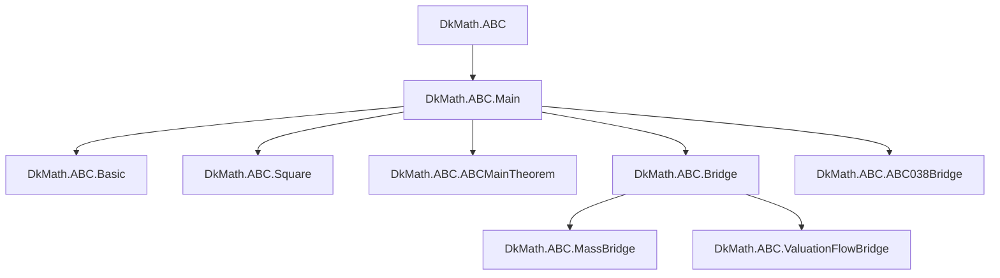
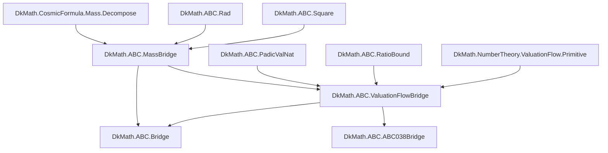
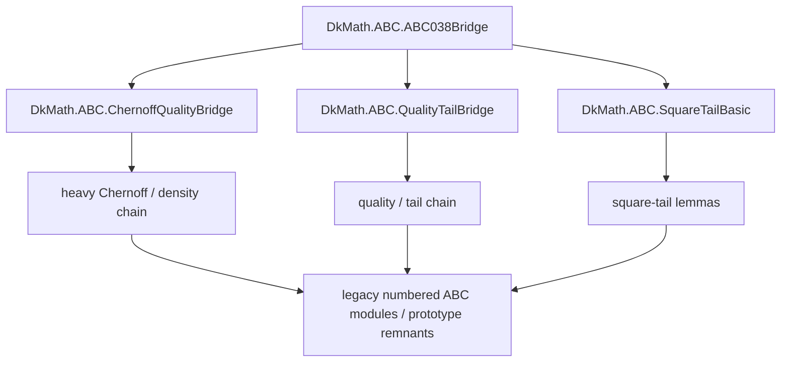

# DkMath.ABC Import Map

> 目的：`DkMath.ABC.*` の現況を、**公開面 / bridge spine / legacy heavy chain** の 3 層で把握できるようにする。  
> 詳細な全 import は `logs/summary_report/__imports.txt` を参照し、本ページは **構造理解のための圧縮地図** とする。

---

## 1. 方針

`DkMath.ABC.*` は、今後つぎの 3 層で見るのが最も読みやすい。

### 1.1. 公開面

外部利用者が最初に触る入口。  
`DkMath.ABC`, `DkMath.ABC.Main`, `DkMath.ABC.Bridge` など。

### 1.2. Bridge spine

今回の named module 化で中心になった層。  
大筋は

\[
\texttt{CosmicFormula}
\to
\texttt{Mass API}
\to
\texttt{ValuationFlow}
\to
\texttt{ABC Bridge}
\]

であり、ABC 側は **本体定理の置き場ではなく、薄い翻訳層** として保つ。

### 1.3. Legacy / heavy chain

Chernoff, Janson, quality, tail などを含む重い解析本体。  
旧 numbered modules の残留や、まだ named 側へ吸収しきっていない部分をここに含める。

---

## 2. 現況まとめ

現時点では、`ABC0*.lean` 由来の **公開依存の主経路** はかなり named module 側へ移っていると見てよい。  
ただし、旧番号付きファイル群そのものが完全消滅したとまではまだ言わず、**legacy residue として残る可能性のある重層** は別枠で見る。

構造的には、いまの `DkMath.ABC.*` は次の 2 本柱で読むのがよい。

1. **公開 bridge spine**
   - `Bridge`
   - `MassBridge`
   - `ValuationFlowBridge`
   - `ABC038Bridge`

2. **legacy / heavy analytic chain**
   - Chernoff / Janson / quality / tail 系
   - 旧 numbered ABC modules を含む残留層

---

## 3. 公開面

まずは、外からどう見えるかを固定する。

### 読み方

- `DkMath.ABC` は top-level 入口。
- `DkMath.ABC.Main` は現行の公開集約口。
- `DkMath.ABC.Bridge` は public-facing aggregator として扱う。
- `ABC038Bridge` は bridge spine から重い側へ進む導線のひとつとみなす。

---

## 4. Bridge spine

今回の最適化と named 化の中心をなす骨格を、別図として切り出す。

### 読み方

#### 4.1. `MassBridge`

`Big / Body / Gap / Core / Beam` の質量保存 API と、ABC 側の語彙をつなぐ薄い層。

主な材料：

- `DkMath.CosmicFormula.Mass.Decompose`
- `DkMath.ABC.Rad`
- `DkMath.ABC.Square`

#### 4.2. `ValuationFlowBridge`

primitive prime, `padicValNat`, `GN`, squarefree valuation 上界などを flow 的に読む層。

主な材料：

- `DkMath.NumberTheory.ValuationFlow.Primitive`
- `DkMath.ABC.PadicValNat`
- `DkMath.ABC.RatioBound`
- `DkMath.ABC.MassBridge`

#### 4.3. `Bridge`

`MassBridge` と `ValuationFlowBridge` を再公開する、外向けの集約面。

---

## 5. Legacy / heavy chain

named spine と区別して、重い解析本体を別図で置く。

### 読み方

- `ABC038Bridge` は convenience route / extension route として見る。
- そこから先の Chernoff, Janson, quality, tail 系は、**公開 bridge spine とは別層** として扱う。
- old numbered modules がまだ残っていても、この層に押し込めて読めば public surface は濁りにくい。

---

## 6. 構造の要点

### 6.1. ABC 側は bridge を薄く保つ

ABC 側の最初の目標は、大定理を直接詰めることではなく、

\[
\texttt{Big = Body + Gap},\quad
\texttt{Body = Core + Beam}
\]

を質量保存 API として再編し、さらに

\[
\texttt{primitive prime}
\to
\texttt{ValuationFlow}
\to
\texttt{ABC Bridge}
\]

の spine を通すことにある。

### 6.2. `Bridge` は公開面、heavy chain は別面

外からの読者にとって重要なのは、

- 何を import すれば使えるか
- どこから重い解析本体へ入るか

の 2 点である。

そのため、

- `Bridge` は public-facing aggregator
- heavy analytic chain は別図
- `__imports.txt` は真の詳細ソース

という役割分担にする。

### 6.3. Mermaid は「完全 DAG」より「章立て地図」

このページでは、全 import を 1 枚に潰さず、

1. 公開面
2. bridge spine
3. legacy / heavy chain

の 3 枚へ分けて示す。  
これにより、named 化の進捗と、残る residue の両方が見える。

---

## 7. 今後の整理対象

### 7.1. 棚卸しすべきもの

- public surface から既に切り離せている旧 numbered files
- named spine からまだ直接触っている legacy residue
- examples 専用で残してよいファイル
- 将来 `Main` から外してもよい convenience route

### 7.2. 次の判断軸

つぎの判断は、各ファイルを次の 4 類型へ分類すると進めやすい。

| 類型 | 意味 | 例 |
|---|---|---|
| Public | 外から直接使わせたい | `Bridge`, `MassBridge`, `ValuationFlowBridge` |
| Spine | 中核依存として安定化したい | `CosmicFormula.Mass.*`, `ValuationFlow.*` |
| Convenience | あって便利だが重い | `ABC038Bridge` |
| Legacy | 重い解析本体 / 移行残骸 | Chernoff / Janson / quality / tail / old numbered files |

---

## 8. 参照先

このページは **概説** に徹する。  
詳細確認は次を参照する。

- `logs/summary_report/__imports.txt`
- `logs/summary_report/__file_tree_in_dkmath.txt`
- `logs/summary_report/__theorems-heading.txt`
- `logs/summary_report/__sorries.txt`

---

## 9. 暫定結論

現況の `DkMath.ABC.*` は、もはや「番号付き連鎖を辿らねば読めぬ塔」ではなく、

\[
\texttt{public surface}
\quad/\quad
\texttt{bridge spine}
\quad/\quad
\texttt{legacy heavy chain}
\]

として分けて読める段階へ入っている。

したがって、今後の import 最適化は

- public surface を軽く保つ
- bridge spine を named module として固定する
- legacy heavy chain を段階的に隔離・縮小する

という三方針で進めるのがよい。
