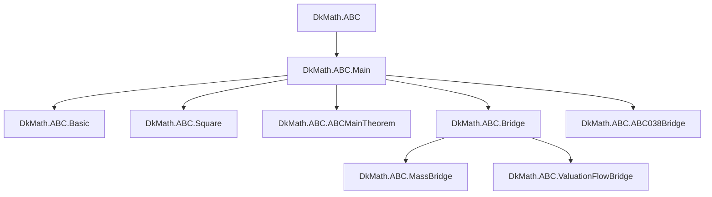
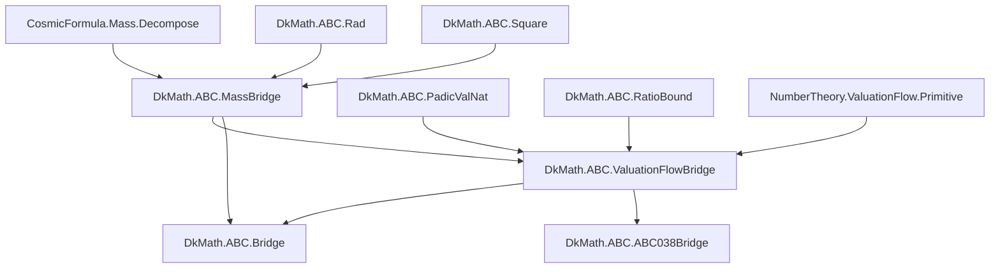
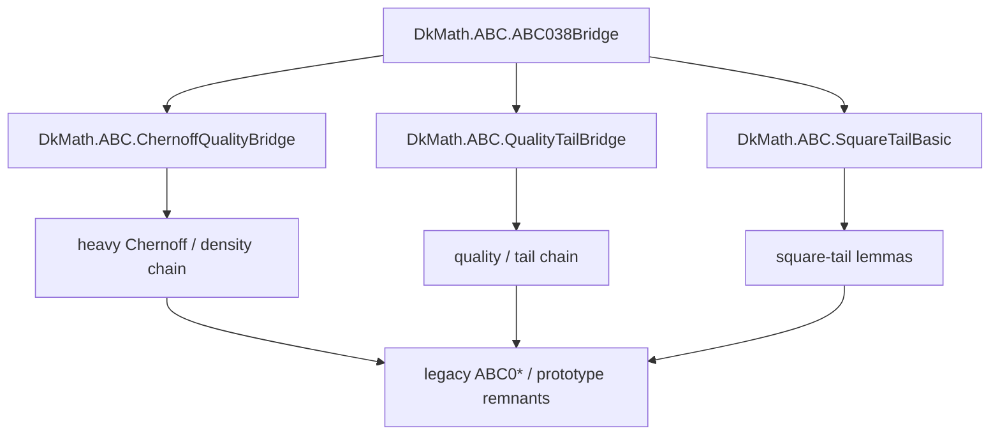

# review

tag: refact-ABC-Erdos1196-260419-v4-cp

うむ、 **今がちょうど Mermaid を起こす好機** じゃ。

お主の言う

> `ABC0*.lean` のナンバリング依存はほぼ解消し、named module 側へ寄った

という流れは、設計思想ともよく噛み合っておる。もともと #1196 由来の整備は

$$
\text{CosmicFormula}
\to
\text{Mass API}
\to
\text{Branch API}
\to
\text{ValuationFlow}
\to
\text{ABC Bridge}
$$

という層分離を前提にしており、`ABC` 側は **bridge のみ** に留める方針じゃった。
また実装計画でも、ABC 側の役目は `MassBridge` / `ValuationFlowBridge` のような **薄い翻訳面** を置くことにあり、本丸へ直接混ぜぬとされておる。

そして前回の中間評価でも、

* `Bridge.lean`
* `MassBridge.lean`
* `ValuationFlowBridge.lean`
* `ABC038Bridge.lean`

が公開導線として育ち、`Bridge` は public-facing aggregator として扱う、という整理になっておった。

## 1. わっちの見立て

いま Mermaid で先に固定すべきは、 **ファイル全部の完全 DAG** ではなく、次の 3 枚じゃ。

## 1. Public surface

外から何を import すればどこまで来るか。

## 2. Bridge spine

`MassBridge` と `ValuationFlowBridge` を核にした、#1196 由来の新しい骨格。

## 3. Legacy / heavy chain

旧 ABC 本丸、Chernoff/Janson/quality/tail 系の重い流れ。

この 3 分割にする理由は明快で、INDEX でも詳細な import 全体は `__imports.txt` に委ね、手書き文書側は **概要地図** に徹する方針になっておるからじゃ。

## 2. いま見えている重要点

snapshot をざっとほどいた限り、かなり良い状態じゃ。

* `DkMath.ABC` はまだ `Main` を丸ごと引く
* `Main` 側には `Basic`, `Square`, `ABCMainTheorem`, `Bridge`, `ABC038Bridge` が見える
* `Bridge` は `MassBridge` と `ValuationFlowBridge` の集約口になっておる
* `ValuationFlowBridge` は `MassBridge`, `PadicValNat`, `RatioBound`, `NumberTheory.ValuationFlow.Primitive` に乗っておる
* `MassBridge` は `Square`, `Rad`, `CosmicFormula.Mass.Decompose` に乗っておる

つまり、 **新 spine は既に named module 中心で読める** 。
ここはかなり前進じゃ。

ただし、やわらかく留意点を言うと、 **「完全に ABC0* が消えた」と言い切るのはまだ少し早い** かもしれぬ。
snapshot の木には番号付きファイル群はまだ残っておるし、少なくとも一部 legacy edge は生きておる。なので現段階の表現としては

> **公開 spine と主要依存は named 側へ移り、番号付き群は residual legacy として残っている**

と書くのがいちばん正確じゃろう。

## 3. 先に書くべき Mermaid

まずはこの 3 枚を README / docs / Roadmap のどこかに置くのがよい。

### 3.1. 公開面



これは **「外から見える顔」** じゃ。

### 3.2. bridge spine



これは **今回お主が育てた新しい骨** じゃ。
設計書の層分離そのものでもある。

### 3.3. heavy / legacy 側

これは細かくしすぎぬ方がよい。たとえばこうじゃ。



ここで大事なのは、 **全部の old file を並べないこと** じゃ。
並べ始めると一気に読めなくなる。

## 4. 文章で添えるべき要約

Mermaid の上に、短くこれを書いておくとよい。

```md
`DkMath.ABC` は現在、次の 2 層に分かれる。

1. 公開 bridge spine
   - `Bridge`
   - `MassBridge`
   - `ValuationFlowBridge`
   - `ABC038Bridge`

2. legacy / heavy analytic chain
   - Chernoff / Janson / quality / tail 系
   - 旧 numbered ABC modules を含む残留層

方針としては、外部利用者はまず bridge spine を読む。
重い解析本体は別層として維持し、直接 public surface に混ぜすぎない。
```

この書き方は、`ABC` 側を bridge に徹させるという設計原則とも一致する。

## 5. 次にやると効くこと

わっちのおすすめ順はこうじゃ。

## 5.A. `docs/ABC/ImportMap.md` を新設

ここに

* 上の 3 Mermaid
* 用語
* public surface / bridge spine / legacy の説明

を置く。

## 5.B. 自動生成 `__imports.txt` と対応づける

INDEX が言う通り、手書き地図は概要、詳細は `__imports.txt` という役割分担にする。

つまり文書内に

```md
詳細な全 import は `logs/summary_report/__imports.txt` を参照。
本ページは構造理解のための圧縮地図である。
```

を入れておくと美しい。

## 5.C. legacy 残留の棚卸し

とくに

* `public surface からもう触っていない numbered file`
* `まだ named spine から直接 import される legacy residue`
* `examples 専用の残留`

を 3 分類すると、次の掃除がしやすい。

## 6. わっちの最終判断

うむ、今はもう **Mermaid を書くべき段** じゃ。
しかも書くなら、単なる import 一覧ではなく、

$$
\text{public surface}
\quad/\quad
\text{bridge spine}
\quad/\quad
\text{legacy heavy chain}
$$

の 3 層で描くのが最も効く。

これを先に固定しておけば、

* import 最適化の進捗が見える
* 残る legacy residue が見える
* 「次にどこを named 化するか」が明確になる

からの。
